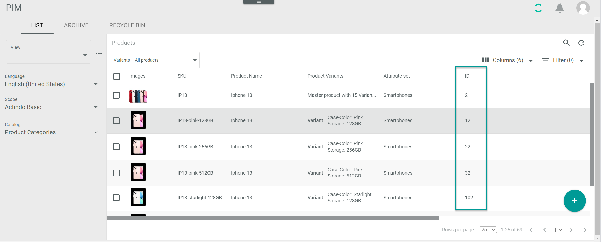

# Retrieve entity data

To make an API call to the *Actindo Core OpenAPI*, you usually need to provide one or several entity IDs in your request body for the system to recognize the entity you are addressing. The entity identification number (ID) is automatically assigned by the system when creating an entity.

For example, when you want to create a product, you need to send an *attributeSetId*, that is, the identification number of the attribute set of the product you want to create. You can find out an entity ID via user interface or via API. Besides, you can also retrieve other specific entity data via API if desired.

In the following, a few examples to retrieve entity data via user interface and via API are provided. 

## Discover an entity ID via user interface

You can find out any entity ID via user interface as follows:

1. Select the module where the entity originates from, for example, *PIM > Products > LIST* to find out a product ID.

2. Locate the entity whose ID you need.

3. Check the ID in the *ID* column. 

    > [Info] If the *ID* column is hidden, see [Add or remove columns](../../Core1Platform//UsingCore1/05_WorkWithLists.md#add-or-remove-columns) in the *Actindo Core1 Platform* documentation to learn how to display it. 

    

4. Write down the entity ID. You will need to provide it when sending your request.

## Discover an entity ID via API

Generally, you can get all entity data you need via API. The entity data is provided in the response to your request. Depending on the entity data you need, the endpoint you have to address may vary. 

If desired, you can also set filters to narrow down your request response. See [List products](./05_ManageProducts.md#list-products) for the filter definitions and request samples.

In the following, a few helpful use cases are provided with their corresponding request samples. Refer to the API documentation in your instance under *Dev Tools > API > Tab API > Module name* for a complete list of endpoints.

### List the PIM attribute sets

Get a list of all *PIM* attribute sets in your current instance, including the attribute set IDs.

#### Definitions

| Attribute key  | Data type | Description | 
| ---------------|-----------|-------------| 
| **dataType**   | string    | Entity data type |   

**Endpoint**: /Actindo.Modules.Actindo.PIM.AttributeController.getListOfAttributeSets

#### Request sample

        {
        "dataType": "Actindo\\Modules\\Actindo\\DataHub\\DataTypes\\IntegerValue"
        }

> [Info] Since the attribute set ID is a whole number, you have to include the *Actindo\\Modules\\Actindo\\DataHub\\DataTypes\\IntegerValue* data type in your request.  

### List the attributes in an attribute set

Get a list of all attributes contained in an attribute set, including all attribute IDs. 

**Endpoint**: /Actindo.Modules.Actindo.PIM.AttributeController.getList
 
#### Definitions

| Attribute key  | Data type | Description |  
| ---------------|-----------|-------------|
| **attributeSetId** | integer | Attribute set identification number | 

#### Request sample

    {
      "attributeSetId": 592
    }

### List the variant sets for an attribute set

Get a list of all variant sets assigned to an attribute set, including all variant set IDs.

**Endpoint**: /Actindo.Modules.Actindo.PIM.VariantSetController.getList

#### Descriptions

| Attribute key  | Data type | Description |   
| ---------------|-----------|-------------|
| **attributeSetId** | integer | Attribute set identification number | 

#### Request sample

        {
        "attributeSetId": 102
        }

### List tree node values

Get a list of all tree node values, including their IDs, for a specific attribute with the tree node data type. 

> [Info] Tree node IDs are relevant if you need to create or edit variant products defined by a tree node attribute, such as color or size. 

**Endpoint**: /Actindo.Modules.Actindo.DataHub.TreeNodeValueController.getTree

#### Descriptions

| Attribute key  | Data type | Description |   
| ---------------|-----------|-------------|
| **languageId** | integer | Language identification number |
| **scopeId**    | integer | Scope identification number |
| **attributeId** | integer | Attribute identification number |

#### Request sample

        {
            "languageId": 12,
            "scopeId": 12,
            "attributeId": 3982
        }

> [Info] You can find the language and scope IDs in the corresponding tab in the *DataHub* module under *DataHub > Settings*.

### List all units by dimension

Get a list of all units by dimension, including their IDs.  

> [Info] Unit IDs are relevant if you need to create or edit products containing dimension attributes, such as length or weight. 

**Endpoint**: /Actindo.Modules.Actindo.DataHub.Units.getByDimension

#### Descriptions

| Attribute key  | Data type | Description |   
| ---------------|-----------|-------------|
| **dimensionId** | integer | Dimension identification number |

#### Request sample

        {
            "dimensionId": 149
        }

> [Info] You can also find the IDs for these entities via user interface under *DataHub > Settings > Tab UNITS AND DIMENSIONS*. For detailed information, see [Discover an entity ID via user interface](#discover-an-entity-id-via-user-interface).  

## Additional entity data

You can obtain any data available in the database via API, such as product data or variant set data. 

### Get variant set data 

Get the data contained in a variant set, including the underlying attribute set, the variant set defining and changeable attributes, and their IDs. 

**Endpoint**: /Actindo.Modules.Actindo.PIM.VariantSetController.get

#### Definitions

| Attribute key  | Data type | Description |  
| ---------------|-----------|-------------|
| **Id** | integer | Variant set identification number |

#### Request sample

        {
        "id": 91
        }

### Get product data

Get data for a specific product. 

**Endpoint**: /Actindo.Modules.Actindo.PIM.Products.get

#### Definitions

| Attribute key  | Data type | Description |  
| ---------------|-----------|-------------|
| **Id** | integer | Product identification number |

> [Info] To find out the desired product ID via API, see [List products](./05_ManageProducts.md#list-products). Alternatively, you can discover a product ID via user interface, see [Discover an entity ID via user interface](#discover-an-entity-id-via-user-interface).

#### Request sample

        {
            "product": {
                "id": "862"
            }
        }

### Get entity data

Get all data for a specific entity, for example, a product. If it is a master product, all its variants are listed, including their IDs. If it is a variant product, its master product and its defining values are listed.

**Endpoint**: /Actindo.Modules.Actindo.PIM.PIM.get

#### Definitions

| Attribute key  | Data type | Description |  
| ---------------|-----------|-------------|
| **entityId** | integer | Product identification number |

#### Request sample 

        {
        "entityId": 141
        }

