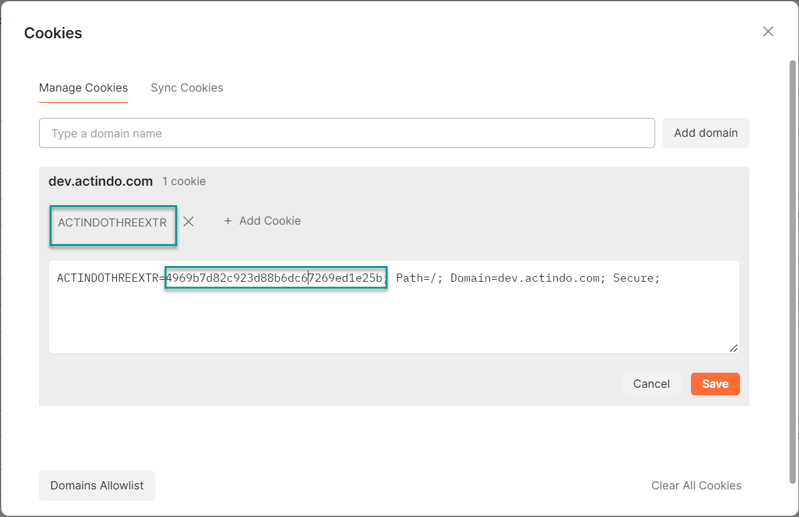

# Set up Postman for the Actindo Core1 OpenAPI

[comment]: <> (Fachreviewer: Diese Datei ist auch unter Overview. Ich muss noch klären, ob/wo es hingehört. Du brauchst es also nicht doppelt zu lesen.)

To send requests to the *Actindo Core1 Platform* API endpoints, you can use an external API tool, such as Postman. For detailed information on download, configuration, and basic functions, see the [Postman](https://www.postman.com/ "[https://www.postman.com/]") website.

Before you can send requests to the *Actindo Core1 OpenAPI* with Postman, you have to set it up to interact with your system.  

## Define the headers

Headers must be defined, so that the data is transferred to the *Actindo Core1 OpenAPI* in the appropriate format and responses are transmitted back to the user. To do so, follow the procedure below:

1. Click the *Headers* tab. 

2. Enter "Content-Type" and "Accept" in two different rows the *Key* column. 

3. Enter "application/json" in the *Value* column for both rows. This setting specifies that the data being sent in the request body is in JSON format.

## Set the session cookie

Before you can communicate with the Core 1, you have to set a session cookie. To do so, follow the procedure below:

1. Send a request via the [Send] button.  
    You receive the following response:

        {
        "success": false,
        "errno": 10000,
        "error": "Not logged in",
        "trace": ""
        }
    
    This response indicates that the request failed because you are not logged into your *Actindo Core1 Platform* instance in Postman. The API request must include the session ID from the *Actindo Core1 Platform* instance in which you are currently logged in.

2. Switch to the browser where you are logged into your *Actindo Core1 Platform* instance. 

3. Open the console in the browser developer tools. Depending on the browser you use, the access shortcut or key may differ. For example, in Chrome you can access the console pressing the **F12** key.

4. In the browser developer tools console, click the *Application* tab and expand the *Cookies* option in the left menu under the *Storage* section.  
    The URL of your current *Actindo Core1 Platform* instance is displayed.

5. Click the URL of your current *Actindo Core1 Platform* instance.  
    All cookies are displayed on the right.

    

6. Select the session cookie of the *Actindo Core1 Platform* instance you want to access via API. There are two types of cookies:
    - **ACTINDOTHREE**  
        Select this cookie if your instance is a live system.
    - **ACTINDOTHREEEXTR**  
        Select this cookie if your instance is a sandbox.  
    The cookie value is displayed in the *Cookie Value* section.

7. Copy the cookie value from the *Cookie Value* section to your clipboard.  

8. Switch to *Postman* and click the [Cookies] button located under the [Send] button.  
    The *Cookies* window is displayed.

    

9. Click the existing cookie to display the current cookie values.

    

10. Replace the current cookie value with the cookie value you have previously copied from the console.

11. Click the [Save] button and close the *Cookies* window.  
    The session cookie has been saved. You can start sending API requests.

[comment]: <> (Ref: https://actindo.atlassian.net/wiki/spaces/CW/pages/33193985/How+to+configure+postman+and+make+an+API+call)

## Best practices

We recommend that you create collections and predefine API calls using the templates provided. This way you can reuse your API calls, export them, and even share them with other colleagues in the Cloud. For detailed information, refer to the Postman documentation in the [Postman](https://www.postman.com/ "[https://www.postman.com/]") website.

[comment]: <> (In Postman habe ich session cookie eingestellt, daher brauche authentication nicht mehr. Wie funktioniert es sonst?)