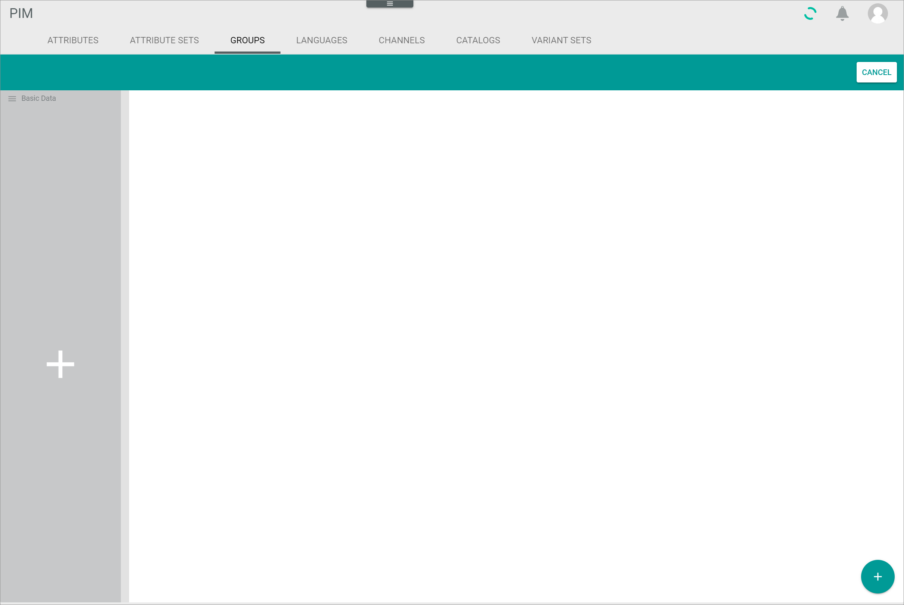
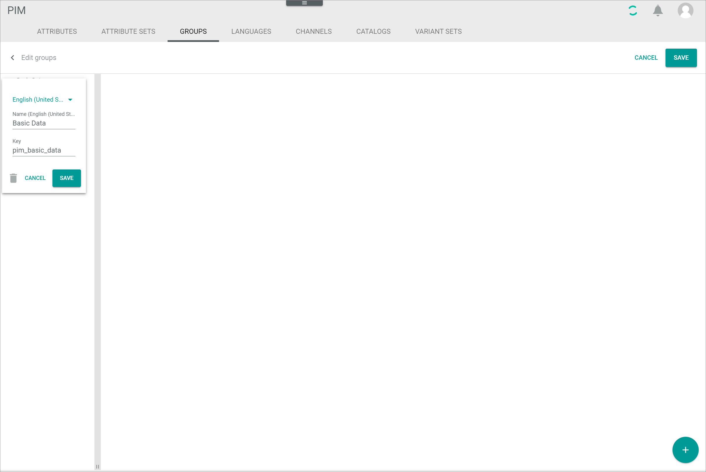

[!!User Interface Attribute groups](../UserInterface/03c_AttributeGroups.md)
[!!Manage the attributes](./01_ManageAttributes.md)
[!!Manage the attribute sets](./02_ManageAttributeSets.md)
[!!Manage the products](../Operation/01_ManageProducts.md)

# Manage an attribute group

The attribute groups serve the logical organization of the product attributes. Attribute groups are organized in a tree structure with a maximum depth of two levels.

Note that attributes can only be added to leaf-groups, that means either to an attribute group without sub-groups or to the sub-group(s) of an attribute group.
Once a sub-group has been created for an attribute group, attributes can no longer be assigned to the attribute group but only to the sub-groups.
If the attribute group already contained attributes, these attributes are automatically moved to first sub-group.

You can create attribute groups, edit attribute groups and the sorting of the attribute groups themselves as well as the sorting of the attributes within a group.

## Create an attribute group

Create an attribute group for new attributes you want to assign to a certain group.

#### Prerequisites

Additional attributes for the attribute group have been created, see [Create an attribute](./01_ManageAttributes.md#create-an-attribute).

#### Procedure

*PIM > Settings > Tab ATTRIBUTE GROUPS*

1. Click the  (Edit) button to the right of the *Attribute groups* section in the left column.   
  The *Edit attribute groups* view is displayed.

  

2. Click the  (Add) button in the bottom right corner.   
  A plus sign is displayed in the attribute group column.

  

3. Click the plus sign in the attribute group column.    
  The *Add element* window is displayed in the attribute group column.

  

4. Enter a name for the attribute group in the *Name* field.

5. Enter a key for the attribute group in the *Key* field. The number of characters is limited to 190.

6. Click the [SAVE] button.   
  The attribute group has been created. The *Add element* window is closed. The new attribute group is displayed in the attribute group column.

  

  > [Info] If you want to change the order of the attribute groups in the list, see [Change the order of attribute groups](#change-the-order-of-attribute-groups).

7. Click the [SAVE] button in the upper right corner.  
  The new attribute group has been saved. The *Edit attribute groups* view is closed.

## Edit an attribute group

After you have created an attribute group, you can edit it.
You can create attribute sub-groups, change the order of attribute groups, add attributes to a group, change the order of attributes within a group, remove attributes from an attribute group or delete attribute groups.

### Create an attribute sub-group

Create an attribute sub-group to organize the attributes in special groups, for instance depending on product-related categories.
If the attribute group already contained attributes, these attributes are automatically moved to first sub-group.

Attribute groups are organized in a tree structure with a maximum depth of two levels. That means that a maximum of one sub-group level can be added to an attribute group.

#### Prerequisites

At least one attribute group has been created, see [Create an attribute group](#create-an-attribute-group).

#### Procedure

*PIM > Settings > Tab ATTRIBUTE GROUPS*

1. Click the  (Edit) button to the right of the *Attribute groups* section in the left column.   
  The *Edit attribute groups* view is displayed.

  

2. Click the attribute group to which you want to create a sub-group.   
  The existing attribute sub-groups are displayed in the column to the right of the attribute group column.

  

3. Click the  (Add) button in the bottom right corner.   
  Plus signs are displayed in the attribute group and the attribute sub-group column.

  

4. Click the plus sign in the attribute sub-group column.    
  The *Add element* window is displayed in the attribute sub-group column.

  

5. Enter a name for the attribute sub-group in the *Name* field.

6. Enter a key for the attribute sub-group in the *Key* field. The number of characters is limited to 190.

7. Click the [SAVE] button.   
  The attribute sub-group has been created. The *Add element* window is closed. The new attribute sub-group is displayed in the attribute sub-group column.

  

  > [Info] If you want to change the order of the attribute sub-groups in the list, see [Change the order of attribute groups](#change-the-order-of-attribute-groups).

8. Click the [SAVE] button in the upper right corner.  
  The new attribute sub-group has been saved. The *Edit attribute groups* view is closed.

  > [Info] Note that if the attribute group already contained attributes, these attributes are automatically moved to first sub-group.

### Change the order of attribute groups

The order of attribute groups in the *ATTRIBUTE GROUPS* tab corresponds to the order of attributes groups in the product view.
You can change the order to display an attribute group in a different place when creating or editing a product.   

The procedure to change the order of attribute groups and sub-groups is identical.
Just select the attribute sub-group instead of the group and follow the steps described below.

#### Prerequisites

At least two attribute groups have been created, see [Create an attribute group](#create-an-attribute-group).

#### Procedure

*PIM > Settings > Tab ATTRIBUTE GROUPS*

1. Click the  (Edit) button to the right of the *Attribute groups* section in the left column.   
  The *Edit attribute groups* view is displayed.

  

2. Click and hold the  (Sort) button to the left of the attribute group you want to move to another position in the list.

3. Move the selected attribute group to the desired position in the list by using drag and drop.

4. Click the [SAVE] button in the upper right corner.  
  The new attribute group order has been saved. The *Edit attribute groups* view is closed.

### Delete an attribute group

You can delete an attribute group if it is no longer in use.
Note that you just delete the attribute group but not the attributes within a group.
All active attributes that are no longer assigned to an attribute group are automatically assigned to a new attribute group with the name *Unassigned Group* which is only displayed in the product view.
If you delete an attribute group with sub-groups, also the attribute sub-groups are deleted.   

The procedure to delete attribute groups and sub-groups is identical.
Just select the attribute sub-group instead of the group and follow the steps described below.

#### Prerequisites

At least one attribute group has been created, see [Create an attribute group](#create-an-attribute-group).

#### Procedure

*PIM > Settings > Tab ATTRIBUTE GROUPS*

1. Click the  (Edit) button to the right of the *Attribute groups* section in the left column.   
  The *Edit attribute groups* view is displayed.

  

2. Click the  (Edit) button to the right of the attribute group you want to delete.   
  The attribute group data is displayed in a window in the attribute group column.

  

3. Click the  (Delete) button in the bottom left corner of the attribute group data window.    
  The selected attribute group has been removed from the attribute group column. The attribute group data window is closed.

4. Click the [SAVE] button in the upper right corner.  
  The attribute group has been deleted. The *Edit attribute groups* view is closed.

### Add attributes to a group

You can add attributes to an attribute group or sub-group.
Note that attributes can only be added to leaf-groups, that means either to an attribute group without sub-groups or to the sub-group(s) of an attribute group.
Once a sub-group has been created for an attribute group, attributes can no longer be assigned to the attribute group but only to the sub-groups.
If the attribute group already contained attributes, these attributes are automatically moved to first sub-group.

Be aware that an attribute can be assigned to one attribute group or sub-group only.
If you add an attribute to an attribute group that is already added to another group, it is automatically removed from the former attribute group.

#### Prerequisites

- At least one attribute group has been created, see [Create an attribute group](#create-an-attribute-group).
- At least one additional attribute has been created that is not yet assigned to a group, see [Create an attribute](./01_ManageAttributes.md#create-an-attribute).

#### Procedure

*PIM > Settings > Tab ATTRIBUTE GROUPS*

1. Click the attribute group or sub-group to which you want to add an attribute.   
  The selected attribute group is highlighted. The attributes assigned to the group are displayed on the right side.

  > [Info] If an attribute group has at least one attribute sub-group, you can only add an attribute to the sub-group.

  

2. Click the  (Add) button in the bottom right corner.   
  The *Add attributes to attribute group* view is displayed.

  

3. Select the checkboxes of the attributes you want to add to the selected attribute group.   
  The editing toolbar is displayed above the list.

  > [Info] Enable the *Only Unassigned Attributes* toggle above the list to hide all attributes that are already assigned to an attribute group.

4. Click the [ADD] button in the editing toolbar.
  The *Add attributes to attribute group* view is closed. The selected attributes have been added to the attribute group.

  > [Info] The new attributes are always added at the end of the attribute list. If you want to change the position of an attribute in the list, see [Change the order of attributes within a group](#change-the-order-of-attributes-within-a-group).

### Change the order of attributes within a group

The order of attributes within an attribute group in the *ATTRIBUTE GROUPS* tab corresponds to the order of attributes within a group in the product view. You can change the order to display a certain attribute in a different place in the attribute group when creating or editing a product.   

The procedure to change the order of attributes within attribute groups and sub-groups is identical.
Just select the attribute sub-group instead of the group and follow the steps described below.

#### Prerequisites

- At least one attribute group has been created, see [Create an attribute group](#create-an-attribute-group).
- At least two attributes have been added to the attribute group, see [Add attributes to a group](#add-attributes-to-a-group).

#### Procedure

*PIM > Settings > Tab ATTRIBUTE GROUPS*

1. Click the attribute group or sub-group where you want to change the order of attributes.   
  The selected attribute group is highlighted. The attributes assigned to the group are displayed on the right side.

  

2. Click the  (Sort attributes) button above the list.   
  The *Assigned attributes (Sorting mode)* view is displayed on the right side.

  

3. Click and hold the  (Sort) button to the left of the attribute you want to move to another position in the list.

4. Move the selected attribute to the desired position in the list by using drag and drop.

  > [Info] Repeat the steps **3** and **4** for all attributes whose position in the list you want to change.

5. Click the [SAVE] button in the upper right corner.
  The new order of attributes within the selected attribute group has been saved. The *Assigned attributes (Sorting mode)* view is closed.

### Remove attributes from a group

You can remove an attribute from an attribute group if it is no longer in use.
Note that you just remove the attribute from the attribute group but you do not delete the attribute itself.
Alternatively, you can [deactivate an attribute](./01_ManageAttributes.md#deactivate-an-attribute) so it is no longer displayed in the product view.   

The procedure to remove attributes from attribute groups or sub-groups is identical.
Just select the attribute sub-group instead of the group and follow the steps described below.

#### Prerequisites

- At least one attribute group has been created, see [Create an attribute group](#create-an-attribute-group).
- At least one attribute has been added to the attribute group, see [Add attributes to a group](#add-attributes-to-a-group).

#### Procedure

*PIM > Settings > Tab ATTRIBUTE GROUPS*

1. Click the attribute group or sub-group where you want to remove an attribute from.   
  The selected attribute group is highlighted. The attributes assigned to the attribute group are displayed on the right side.

  

2. Select the checkboxes of the attributes you want to remove from the selected attribute group.   
  The editing toolbar is displayed above the list.

3. Click the  (Remove) button in the editing toolbar.   
  The selected attributes have been removed from the list.
