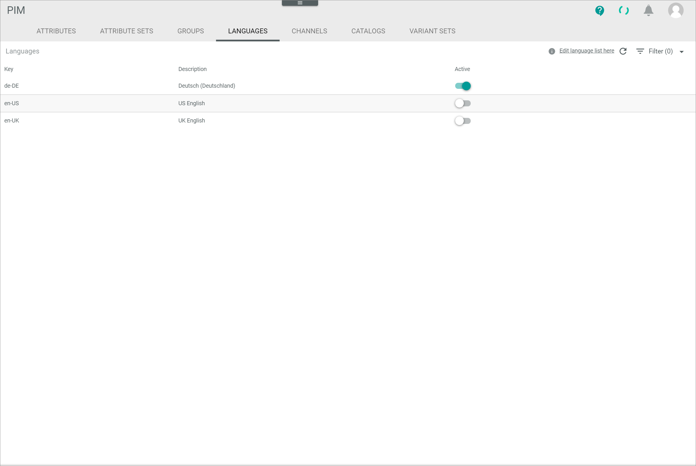

[!!DataHub](DataHub)
[!!User Interface Languages](../UserInterface/03d_Languages.md)
[!!Create a language](../../DataHub/Integration/05_ManageLanguages.md#create-a-language)

# Configure the language settings

If you want to maintain PIM products in multiple languages, you have to activate the respective languages in the *PIM* module. By default, the languages *English (United States)* and *German (Germany)* are predefined and activated. Note that the completeness of products is recalculated when a language is activated or deactivated.

#### Prerequisites

No Prerequisites to fulfill.

> [Info] By default, the languages *English (United States)* and the *Deutsch (Deutschland)* are created and activated in the *DataHub* module, see [Create a language](../../DataHub/Integration/05_ManageLanguages.md#create-a-language).

#### Procedure
*PIM > Settings > Tab LANGUAGES*

1. Enable the *Active* toggle in the row of the language you want to switch active in the *PIM* module.

  > [Info] At least one language has to be activated.

2. Press **F5** to initialize the Core1 Platform.   
  The selected language is activated in the *PIM* module.
