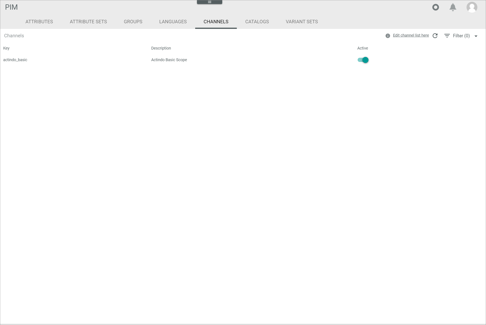

[!!DataHub](../../DataHub/Overview/01_General.md)
[!!User interface Channels](../UserInterface/03e_Channels.md)
[!!Create a channel in DataHub](../../DataHub/Integration/04_ManageChannels.md#create-a-channel)

# Configure the channel settings

If you want to maintain PIM products in multiple channels, you have to activate the respective channel in the *PIM* module. By default, the *Actindo Basic* channel is predefined and activated.

> [Info] A channel is not equal to a marketplace or web store connection. You can create a channel and use it for another connection.

#### Prerequisites

No prerequisites to fulfill.

> [Info] By default, the *Actindo Basic* channel is created and activated in the *DataHub* module, see [Create a channel](../../DataHub/Integration/04_ManageChannels.md#create-a-channel).

#### Procedure

*PIM > Settings > Tab CHANNELS*

1. Enable the *Active* toggle in the row of the channel you want to activate in the *PIM* module.

    > [Info] At least one channel has to be activated.

2. Press the **F5** key to initialize the *Core1 Platform*.   
  The selected channel has been activated in the *PIM* module.
