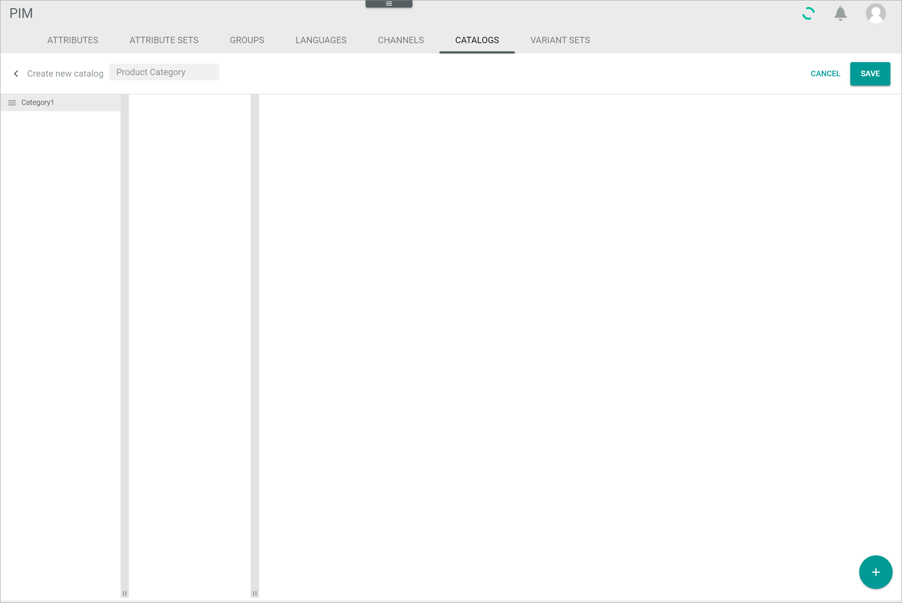
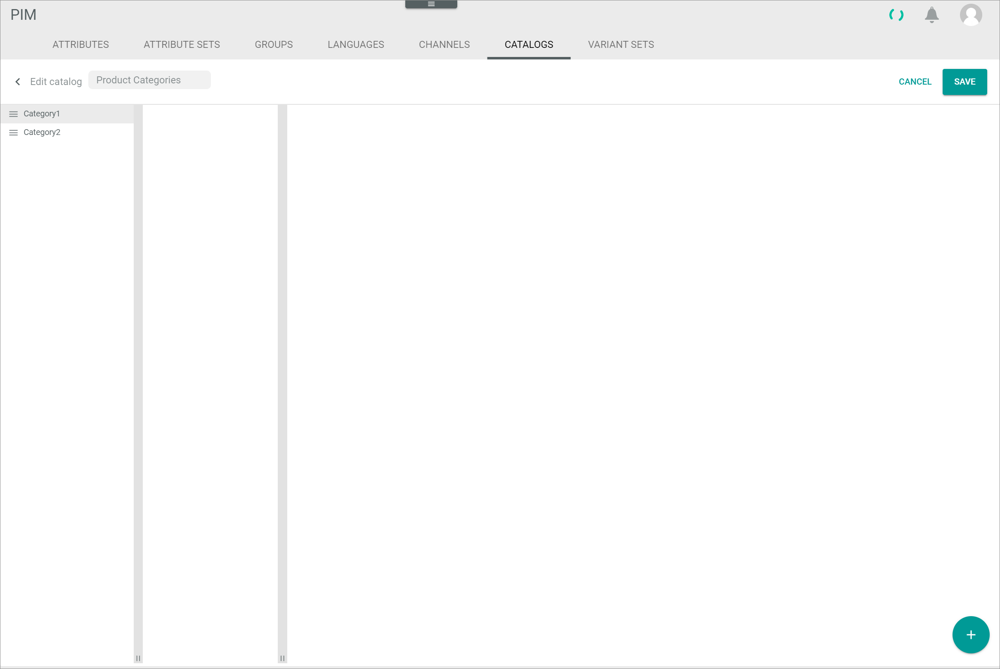
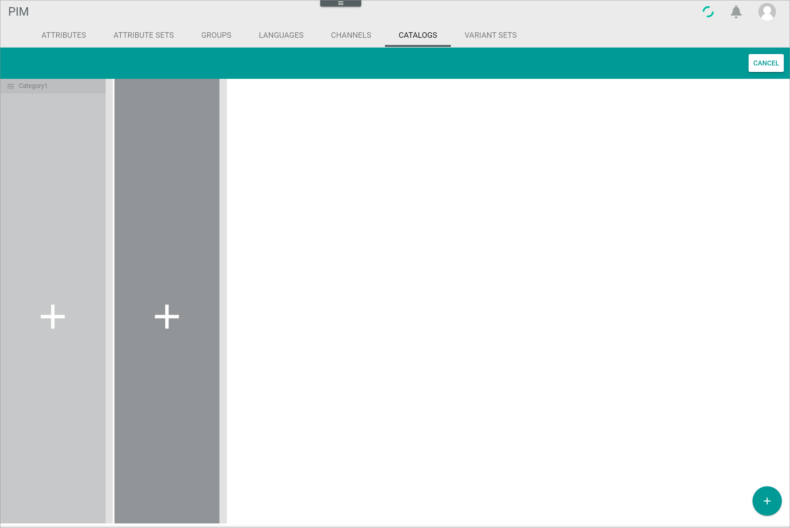
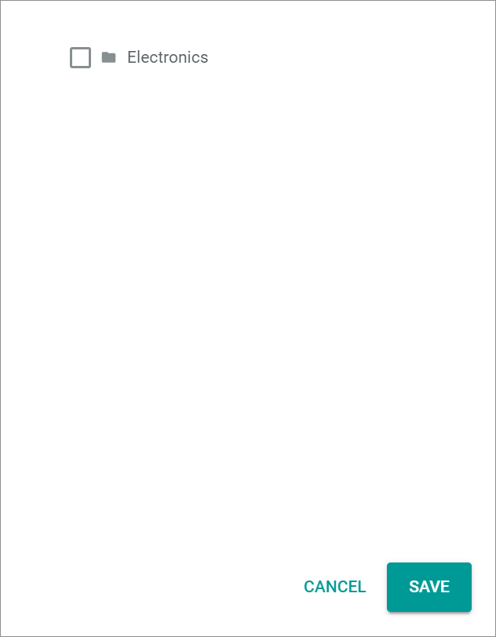

[!!User Interface Catalogs](../UserInterface/03f_Catalogs.md)
[!!Manage the products](../Operation/01_ManageProducts.md)

# Manage a catalog

You can manage products in different catalogs and assign them to categories in order to sort the products and find them faster.

[comment]: <> (UI will be changed)

## Create a catalog

Create a catalog with at least one category for new attributes you want to assign to a certain category.

### Define the catalog basic data

Create a new catalog and define its name to be able to create one or more categories afterwards.

#### Prerequisites

No prerequisites to fulfill.

#### Procedure
*PIM > Settings > Tab CATALOGS*

1. Click the  (Points) button to the right of the catalog name in the left column.   
  The menu is displayed.

  

2. Click the *+ Create new* menu entry.   
  The *Create new catalog* view is displayed.

  

3. Enter a name for the catalog in the text field in the header.    

4. Continue to [add a category](#create-a-category) to the catalog, as at least one category per catalog is required to which you can assign the products.

### Create a category

You need to add at least one category to a catalog to be able to assign products to it.

#### Prerequisites

The catalog basic data has been created, see [Define the catalog basic data](#define-the catalog-basic-data).

#### Procedure
*PIM > Settings > Tab CATALOGS > Button Create new*

1. Click the  (Add) button in the bottom right corner.   
  A plus sign is displayed in the category column.

  

2. Click the plus sign in the category column.    
  The *Add Element* window is displayed in the category column.

  

3. Enter a name for the category of the catalog in the *Name* field.

4. Enter a key for the category of the catalog in the *Key* field.

5. Click the [SAVE] button.   
  The catalog category is created. The *Add Element* window is closed. The new category is displayed in the category column.

  

  > [Info] To add an additional category, repeat the steps **1** to **5**. To add a sub-category, see [Create a sub-category](#create-a-sub-category).  

6. Click the [SAVE] button in the upper right corner.  
  The new catalog is saved. The *Create new catalog* view is closed.

## Edit a catalog

After you have created a catalog, you can edit the catalog and its categories. You can create further categories, change the order of categories and delete categories.

### Create a sub-category

Create a sub-category to be able to assign products to individual categories in an even more detailed way.

#### Prerequisites

At least one catalog with one category is created, see [Create a catalog](#create-a-catalog).

#### Procedure
*PIM > Settings > Tab CATALOGS*

1. Select the catalog you want to create a sub-category to in the drop-down list in the left column.   
  The catalog name is displayed in the drop-down list.

2. Click the  (Points) button to the right of the selected catalog.   
  The menu is displayed.

  

3. Click the * Edit* menu entry.   
  The *Edit catalog* view is displayed.

  

4. Select the category to which you want to create a sub-category in the category column.
  A sub-category column is displayed to the right of the category column.

5. Click the  (Add) button in the bottom right corner.   
  A plus sign is displayed in the category column as well as in the sub-category column.

  

6. Click the plus sign in the sub-category column.    
  The *Add Element* window is displayed in the sub-category column.

  

7. Enter a name for the sub-category in the *Name* field.

8. Enter a key for the sub-category in the *Key* field.

9. Click the [SAVE] button.   
  The catalog sub-category is created. The *Add Element* window is closed. The new sub-category is displayed in the sub-category column.

  > [Info] To add an additional sub-category, repeat the steps **4** to **8**. You can create an unlimited number of sub-categories in an unlimited number of levels. The procedure to create a sub-category in another level is identical to creating a sub-category. Just select the category or sub-category to which you want to create another sub-category and click the corresponding plus sign in the column of the respective level.

[comment]: <> (number of levels depends on screen size -> should it not be limited to a certain number of level?)

10. Click the [SAVE] button in the upper right corner.   
  The new sub-category is saved. The *Edit catalog* view is closed.

### Change the order of categories

The order of categories within the catalog is also displayed in the products view. If you want to have a different order, change the order of categories in the desired way.

#### Prerequisites

- At least one catalog is created, see [Create a catalog](#create-a-catalog).
- At least two categories are created within the catalog, see [Create a category](#create-a-category).

#### Procedure
*PIM > Settings > Tab CATALOGS*

1. Select the catalog you want to create a sub-category to in the drop-down list in the left column.   
  The catalog name is displayed in the drop-down list.

2. Click the  (Points) button to the right of the selected catalog.   
  The menu is displayed.

  

3. Click the * Edit* menu entry.   
  The *Edit catalog* view is displayed.

  

  > [Info] The procedure to change the order of categories and sub-categories is identical. Just select the sub-category instead of the category and follow the steps described below.

4. Click and hold the  (Sort) button to the left of the category you want to move to another position in the list.

3. By using drag and drop, move the selected category to the desired position in the list.

4. Click the [SAVE] button in the upper right corner.  
  The new category order is saved. The *Edit category* view is closed.

### Delete a category

Delete a category that is no longer needed. If you delete a category containing one or more sub-categories, these sub-categories will be deleted as well.

#### Prerequisites

- At least one catalog is created, see [Create a catalog](#create-a-catalog).
- At least one category is created within the catalog, see [Create a category](#create-a-category).

#### Procedure
*PIM > Settings > Tab CATALOGS*

1. Select the catalog you want to delete a category from in the drop-down list in the left column.   
  The catalog name is displayed in the drop-down list.

2. Click the  (Points) button to the right of the selected catalog.   
  The menu is displayed.

  

3. Click the * Edit* menu entry.   
  The *Edit catalog* view is displayed.

  

  > [Info] The procedure to delete categories and sub-categories is identical. Just select the sub-category instead of the category and follow the steps described below.

4. Click the  (Edit) button to the right of the category you want to delete.   
  The category data is displayed in a window in the category column.

  

  > [Info] The  (Edit) button is only displayed if you hover over the respective category.

5. Click the  (Delete) button in the bottom left corner of the category data window.    
  The selected category is removed from the category column. The category data window is closed.

  > [Warning] Make sure that no product is assigned to the category that will be deleted as problems may occur to products that are still assigned to a deleted category.

6. Click the [SAVE] button in the upper right corner.  
  The category is deleted. The *Edit category* view is closed.

## Assign a product to a catalog category

#### Prerequisites

- At least one catalog is created, see [Create a catalog](#create-a-catalog).
- At least one category is created within the catalog, see [Create a category](#create-a-category).

#### Procedure
*PIM > Products > Tab LIST*

1. Click the product you want to assign to a catalog category in the list of products.   
  The *Edit Product* view is displayed. The *Attributes* tab is preselected.

  

2. Select the *Catalogs* tab.   
  The *Catalogs* tab is displayed

  

3. Click the [EDIT ATTRIBUTE] button in the section of the catalog to which you want to assign the selected product.   
  A window with all categories and sub-categories of the selected catalog is displayed.

  

4. Select the checkbox of the category or sub-category you want to assign the product to.    

  > [Info] You can assign a product to several categories or sub-categories.

5. Click the [SAVE] button in the bottom right corner of the window.    
  The window is closed. The selected category is displayed in the section of the catalog.

  

6. Click the [SAVE] button in the upper right corner.  
  The product is assigned to the selected category. The *Edit Product* view is closed. The list of products is displayed again.

6. Select the appropriate catalog and the assigned category in the left side bar.
  The list of products displays only those products that are assigned to the selected category.

  
