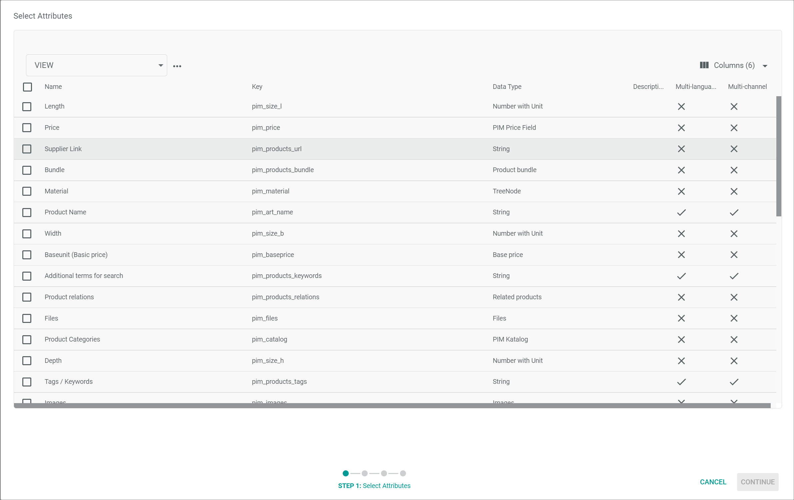
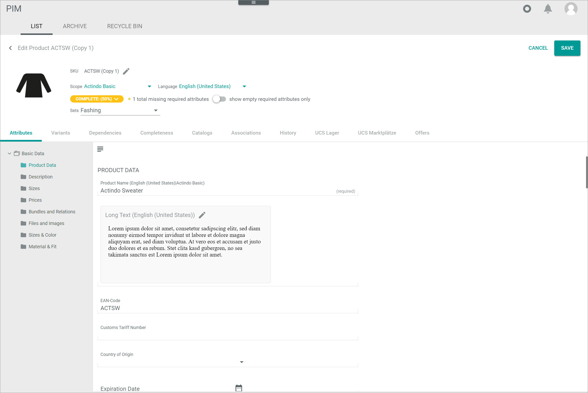
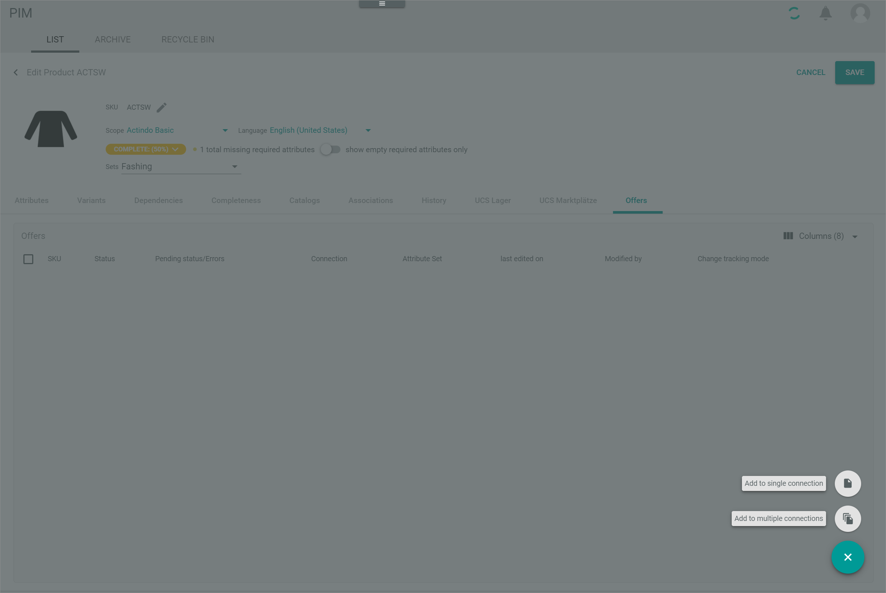

[!!Omni-Channel](../../Channels/Overview/01_General.md)
[!!User interface Product list](../UserInterface/02a_List.md)
[!!Manage the variants](./02_ManageVariants.md)
[!!Manage an attribute set](./02_ManageAttributeSets.md)

# Manage a product

A product defines everything that can be offered and purchased on a market. All products are assigned to an attribute set and can be specified by the attributes within this set.   
You can create, edit and copy single products, master products and variants, see [Manage variants](./02_ManageVariants.md).

To offer a product on a marketplace you have to create an offer for the product, see [Create an offer in PIM](#create-an-offer-in-PIM).

## Create a product

Create a product to offer it on a marketplace. You can create single products, master products or variants to a master product, see [Create variants](./02_ManageVariants.md#create-variants). In the following, the procedure to create a single or master product is described.

#### Prerequisites

An attribute set has been created, see [Create an attribute set](../Integration/02_ManageAttributeSets.md#Create-an-attribute-set).

> [Info] By default, the *PIM Basic Set* attribute set has been created when installing the *PIM* module.

#### Procedure

*PIM > Products > Tab LIST*

1. Click the  (Add) button in the bottom right corner.   
  The *Create new product* window is displayed.

  

2. Select an attribute set in the *Attribute set* drop-down list. All active attribute sets for the PIM products are displayed in the drop-down list.

3. Enter a SKU for the product in the *SKU* field.

    > [Info] The SKU (Stock Keeping Unit) is an identification number for the product. Therefore, it should be unique within the *PIM* module.

4. Click the [CREATE] button.   
  The *Create product* view is displayed. The *Attributes* tab is preselected.

  

5. Enter the product data in the *Attributes* tab. It is recommended to complete at least the *Product name*, *Price* and *Tax class* fields.   

    > [Info] All fields marked with the note *(required)* are used for the completeness calculation of product attributes. When editing a product, you can enable the *Show empty required attributes only* toggle to display only the incomplete required attribute fields for the selected product.

6. Click the [SAVE] button in the upper right corner.   
  The new product has been saved and is added to the product list. The *Create product* view is closed. The product list is displayed.

## Edit products

After you have created a product, you can edit it. You can either edit a single product or use the mass editing function to edit the same attribute values in several products using a wizard. Depending on the attribute settings, not all attribute values are editable. Further, attributes that are either inherited from a master product or set by an ETL mapping cannot be edited.   
Note that a product which is currently being edited by another user is frozen and marked as *in use by "username"* in the product list. Any changes made to this product cannot be saved until the other user closes the corresponding product.

### Edit a single product

Edit one or several attribute values for a single product.

#### Prerequisites

At least one product has been created, see [Create a product](#create-a-product).

#### Procedure

*PIM > Products > Tab LIST*

1. Click the product you want to edit in the list of products.   
  The *Edit product* view is displayed. The *Attributes* tab is preselected.

  

2. Edit the desired product data in the corresponding fields and tabs.

3. Click the [SAVE] button in the upper right corner.   
  The changes have been saved. The *Edit product* view is closed.  

### Mass editing

The mass editing function allows to edit different attribute values of multiple products at the same time.

#### Prerequisites

At least two products have been created, see [Create a product](#create-a-product).

#### Procedure

*PIM > Products > Tab LIST*

1. Select the checkboxes of the products you want to edit.   
  The editing toolbar is displayed above the product list.

2. Click the [START MASS EDITING] button in the toolbar.   
  The *Mass editing* side bar is displayed on the right side.

  

   > [Info] You can still add products to the mass editing process when the side bar is displayed. Just select the checkboxes of the products in the list and click the [MASS EDITING >] button in the editing toolbar to add the selected products to the mass editing list.    
   To remove a product from the mass editing list, click the  (Remove) button right to the respective product. The  (Remove) button is only displayed if you hover over a product in the list.

3. Click the [START] button in the upper right corner of the side bar to start the mass editing wizard.   
  The *Select Attributes* wizard window is displayed.

  

4. Select the checkboxes of the attributes you want to edit and click the [CONTINUE] button in the bottom right corner.   
  If at least one of the selected attributes is multi-language or multi-channel, the *Select channels and languages* wizard window is displayed. Otherwise, this wizard window is skipped and the *Editing* wizard window with the selected products and their attributes to be edited is displayed. In this case, continue with step **6**.

  

5. Select the appropriate channels and languages by selecting the corresponding checkboxes in the *Select channels* and *Select languages* sections and click the [CONTINUE] button in the bottom right corner.   
  The *Editing* wizard window with the selected products and their attributes to be edited is displayed.

  

6. Edit the desired product data in the corresponding fields.  

   > [Info] Click the  (Points) button next to an attribute value field to apply the corresponding value to either all attributes in the column or to the attributes in the column of the selected products.   

7.  Click the [CONTINUE] button in the bottom right corner.   
The *Applying changes* wizard window and the *Mass editing has been triggered* pop-up window are displayed.

  

  The progress bar in the *Applying changes* wizard window displays **100%** when the changes has been applied.

    > [Info] As the change job is executed in the background, the wizard window can be closed before the progress bar reaches **100%**.

  

8. Click the [FINALIZE] button in the bottom right corner.   
  The changes have been saved. The *Applying changes* wizard window is closed.

## Copy a product

Use the copy function to duplicate a product and its properties to create a similar product where you only have to adjust individual attributes.

#### Prerequisites

At least one product has been created, see [Create a product](#create-a-product).

#### Procedure

*PIM > Products > Tab LIST*

1. Select the checkbox of the product you want to copy.   
  The editing toolbar is displayed above the product list.

2. Click the [COPY PRODUCT] button in the toolbar.   
  The *Edit product (Copy)* view is displayed. The *Attributes* tab is preselected. All attribute values from the selected product are applied to the copied product.

  

3. Click the *SKU* field and edit the SKU for the new product.

    > [Info] The SKU (Stock Keeping Unit) is an identification number for the product. Therefore, it should be unique within the *PIM* module.

4. Click the  *Product name* field and edit the product name for the new product.

5. Add or edit the product data in the *Attributes* tab. It is recommended to complete at least the *Product name*, *Price* and *Tax class* fields.   

    > [Info] All fields marked with the note *(required)* are used for the completeness calculation of product attributes. When editing a product, you can enable the *Show empty required attributes only* toggle to display only the incomplete required attribute fields for the selected product.

6. Click the [SAVE] button in the upper right corner.   
  The product has been saved and is added to the product list. The *Edit product (Copy)* view is closed. The product list is displayed.

## Create an offer in PIM

Create an offer for a product so you can sell the product in a selected connection. In the *PIM* module you can  create offers to all PIM products. You can either create an offer for a single connection or multiple connections.

### Create a single connection offer in PIM

If you want to offer the product on a single connection only or you have just one connection created, it is recommended to create a single connection offer.

#### Prerequisites

- At least one product has been created, see [Create a product](#create-a-product).    
- At least one connection has been created.

[comment]: <> (Add link to chapter in Channels when documentation is written)

#### Procedure

*PIM > Products > Tab LIST*

1. Click the product you want to create an offer for in the product list.    
  The *Edit product* view is displayed.

2. Click the *Offers* tab in the product view.   
  The *Offers* tab with a list of all existing offers to the product in all connections is displayed.

  

3. Click the  (Add) button in the bottom right corner.   
  The [Add to a single connection  ] button and the [Add to multiple connections  ] button are displayed.

  

4. Click the [Add to a single connection  ] button to create an offer from the selected PIM product to a single connection.   
  The *Create offer* window is displayed.

  

5. Configure the following settings:

    + Click the *Select connection* drop-down list and select the connection for which you want to create the offer. All active connections are displayed in the list.    
    The *Select attribute set* drop-down list is unlocked.

    + Click the *Select attribute set* drop-down list and select the appropriate attribute set for the offer. All active attribute sets are displayed in the list.   

    + Enable the *Generate SKU* toggle to automatically create a SKU for the product offer.   

    + Select the appropriate option for change tracking in the *Change tracking mode* section:   
        -  *Manual*   
          Changes in a PIM product must be triggered manually to be applied to the offer. The initial offer is automatically applied.   
        -  *Semi-automatic*   
          Changes in a PIM product are automatically applied to the offer after confirmation. The initial offer is automatically applied without confirmation.   
        -  *Semi-automatic, changes must be confirmed by another user*   
          Changes in a PIM product are automatically applied to the offer after confirmation by another user. The initial offer is only applied after confirmation by another user.    
        -  *Automatic*   
          Changes in a PIM product are automatically applied to the offer. The initial offer is also automatically applied.

    + Click the *Offer status* drop-down list and select the initial offer status. The statuses below are available:   
        - **Active**      
          The offer is active. It is displayed in the selected connection and can be sold there.   
        - **Inactive**   
          The offer is inactive. It is not displayed in the selected connection and cannot be sold there.   
        - **Offline**   
          The offer is unknown to the selected connection and cannot be sold there.   

6. Click the [SAVE] button in the bottom right corner of the *Create offer* window.   
  The single offer is added to the list of offers. The *Create offer* window is closed.

   > [Info] The product must be saved to start the creation process of the offer.

7. Click the [SAVE] button in the upper right corner of the *Edit product* view.   
  The *Edit product* view is closed. The *LIST* tab with the product list is displayed again. The new offer will be created.

   > [Info] The offer creation is performed asynchronously. That means that it may take  some time until the offer has been finally created.

### Create a multi-connection offer in PIM

To create offers to a product for several connections at the same time, you can use the multi-connection wizard.  

#### Prerequisites

- At least one product has been created, see [Create a product](#create-a-product).    
- At least two connections have been created.

[comment]: <> (Add link to chapter in Channels when documentation is written)

#### Procedure

*PIM > Products > Tab LIST*

1. Click the product you want to create an offer for in the product list.    
  The *Edit product* view is displayed.

2. Click the *Offers* tab.   
  The *Offers* tab with a list of all existing offers of the product in all connections is displayed.

  

3. Click the  (Add) button in the bottom right corner.   
  The [Add to a single connection  ] button and the [Add to multiple connections  ] button are displayed.

  

4. Click the [Add to multiple connections  ] button to create an offer from the selected PIM product to multiple connections.   
  The *Select connections and status* wizard window is displayed.

  

5. Configure the following settings:

    + Click the *Offer status* drop-down list and select the initial offer status. The statuses below are available:   
        - **Active**      
          The offer is active. It is displayed in the selected connection and can be sold there.   
        - **Inactive**   
          The offer is inactive. It is not displayed in the selected connection and cannot be sold there.   
        - **Offline**   
          The offer is unknown to the selected connection and cannot be sold there.   

    + Select the appropriate option for the change tracking mode:
        -  *Manual*   
          Changes in a PIM product must be triggered manually to be applied to the offer. The initial offer is automatically applied.   
        -  *Semi-automatic*   
          Changes in a PIM product are automatically applied to the offer after confirmation. The initial offer is automatically applied without confirmation.   
        -  *Semi-automatic, changes must be confirmed by another user*   
          Changes in a PIM product are automatically applied to the offer after confirmation by another user. The initial offer is only applied after confirmation by another user.    
        -  *Automatic*   
          Changes in a PIM product are automatically applied to the offer. The initial offer is also automatically applied.

   + Enable the toggles of the connections for which you want to create offers in the *Select connections* section. If you want to create an offer for all displayed connections, click the [SELECT ALL] button to enable all toggles. All active connections are displayed in the list.    

6. Click the [CONTINUE] button in the bottom right corner of the window.   
  The *Select destination attribute sets* wizard window is displayed.

  

   > [Info] The attribute destination sets for the selected connections are automatically selected. You cannot edit the selection.

  [comment]: <> (Is that correct? Why does this window exist when I cannot make any changes?)

7. Click the [FINISH] button in the bottom right corner of the window.   
  The new offers are added to the list of offers. The *Select destination attribute sets* wizard window is closed.

    > [Info] The product must be saved to start the creation process of the offers.

8. Click the [SAVE] button in the upper right corner of the *Edit product* view.   
  The *Edit product* view is closed. The *LIST* tab with the product list is displayed again. The new offers will be created.

    > [Info] The offer creation is performed asynchronously. That means that it may take  some time until the offer has been finally created.
