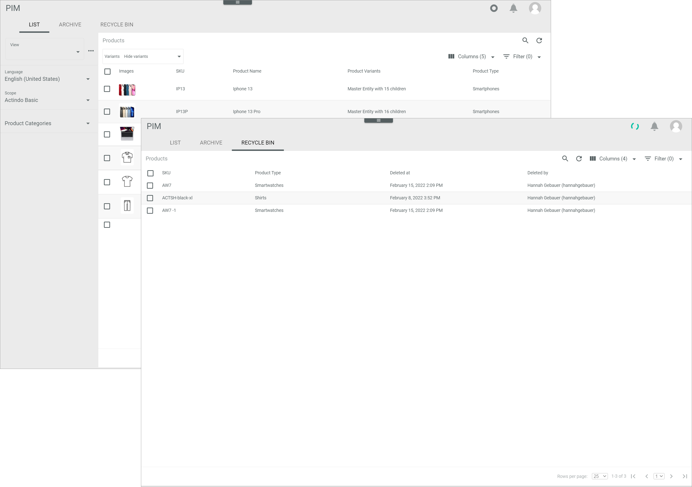
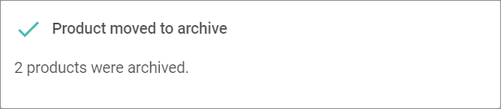
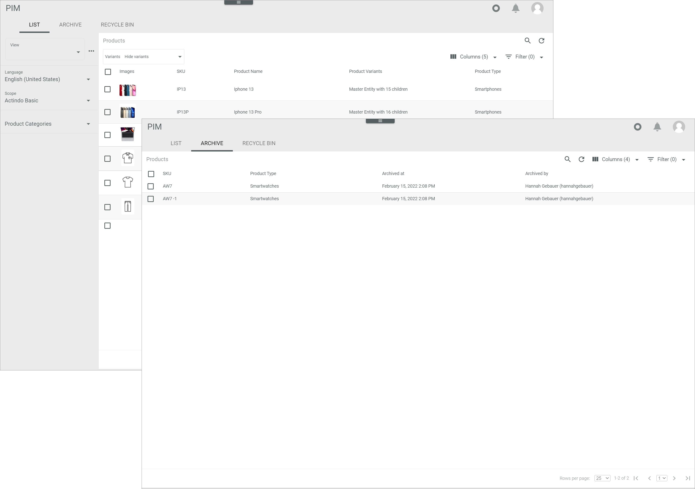
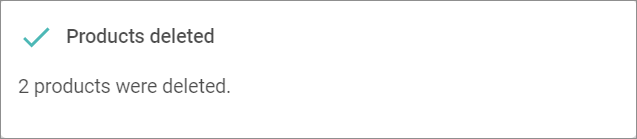
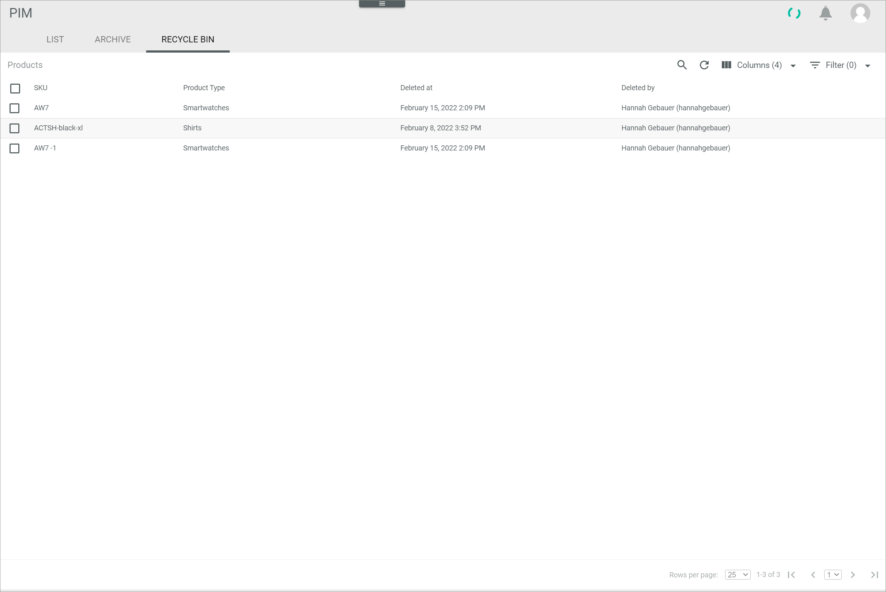
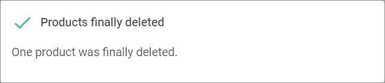
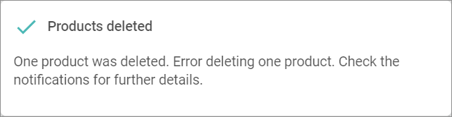
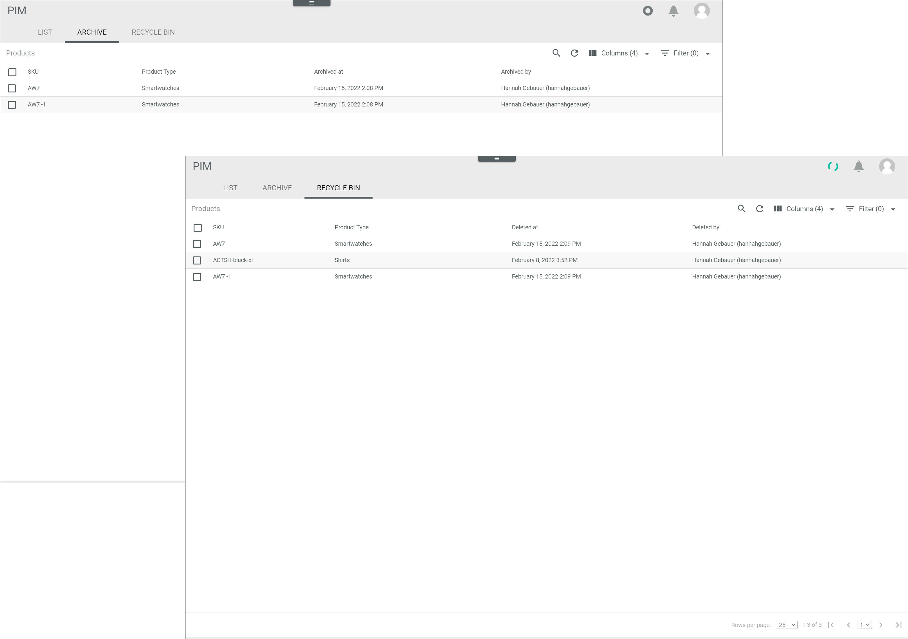

[!!User interface Products](../UserInterface/02_Products.md)   
[!!Manage the products](./01_ManageProducts.md)

# Move a product

Move a product to either archive it, move it to the recycle bin, delete it permanently or restore it.

## Archive a product

You can archive products that you are not currently using, but that you still want to access and may want to use again at a later time. Archived products cannot be permanently deleted but must first be moved to the recycle bin.

#### Prerequisites

At least one product has been created, see [Create a product](./01_ManageProducts.md#create-a-product).

#### Procedure

*PIM > Products > Tab LIST*    
*PIM > Products > Tab RECYCLE BIN*

> [Info] You can archive products from the product list or from the recycle bin. The procedure to archive them is identical. To archive a product from the recycle bin, start in the *RECYCLE BIN* tab instead of in the *LIST* tab and follow the steps described below.

1. Select the checkboxes of the products you want to archive.   
  The editing toolbar is displayed above the product list.

2. Click the [ARCHIVE PRODUCTS] button in the editing toolbar.   
  The button changes to [ARCHIVING...]. The *Product moved to archive* pop-up window is displayed, indicating the number of archived products.

  

  The selected products have been archived.

  > [Info] You find the archived products in the *ARCHIVE* tab where you can either restore or delete them.

## Delete a product

You can delete products that are no longer needed by moving them to the recycle bin. Products in the recycle bin can still be restored or archived but they also can be permanently deleted.

#### Prerequisites

At least one product has been created, see [Create a product](./01_ManageProducts.md#create-a-product).

#### Procedure

*PIM > Products > Tab LIST*   
*PIM > Products > Tab ARCHIVE*

> [Info] You can delete products from the product list or from the archive. The procedure to delete them is identical. To delete a product from the archive, start in the *ARCHIVE* tab instead of in the *LIST* tab and follow the steps described below.

1. Select the checkboxes of the products you want to delete.   
  The editing toolbar is displayed above the product list.

2. Click the [MOVE TO RECYCLE BIN] button in the editing toolbar.   
  The button changes to [DELETING...]. The *Product deleted* pop-up window is displayed, indicating the number of deleted products.

  

  The selected products have been moved to the recycle bin.

  > [Info] You find the deleted products in the *RECYCLE BIN* tab where you can either restore or permanently delete them.

## Permanently delete a product

You can permanently delete products that have been moved to the recycle bin unless they have any existing dependencies. Be aware that once products have been permanently deleted, they cannot be restored as the deletion process cannot be undone.

#### Prerequisites

At least one product has been moved to the recycle bin, see [Delete a product](#delete-a-product).

#### Procedure

*PIM > Products > Tab RECYCLE BIN*

1. Select the checkboxes of the products you want to delete.   
  The editing toolbar is displayed above the product list.

2. Click the [FINALLY DELETE PRODUCTS] button in the editing toolbar.   
  The button changes to [DELETING...]. The *Products finally deleted* pop-up window is displayed, indicating the number of permanently deleted products.

  

  The selected products have been permanently deleted.

  > [Info] If the deletion is not possible, the *Products deleted* pop-up window indicates an error for the number of products that cannot be deleted. An error message with further information is displayed in the notifications.

  

## Restore a product

You can restore products that have been moved to the archive or the recycle bin in order to use them again.

#### Prerequisites

At least one product has been moved to the archive or the recycle bin, see [Archive a product](#archive-a-product) or [Delete a product](#delete-a-product).

#### Procedure

*PIM > Products > Tab ARCHIVE*   
*PIM > Products > Tab RECYCLE BIN*

> [Info] You can restore products from the archive or from the recycle bin. The procedure to restore them is identical. To restore a product from the recycle bin, start in the *RECYCLE BIN* tab instead of in the *ARCHIVE* tab and follow the steps described below.

1. Select the checkboxes of the products you want to restore.   
  The editing toolbar is displayed above the product list.

2. Click the [RESTORE PRODUCTS] button in the editing toolbar.   
  The button changes to [RESTORING...]. The *Products restored* pop-up window is displayed, indicating the number of restored products.

  

  The selected products have been restored.

  > [Info] You find the restored products in the *LIST* tab.
