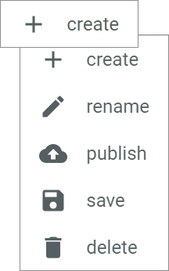

[!!DataHub](../../DataHub/Overview/01_General.md)
[!!User interface Product list](../UserInterface/02a_List.md) 
[!!Create a language in DataHub](../../DataHub/Integration/CreateLanguage.md)
[!!Configure the language settings](../Integration/04_ConfigureLanguages.md)
[!!Create a channel in DataHub](../../DataHub/Integration/CreateChannel.md)
[!!Configure the channel settings](../Integration/05_ConfigureChannels.md)
[!!Manage the catalogs](../Integration/06_ManageCatalogs.md)

# Manage the view

The *LIST* tab is the view where you can see and manage the products. To have a customized view for all purposes, you can modify various settings to adjust the view to your requirements and save individual views to quickly access the view you need.

## Select a language

You can select the language for which the attribute values of the products are displayed. Only multi-language attributes can have different values in different languages. Otherwise, the value remains the same in all languages. Note that the selected language only refers to the display language of the attribute values but does not equal the user interface language. To change the interface language, you have to change the user language settings.

#### Prerequisites

At least two languages have been created and activated in the *PIM* module, see [Create a language](../../DataHub/Integration/CreateLanguage.md) and [Configure the language settings](../Integration/04_ConfigureLanguages.md).

> [Info] By default, the languages *English (United States)* and *Deutsch (Deutschland)* are created and activated in the *PIM* module.

#### Procedure

*PIM > Products > Tab LIST*

1. Click the *Language* drop-down list in the left column.  
    All languages that are activated in the *PIM* module are displayed in the list.   

    > [Info] For detailed information about activating a language in the *PIM* module, see [Configure the language settings](../Integration/04_ConfigureLanguages.md).

2. Select the desired language in the *Language* drop-down list.   
    The multi-language values in the columns have been changed to the values in the selected language. All single language values remain unchanged.

    > [Info] If a product has no attribute value defined in the selected language, the value in the corresponding columns remains blank.

## Select a channel

You can select the channel for which the attribute values of the products are displayed. Only multi-channel attributes can have different values in different channels. Otherwise, the value remains the same in all channels.

#### Prerequisites

At least two channels have been created and activated in the *PIM* module, see [Create a channel](../../DataHub/Integration/CreateChannel.md) and [Configure the channel settings](../Integration/05_ConfigureChannels.md).

> [Info] By default, the channel *Actindo Basic* is created and activated in the *PIM* module.

#### Procedure

*PIM > Products > Tab LIST*

1. Click the *Channel* drop-down list in the left column.  
    All channels that are activated in the *PIM* module are displayed in the list.   

    > [Info] For detailed information about activating a channel in the *PIM* module, see [Configure the channel settings](../Integration/05_ConfigureChannels.md).

2. Select the desired channel in the *Channel* drop-down list.   
    The multi-channel values in the columns have been changed to the values in the selected channel. All single channel values remain unchanged.

    > [Info] If a product has no attribute value defined in the selected channel, the value in the corresponding column remains blank.

## Select a product category

You can select a product category to limit the number of products to those assigned to a certain category. You can assign a product to one or multiple categories and catalogs in the product view.

#### Prerequisites

- At least one catalog has been created, see [Create a catalog](../Integration/06_ManageCatalogs.md#create-a-catalog).
- At least one category has been created within the catalog, see [Create a category](../Integration/06_ManageCatalogs.md#create-a-category).
- At least one product has been assigned to a category, see [Assign a product to a catalog category](../Integration/06_ManageCatalogs.md#assign-a-product-to-a-catalog-category)

#### Procedure

*PIM > Products > Tab LIST*

1. Click the *Catalog* drop-down list in the left column.  
    All available catalogs are displayed in the list.   

    > [Info] For detailed information about creating a catalog or categories, see [Manage the catalogs](../Integration/06_ManageCatalogs.md).

2. Select the desired catalog in the *Catalog* drop-down list.      
    All corresponding categories and sub-categories are displayed below the selected catalog.

3. Select the desired category or sub-category in the left column.   
    Only those products that are assigned to the selected category or sub-category are displayed in the list of products on the right side.

    

    > [Info] When you create a product, it will be automatically assigned to the currently selected category.

## Select a variant view

Switch the variant view to either display only the single and master products in the product list or all products including their variants.

#### Prerequisites

No prerequisites to fulfill.

#### Procedure
*PIM > Products > Tab LIST*

1. Click the *Variants* drop-down list at the top of the product list.   
    The options below are displayed:
    - **All products**   
        All products and their variants are displayed in the product list.   
    - **Hide variants**   
        No variants are displayed in the product list.

2. Select the desired variant view in the *Variants* drop-down list.
    Depending on the selection, the product list displays all products including their variants or only the single and master products.

## Create a view

Create a view with a predefined selection of the language, the channel, the product category, the variant view and the order of columns in the product list.

#### Prerequisites

No prerequisites to fulfill.

> [Info] Depending on the view you want to create, it is necessary to fulfill the corresponding prerequisites in the chapters [Select a language](#select-a-language), [Select a channel](#select-a-channel) or [Select a product category](#select-a-product-category).

#### Procedure

*PIM > Products > Tab LIST*

1. Select the desired settings for the view you want to save:
    + Click the *Language* drop-down list and select the desired language.
    + Click the *Channel* drop-down list and select the desired channel.
    + Click the *Catalog* drop-down list and select the desired catalog and category.
    + Click the *Variants* drop-down list and select the desired variant view.   

2. If desired, adjust the displayed columns in the product list by following the steps below:
    + Click the [  Columns (x)] button.   
    + Click the *Column* drop-down list, select a column in the list and click the [ADD COLUMN] button to add the column to the columns displayed in the product list.
    + Click the  (Remove) button next to a column name to remove the corresponding column from the product list.
    + Click and hold a column name and move the selected column to the desired position by using drag and drop. The number left to the column name displays the position number of the column in the product list.
    + Click the [APPLY] button to apply the changes.

3. If desired, add a filter to the product list by following the steps below:
    + Click the [  Filter (x)] button.   
    + Click the *Column* drop-down list and select a column to which you want to add a filter.
    + Click the *Relation* drop-down list and select a filter relation. Depending on the selected column, the filter relations vary.
    + Click the *Value* drop-down list and enter a value for the filter.
    + Click the [ADD FILTER] button to apply the filter.

4. Click the  (Points) button next to the *View* drop-down list.   
    The view context menu is displayed.

    

    > [Info] If no view is selected when clicking the  (Points) button, only the *+ create* menu entry is displayed in the context menu.

5. Click the *+ create* menu entry in the context menu.   
    The *Create view* window is displayed.

    

6. Enter a name for the view in the *Name* field.

7. Click the [SAVE] button.   
    The view has been saved and preselected in the *View* drop-down list.

    > [Info] To change the view, click the *View* drop-down list and select the view you want to display. The view will change depending on the saved settings.
