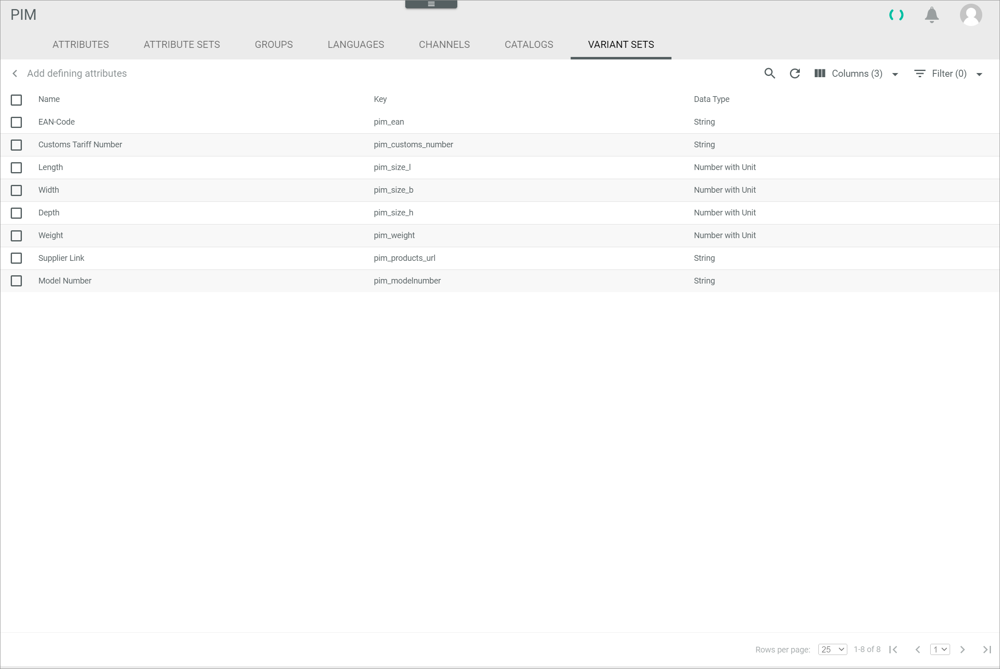

[!!User interface Attributes](../UserInterface/03a_Attributes.md)
[!!Data type list](../../Datahub/UserInterface/04_DataTypeList.md)
[!!Manage a variant set](../Integration/07_ManageVariantSets.md)

# Add a missing defining attribute

At least one defining attribute is required to create a variant set. When adding defining attributes to a variant set, a list of all available defining attributes is displayed.  

#### Error Description

A certain attribute is missing in the list of defining attributes for a variant set.

Follow the instructions below to check why the attribute is not displayed and, if applicable, to display the attribute in the list.

#### Prerequisites

No prerequisites to fulfill.

#### Procedure

*PIM > Settings > Tab ATTRIBUTES*

1. Search for the respective attribute in the attribute list.

2. Click the respective attribute in the attribute list.   
    The *Edit attribute* view is displayed.

    

3. Check the following attribute settings:
    - *Multi-language*      
        Check if the toggle is disabled. Only single language attributes can be used as defining attributes for a variant set.
    - *Multi-channel*      
        Check if the toggle is disabled. Only single channel attributes can be used as defining attributes for a variant set.

        > [Info] If the respective attribute is multi-language or multi-channel, it cannot be used as defining attribute. Create a new attribute which is neither multi-language nor multi-channel to use it as a defining attribute, see [Create a new attribute](../Integration/01_ManageAttributes.md#create-an-attribute).    

4. Check if the *Active* toggle is enabled. Only active attributes are displayed in the list of defining attributes for a variant set. If the toggle is disabled, enable the toggle by clicking it.

5. Click the [SAVE] button in the upper right corner to save any changes.   
    The changes have been applied. The *Edit attribute* view is closed.

6. Press the **F5** key to initialize the *Core1 Platform*.

7. Switch to the *VARIANT SETS* tab: *PIM > Settings > Tab VARIANT SETS* .      
    The *VARIANT SETS* tab with the list of variant sets is displayed.

    

8. Create a new variant set or select the variant set to which you want to add the defining attribute.   
  For detailed information, see [Create a variant set](../Integration/07_ManageVariantSets.md#create-a-variant-set) or [Edit a variant set](../Integration/07_ManageVariantSets.md#edit-a-variant-set).

    

9. In the *Defining attributes* box, click the  (Add) button.    
    The *Add defining attributes* view is displayed.

    

10. Check if the respective attribute is displayed in the list.

    > [Info] If necessary, click the  (Refresh) button to update the list of defining attributes.    
    If the attribute is still not displayed, please contact the Customer Support.    

11. Add the attribute to the variant set, see [Add defining attributes](../Integration/07_ManageVariantSets.md#add-defining-attributes).

#### Was this chapter helpful?

If you need further assistance, please contact the Customer Support.
