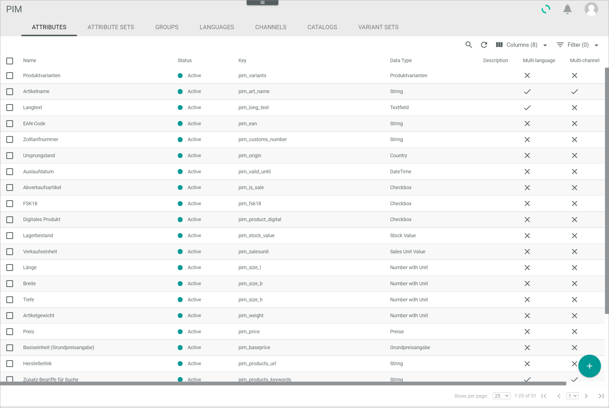
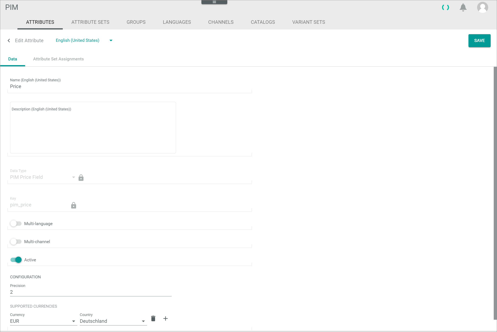

[!!User interface Attributes](../UserInterface/03a_Attributes.md)
[!!Data type list](../UserInterface/04_DataTypeList.md)

# Edit a limited number of decimal places

#### Error Description

When entering a floating number in a product attribute field with the *Floating point number*, *Stock vValue* or *PIM Price field* data type, the places of decimals are limited.

Follow the instructions below to check why the number of decimals is limited and, if applicable, change the number of decimal places.

[comment]: <> (Not yet working this way -> entering of more decimal places still possible, but the number is rounded to the indicated precision after saving)

#### Prerequisites

No prerequisites to fulfill.

#### Procedure
*PIM > Settings > Tab ATTRIBUTES*

1. Search for the respective attribute in the attribute list.

2. Click the respective attribute in the attribute list.   
  The *Edit attribute* view is displayed.

  

3. In the *CONFIGURATION* section, check the number in the *Precision* field.

    > [Info] The number in the *Precision* field indicates the permissible number of decimals for the attribute.

4. If necessary, click the *Precision* field and edit the number of decimals to the desired number.

5. Click the [SAVE] button in the upper right corner to save any changes.   
  The changes have been applied. The *Edit attribute* view is closed.

6. Press the **F5** key to initialize the *Core1 Platform*.

7. Switch to the *LIST* tab: *PIM > Products > Tab LIST* .   
  The *LIST* tab with the list of products is displayed.

  

8. Click the respective product in the list of products, select the *Attributes* tab in the *Edit product* view and retry to edit the floating point number in the corresponding attribute field as desired.

  > [Info] If the number of decimals is still limited, please contact the Customer Support.    

## Was this chapter helpful?

If you need further assistance, please contact the Customer Support.
