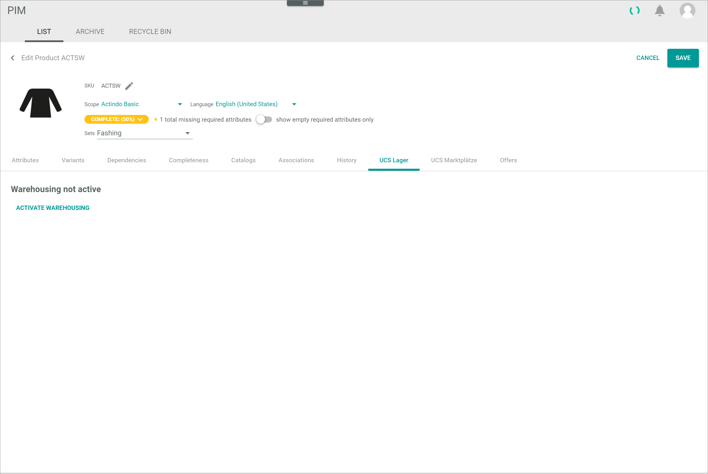
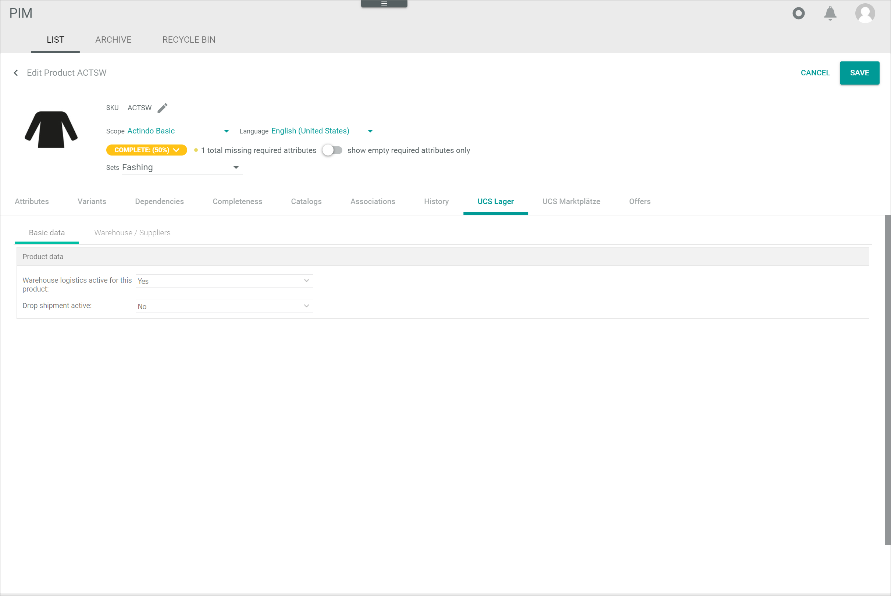

[!!Warehouse](../../RetailSuiteWarehousing/Overview/01_General.md)
[!!User interface Product list](../UserInterface/02a_List.md)   
[!!User interface Warehouse](../../RetailSuiteWarehousing/UserInterface/00_UserInterface.md)
[!!Data type list](../../Datahub/UserInterface/04_DataTypeList.md)

# Add a missing stock value

#### Error Description

No stock is displayed in a product attribute field with the *Stock Value* data type, although a stock is specified in the *Warehouse* module.

Follow the instructions below to display the stock in the product view.

#### Prerequisites

No prerequisites to fulfill.

#### Procedure

*PIM > Products > Tab LIST*

1. Click the product to which the stock is not displayed in the product list.
  The *Edit product* view is displayed.

  

2. Switch to the *UCS Warehouse* tab.   

  

3. Check if the warehousing is active. If the warehousing is inactive, click the [ACTIVATE WAREHOUSING] button to activate the warehousing for the selected product.   
  A confirmation window is displayed. After confirmation, the *Warehousing activated* pop-up window is displayed and the warehousing is active. The *Basic data* and the *Warehouse / Suppliers* sub-tabs are displayed in the *UCS Warehouse* tab. By default, the *Basic data* sub-tab is preselected.

  

4. Check if the option **Yes** is selected in the *Warehouse logistics active for this product* drop-down list. If not, select this option.

5. Click the [SAVE] button in the upper right corner to save any changes.   
  The changes have been applied. The *Edit product* view is closed.

6. Press the **F5** key to initialize the *Core1 Platform*.

7. Click again the product to which the stock was not displayed in the product list.   
  The *Edit product* view is displayed.

  

8. Switch to the *Attributes* tab and check if the stock value is displayed.

  > [Info] If the stock value is still missing, please contact the Customer Support.    

## Was this chapter helpful?

If you need further assistance, please contact the Customer Support.
