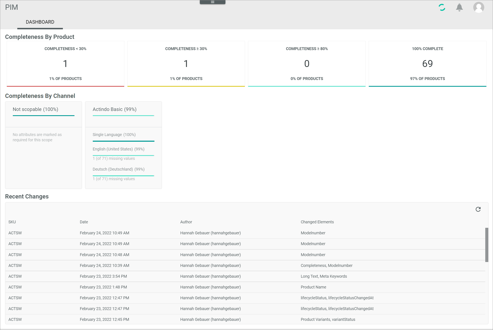

# Dashboard

*PIM > Overview > Tab DASHBOARD*

**Completeness by product**

In this section, an overview of the completeness regarding the products is displayed in four boxes.   
Each box presents one degree of completeness. The following degrees of completeness in percent are displayed:
- *Completeness < 30%*: completeness less than 30%
- *Completeness ≥ 30%*: completeness more than or equal to 30%
- *Completeness ≥ 80%*: completeness more than or equal to 80%
- *100% complete*: completeness equal to 100%

In addition to the degree of completeness, the number of products in the corresponding level and the percentage of this number of products measured against the total number of products are displayed in each box.

**Completeness by channel**

In this section, an overview of the completeness regarding the channels is displayed in several boxes.    
Each box presents an existing channel. Additionally, one box presents the completeness of products that are not assigned to a specific channel.

In each box the degree of completeness in percent is displayed related to:
- all products within that channel
- all single language products within that channel
- all products in the active languages within that channel (a single percentage for each active language)

**Recent changes**

-  (Refresh)    
  Click this button to update the list of recent changes.

The list in the box displays all recent changes on the products. All fields are read-only.

- *SKU*  
  Stock Keeping Unit. Identification number for the product.  

- *Date*  
  Date and time of the change.  

- *Author*   
  Name and username of the author who made the change.

- *Changed elements*   
  Elements that have been changed on the product.
