[!!Manage the view](../Operation/04_ManageView.md)
[!!Manage a product](../Operation/01_ManageProducts.md)
[!!Move a product](../Operation/03_MoveProducts.md)
[!!Data type list](../../DataHub/UserInterface/04_DataTypeList.md)

# List

*PIM > Products > Tab LIST*

- *View*   
    Click the drop-down list to select the view. All created views are displayed in the drop-down list. Click the  (Points) button to the right of the *View* drop-down list to display the context menu and create a view.   

    -  (Points)      
        Click this button to the right of the *VIEW* drop-down list to display the context menu. The following menu entries are available:

        -  create  
            Click this entry to create a view. The *Create view* window is displayed, see [Create view](#create-view).

        -  rename  
            Click this entry to rename the selected view. The *Rename view* window is displayed, see [Rename view](#rename-view). This menu entry is only displayed if a view has been selected.

        -  reset  
            Click this entry to reset all unsaved changes to the settings of the selected view. This menu entry is only displayed if a view has been selected and any changes have been made to the view settings.

        -  publish  
            Click this entry to publish the view. This menu entry is only displayed if a view has been selected and unpublished.

        -  unpublish  
            Click this entry to unpublish the view. This menu entry is only displayed if a view has been selected and published.

        -  save  
            Click this entry to save the current view settings in the selected view. This menu entry is only displayed if a view has been selected.

            > [Info] When the settings of a view have been changed, an asterisk is displayed next to the view name. The asterisk is hidden as soon as the changes have been saved.

        -  delete  
            Click this entry to delete the selected view. A confirmation window to confirm the deletion is displayed. This menu entry is only displayed if a view has been selected.

[comment]: <> (when can I reset a view? -> cannot track when this entry is displayed; where is a view published?)

- *Language*   
    Click the drop-down list to select the language. All languages that are active in the *PIM* module are displayed in the drop-down list.    

- *Channel*   
    Click the drop-down list to select the channel. All channels that are active in the *PIM* module are displayed in the drop-down list. By default, the **Actindo Basic** channel is preselected.   

- *Catalog*   
    Click the drop-down list to select the catalog. All catalogs are displayed in the drop-down list. After having selected a catalog, all categories and sub-categories of the selected catalog are displayed. Click a category or sub-category to limit the product list to those products that are assigned to the selected category. By default, the **Product Categories** catalog is preselected.    

**Products**

-  (Search)   
    Click this button to display the search bar and search for a product.

-  (Refresh)   
    Click this button to update the list of products.

- *Variants*   
    Click the drop-down list to select the display settings for variants. The following options are available:
    - **All products**   
        All products and their variants are displayed in the product list.   
    - **Hide variants**   
        No variants are displayed in the product list.   
    
-  Columns (x)   
    Click this button to display the columns bar and customize the displayed columns and the order of columns in the list. The *x* indicates the number of columns that are currently displayed in the list.

-  Filter (x)   
    Click this button to display the filter bar and customize the active filters. The *x* indicates the number of filters that are currently active.

- [x]     
    Select the checkbox to display the editing toolbar. If you click the checkbox in the header, all products in the list are selected.

-  (Edit)   
    Click this button to edit the selected product(s). This button is only displayed if the checkbox of at least one product is selected. Alternatively, you can click directly a row in the list to edit a product.    

- [COPY PRODUCT]   
    Click this button to copy the selected product. This button is only displayed if the checkbox of a single product is selected.   

- [ARCHIVE PRODUCT] / [ARCHIVE PRODUCTS]   
    Click this button to archive the selected product(s). This button is only displayed if the checkbox of at least one product is selected.   

- [MOVE TO RECYCLE BIN]   
    Click this button to move the selected product(s) to the recycle bin. This button is only displayed if the checkbox of at least one product is selected.   

- [START MASS EDITING]   
    Click this button to edit the selected products. This button is only displayed if the checkbox of at least one product is selected. The mass editing is only recommended if you select more than one product.   

Depending on the selection in the *Variants* drop-down list, the product list displays all products including their variants or only the single and master products. All fields are read-only. Depending on the settings, the displayed columns may vary.

- *Images*   
    Image of the product.

- *SKU*   
    Stock Keeping Unit. Identification number for the product.  

- *Product name*   
    Name of the product.

- *Product variants*   
    Variant type of the product. The following variant types are displayed:
    - **Master product with *x* variants**    
        The product is a master product with variants. The *x* indicates the number of variants.
    - **Variant *Defining Attribute: Value***   
        The product is a variant. Additionally, the defining attributes to the variant and their values are indicated.
    - Empty   
        The product is a single product. No variant type is indicated for single products.

- *Attribute set*   
    Assigned attribute set.

- *ID*   
    Product identification number. The ID number is automatically assigned by the system when the product is created.

- *Modified on*   
    Date and time of the last modification.

- *Modified by*   
    Name and username of the user who modified the product.

- *Created on*   
    Date and time of the creation.

- *Created by*   
    Name and username of the user who created the product.

- Attribute    
    You can add a column for each attribute that is assigned to the product. The column displays the attribute name, the row displays the corresponding attribute value of the product.

-  (Add)   
    Click this button to create a product. The *Create new product* window is displayed.    

## Create view

*PIM > Products > Tab LIST > Button Points > Menu entry create*

- *Name*   
    Enter a name for the view.

- [CANCEL]   
    Click this button to cancel creating a view. The *Create view* window is closed.

- [SAVE]   
    Click this button to save the new view. The *Create view* window is closed. The view is saved and displayed in the *View* drop-down list.

## Rename view

*PIM > Products > Tab LIST > Button Points > Menu entry rename*

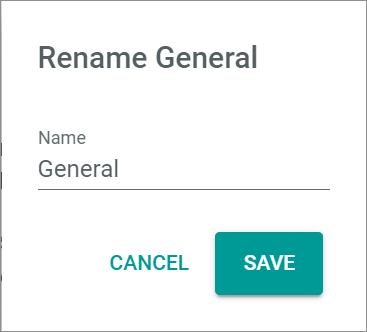

- *Name*   
    Click this field to edit the view name.

- [CANCEL]   
    Click this button to cancel renaming the view. The *Rename view* window is closed.

- [SAVE]   
    Click this button to save the changes to the view name. The *Rename view* window is closed. The new name for the view is saved and displayed in the *View* drop-down list.

## Create new product

*PIM > Products > Tab LIST > Button Add*

- *Attribute set*   
    Click the drop-down list to select the attribute set for the new product. All available attribute sets are displayed in the drop-down list.

- *SKU*   
    Enter the SKU of the new product. The SKU (Stock Keeping Unit) is an identification number for the product. Therefore, it should be uniquely assigned to a single product.

## Create product

*PIM > Products > Tab LIST > Button Add > Button CREATE*

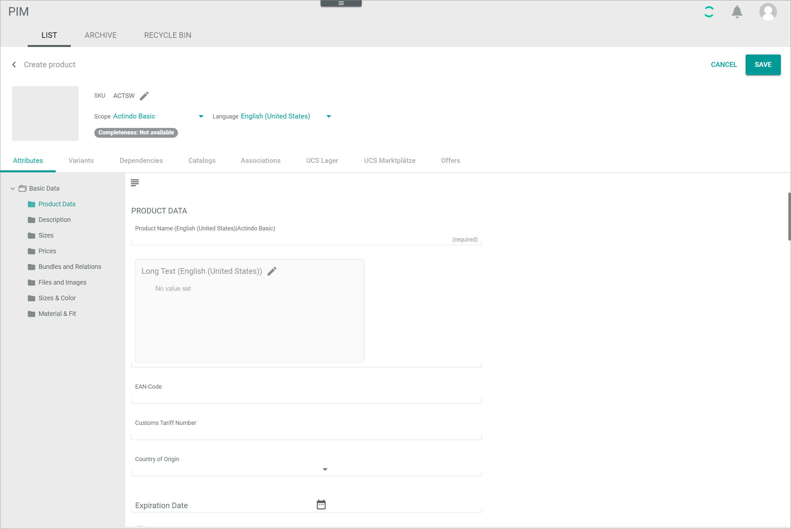

-  (Back)   
    Click this button to close the *Create product* view and return to the product list. All changes are rejected.

- [CANCEL]   
    Click this button to cancel creating a product. The *Create product* view is closed.

- [SAVE]   
    Click this button to save the new product. The *Create product* view is closed. The new product is added to the product list.

- Image box   
    Image of the product. In the *Create product* view, the image box is always empty. When an image is assigned in the corresponding attribute and the product is saved, this image is displayed next time opening the product view.

- *SKU*   
    Stock Keeping Unit. Identification number for the product. The SKU (Stock Keeping Unit) is an identification number for the product. Therefore, it should be uniquely assigned to a single product.   
  Click the button  (Edit) to the right of the SKU to edit it.

-  (Edit)   
    Click this button to edit the SKU.

-  (Apply)   
    Click this button to apply the changes to the SKU. This button is only displayed if you are editing the SKU.

- *Channel*   
    Click the drop-down list to select a channel for the product. All active channels are displayed in the drop-down list. By default, the **Actindo Basic** channel is preselected.

- *Language*   
    Click the drop-down list to select a language for the product. All active languages are displayed in the drop-down list. The default language is preselected.

- [Completeness: Not available]     
    Completeness of the product. In the *Create product* view, the completeness cannot be indicated. The completeness is indicated once the product have been saved.

## Create product &ndash; Attributes

*PIM > Products > Tab LIST > Button Add > Button CREATE > Tab Attributes*

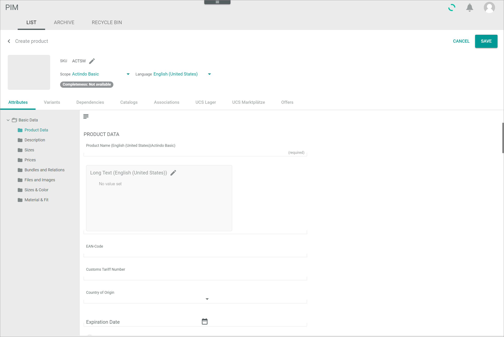

In the left margin column, all available attribute groups are displayed. Click an attribute group to display the attributes that are assigned to this group on the right side of the *Attributes* tab. If the product contains attributes that are unassigned, the *Unassigned group* attribute group is automatically displayed in the left margin column.

The right side of the *Attributes* tab displays all attributes that are assigned to the selected group in the left margin column.

-  (Fade in/out)    
  Click this button to hide or display the left margin column with the attribute groups. When the left margin is displayed and you click this button, the column is hidden. When the column is hidden and you click this button, the column is displayed again.

## Create product &ndash; Variants

*PIM > Products > Tab LIST > Button Add > Button CREATE > Tab Variants*

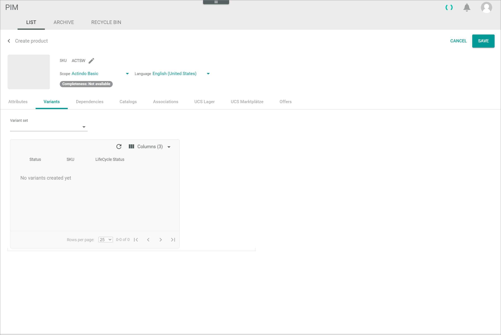

- *Variant set*   
    Click the drop-down list to select a variant set for the product. All variant sets to the corresponding attribute set of the product are displayed in the drop-down list. The  (Add) button is displayed in the variants box below if a variant set is selected.

**Variants box**

-  (Refresh)   
    Click this button to update the list of variants.

-  Columns (x)   
    Click this button to display the columns bar and customize the displayed columns and the order of columns in the list. The *x* indicates the number of columns that are currently displayed in the list.

The list displays all variants of the selected product. All fields are read-only. Depending on the settings, the displayed columns may vary.

- *Status*  
    Status of the variant. In the *Create product* view, the **Created after save** status is displayed if you have added a variant.

- *SKU*  
    Stock Keeping Unit. Identification number for the variant. The SKU for the variant is created depending on the selected settings.

- *Lifecycle status*   
    Lifecycle status of the variant. The status is created after saving. In the *Create product* view, no lifecycle status is displayed.

- *ID*   
    Variant identification number. The ID is created after saving. In the *Create product* view, no ID is displayed.

- Defining/changeable attribute    
    You can add a column for each attribute that is assigned as a defining or changeable attribute to the selected variant set. The column displays the attribute name, the row displays the attribute value.

-  (Add)   
    Click this button to add a new variant to the product. The [Add single variant  ] button and the [Add multiple variants  ] button are displayed.

### Add variant

*PIM > Products > Tab LIST > Button Add > Button CREATE > Tab Variants > Select variant set > Button Add*

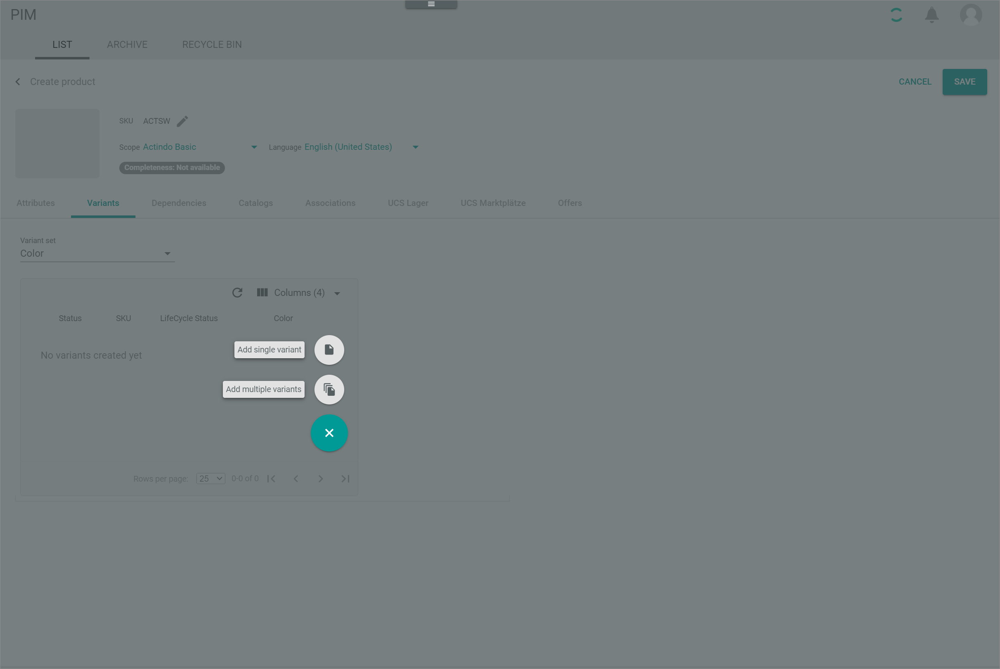

- [Add single variant  ]    
    Click this button to add a single variant. The *Add single variant* window is displayed.

- [Add multiple variants  ]    
    Click this button to add multiple variants. The *Select values* wizard window is displayed.

-  (Cancel)   
    Click this button to hide the buttons and return to the *Variants* tab.

### Add single variant

*PIM > Products > Tab LIST > Button Add > Button CREATE > Tab Variants > Select variant set > Button Add > Button Add single variant*

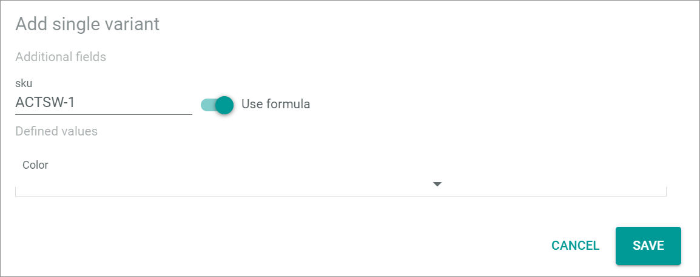

**Additional fields**

- *SKU*   
    Identification number for the variant. The SKU (Stock Keeping Unit) is an identification number and should be assigned only once. This field is read-only as long as the *Use formula* toggle is enabled. Disable the toggle to edit the SKU.

-  *Use formula*   
    Enable this toggle to apply the formula defined in the settings for the variant sets to the variant SKU. When the toggle is enabled, the *SKU* field is read-only. Disable the toggle to enter a different SKU. By default, this toggle is enabled.

**Defined values**

For each defining attribute a single field or box to define the attribute value is displayed.

> [Info] If more than one defining attribute is assigned to the variant, you have to select a value for each defining attribute to add a variant.

- Defining attribute(s)   
    Enter or select the appropriate value for the defining attribute(s).

- [CANCEL]   
    Click this button to cancel adding a variant. The *Add single variant* window is closed.

- [SAVE]   
    Click this button to save the variant. The *Add single variant* window is closed.

### Add multiple variants

*PIM > Products > Tab LIST > Button Add > Button CREATE > Tab Variants > Select variant set > Button Add > Button Add multiple variants*

The wizard to add multiple variants to the selected product is started. The wizard is composed of the following wizard windows:

- [Select values](#select-values)
- [Summary](#summary)

#### Select values

*PIM > Products > Tab LIST > Button Add > Button CREATE > Tab Variants > Select variant set > Button Add > Button Add multiple variants > Wizard window Select values*

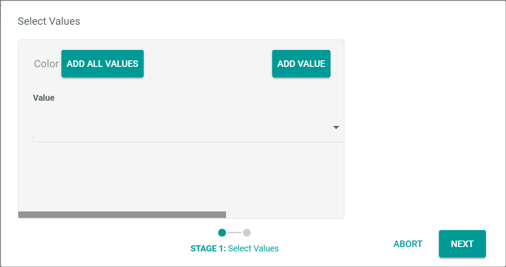

For each defining attribute a single box to define the attribute value is displayed.

> [Info] If more than one defining attribute is assigned to the variant, you have to select a value for each defining attribute to add a variant.

- [ADD ALL VALUES]   
    Click this button to add all available values in the box for the corresponding defining attribute. This button is only displayed for attributes with the *TreeNode* data type.

- [ADD VALUE]   
    Click this button to add a further row to the corresponding attribute where you can enter or select the desired value.

- [CANCEL]   
    Click this button to cancel adding variants. The *Select values* wizard window is closed.

- [NEXT]   
    Click this button to proceed to the next step. The *Summary* wizard window is displayed.

#### Summary

*PIM > Products > Tab LIST > Button Add > Button CREATE > Tab Variants > Select variant set > Button Add > Button Add multiple variants > Wizard window Summary*

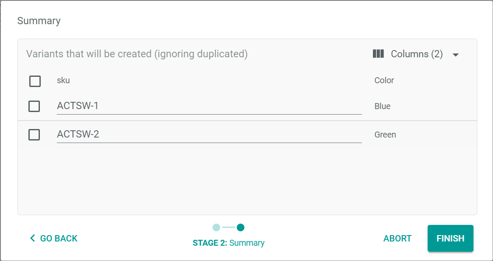

The box displays all variants that will be created from the selected attribute values. For each possible combination of the selected attributes, a new variant is created. Variants that already exist will not be created even if they are listed in the box.

**Variants that will be created (ignoring duplicated)**

-  Columns (x)   
    Click this button to display the columns bar and customize the displayed columns and the order of columns in the list. The *x* indicates the number of columns that are currently displayed in the list.

- [x]     
    Select the checkbox to display the editing toolbar. If you click the checkbox in the header, all variants in the list are selected.

-  (Delete)   
    Click this button to delete the selected variant from the list. This button is only displayed if the checkbox of a variant is selected.

The list displays all selected variants. Depending on the settings, the displayed columns may vary.

- *SKU*      
    Stock Keeping Unit. Identification number for the variant. Click this field to edit the SKU of the selected variant.

- Defining attribute     
    You can add a column for each defining attribute. The column displays the attribute name, the row displays the corresponding attribute value. These fields are read-only.

- [< GO BACK]   
    Click this button to go back to the previous step of adding variants. The *Select values* wizard window is displayed.

- [CANCEL]   
    Click this button to cancel adding variants. The *Summary* wizard window is closed.

- [FINALIZE]   
    Click this button to save the listed variants. The *Summary* wizard window is closed.

## Create product &ndash; Dependencies

*PIM > Products > Tab LIST > Button Add > Button CREATE > Tab Dependencies*

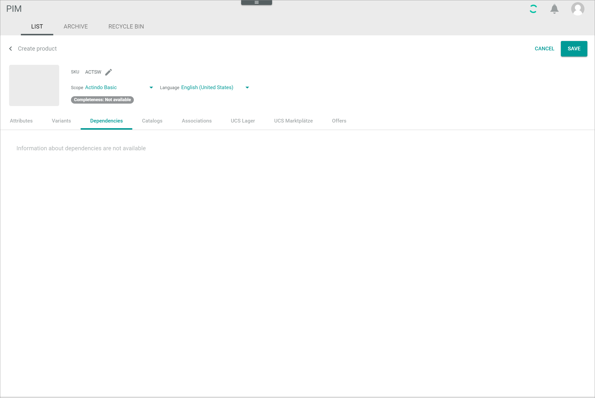

In the *Create product* view, the notice *Information about dependencies are not available* is displayed in this tab. Dependencies are displayed only after saving.  

## Create product &ndash; Catalogs

*PIM > Products > Tab LIST > Button Add > Button CREATE > Tab Catalogs*

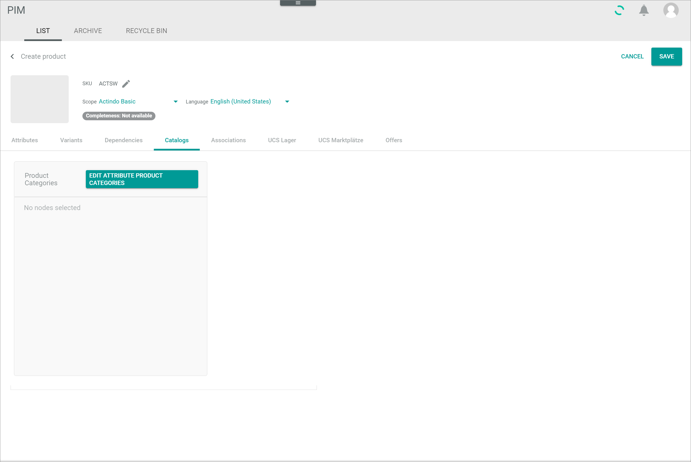

For each catalog a single box to assign the new product to a category is displayed. You can assign a product to several catalogs and categories at the same time.

**"Catalog name"**

- [EDIT ATTRIBUTE "CATALOG NAME"]   
    Click this button to assign the product to a category or a sub-category in the selected catalog. The categories window is displayed.

The catalog box displays all selected categories and their level. All fields are read-only. If no category is selected, the notice *No nodes selected* is displayed in the box.

- *Level 1*    
    Level 1 category name.

- *Level 2*   
    Level 2 category name. This field is only displayed if the product is assigned to a category of level 2 or lower.

- *Level x*   
    Level x category name. This field is only displayed if the product is assigned to a category of level x or lower. The *x* indicates the level number of the assigned category.

-  (Delete)   
    Click this button to delete the category next to the button from the box. This button is only displayed if you hover over a category in the box.

### Categories

[comment]: <> (window needs title!-> FETA-22)

*PIM > Products > Tab LIST > Button Add > Button CREATE > Tab Catalogs > Button EDIT ATTRIBUTE*

- [x]     
    Select a checkbox to assign the product to the selected category. You can select multiple checkboxes.

    > [Info] Categories that are containing sub-categories are displayed with the symbol  (Folders), categories without sub-categories with the symbol  (Folder).    
    Click the [>] button to the left of a category checkbox to display their sub-categories.

- [CANCEL]   
    Click this button to cancel selecting categories. The *Categories* window is closed.

- [SAVE]   
    Click this button to save the selected categories. The *Categories* window is closed.

## Create product &ndash; Associations

*PIM > Products > Tab LIST > Button Add > Button CREATE > Tab Associations*

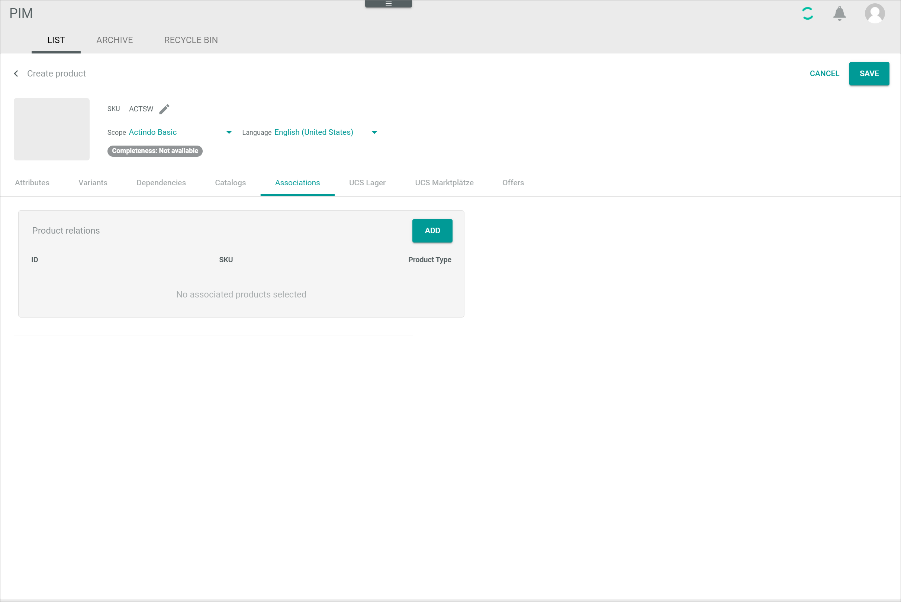

In this tab, boxes of all attributes with the *Related products* data type are displayed. The box titles differ depending on the corresponding attribute names, but the structure of all boxes is identical.   

- [ADD]   
    Click this button to add an associated product to the list. The *Not associated products* window is displayed.

The box displays all associated products. All fields are read-only. If no product is selected, the notice *No associated products selected* is displayed in the box.

- *ID*   
    Product identification number. The ID number is automatically assigned by the system after creation.

- *SKU*   
    Stock Keeping Unit. Identification number of the product.

- *Attribute set*   
    Assigned attribute set.

-  (Eye)   
    The button is only displayed, when you hover over a product in the list.  

[comment]: <> (what should be displayed? loading never ends... -> BUG-153)

-  (Delete)   
    Click this button to delete the selected product from the list. The button is only displayed, when you hover over a product in the list.

### Not associated products

*PIM > Products > Tab LIST > Button Add > Button CREATE > Tab Associations > Button ADD*

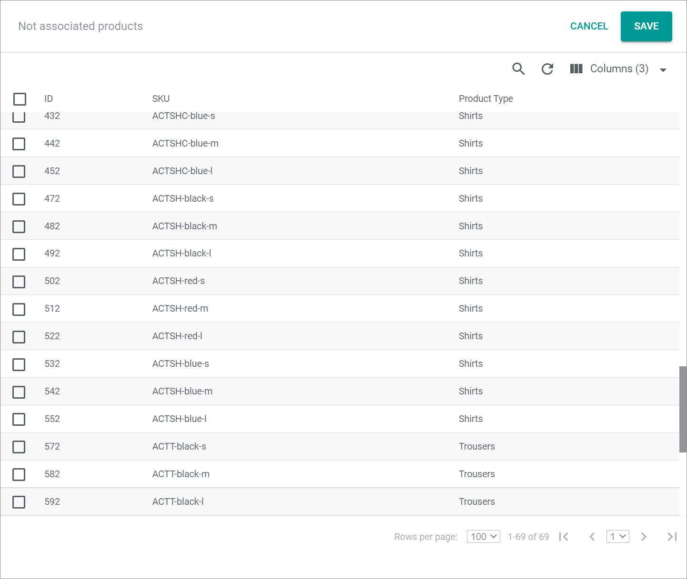

- [CANCEL]   
    Click this button to cancel adding products. The *Not associated products* window is closed.

- [SAVE]   
    Click this button to add the selected products to the list. The *Not associated products* window is closed.

-  (Search)   
    Click this button to display the search bar and search for a product.

-  (Refresh)   
    Click this button to update the list of products.

-  Columns (x)   
    Click this button to display the columns bar and customize the displayed columns and the order of columns in the list. The *x* indicates the number of columns that are currently displayed in the list.

- [x]     
    Select the checkbox to display the editing toolbar. If you click the checkbox in the header, all products in the list are selected.

The list displays all products. All fields are read-only.

- *ID*   
    Product identification number. The ID number is automatically assigned by the system after creation.

- *SKU*   
    Stock Keeping Unit. Identification number of the product.

- *Attribute set*   
    Assigned attribute set.

## Create product &ndash; Offers

*PIM > Products > Tab LIST > Button Add > Button CREATE > Tab Offers*

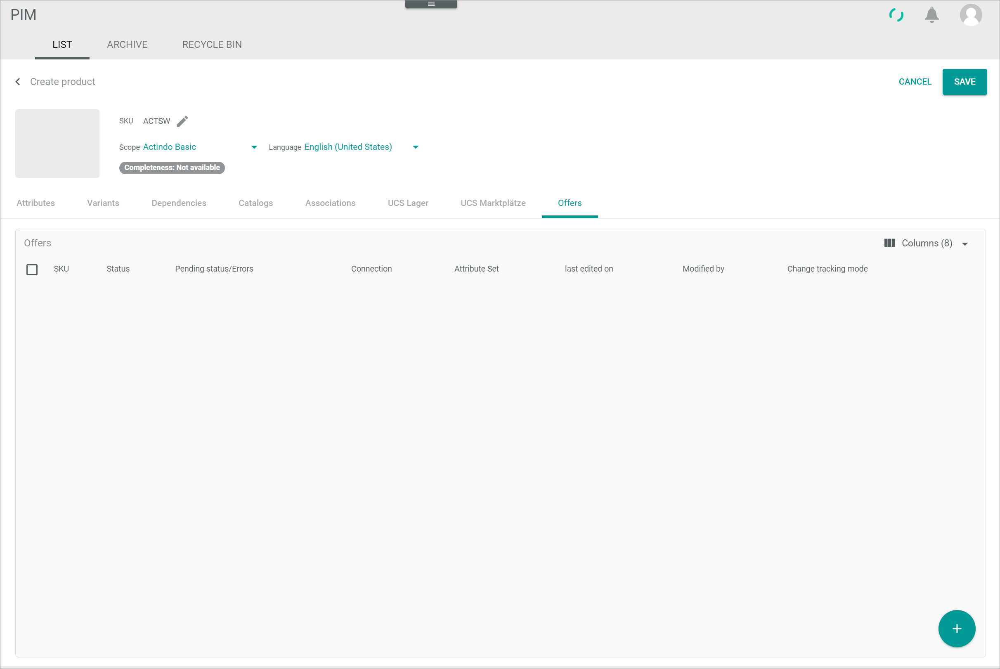

**Offers**

-  Columns (x)   
    Click this button to display the columns bar and customize the displayed columns and the order of columns in the list. The *x* indicates the number of columns that are currently displayed in the list.

- [x]     
    Select the checkbox to display the editing toolbar. If you click the checkbox in the header, all offers in the list are selected.

- *Status*   
    Click the drop-down list to change the offer status. The selected status is displayed in the *Pending status/Errors* column. This drop-down list is only displayed if the checkbox of at least one offer is selected. The following options are available:
    - **Active**      
        The offer is active. It is displayed in the selected connection and can be sold there.   
    - **Inactive**   
        The offer is inactive. It is not displayed in the selected connection and cannot be sold there.   
    - **Offline**   
        The offer is unknown to the selected connection and cannot be sold there.      

- *Change tracking mode*   
    Click the drop-down list to change the change tracking mode (ETL mode) of the offer. The currently selected change tracking mode is displayed in the *Change tracking mode* column. This drop-down list is only displayed if the checkbox of one offer is selected. The following options are available:    
    - **Manual**   
        Changes in a PIM product must be triggered manually to be applied to the offer. The initial offer is automatically applied.
    - **Semi-automatic**   
        Changes in a PIM product are automatically applied to the offer after confirmation. The initial offer is automatically applied without confirmation.   
    - **Semi-automatic, changes must be confirmed by another user**   
        Changes in a PIM product are automatically applied to the offer after confirmation by another user. The initial offer is only applied after confirmation by another user.       
    - **Automatic**   
        Changes in a PIM product are automatically applied to the offer. The initial offer is also automatically applied.

-  (Edit)   
    Click this button to edit the selected offer from the list. This button is only displayed if the checkbox of at least one offer is selected.

[comment]: <> (not working -> if I want to edit an offer, a window is displayed loading all the time... -> BUG-154)

The list displays all created offers to this product. All fields are read-only.

- *SKU*   
    Stock Keeping Unit. Identification number of the product. In the *Create product* view, **TO BE GENERATED** is displayed.

- *Status*   
    Connection status of the offer. In the *Create product* view, **Offline** is displayed.

- *Pending status/Errors*   
    Indication of the pending status or an error for this offer. The selected status is displayed if you have changed the offer status via the editing toolbar. The following options are available:
    - **Active**   
    - **Inactive**   
    - **Offline**

    If an error occurs when uploading the offer, the error message is displayed in the column.

- *Connection*   
    Selected connection for the offer.

- *Attribute set*   
    Attribute set assigned to the offer.

- *Last edited on*   
    Date and time of the last modification. In the *Create product* view, no date is displayed.

- *Modified by*   
    Name and username of the user who modified the offer. In the *Create product* view, no name is displayed.

- *Change tracking mode*   
    Change tracking mode (ETL mode) of the offer. The following options are available:
    - **Manual**
    - **Semi-automatic**
    - **Semi-automatic, changes must be confirmed by another user**   
    - **Automatic**

- *ID*   
    Product identification number. The ID number is automatically assigned by the system after creation.

- *Created on*   
    Date and time of the creation. In the *Create product* view, no date is displayed.

- *Created by*   
    Name and username of the user who created the offer. In the *Create product* view, no name is displayed.

-  (Add)   
    Click this button to create a new offer. The [Add to a single connection  ] button and the [Add to multiple connections  ] button are displayed.

### Add an offer in PIM

*PIM > Products > Tab LIST > Button Add > Button CREATE > Tab Offers > Button Add*

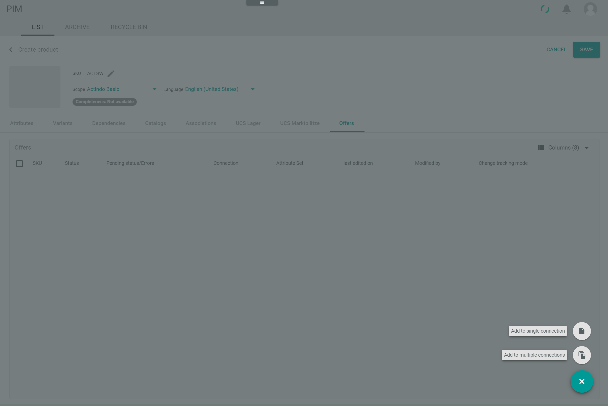

- [Add to a single connection  ]    
    Click this button to add a single connection to the product. The *Add to a single connection* window is displayed.

- [Add to multiple connections  ]    
    Click this button to add multiple connections to the product. The *Add to multiple connections* wizard window is displayed.

-  (Cancel)   
    Click this button to cancel the connection creation. The current view is closed.

### Add to a single connection

*PIM > Products > Tab LIST > Button Add > Button CREATE > Tab Offers > Button Add > Button Add to a single connection*

**Create offer**

- *Select connection*   
    Click the drop-down list to select a connection for the offer. All available connections are displayed in the list. Once a connection has been selected, the *Select attribute set* drop-down list is unlocked.

- *Attribute set*   
    Click the drop-down list to select an attribute set for the offer. All active attribute sets are displayed in the drop-down list. The drop-down list is locked if no connection is selected.

-  *Generate SKU*   
    Enable this toggle to automatically generate a SKU for the offer. Disable the toggle to enter a SKU manually. By default, this toggle is enabled.

- *SKU*    
    Enter an individual SKU for the offer. The SKU (Stock Keeping Unit) is an identification number and should be assigned only once. This field is only displayed if the *Generate SKU* toggle is disabled.

[comment]: <> (offer or product? how does this work? When I enter a different SKU, The SKU is automatically overwritten)

- *Change tracking mode*   
    Select the appropriate option for the change tracking mode (ETL mode). The following options are available:   
    -  *Manual*   
        Changes in a PIM product must be triggered manually to be applied to the offer. The initial offer is automatically applied.   
    -  *Semi-automatic*   
        Changes in a PIM product are automatically applied to the offer after confirmation. The initial offer is automatically applied without confirmation.   
    -  *Semi-automatic, changes must be confirmed by another user*   
        Changes in a PIM product are automatically applied to the offer after confirmation by another user. The initial offer is only applied after confirmation by another user.    
    -  *Automatic*   
        Changes in a PIM product are automatically applied to the offer. The initial offer is also automatically applied.

- *Offer status*    
    Click the drop-down list to select the offer status. The following options are available:    
    - **Active**      
        The offer is active. It is displayed in the selected connection and can be sold there.   
    - **Inactive**   
        The offer is inactive. It is not displayed in the selected connection and cannot be sold there.   
    - **Offline**   
        The offer is unknown to the selected connection and cannot be sold there.

- [CANCEL]   
    Click this button to cancel adding an offer. The *Create offer* window is closed.

- [SAVE]   
    Click this button to save the offer. The *Create offer* window is closed.

### Add to multiple connections

*PIM > Products > Tab LIST > Button Add > Button CREATE > Tab Offers > Button Add > Button Add to multiple connections*

The wizard to create offers for multiple connections is started. The wizard is composed of the following wizard windows:

- [Select connections and status](#select-connections-and-status)
- [Select destination attribute sets](#select-destination-attribute-sets)

#### Select connections and status

*PIM > Products > Tab LIST > Button Add > Button CREATE > Tab Offers > Button Add > Button Add to multiple connections > Wizard window Select connections and status*

**Select status and change tracking mode**

- *Status*    
    Click the drop-down list to select the offer status. The following options are available:    
    - **Active**      
        The offer is active. It is displayed in the selected connection and can be sold there.   
    - **Inactive**   
        The offer is inactive. It is not displayed in the selected connection and cannot be sold there.   
    - **Offline**   
        The offer is unknown to the selected connection and cannot be sold there.

- Change tracking mode
    Select the appropriate option for the change tracking mode (ETL mode). The following options are available:   
    -  *Manual*   
        Changes in a PIM product must be triggered manually to be applied to the offer. The initial offer is automatically applied.   
    -  *Semi-automatic*   
        Changes in a PIM product are automatically applied to the offer after confirmation. The initial offer is automatically applied without confirmation.   
    -  *Semi-automatic, changes must be confirmed by another user*   
        Changes in a PIM product are automatically applied to the offer after confirmation by another user. The initial offer is only applied after confirmation by another user.    
    -  *Automatic*   
        Changes in a PIM product are automatically applied to the offer. The initial offer is also automatically applied.

**Select connections**

- [SELECT ALL]   
    Click this button to select all available connections.

-  "Connection name"     
    Enable a toggle to select the corresponding connection to create an offer to. All available connections are displayed. By default, all toggles are disabled.

- [CANCEL]   
    Click this button to cancel adding multi-connection offers. The *Select connections and status* wizard window is closed.

- [CONTINUE]   
    Click this button to proceed to the next step. The *Select destination attribute sets* wizard window is displayed.

#### Select destination attribute sets

*PIM > Products > Tab LIST > Button Add > Button CREATE > Tab Offers > Button Add > Button Add to multiple connections > Wizard window Select destination attribute sets*

- *Destination attribute set for connection "Connection name"*   
    Click the drop-down list to select the destination attribute set for the selected connection. All available attribute sets for the respective connection are displayed in the list. A single drop-down list is displayed for each selected connection.

- [< BACK]   
    Click this button to go back to the previous step. The *Select connections and status* wizard window is displayed.

- [CANCEL]   
    Click this button to cancel adding multi-connection offers. The *Select destination attribute sets* wizard window is closed.

- [FINALIZE]   
    Click this button to save the multi-connection offers. The *Select destination attribute sets* wizard window is closed.

## Edit product

*PIM > Products > Tab LIST > Select product*

-  (Back)   
    Click this button to close the *Edit product* view and return to the product list. All changes are rejected.

- [CANCEL]   
    Click this button to cancel editing the product.

- [SAVE]   
    Click this button to save the changes to the product.

- Image box   
    Image of the product. The image is displayed when an image is assigned in the corresponding attribute.

- *SKU*   
    Stock Keeping Unit. Identification number for the product.  he SKU (Stock Keeping Unit) is an identification number for the product. Therefore, it should be uniquely assigned to a single product.   
    Click the button  (Edit) to the right of the SKU to edit it.

-  (Edit)   
    Click this button to edit the SKU.

-  (Apply)   
    Click this button to apply the changes to the SKU. This button is only displayed if you are editing the SKU.

- *Channel*   
    Click the drop-down list to select a channel for the product. All active channels are displayed in the drop-down list. By default, the **Actindo Basic** channel is preselected.

- *Language*   
    Click the drop-down list to select a language for the product. All active languages are displayed in the drop-down list. The default language is preselected.

- [COMPLETE]     
    Completeness of the product for all available channels and languages. The percentage of completeness is displayed in the button. Click the button to display the *Completeness* window. If the completeness is less than 100%, the number of missing require attributes is displayed to the right of the completeness button.
    If the completeness cannot be calculated, *Completeness: Not available* is displayed and the button is not clickable.

    > [Info] The completeness is calculated by considering the number of missing *(required)* fields. As the required fields are defined individually for each attribute set, the completeness may vary from one product to another.  

-  *show empty required attributes only*     
    Enable this toggle to display only the missing required fields in the *Attributes* tab for this product. By default, the toggle is disabled. The toggle is only displayed if at least one required field is missing.

- *Sets*   
    Click the drop-down list to change the attribute set for the product. All available attribute sets are displayed in the drop-down list. The currently selected attribute set is highlighted in bold.

    > [Caution] Changing the attribute set can cause a loss of data. Therefore, a confirmation window is displayed to confirm the attribute set change. It is recommended not to change the attribute set subsequently. Note that the change cannot be undone once you have saved the changes.

### Completeness

*PIM > Products > Tab LIST > Select product > Button Complete*

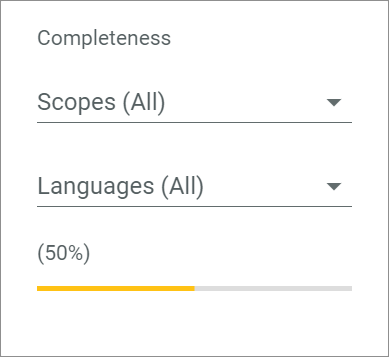

- *Channels*   
    Click the drop-down list to change the channel for the product completeness calculation. All available channels, the **Channels (All)** option and the **Not multi-channel** option are displayed in the drop-down list. By default, the **Channels (All)** option is preselected.

    > [Info] The product completeness for the selected channel is only displayed in the *Completeness* window. The [COMPLETE] button in the *Edit Product* view is not affected by this change.

- *Languages*   
    Click the drop-down list to change the language for the product completeness calculation. All available languages, the **Languages (All)** option and the **Not multi-language** option are displayed in the drop-down list. By default, the **Languages (All)** option is preselected.

    > [Info] The product completeness for the selected language is only displayed in the *Completeness* window. The [COMPLETE] button in the *Edit Product* view is not affected by this change.

- Percentage   
    The current percentage for the product completeness of the selected channel and language is displayed. The percentage is automatically updated when you select a different channel or language.

## Edit product &ndash; Attributes

*PIM > Products > Tab LIST > Select product > Tab Attributes*

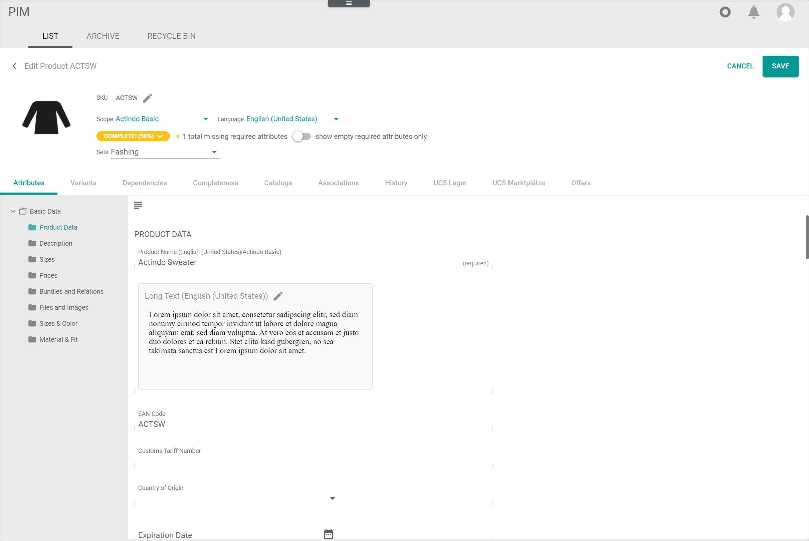

In the left margin column, all available attribute groups are displayed. Click an attribute group to display the attributes that are assigned to this group on the right side of the *Attributes* tab. If the product contains attributes that are unassigned, the *Unassigned group* attribute group is automatically displayed in the left margin column.

The right side of the *Attributes* tab displays all attributes that are assigned to the selected group in the left margin column.

-  (Fade in/out)    
    Click this button to hide or display the left margin column with the attribute groups. When the left margin is displayed and you click this button, the column is hidden. When the column is hidden and you click this button, the column is displayed again.

## Edit product &ndash; Variants

*PIM > Products > Tab LIST >  Select product > Tab Variants*

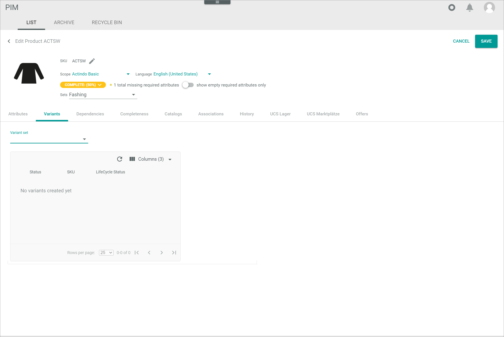

- *Variant set*   
    Click the drop-down list to select a variant set for the product. All available variant sets are displayed in the drop-down list. The  (Add) button is displayed in the variants box below if a variant set is selected.
    If the product is a master product, the corresponding variant set is preselected in the drop-down list. The drop-down list is locked. The corresponding variants and the  (Add) button are displayed in the variants box.
    If the product is a variant, the *Variant set* drop-down list is not displayed, but the *Variant* field.

- *Variant*   
    Indication that the selected product is a variant. This field is read-only. The value can be changed within the *Attributes* tab. This field is only displayed for variants.

**Variants box**

> [Info] If the product is a variant, the variants box is not displayed.

-  (Refresh)   
    Click this button to update the list of variants.

-  Columns (x)   
    Click this button to display the columns bar and customize the displayed columns and the order of columns in the list. The *x* indicates the number of columns that are currently displayed in the list.

The list displays all variants. All fields are read-only. Depending on the settings, the displayed columns may vary.

- *Status*  
    Status of the variant. The following options are available:
    - **Created after save**   
        The added variant is created after saving the product.
    - **Created**   
        The variant is already created.

- *SKU*  
    Stock Keeping Unit. Identification number for the variant. The SKU for the variant is created depending on the selected settings.

- *Lifecycle status*   
    Life cycle status of the variant article. The following options are available:
    - **active**   
        The variant is active.
    - **in_archive**   
        The variant is archived.
    - **in_recycle_bin**   
        The variant is moved to the recycle bin.

- *ID*   
    Variant identification number. The ID number is automatically assigned by the system after saving. In the *Create product* view, no ID is displayed.

- Defining/changeable attribute    
    You can add a column for each attribute that is assigned as a defining or changeable attribute to the selected variant set. The column displays the attribute name, the row displays the attribute value.

-  (Add)   
    Click this button to add a new variant to the product. The [Add single variant  ] button and the [Add multiple variants  ] button are displayed.

### Add variant

*PIM > Products > Tab LIST > Select product > Tab Variants > Select variant set > Button Add*

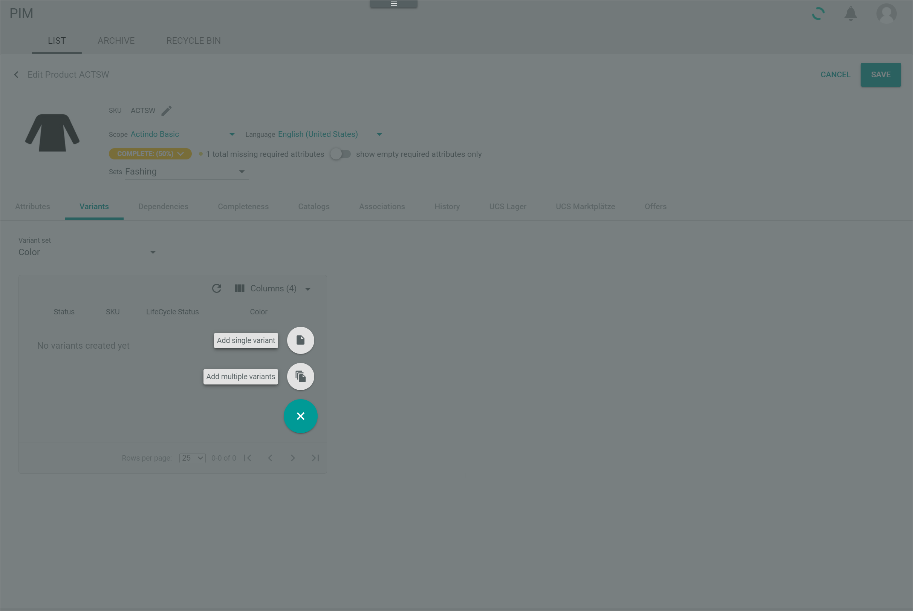

- [Add single variant  ]    
    Click this button to add a single variant to the product. The *Add single variant* window is displayed.

- [Add multiple variants  ]    
    Click this button to add multiple variants to the product. The *Add multiple variant* wizard window is displayed.

-  (Cancel)   
    Click this button to cancel the variant creation and exit the current view.

### Add single variant

*PIM > Products > Tab LIST > Select product > Tab Variants > Select variant set > Button Add > Button Add single variant*

**Additional fields**

- *SKU*   
    Identification number for the variant. The SKU (Stock Keeping Unit) is an identification number and should be assigned only once. This field is read-only as long as the *Use formula* toggle is enabled. Disable the toggle to edit the SKU.

-  *Use formula*   
    Enable this toggle to apply the formula defined in the settings for the variant sets to the variant SKU. When the toggle is enabled, the *SKU* field is read-only. Disable the toggle to enter a different SKU. By default, this toggle is enabled.

**Defined values**

All defining attributes of the variant are displayed in this section.

- Defining attribute   
    Enter or select the appropriate value for the defining attribute.

- [CANCEL]   
    Click this button to cancel adding a variant. The *Add single variant* window is closed.

- [SAVE]   
    Click this button to save the variant. The *Add single variant* window is closed.

### Add multiple variants

*PIM > Products > Tab LIST > Select product > Tab Variants > Select variant set > Button Add > Button Add multiple variants*

The wizard to add multiple variants to the selected product is started. The wizard is composed of the following wizard windows:

- [Select values](#select-values-1)
- [Summary](#summary-1)

#### Select values

*PIM > Products > Tab LIST > Select product > Tab Variants > Select variant set > Button Add > Button Add multiple variants > Wizard window Select values*

For each defining attribute a single box to define the attribute value is displayed.

> [Info] If more than one defining attribute is assigned to the variant, you have to select a value for each defining attribute to add a variant.

- [ADD ALL VALUES]   
    Click this button to add all available values in the box for the corresponding defining attribute. This button is only displayed for attributes with the *TreeNode* data type.

- [ADD VALUE]   
    Click this button to add a further row to the corresponding attribute where you can enter or select the desired value.

- [CANCEL]   
    Click this button to cancel adding variants. The *Select values* wizard window is closed.

- [NEXT]   
    Click this button to proceed to the next step. The *Summary* wizard window is displayed.

#### Summary

*PIM > Products > Tab LIST > Select product > Tab Variants > Select variant set > Button Add > Button Add multiple variants > Wizard window Summary*

The box displays all variants that will be created from the selected attribute values. For each possible combination of the selected attributes, a new variant is created. Variants that already exist will not be created even if they are listed in the box.

**Variants that will be created (ignoring duplicated)**

-  Columns (x)   
    Click this button to display the columns bar and customize the displayed columns and the order of columns in the list. The *x* indicates the number of columns that are currently displayed in the list.

- [x]     
    Select the checkbox to display the editing toolbar. If you click the checkbox in the header, all variants in the list are selected.

-  (Delete)   
    Click this button to delete the selected variant from the list. This button is only displayed if the checkbox of a variant is selected.

The list displays all selected variants. Depending on the settings, the displayed columns may vary.

- *SKU*      
    Stock Keeping Unit. Identification number for the variant. Click this field to edit the SKU of the selected variant.

- Defining attribute   
    You can add a column for each defining attribute. The column displays the attribute name, the row displays the corresponding attribute value. These fields are read-only.

- [< GO BACK]   
    Click this button to go back to the previous step of adding variants. The *Select values* wizard window is displayed.

- [CANCEL]   
    Click this button to cancel adding variants. The *Summary* wizard window is closed.

- [FINALIZE]   
    Click this button to save the listed variants. The *Summary* wizard window is closed.

## Edit product &ndash; Dependencies

*PIM > Products > Select product > Tab Dependencies*

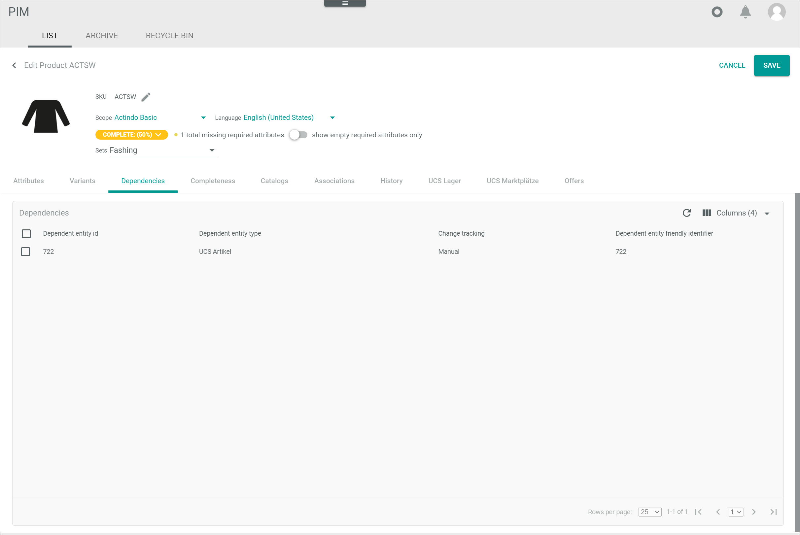

**Dependencies**

-  (Refresh)   
    Click this button to update the list of product dependencies.

-  Columns (x)   
    Click this button to display the columns bar and customize the displayed columns and the order of columns in the list. The *x* indicates the number of columns that are currently displayed in the list.

- [x]     
    Select the checkbox to display the editing toolbar. If you click the checkbox in the header, all dependent entities in the list are selected.

The list displays all dependencies of the selected product. All fields are read-only. Depending on the settings, the displayed columns may vary.

- *Dependent entity ID*   
    Identification number of the dependent entity.

- *Dependent entity type*   
    Type of the dependent entity. The available types depend on the installed plugins.

- *Change tracking mode*   
    Change tracking mode (ETL mode) of the dependent entity. The following options are available:
    - **Manual**
    - **Semi-automatic**
    - **Semi-automatic, changes must be confirmed by another user**   
    - **Automatic**

- *Dependent entity friendly identifier*   
    Further, more descriptive identifier of the dependent entity, for instance the SKU number or a bill number.

- [RERUN MAPPING]   
    Click this button to rerun the mapping of the selected entity. This button is only displayed if the checkbox of at least one dependency is selected.

## Edit product &ndash; Completeness

*PIM > Products > Select product > Tab Completeness*

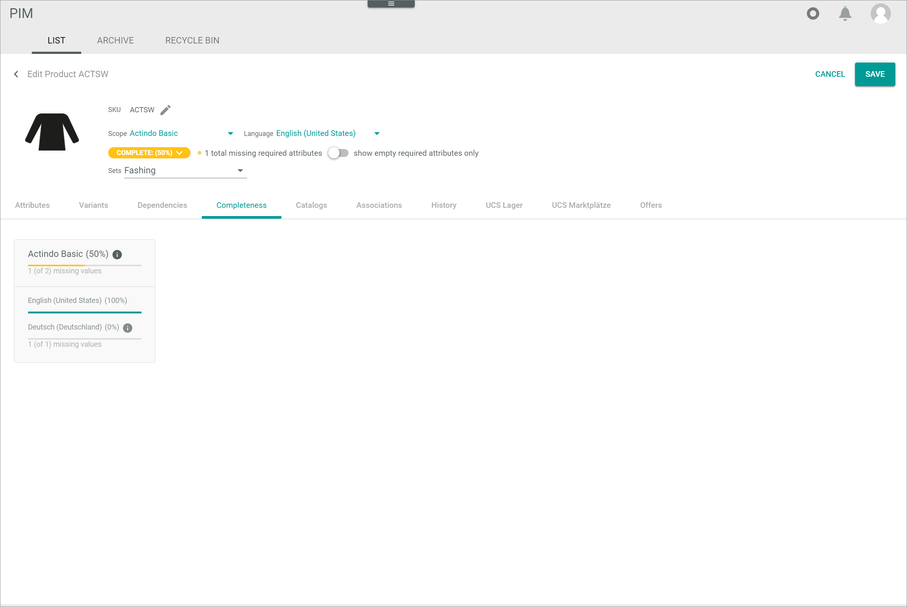

The *Completeness* tab displays the completeness of the product for the different languages and channels. A single box is displayed for each active channel. The tab is only displayed if the completeness of the product has been calculated and is displayed in the header section of the *Edit product* view. Consequently, the tab is never displayed in the *Create product* view.

- Channel name   
    This box displays the percentage for the product completeness of the selected product regarding the assigned channel.
    - Language   
        The box displays the percentage for the product completeness of the selected product regarding the assigned channel and language. A single percentage is displayed for each available language for one channel.

    -  (Info)   
        Hover over this icon to display a box that is listing the missing attribute values. This icon is only displayed if at least one required attribute value for the product completeness is missing.

## Edit product &ndash; Catalogs

*PIM > Products > Select product > Tab Catalogs*

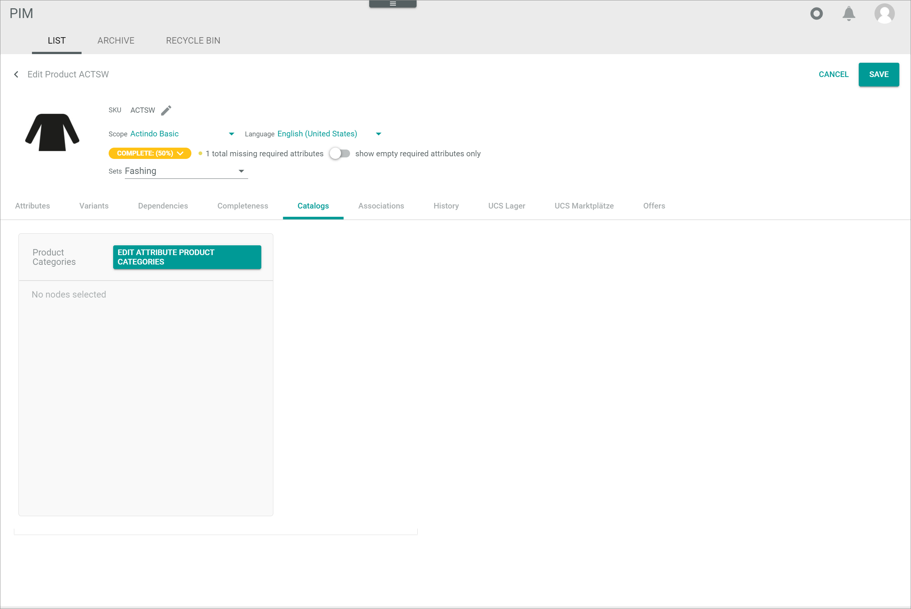

For each catalog a single box to assign the new product to a category is displayed. You can assign a product to several categories at the same time.

**"Catalog name"**

- [EDIT ATTRIBUTE "CATALOG NAME"]   
    Click this button to assign the product to a category or a sub-category in the selected catalog. The categories window is displayed.

The box displays all selected categories and their level. All fields are read-only. If no category is selected, the notice *No nodes selected* is displayed in the box.

- *Level 1*    
    Level 1 category name.

- *Level 2*   
    Level 2 category name. This field is only displayed if the product is assigned to a category of level 2 or lower.

- *Level x*   
    Level x category name. This field is only displayed if the product is assigned to a category of level x or lower. The *x* indicates the level number of the assigned category.

-  (Delete)   
    Click this button to delete the selected category from the box. This button is only displayed if you hover over a category in the box.

### Categories

*PIM > Products > Select product > Tab Catalogs > Button EDIT ATTRIBUTE*

- [x]     
    Select a checkbox to assign the product to the selected category. You can select multiple checkboxes.

> [Info] Categories that are containing sub-categories are displayed with the symbol  (Folders), categories without sub-categories with the symbol  (Folder).    
Click the [>] button to the left of a category checkbox to display their sub-categories.

- [CANCEL]   
    Click this button to cancel selecting categories. The *Categories* window is closed.

- [SAVE]   
    Click this button to save the selected categories. The *Categories* window is closed.

## Edit product &ndash; Associations

*PIM > Products > Select product > Tab Associations*

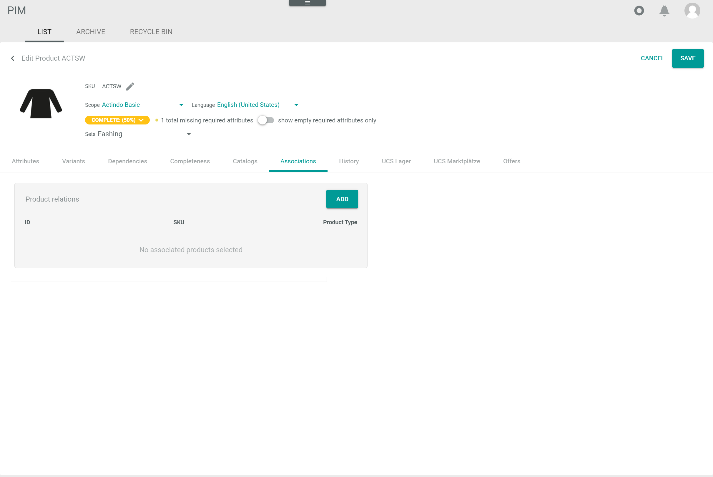

In this tab, boxes of all attributes with the *Related products* data type are displayed. The box titles differ depending on the corresponding attribute names, but the structure of all boxes is identical.

- [ADD]   
    Click this button to add an associated product to the list. The *Not associated products* window is displayed.

The box displays all associated products. All fields are read-only. If no product is selected, *No associated products selected* is displayed in the box.

- *ID*   
    Product identification number. The ID number is automatically assigned by the system.

- *SKU*   
    Stock Keeping Unit. Identification number of the product.

- *Attribute set*   
    Assigned attribute set.

-  (Eye)   
    The button is only displayed, when you hover over a product in the list.

[comment]: <> (what should be displayed? loading never ends... BUG-153)

-  (Delete)   
    Click this button to delete the selected product from the list. This button is only displayed if you hover over a product in the list.

### Not associated products

*PIM > Products > Select product > Tab Associations > Button ADD*

- [CANCEL]   
    Click this button to cancel adding products. The *Not associated products* window is closed.

- [SAVE]   
    Click this button to add the selected products to the list. The *Not associated products* window is closed.

-  (Search)   
    Click this button to display the search bar and search for a product.

-  (Refresh)   
    Click this button to update the list of products.

-  Columns (x)   
    Click this button to display the columns bar and customize the displayed columns and the order of columns in the list. The *x* indicates the number of columns that are currently displayed in the list.

- [x]     
    Select the checkbox to display the editing toolbar. If you click the checkbox in the header, all products in the list are selected.

The list displays all products. All fields are read-only.

- *ID*   
    Product identification number. The ID number is automatically assigned by the system.

- *SKU*   
    Stock Keeping Unit. Identification number of the product.

- *Attribute set*   
    Assigned attribute set.

## Edit product &ndash; History

*PIM > Products > Select product > Tab History*

The *History* tab is only displayed in the *Edit product* view. The tab is never displayed in the *Create product* view.

**History**

-  (Search)   
    Click this button to display the search bar and search for a change.

-  (Refresh)   
    Click this button to update the list of changes.

-  Columns (x)   
    Click this button to display the columns bar and customize the displayed columns and the order of columns in the list. The *x* indicates the number of columns that are currently displayed in the list.

-  Filter (x)   
    Click this button to display the filter bar and customize the active filters. The *x* indicates the number of filters that are currently active.

The list displays the change history of the product. All fields are read-only. Depending on the settings, the displayed columns may vary.

- [x]     
    Select the checkbox to display the editing toolbar.

- *Date*   
    Date and time of the change.

- *Author*   
    Name and username of the user who modified the product.

- *Changed elements*   
    List of elements that were changed.

- *ID*   
    Identification number of the change. The ID number is automatically assigned by the system.  

-  (Eye)   
    Click this button to display the *History (Single entry)* window. This button is only displayed if the checkbox of a change entry is selected. Alternatively, you can click directly a row in the list to display the *History (Single entry)* window.   

### History (Single entry)

*PIM > Products > Select product > Tab History > Select checkbox > Button Eye*

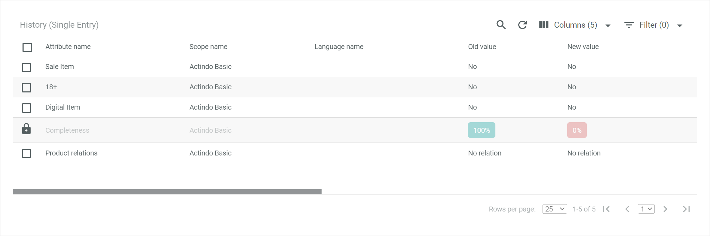

-  (Search)   
    Click this button to display the search bar and search for a change entry.

-  (Refresh)   
    Click this button to update the list of change entries.

-  Columns (x)   
    Click this button to display the columns bar and customize the displayed columns and the order of columns in the list. The *x* indicates the number of columns that are currently displayed in the list.

-  Filter (x)   
    Click this button to display the filter bar and customize the active filters. The *x* indicates the number of filters that are currently active.

- [x]     
    Select the checkbox to display the editing toolbar. If you click the checkbox in the header, all change entries in the list are selected.

-  (Lock)   
    This entry is locked and cannot be undone. It cannot be selected. The corresponding entry row is grayed out.

The list displays the single entries of the selected product change. All fields are read-only. Depending on the settings, the displayed columns may vary.

- *Attribute name*   
    Name of the attribute to which the change was made.

- *Channel name*   
    Name of the channel to which the change was made.

- *Language name*   
    Name of the language to which the change was made

- *Old value*   
    Attribute value before change. If the field is empty, no value was set for this attribute before the change.  

- *New value*   
    Attribute value after the change.  

- *ID*   
    Identification number of the change entry. The ID number is automatically assigned by the system.  

-  (Undo)   
    Click this button to undo the selected change(s). A confirmation window is displayed to confirm the change reversion. This button is only displayed if the checkbox of a change entry is selected.

## Edit product &ndash; Offers

*PIM > Products > Select product > Tab Offers*

**Offers**

-  Columns (x)   
    Click this button to display the columns bar and customize the displayed columns and the order of columns in the list. The *x* indicates the number of columns that are currently displayed in the list.

- [x]     
    Select the checkbox to display the editing toolbar. If you click the checkbox in the header, all offers in the list are selected.

- *Status*   
    Click the drop-down list to change the offer status. The selected status is displayed in the *Pending status/Errors* column. This drop-down list is only displayed if the checkbox of at least one offer is selected. The following options are available:    
    - **Active**      
        The offer is active. It is displayed in the selected connection and can be sold there.   
    - **Inactive**   
        The offer is inactive. It is not displayed in the selected connection and cannot be sold there.   
    - **Offline**   
        The offer is unknown to the selected connection and cannot be sold there.

- *Change tracking mode*   
    Click the drop-down list to change the change tracking mode (ETL mode) of the offer. The currently selected change tracking mode is displayed in the *Change tracking mode* column. This drop-down list is only displayed if the checkbox of one offer is selected. The following options are available:    
    - **Manual**   
        Changes in a PIM product must be triggered manually to be applied to the offer. The initial offer is automatically applied.
    - **Semi-automatic**   
        Changes in a PIM product are automatically applied to the offer after confirmation. The initial offer is automatically applied without confirmation.   
    - **Semi-automatic, changes must be confirmed by another user**   
        Changes in a PIM product are automatically applied to the offer after confirmation by another user. The initial offer is only applied after confirmation by another user.       
    - **Automatic**   
        Changes in a PIM product are automatically applied to the offer. The initial offer is also automatically applied.

-  (Edit)   
    Click this button to edit the selected offer from the list. This button is only displayed if the checkbox of at least one offer is selected.

[comment]: <> (not working -> if I want to edit an offer, a window is displayed loading all the time... -> BUG-154)

The list displays all created offers to this product. All fields are read-only.

- *SKU*   
    Stock Keeping Unit. Identification number of the product.

- *Status*   
    Connection status of the offer. The following options are available:
    - **Active**      
        The offer is active. It is displayed in the selected connection and can be sold there.   
    - **Inactive**   
        The offer is inactive. It is not displayed in the selected connection and cannot be sold there.   
    - **Offline**   
        The offer is unknown to the selected connection and cannot be sold there.

- *Pending status/Errors*   
    Indication of the pending status or an error for this offer. The selected status is displayed if you have changed the offer status via the editing toolbar. The following options are available:
    - **Active**   
    - **Inactive**   
    - **Offline**

    If an error occurs when uploading the offer, the error message is displayed in the column.

- *Connection*   
    Selected connection for the offer.

- *Attribute set*   
    Selected attribute set for the offer.

- *last edited on*   
    Date and time of the last modification.

- *Modified by*   
    Name and username of the user who modified the product.

- *Change tracking mode*   
    Change tracking mode (ETL mode) of the offer. The following options are available:
    - **Manual**
    - **Semi-automatic**
    - **Semi-automatic, changes must be confirmed by another user**   
    - **Automatic**

- *ID*   
    Product identification number. The ID number is automatically assigned by the system.

- *Created on*   
    Date and time of the creation.

- *Created by*   
    Name and username of the user who created the product.

-  (Add)   
    Click this button to add a new variant to the product. The [Add to a single connection  ] button and the [Add to multiple connections  ] button are displayed.

### Add an offer in PIM

*PIM > Products > Select product > Tab Offers > Button Add*

- [Add to a single connection  ]    
    Click this button to add a single variant to the product. The *Add to a single connection* window is displayed.

- [Add to multiple connections  ]    
    Click this button to add multiple variants to the product. The *Add to multiple connections* wizard window is displayed.

-  (Cancel)   
    Click this button to cancel the connection creation and exit the current view.

### Add to a single connection

*PIM > Products > Select product > Tab Offers > Button Add > Button Add to a single connection*

**Create offer**

- *Select connection*   
    Click the drop-down list to select a connection for the offer. All available connections are displayed in the list.

- *Attribute set*   
    Click the drop-down list to select an attribute set for the offer. All active attribute sets are displayed in the drop-down list. The drop-down list is locked if no connection is selected.

-  *Generate SKU*   
    Enable this toggle to automatically generate a SKU for the offer. Disable the toggle to enter a SKU manually. By default, this toggle is enabled.

- *SKU*    
    Enter an individual SKU for the offer. The SKU (Stock Keeping Unit) is an identification number and should be assigned only once.

[comment]: <> (offer or product? how does this work? When I enter a different SKU, The SKU is automatically overwritten)

- *Change tracking mode*   
    Select the appropriate option for the change tracking mode (ETL mode). The following options are available:   
    -  *Manual*   
        Changes in a PIM product must be triggered manually to be applied to the offer. The initial offer is automatically applied.   
    -  *Semi-automatic*   
        Changes in a PIM product are automatically applied to the offer after confirmation. The initial offer is automatically applied without confirmation.   
    -  *Semi-automatic, changes must be confirmed by another user*   
        Changes in a PIM product are automatically applied to the offer after confirmation by another user. The initial offer is only applied after confirmation by another user.    
    -  *Automatic*   
        Changes in a PIM product are automatically applied to the offer. The initial offer is also automatically applied.

- *Offer status*    
    Click the drop-down list to select the offer status. The following options are available:    
    - **Active**      
        The offer is active. It is displayed in the selected connection and can be sold there.   
    - **Inactive**   
        The offer is inactive. It is not displayed in the selected connection and cannot be sold there.   
    - **Offline**   
        The offer is unknown to the selected connection and cannot be sold there.

- [CANCEL]   
    Click this button to cancel adding an offer. The *Create offer* window is closed.

- [SAVE]   
    Click this button to save the offer. The *Create offer* window is closed.

### Add to multiple connections

*PIM > Products > Select product > Tab Offers > Button Add > Button Add to multiple connections*

The wizard to create offers for multiple connections is started. The wizard is composed of the following wizard windows:

- [Select connections and status](#select-connections-and-status-1)
- [Select destination attribute sets](#select-destination-attribute-sets-1)

#### Select connections and status

*PIM > Products > Select product > Tab Offers > Button Add > Button Add to multiple connections > Wizard window Select connections and status*

**Select status and change tracking mode**

- *Status*    
    Click the drop-down list to select the offer status. The following options are available:    
    - **Active**   
        The offer is active. It is displayed on the marketplace and can be sold there.
    - **Inactive**   
        The offer is inactive. It is not displayed on the marketplace and cannot be sold there.   
    - **Offline**   
        The offer is unknown to the marketplace and therefore cannot be sold there.

- Select the appropriate change tracking mode. The following options are available:   
    -  *manual*   
        Changes in a PIM product must be triggered manually to be applied to the offer. The initial offer is automatically applied.   
    -  *semi-automatic*   
        Changes in a PIM product are automatically applied to the offer after confirmation in the *Omni-Channel* module. The initial offer is automatically applied without confirmation.   
    -  *semi-automatic, changes must be confirmed by another user*   
        Changes in a PIM product are automatically applied to the offer after confirmation in the *Omni-Channel* module by another user. The initial offer is only applied after confirmation by another user.    
    -  *automatic*   
        Changes in a PIM product are automatically applied to the offer. The initial offer is also automatically applied.

**Select connections**

- [SELECT ALL]   
    Click this button to select all available connections.

-  *"Connection name"*     
    Enable a toggle to select the corresponding connection to create an offer to. All available connections are displayed. By default, all toggles are disabled.

- [CANCEL]   
    Click this button to cancel adding multi-connection offers. The *Select connections and status* wizard window is closed.

- [CONTINUE]   
    Click this button to proceed to the next step. The *Select destination attribute sets* wizard window is displayed.

#### Select destination attribute sets

*PIM > Products > Select product > Tab Offers > Button Add > Button Add to multiple connections > Wizard window Select destination attribute sets*

- *Destination attribute set for connection*   
    Destination attribute set for the selected connection. The attribute set is automatically selected. This field is read-only. An own attribute set is assigned to each selected connection.

- [< BACK]   
    Click this button to go back to the previous step. The *Select connections and status* wizard window is displayed.

- [CANCEL]   
    Click this button to cancel adding multi-connection offers. The *Select destination attribute sets* wizard window is closed.

- [FINALIZE]   
    Click this button to save the multi-connection offers. The *Select destination attribute sets* wizard window is closed.
