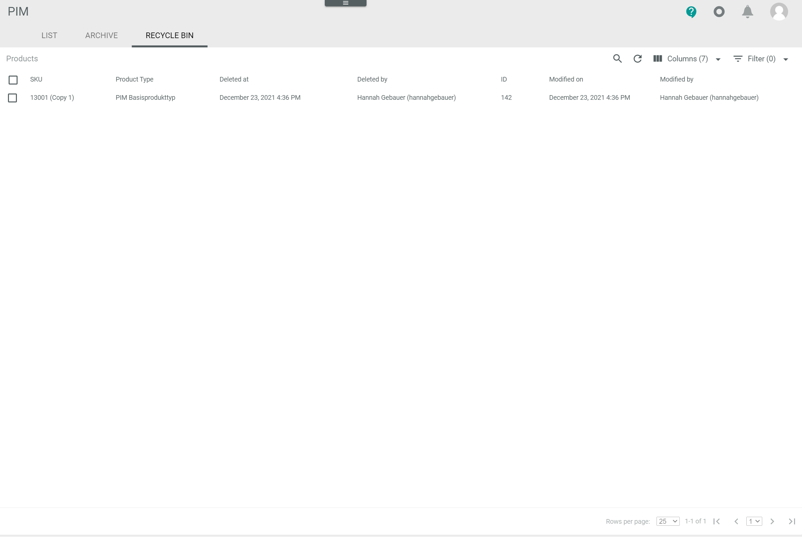

# Recycle bin

*PIM > Products > Tab RECYCLE BIN*

**Products**

-  (Search)   
  Click this button to display the search bar and search for a product.

-  (Refresh)   
  Click this button to update the list of products.

-  Columns (x)   
  Click this button to display the columns bar and customize the displayed columns and the order of columns in the list. The *x* indicates the number of columns that are currently displayed in the list.

-  Filter (x)   
  Click this button to display the filter bar and customize the active filters. The *x* indicates the number of filters that are currently active.

- [x]     
  Select the checkbox to display the editing toolbar. If you click the checkbox in the header, all products in the list are selected.

- [ARCHIVE PRODUCT] / [ARCHIVE PRODUCTS]   
  Click this button to archive the selected product(s). This button is only displayed if the checkbox of at least one product is selected.   
  For detailed information, see [Archive a product](../Operation/03_MoveProducts.md#archive-a-product).

- [RESTORE PRODUCT] / [RESTORE PRODUCTS]   
  Click this button to restore the selected product(s). This button is only displayed if the checkbox of at least one product is selected.   
  For detailed information, see [Restore a product](../Operation/03_MoveProducts.md#restore-a-product).

- [PERMANENTLY DELETE PRODUCT] / [PERMANENTLY DELETE PRODUCTS]      
  Click this button to delete the selected product(s) permanently. This button is only displayed if the checkbox of at least one product is selected.   
  For detailed information, see [Delete a product](../Operation/03_MoveProducts.md#delete-a-product).

The list displays all products moved to recycle bin. All fields are read-only. Depending on the settings, the displayed columns may vary.

- *SKU*   
  Stock Keeping Unit. Identification number for the product.  

- *Attribute set*   
  Assigned attribute set.

- *Deleted on*   
  Date and time of the deletion.

- *Deleted by*   
  Name and username of the user who deleted the product.

- *ID*   
  Product ID number. The ID number is automatically assigned to the product by the system when it is created.

- *Modified on*   
  Date and time of the last modification.

- *Modified by*   
  Name and username of the user who modified the product.
