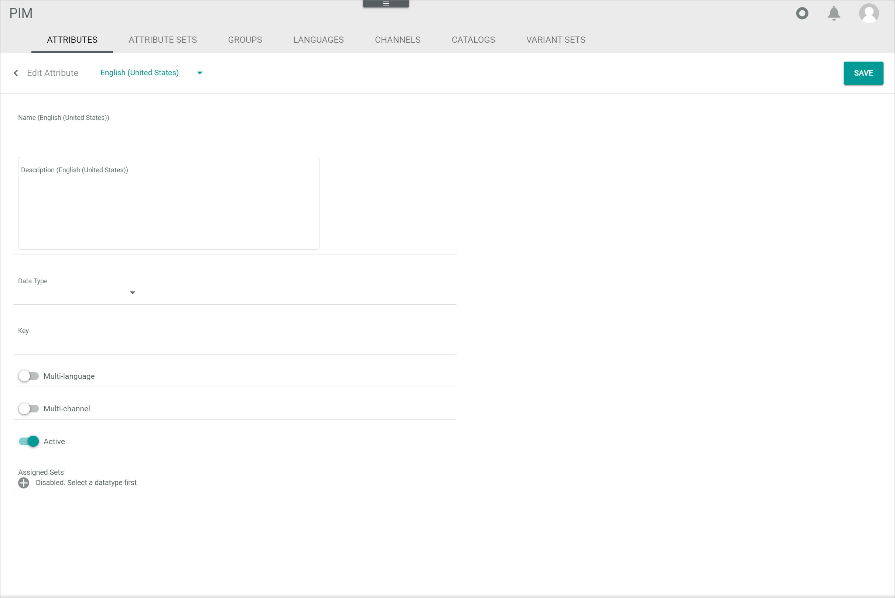
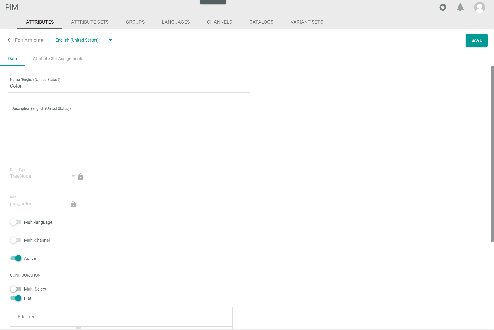

# Attributes

*PIM > Settings > Tab ATTRIBUTES*

**Attribute list**

-  (Search)   
  Click this button to display the search bar and search for an attribute.

-  (Refresh)   
  Click this button to update the list of attributes.

-  Columns (x)   
  Click this button to display the columns bar and customize the displayed columns and the order of columns in the list. The *x* indicates the number of columns that are currently displayed in the list.

-  Filter (x)   
  Click this button to display the filter bar and customize the active filters. The *x* indicates the number of filters that are currently active.

- [x]     
  Select the checkbox to display the editing toolbar. You cannot select multiple checkboxes at once.

- [EDIT]      
  Click this button to edit the selected attribute. This button is only displayed if the checkbox of an attribute is selected. Alternatively, you can click directly a row in the list to edit an attribute.   
  For detailed information, see [Edit an attribute](../Integration/01_ManageAttributes.md#edit-an-attribute).

- [DELETE]   
  Click this button to delete the selected attribute. This button is only displayed if the checkbox of an attribute is selected.       
  For detailed information, see [Delete an attribute](../Integration/01_ManageAttributes.md#delete-an-attribute).

The list displays all attributes. Depending on the settings, the displayed columns may vary. All fields are read-only.

- *Name*   
  Attribute name.

- *Status*   
  Attribute status. The following options are available:
  -  **Active**
  -  **Inactive**   

- *Group*   
  Attribute group assigned to the attribute. If the attribute is not assigned to any attribute group, *not assigned* is displayed.

- *Key*   
  Attribute key.

- *Data type*   
  Attribute data type.    
  For detailed information about all data types, see [Data type list](../../DataHub/UserInterface/04_DataTypeList.md).

- *Description*   
  Description to the attribute.

- *Multi-language*   
  Indication whether the attribute is multi-language or not:
  -  (Checkmark): The attribute is multi-language.  
  -  (Cross): The attribute is single language.

- *Multi-channel*   
  Indication whether the attribute is multi-channel or not:  
  -  (Checkmark): The attribute is multi-channel.  
  -  (Cross): The attribute is single channel.

- *Plugin*   
  Module or plugin that owns the attribute. In the *PIM* module, only PIM attributes are displayed.

  [comment]: <> (What sense has this column in the PIM module when only PIM attributes are displayed?)

- *ID*   
  Attribute identification number. The ID number is automatically assigned by the system.

- *Modified on*   
  Date and time of the last modification.

- *Modified by*   
  Name and username of the user who modified the attribute.

- *Created on*   
  Date and time of the creation.

- *Created by*   
  Name and username of the user who created the attribute.

- *Name (Language)*   
  Attribute name in the selected language. A single column is displayed for the system languages *English (United States)* and *Deutsch (Deutschland)*.

- *Description (Language)*   
  Attribute description in the selected language. A single column is displayed for the system languages *English (United States)* and *Deutsch (Deutschland)*.

-  (Add)   
  Click this button to create an attribute. The *Create attribute* view is displayed.   

## Create attribute

*PIM > Settings > Tab ATTRIBUTES > Button Add*

**Create attribute**

-  (Back)   
  Click this button to close the *Create attribute* view and return to the attributes list. All changes are rejected.

- Language      
  Click the drop-down list and select the system language in which the *Name (Language)* and *Description (Language)* fields are displayed. By default, the following options are available:
  - **English (United States)**
  - **Deutsch (Deutschland)**

- [SAVE]   
  Click this button to save the attribute. The *Create attribute* view is closed.

**BASIC DATA**

- *Name (Language)*   
  Enter an attribute name in the selected language.

- *Description (Language)*   
  Enter a description to the attribute in the selected language.

- *Data type*   
  Click the drop-down list and select an attribute data type. The  (Add) button in the *Assigned sets* field is unlocked.   
  For detailed information about all data types, see [Data type list](../../DataHub/UserInterface/04_DataTypeList.md).

- *Key*   
  Enter an attribute key. The key is required for API access and must be system wide unique. An attribute key must fulfill the following criteria:
    - valid characters are **a-z** (upper and lower case), **0-9** and the underscore ( **_** )
    - the key must not start with a number
    - a double underscore ( **___** ) and a trailing underscore are forbidden

-  *Multi-language*   
  Enable this toggle to create a multi-lingual attribute. Disable the toggle to create a single language attribute. By default, this toggle is disabled.

-  *Multi-channel*   
  Enable this toggle to create a multi-channel attribute. Disable the toggle to create a single channel attribute. By default, this toggle is disabled.

-  *Active*   
  Enable this toggle to set the attribute status to active. Disable the toggle to set the status to inactive. By default, this toggle is enabled.

- *Assigned sets*   
  Click the drop-down list and select an attribute set to which the attribute is assigned after creation. All active attribute sets are displayed. This drop-down list is only displayed if you have previously clicked the  (Add) button.
  -  (Add)    
    Click this button to add an attribute set drop-down list. You can add an infinite number of attribute sets.
  -  (Delete)   
    Click this button to delete the corresponding attribute set.

  > [Info] If you do not assign the attribute to an attribute set at this point, you will have to do it afterwards in the corresponding attribute set(s), see [Add an attribute to the set](../Integration/02_ManageAttributeSets.md#add-an-attribute-to-the-set).

**CONFIGURATION**

The *CONFIGURATION* section displays the additional configuration for the selected data type. The configuration fields differ depending on the selected data type.
As some data types have no further configuration settings, no *CONFIGURATION* section is displayed for these data types.    
For detailed information about the different configurations of data types, see [Data type list](../../DataHub/UserInterface/04_DataTypeList.md).

## Edit attribute

*PIM > Settings > Tab ATTRIBUTES > Select attribute*

**Edit attribute**

-  (Back)   
  Click this button to close the *Edit attribute* view and return to the attributes list. All changes are rejected.

- Language      
  Click the drop-down list and select the system language in which the *Name (Language)* and *Description (Language)* fields are displayed. By default, the following options are available:
  - **English (United States)**
  - **Deutsch (Deutschland)**

- [SAVE]   
  Click this button to save the attribute. The *Edit attribute* view is closed.

### Edit attribute &ndash; Data

*PIM > Settings > Tab ATTRIBUTES > Select attribute > Tab Data*

- *Name (Language)*   
  Click the field to edit the attribute name in the selected language.

- *Description (Language)*   
  Click the field to edit the description to the attribute in the selected language.

- *Data type*   
  Attribute data type. In the *Edit attribute* view, this field is locked.    
  For detailed information about all data types, see [Data type list](../../DataHub/UserInterface/04_DataTypeList.md).

- *Key*   
  Attribute key. In the *Edit attribute* view, this field is locked.

-  *Multi-language*   
  This toggle indicates whether the attribute is multi-language or not. In the *Edit attribute* view, this toggle is read-only.

-  *Multi-channel*   
  This toggle indicates whether the attribute is multi-channel or not. In the *Edit attribute* view, this toggle is read-only.

-  *Active*   
  Enable this toggle to set the attribute status to active. Disable the toggle to set the status to inactive. By default, this toggle is enabled.

**CONFIGURATION**

The *CONFIGURATION* section displays the additional configuration for the selected data type. The configuration fields differ depending on the selected data type.    
As some data types have no further configuration settings, no *CONFIGURATION* section is displayed for these data types.    
For detailed information about the different configurations of data types, see [Data type list](../../DataHub/UserInterface/04_DataTypeList.md).

### Edit attribute &ndash; Attribute set assignments

*PIM > Settings > Tab ATTRIBUTES > Select attribute > Tab Attribute set assignments*

**Attribute set assignments**

-  (Refresh)   
  Click this button to update the list of attributes.

-  Columns (x)   
  Click this button to display the columns bar and customize the displayed columns and the order of columns in the list. The *x* indicates the number of columns that are currently displayed in the list.

The list displays all attributes. Depending on the settings, the displayed columns may vary. All fields are read-only.

- *Attribute set*   
  Assigned attribute set.

- *Required*   
  Indication whether the attribute is a required field in the attribute set or not:
  -  (Checkmark): The attribute is required.  
  -  (Cross): The attribute is optional.

- *Inherited*   
  Indication whether the attribute is an inherited attribute to the attribute set or not:
  -  (Checkmark): The attribute is inherited.  
  -  (Cross): The attribute is not inherited.

- *Calculated field*   
  Indication whether the attribute is calculated by an ETL mapping from other fields to itself or not:
  -  (Checkmark): The attribute is a calculated field.  
  -  (Cross): The attribute is no calculated field.
