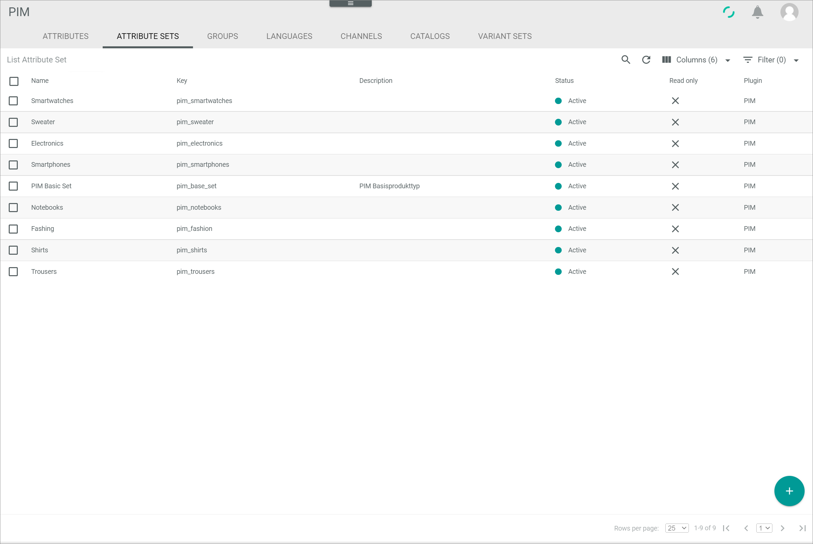
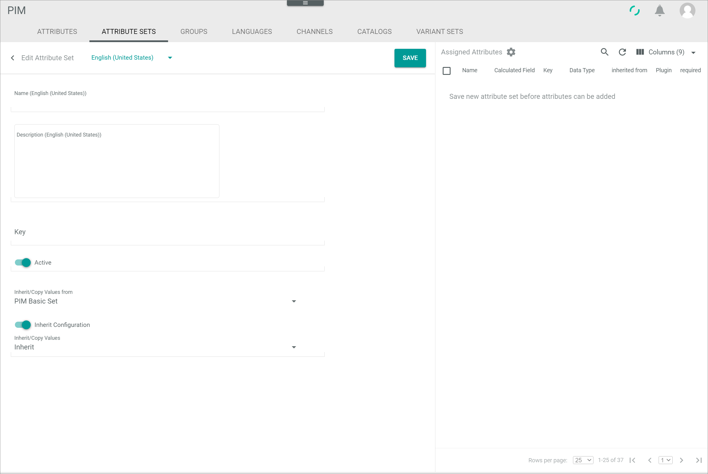
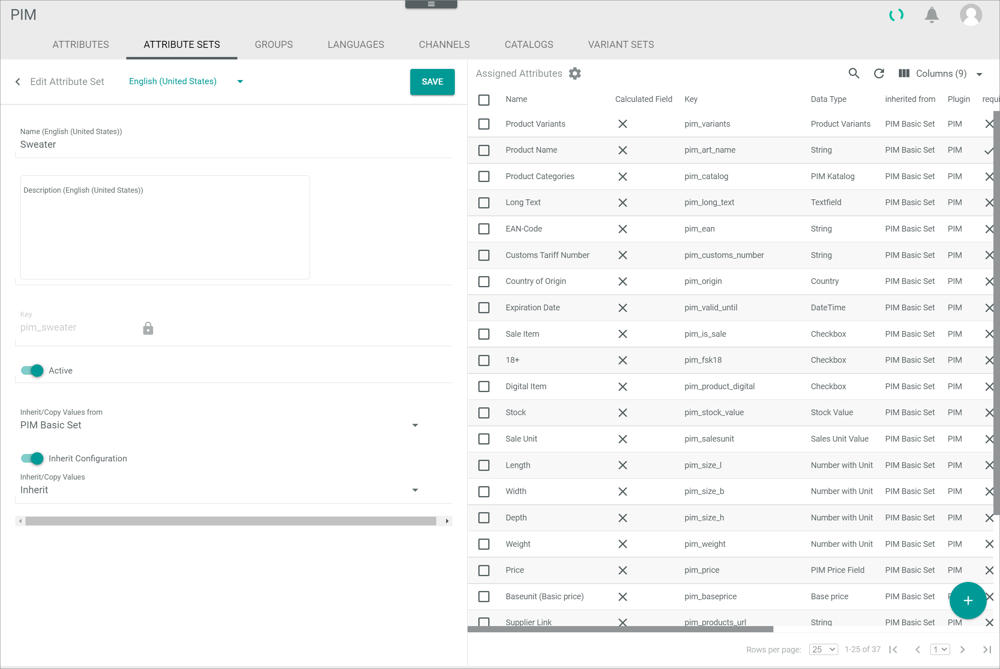
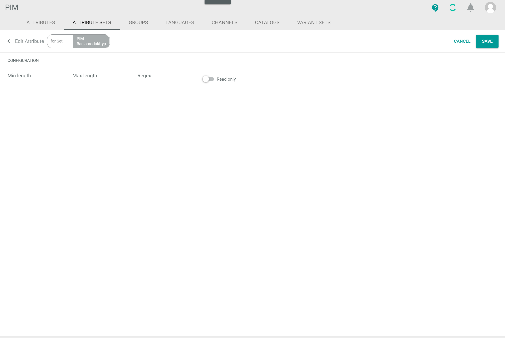
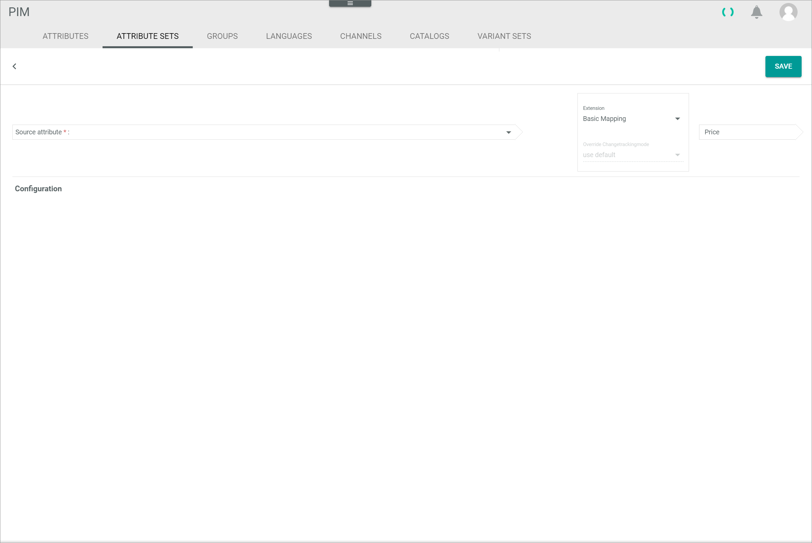

# Attribute Sets

*PIM > Settings > Tab ATTRIBUTE SETS*

**Attribute set list**

-  (Search)   
  Click this button to display the search bar and search for an attribute set.

-  (Refresh)   
  Click this button to update the list of attribute sets.

-  Columns (x)   
  Click this button to display the columns bar and customize the displayed columns and the order of columns in the list. The *x* indicates the number of columns that are currently displayed in the list.

-  Filter (x)   
  Click this button to display the filter bar and customize the active filters. The *x* indicates the number of filters that are currently active.

- [x]     
  Select the checkbox to display the editing toolbar. If you click the checkbox in the header, all attribute sets in the list are selected.

- [EDIT]
  Click this button to edit the selected attribute set. This button is only displayed if a single checkbox in the list of attribute sets is selected. Alternatively, you can click directly a row in the list to edit an attribute set.   
  For detailed information, see [Edit an attribute set](../Integration/02_ManageAttributeSets.md#edit-an-attribute-set).

- [DELETE]
  Click this button to delete the selected attribute set. This button is only displayed if the checkbox of at least one attribute set is selected. An attribute set cannot be deleted if any attribute is assigned to it.       

The list displays all attribute sets. Depending on the settings, the displayed columns may vary. All fields are read-only.

- *Name*   
  Attribute set name.

- *Key*   
  Attribute set key.

- *Description*   
  Description to the attribute set.

- *Status*   
  Attribute set status. The following statuses are displayed:
  -  **Active**
  -  **Inactive**   

- *Read-only*   
  Indication whether the attribute set is read-only or not:
  -  (Checkmark): The attribute set is read-only.  
  -  (Cross): The attribute set can be edited.

- *Plugin*   
  Module or plugin that owns the attribute set. In the *PIM* module, only PIM attribute sets are displayed.

- *ID*   
  Attribute set identification number. The ID number is automatically assigned by the system.

- *Modified on*   
  Date and time of the last modification.

- *Modified by*   
  Name and username of the user who modified the attribute set.

- *Created on*   
  Date and time of the creation.

- *Created by*   
  Name and username of the user who created the attribute set.

- *Name (Language)*   
  Attribute name in the selected language. A single column is displayed for the system languages *English (United States)* and *Deutsch (Deutschland)*.

- *Description (Language)*   
  Attribute description in the displayed language. A single column is displayed for the system languages *English (United States)* and *Deutsch (Deutschland)*.

-  (Add)   
  Click this button to create a attribute set. The *Create attribute set* view is displayed.   

## Create attribute set

*PIM > Settings > Tab ATTRIBUTE SETS > Button Add*

**Create attribute set**

-  (Back)   
  Click this button to close the *Create attribute set* view and return to the attribute set list. All changes are rejected.

- Language      
  Click the drop-down list and select the system language in which the *Name (Language)* and *Description (Language)* fields are displayed. By default, the following options are available:
  - **English (United States)**
  - **Deutsch (Deutschland)**

- [SAVE]   
  Click this button to save the attribute set. The *Create attribute set* view is closed.

- *Name (Language)*   
  Enter an attribute set name in the selected language.

- *Description (Language)*   
  Enter a description to the attribute set in the selected language.

- *Key*   
  Enter an attribute set key. The key is required for API access and must be system wide unique. An attribute set key must fulfill the following criteria:
  - valid characters are **a-z** (upper and lower case), **0-9** and the underscore ( **_** )
  - the key must not start with a number
  - a double underscore ( **___** ) and a trailing underscore are forbidden

-  *Active*   
  Enable this toggle to set the attribute set status to active. Disable the toggle to set the status to inactive. By default, this toggle is enabled.

- *Inherit/Copy values from*   
  Click the drop-down list to select whether or not the values for the new attribute set should be inherited or copied from an existing attribute set. The following options are available:    
  - **No inheritance**   
    The values are neither inherited nor copied from an existing attribute set. The *Inherit configuration* toggle and the *Inherit/Copy values* drop-down list are locked.
  - **Attribute set name**   
    The values inherited or copied from the selected attribute set. All existing attribute sets are displayed in the drop-down list.

-  *Inherit configuration*   
  Enable this toggle to inherit not only the values of the selected attribute set, but also their configuration. Disable the toggle to inherit the values without configuration. By default, this toggle is enabled. This toggle is locked if the **No inheritance** option is selected in the *Inherit/Copy values from* drop-down list.

- *Inherit/Copy values*   
  Click the drop-down list to select the inheritance type. The following types are available:    
  - **Copy once**   
    The attribute values are applied once from the selected attribute set, but afterwards they are independent of changes in the selected set.
  - **Inherit**   
    The attribute values are applied from the selected attribute set and updated each time if the selected set changes.

**Assigned attributes**

-  (Settings)   
  Click this button to unlock the *Required* column in the attributes list. The color of the button switches to blue if the column is unlocked. Click the button again to lock the *Required* column. The button color switches back to gray.

-  (Search)   
  Click this button to display the search bar and search for an attribute.

-  (Refresh)   
  Click this button to update the list of attributes.

-  Columns (x)   
  Click this button to display the columns bar and customize the displayed columns and the order of columns in the list. The *x* indicates the number of columns that are currently displayed in the list.

- [x]     
  Select the checkbox to display the editing toolbar. If you click the checkbox in the header, all attributes in the list are selected.

In the *Create attribute set* view, no attributes are displayed in the list. You must save the attribute set before you can assign attributes to it.   

## Edit attribute set

*PIM > Settings > Tab ATTRIBUTE SETS > Select attribute set*

**Edit attribute set**

-  (Back)   
  Click this button to close the *Edit attribute set* view and return to the attribute set list. All changes are rejected.

- Language      
  Click the drop-down list and select the system language in which the *Name (Language)* and *Description (Language)* fields are displayed. By default, the following options are available:
  - **English (United States)**
  - **Deutsch (Deutschland)**

- [SAVE]   
  Click this button to save the attribute set. The *Edit attribute set* view is closed.

- *Name (Language)*   
  Click the field to edit the attribute set name in the selected language.

- *Description (Language)*   
  Click the field to edit the description to the attribute set in the selected language.

- *Key*   
  Attribute set key. In the *Edit attribute set* view, this field is locked.

-  *Active*   
  Enable this toggle to set the attribute set status to active. Disable the toggle to set the status to inactive. By default, this toggle is enabled.

- *Inherit/Copy values from*   
  Click the drop-down list to select whether or not the values for the new attribute set should be inherited or copied from an existing attribute set. The following options are available:    
  - **No inheritance**   
    The values are neither inherited nor copied from an existing attribute set. The *Inherit configuration* toggle and the *Inherit/Copy values* drop-down list are locked.
  - **Attribute set name**   
    The values inherited or copied from the selected attribute set. All existing attribute sets are displayed in the drop-down list.  

-  *Inherit configuration*   
  Enable this toggle to inherit not only the values of the selected attribute set, but also their configuration. Disable the toggle to inherit the values without configuration. By default, this toggle is enabled. This toggle is locked if the **No inheritance** option is selected in the *Inherit/Copy values from* drop-down list.

- *Inherit/Copy values*   
  Click the drop-down list to select the inheritance type. The following types are available:    
  - **Copy once**   
    The attribute values are applied once from the selected attribute set, but afterwards they are independent of changes in the selected set.
  - **Inherit**   
    The attribute values are applied from the selected attribute set and updated each time if the selected set changes.

> [Info] The inheritance settings may be read-only for attribute sets predefined by the system, for example for the *PIM Basic Set*.

**Assigned attributes**

-  (Settings)   
  Click this button to unlock the *Required* column in the attributes list. The color of the button switches to blue if the column is unlocked. Click the button again to lock the *Required* column. The button color switches back to gray.

-  (Search)   
  Click this button to display the search bar and search for an attribute.

-  (Refresh)   
  Click this button to update the list of attributes.

-  Columns (x)   
  Click this button to display the columns bar and customize the displayed columns and the order of columns in the list. The *x* indicates the number of columns that are currently displayed in the list.

-  Filter (x)   
  Click this button to display the filter bar and customize the active filters. The *x* indicates the number of filters that are currently active.

- [x]     
  Select the checkbox to display the editing toolbar. If you click the checkbox in the header, all attributes in the list are selected.

-  (Edit)   
  Click this button to edit the configuration of the selected attribute. This button is only displayed if a single checkbox in the list of attributes is selected and if the selected attribute has an editable configuration. The *Edit attribute for set "Attribute set name"* view is displayed. Alternatively, you can click directly a row in the list to edit an attribute configuration.

[comment]: <> (Not working -> Bugticket)

-  (Delete)   
  Click this button to remove the selected attribute from the attribute set. This button is only displayed if at least one checkbox of an attribute is selected.       

  > [Info] If you remove an attribute from the attribute set, the attribute itself is not deleted, but it is unassigned to the selected attribute set.   

- [ADD MAPPING]   
  Click this button to add a mapping to the selected attribute. The *Add mapping* view is displayed. You can only add a mapping for attribute sets that are not inherited from another attribute set. This button is only displayed if a single checkbox in the list of attributes is selected.

The list displays all attributes assigned to the selected attribute set. Depending on the settings, the displayed columns may vary.
If the  (Settings) button is gray, all fields are read-only. If the  (Settings) button is blue, the field *Required* is editable.

- *Name*   
  Attribute name.

- *Calculated field*   
  Indication whether the attribute is calculated by an ETL mapping from other fields to itself or not:
  -  (Checkmark): The attribute is a calculated field.  
  -  (Cross): The attribute is no calculated field.

- *Key*   
  Attribute key.

- *Data type*   
  Attribute data type.   
  For detailed information about all data types, see [Data type list](../../DataHub/UserInterface/04_DataTypeList.md).

- *Inherited from*   
  Inheritance attribute set. The name of the attribute set from which the attribute value is inherited is displayed. If the attribute value is not inherited, the field is empty.

- *Plugin*   
  Module or plugin that owns the attribute set. In the *PIM* module, only PIM attributes are displayed.

- *Required*   
  Indication whether the attribute value is required or not. The following options are only displayed if the  (Settings) button is inactive:
  - If the  (Settings) button is blue, the *Required* toggle is displayed. Enable the toggle to set the attribute value as a mandatory field. Disable the toggle to set the attribute value as an optional field.   
  - If the  (Settings) button is gray, the following options are displayed:
    -  (Checkmark): The attribute is required.  
    -  (Cross): The attribute is optional.

- *Read-only*   
  Indication whether the attribute value is read-only or not:
  -  (Checkmark): The attribute value is read-only.  
  -  (Cross): The attribute value can be edited.

- *Configuration*   
  Attribute configuration.

- *ID*   
  Attribute identification number. The ID number is automatically assigned by the system.

- *Description*   
  Description to the attribute.

- *Multi-language*   
  Indication whether the attribute is multilingual or not:
  -  (Checkmark): The attribute is multi-language.  
  -  (Cross): The attribute is single language.

- *Multi-channel*   
  Indication whether the attribute is multi-channel or not:
  -  (Checkmark): The attribute is multi-channel.  
  -  (Cross): The attribute is single channel.

### Edit attribute for set "Attribute set name"

[comment]: <> (to be checked! currently not working)

*PIM > Settings > Tab ATTRIBUTE SETS > Select attribute set > Select attribute with configuration*

**Edit attribute for set "Attribute set name"**

-  (Back)   
  Click this button to close the *Edit attribute for set "Attribute set name"* view and return to *Edit attribute set* view. All changes are rejected.

- [CANCEL]   
  Click this button to cancel editing the configuration. The *Edit attribute for set "Attribute set name"* view is closed.

- [SAVE]   
  Click this button to save the changes. The *Edit attribute for set "Attribute set name"* view is closed.

**CONFIGURATION**

The *CONFIGURATION* section displays the additional configuration for the data type of the selected attribute. The configuration fields differ depending on the data type of the attribute.    
For detailed information about the different configurations of data types, see [Data type list](../../DataHub/UserInterface/04_DataTypeList.md).

### Add mapping

*PIM > Settings > Tab ATTRIBUTE SETS > Select attribute set > Select attribute checkbox > Button ADD MAPPING*

**Add mapping**

This view equals the attribute mapping in the *DataHub* module: *DataHub > Settings > Tab ETL > Select attribute set mapping > Select mapping line*     
For detailed information, see [ETL settings](../../DataHub/UserInterface/02d_ETL.md#settings).

-  (Back)   
  Click this button to close the *Edit mapping* view and return to *Edit attribute set* view. All changes are rejected.

- Destination attribute   
  The selected destination attribute is displayed in the arrow box on the right side of the view. This field is read-only.

- *Language*   
  Selected language of the destination attribute. The drop-down list is read-only. This drop-down list is only displayed if the destination attribute is multi-language.

- *Channel*   
  Selected channel of the destination attribute. The drop-down list is read-only. This drop-down list is only displayed if the destination attribute is multi-channel.

- *Extension*   
  Click the drop-down list and select the appropriate ETL extension for the attribute mapping. The displayed extensions depend on the data type of the selected destination attribute.      
  For detailed information about the ETL extensions and the different data types, see [ETL extensions list](../../DataHub/UserInterface/03_ETLExtensions.md) or [Data type list](../../DataHub/UserInterface/04_DataTypeList.md).

- *Override change tracking mode*   
  Change tracking mode (ETL mode) for the mapping. The drop-down list is read-only. By default, the **Use default** option is selected. The following modes are available:
  - **Use default**   
    The mapping configured in the dependency of the specific entities is applied.
  - **Automatic**   
    The initial mapping is automatically applied. All value changes or reruns are applied automatically in the mapping.  
  - **Semi-automatic**   
    The initial mapping is automatically applied. Values changes or reruns are applied after confirmation.
  - **Semi-automatic, changes must be confirmed by another user**   
    The initial mapping as well as values changes or reruns are applied after confirmation by another user.
  - **Manual**   
    The initial mapping is automatically applied. Afterwards, the changes in the mapping must be triggered manually to be applied.

- *Source attribute*   
  Click the drop-down list within the arrow box and select the appropriate source attribute for the mapping. Depending on the selected ETL extension one or several *Source attribute* arrow boxes are displayed. The selection in the drop-down list depends on the selected ETL extension which defines the required data type of the source attribute(s). This drop-down list is only displayed if an ETL extension has been selected in the *Extension* drop-down list.       
  For detailed information about how to set up an attribute mapping, see [Edit an ETL attribute mapping](../../DataHub/Operation/01_ManageETLMappings.md#edit-an-etl-attribute-mapping).

**Configuration**

The *Configuration* section displays the additional configuration settings. The configuration fields differ depending on the data type of the source and/or destination attribute.    
For detailed information about the different configurations of data types, see [Data type list](../../DataHub/UserInterface/04_DataTypeList.md).
