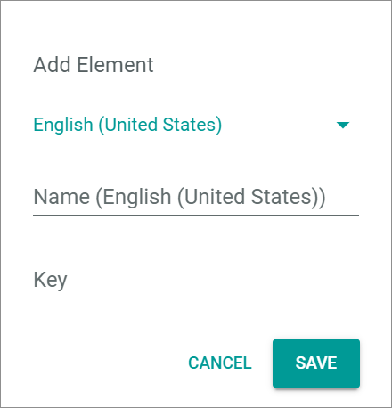

# Attribute groups

*PIM > Settings > Tab ATTRIBUTE GROUPS*

**Attribute groups**

-  (Edit)   
  Click this button to edit the attribute groups. The *Edit attribute groups* view is displayed.   
  For detailed information, see [Edit an attribute group](../Integration/03_ManageAttributeGroups.md#edit-an-attribute-group).

-  (Folders)  
  Attribute group that contains attribute sub-groups. Click the attribute group or the arrow *>* left to the attribute group to unfold the group and display the attribute sub-groups.

-  (Folder)  
  Attribute group. Click the attribute group to display all attributes that are assigned to the selected attribute group in the *Assigned attributes* list.

**Assigned attributes**

-  (Sort)   
  Click this button to display the *Assigned Attributes (Sorting Mode)* view in the right side of the workspace. This button is only displayed if an attribute group is selected.

-  (Search)   
  Click this button to display the search bar and search for an attribute. This button is only displayed if an attribute group is selected.

-  (Refresh)   
  Click this button to update the list of assigned attributes. This button is only displayed if an attribute group is selected.

-  Columns (x)   
  Click this button to display the columns bar and customize the displayed columns and the order of columns in the list. The *x* indicates the number of columns that are currently displayed in the list.

- [x]     
  Select the checkbox to display the editing toolbar. If you click the checkbox in the header, all attributes in the list are selected.

-  (Delete)   
  Click this button to remove the selected attribute from the attribute group. This button is only displayed if the checkbox of an attribute is selected.       

  > [Info] If you remove an attribute from the attribute group, the attribute itself is not deleted, but it is unassigned to the selected attribute group.  

The list displays all attributes assigned to the selected attribute group. Depending on the settings, the displayed columns may vary. All fields are read-only. If no attribute is assigned to the selected attribute group, the notice *No attribute assigned. Use + button to assign one* is displayed.

- *Name*   
  Attribute name.

- *Key*   
  Attribute key. The key is required for API access and must be system wide unique.

- *Description*   
  Description to the attribute.

- *Plugin*   
  Module or plugin that owns the attribute. In the *PIM* module, only PIM attributes are displayed.

- *Read-only*   
  Indication whether the attribute is read-only or not:
  -  (Checkmark): The attribute is read-only.  
  -  (Cross): The attribute can be edited.

- *ID*   
  Attribute identification number. The ID number is automatically assigned by the system.

-  (Add)   
  Click this button to add an attribute to the selected attribute group. The *Add attributes to attribute group* view is displayed.   

## Add attributes to attribute group

*PIM > Settings > Tab ATTRIBUTE GROUPS > Button Add*

**Add attributes to group**

-  (Back)   
  Click this button to cancel adding an attribute to the selected attribute group. The *Add attributes to attribute group* view is closed.

-  *Only unassigned attributes*   
  Enable this toggle to display only the attributes that are not yet assigned to any attribute group. Disable the toggle to display all attributes. By default, this toggle is disabled.

  > [Info] An attribute can be assigned to one attribute group or sub-group only. When you add an attribute to an attribute group that is already added to another group, it is automatically removed from the former attribute group.

-  (Search)   
  Click this button to display the search bar and search for an attribute.

-  (Refresh)   
  Click this button to update the list of attributes.

-  Columns (x)   
  Click this button to display the columns bar and customize the displayed columns and the order of columns in the list. The *x* indicates the number of columns that are currently displayed in the list.

- [x]     
  Select the checkbox to display the editing toolbar. If you click the checkbox in the header, all attributes in the list are selected. Alternatively, you can click directly a row in the list to select the attribute.

- [ADD]   
  Click this button to add the selected attribute to the attribute group. The *Add attributes to attribute group* view is closed.

The list displays all attributes that are not assigned to the selected attribute group. Depending on the settings, the displayed columns may vary. All fields are read-only.

- *Name*   
  Attribute name.

- *Key*   
  Attribute key.

- *Current attribute group*   
  Attribute group to which the attribute is currently assigned.

- *Description*   
  Description to the attribute.

- *Status*   
  Attribute status. The following options are available:
  -  **Active**
  -  **Inactive**   

- *Read-only*   
  Indication whether the attribute is read-only or not:
  -  (Checkmark): The attribute is read-only.  
  -  (Cross): The attribute can be edited.

- *ID*   
  Attribute identification number. The ID number is automatically assigned by the system.

## Edit attribute groups

*PIM > Settings > Tab ATTRIBUTE GROUPS > Button Edit*

**Edit attribute groups**

-  (Back)   
  Click this button to close the *Edit attribute groups* view and return to the *Attribute groups* view. All changes are rejected.

- [CANCEL]   
  Click this button to cancel editing attribute groups. The *Edit attribute groups* view is closed.

- [SAVE]   
  Click this button to save all changes. The *Edit attribute groups* view is closed.

-  (Sort)   
  Click and hold this button to move the selected attribute group to another position in the list using drag and drop.

-  (Edit)   
  Click this button to edit the selected attribute group. The attribute group data window is displayed. This button is only displayed if you hover over the attribute group.

- Attribute group   
  Top attribute group. Click the attribute group to display the attribute sub-group column and all assigned attribute sub-groups. Hover over the attribute group to display the  (Edit) button.

- Attribute sub-group   
  Attribute sub-group to the selected attribute group. Hover over the attribute sub-group to display the  (Edit) button.

-  (Add)   
  Click this button to add an attribute group or sub-group. A plus sign is displayed in each displayed column. Click the plus sign in the desired column to add a new attribute group or sub-group to the selected attribute group. The *Add element* window is displayed.    
  For detailed information about creating attribute groups or sub-groups, see [Create an attribute group](../Integration/03_ManageAttributeGroups.md#create-an-attribute-group) or [Create an attribute sub-group](../Integration/03_ManageAttributeGroups.md#create-an-attribute-sub-group).

  > [Info] Attribute groups are organized in a tree structure with a maximum depth of two levels. That means that a maximum of one sub-group level can be added to an attribute group.

### Add element

*PIM > Settings > Tab ATTRIBUTE GROUPS > Button Edit > Button Add*

> [Info] The *Add element* window for attribute groups and sub-groups is identical.

- Language   
  Click the drop-down list and select the system language in which the *Name (Language)* and *Description (Language)* fields are displayed. By default, the following options are available:
  - **English (United States)**
  - **Deutsch (Deutschland)**

- *Name (Language)*   
  Enter an attribute group name in the selected language.

- *Key*   
  Enter an attribute group key. The number of characters is limited to 190.

- [CANCEL]   
  Click this button to cancel adding an attribute group. The *Add element* window is closed.

- [SAVE]   
  Click this button to add the new attribute group. The *Add element* window is closed.

  > [Info] You have to click the [SAVE] button in the *Edit attribute groups* view to save the added attribute group.

### Edit attribute group data

*PIM > Settings > Tab ATTRIBUTE GROUPS > Button Edit > Hover over attribute group > Button Edit*

> [Info] The *Edit attribute group data* window for attribute groups and sub-groups is identical.

- Language   
  Click the drop-down list and select the system language in which the *Name (Language)* and *Description (Language)* fields are displayed. By default, the following options are available:
  - **English (United States)**
  - **Deutsch (Deutschland)**

- *Name (Language)*   
  Click the field to edit the attribute group name in the selected language.

- *Key*   
  Click the field to edit the attribute group key. The number of characters is limited to 190.

-  (Delete)   
  Click this button to remove the selected attribute group.

  > [Info] You must click the [SAVE] button in the *Edit attribute groups* view to permanently delete the attribute group.

  > [Warning] Be aware that as soon as you delete an attribute group, you also delete all assigned attribute sub-groups.

- [CANCEL]   
  Click this button to cancel editing the attribute group. The *Edit attribute group data* window is closed.

- [SAVE]   
  Click this button to save any changes to the attribute group. The *Edit attribute group data* window is closed.

  > [Info] You have to click the [SAVE] button in the *Edit attribute groups* view to save the changes. Otherwise, all changes are rejected.
