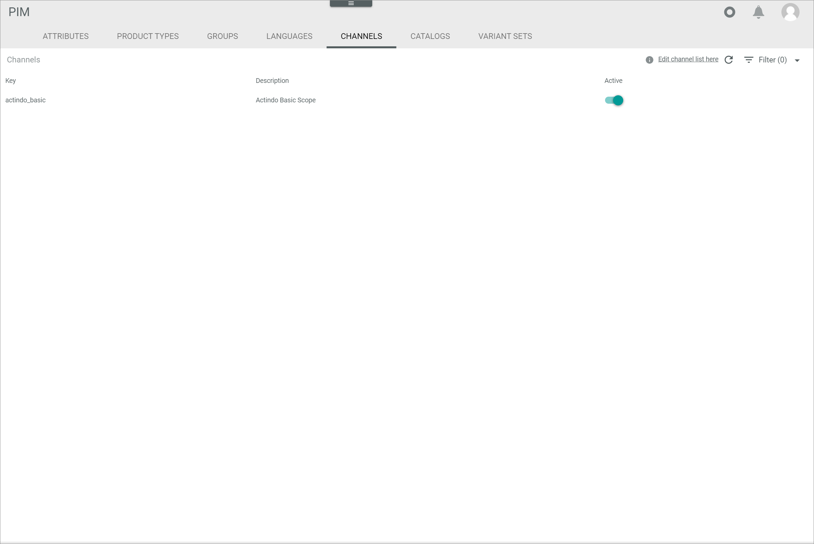

[!!Configure the channel settings](../Integration/05_ConfigureChannels.md)
[!!Manage a channel in DataHub](../../DataHub/Integration/04_ManageChannels.md)

# Channels

*PIM > Settings > Tab CHANNELS*

**Channels**

- [ <u>Edit channel list here</u> ]    
    Click this button to switch to the *DataHub* module and edit the channel list or create a channel.   
    The *CHANNELS* tab is displayed (*DataHub > Settings > Tab CHANNELS*).    

-  (Refresh)   
    Click this button to update the list of channels.

-  Filter (x)   
    Click this button to display the filter bar and customize the active filters. The *x* indicates the number of filters that are currently active.

The list displays all available channels.

- *Key*   
    Channel key. This field is read-only.

- *Description*   
    Description to the channel. This field is read-only.

- *Active*   
    Enable the toggle to set the channel status to active. Disable the toggle to set the channel status to inactive.
