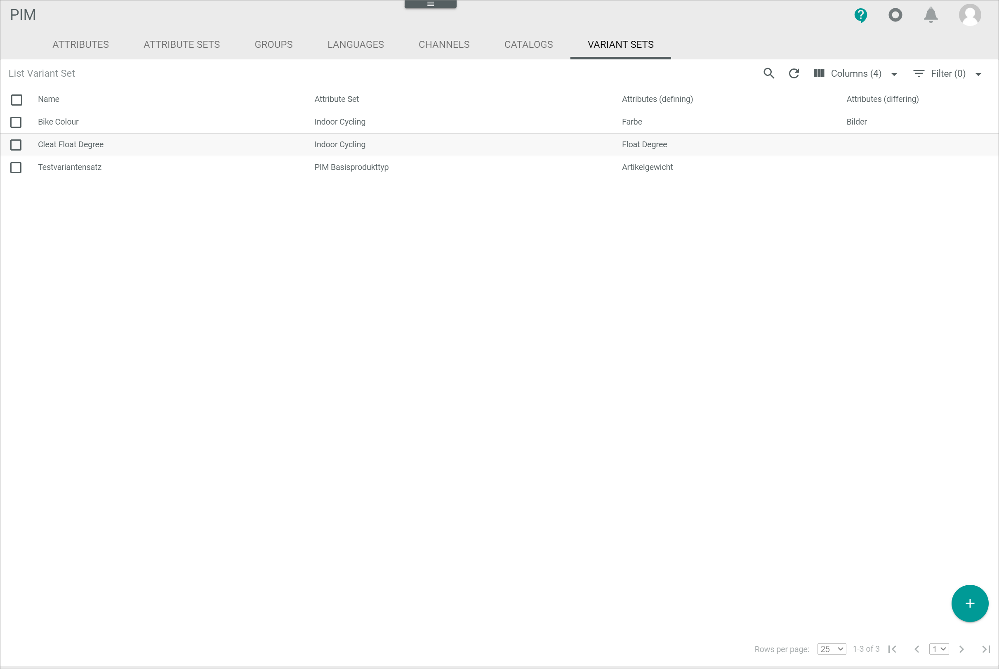
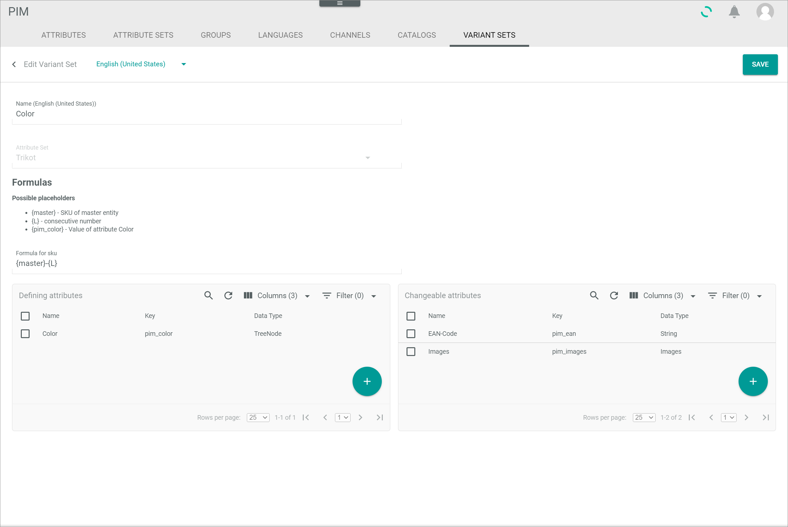
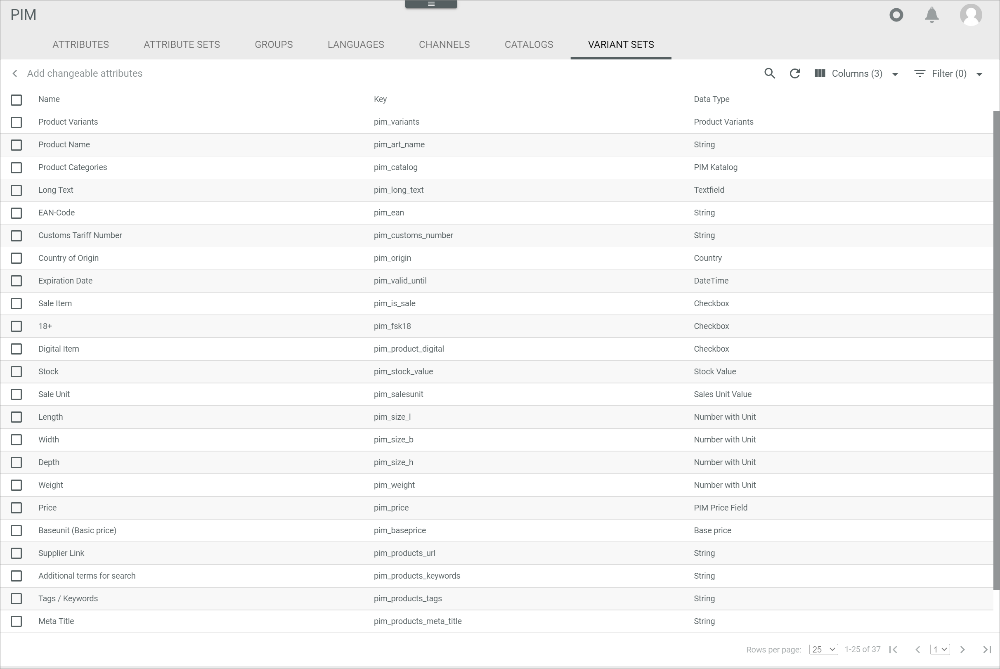

[!!Edit a variant set](../Integration/07_ManageVariantSets.md#edit-a-variant-set)
[!!Data type list](../../DataHub/UserInterface/04_DataTypeList.md)

# Variant Sets

*PIM > Settings > Tab VARIANT SETS*

**Variant set list**

-  (Search)   
  Click this button to display the search bar and search for an variant set.

-  (Refresh)   
  Click this button to update the list of variant sets.

-  Columns (x)   
  Click this button to display the columns bar and customize the displayed columns and the order of columns in the list. The *x* indicates the number of columns that are currently displayed in the list.

-  Filter (x)   
  Click this button to display the filter bar and customize the active filters. The *x* indicates the number of filters that are currently active.

- [x]     
  Select the checkbox to display the editing toolbar. If you click the checkbox in the header, all variant sets in the list are selected.

- [EDIT]      
  Click this button to edit the selected variant set. This button is only displayed if a single checkbox in the list of variant sets is selected. Alternatively, you can click directly a row in the list to edit a variant set. The *Edit variant set* view is displayed.   

- [DELETE]     
  Click this button to delete the selected variant sets. This button is only displayed if the checkbox of at least one variant set is selected.

[comment]: <> (Mostly not possible to delete a variant set -> no integration procedure to delete a variant set -> why is the button still existing? Not working... )

The list displays all variant sets. All fields are read-only. Depending on the settings, the displayed columns may vary.

- *Name*   
  Variant set name.

- *Attribute set*   
  Attribute set name assigned to the variant set.

- *Attributes (defining)*   
  Defining attributes of the variant set.

- *Attributes (changeable)*   
  Changeable attributes of the variant set.

- *ID*   
  Attribute set identification number. The ID number is automatically assigned by the system.

- *Modified on*   
  Date and time of the last modification.

- *Modified by*   
  Name and username of the user who modified the variant set.

- *Created on*   
  Date and time of the creation.

- *Created by*   
  Name and username of the user who created the variant set.

- *Name (Language)*   
  Attribute set name in the selected language. A single column is displayed for the system languages *English (United States)* and *Deutsch (Deutschland)*.

-  (Add)   
  Click this button to create a variant set. The *Create variant set* window is displayed.   

## Create variant set

*PIM > Settings > Tab VARIANT SETS > Button Add*

**Create variant set**

-  (Back)   
  Click this button to close the *Create variant set* view and return to the variant sets list. All changes are rejected.

- Language   
  Click the drop-down list and select the language in which the *Name (Language)* fields are displayed. The languages *English (United States)* and *Deutsch (Deutschland)* are available in the drop-down list.

  [comment]: <> (Is that right? -> language question)

- [SAVE]   
  Click this button to save the variant set. The *Create variant set* view is closed.

- *Name (Language)*   
  Variant set name in the selected language.

- *Attribute set*   
  Click the drop-down list to select the assigned attribute set. All attribute sets are displayed in the drop-down list.

**FORMULAS**

This section is only displayed if an attribute set is selected.

- *Formula for SKU*   
  Click the field to edit the formula for the SKU of the variant articles. By default, the formula **{master}-{L}** is predefined. The following placeholders are available:
  - **{master}**: SKU number of the master entity
  - **{L}**: consecutive number   
  - In addition to these default placeholders, you can include the value of the defining attributes of the variant set into the SKU formula. The corresponding placeholders are displayed in the *Possible placeholders* section when you have added a defining attribute.

**Defining attributes**

-  (Search)   
  Click this button to display the search bar and search for an attribute.

-  (Refresh)   
  Click this button to update the list of an attribute.

-  Columns (x)   
  Click this button to display the columns bar and customize the displayed columns and the order of columns in the list. The *x* indicates the number of columns that are currently displayed in the list.

-  Filter (x)   
  Click this button to display the filter bar and customize the active filters. The *x* indicates the number of filters that are currently active.

- [x]     
  Select the checkbox to display the editing toolbar. If you click the checkbox in the header, all attributes in the list are selected.

- [DELETE]   
  Click this button to delete the selected attribute from the box. This button is only displayed if the checkbox of at least one attribute is selected.

The list displays all defining attributes to the variant set. All fields are read-only.

- *Name*   
  Attribute name.

- *Key*   
  Attribute key. The key is required for API access and must be system wide unique.

- *Data type*   
  Attribute data type.   

- *ID*   
  Attribute identification number. The ID number is automatically assigned by the system.

-  (Add)   
  Click this button to add a defining attribute to the variant set. The *Add defining attributes* view is displayed, see [Add defining attributes](#add-defining-attributes).

**Changeable attributes**

-  (Search)   
  Click this button to display the search bar and search for an attribute.

-  (Refresh)   
  Click this button to update the list of an attribute.

-  Columns (x)   
  Click this button to display the columns bar and customize the displayed columns and the order of columns in the list. The *x* indicates the number of columns that are currently displayed in the list.

-  Filter (x)   
  Click this button to display the filter bar and customize the active filters. The *x* indicates the number of filters that are currently active.

- [x]     
  Select the checkbox to display the editing toolbar. If you click the checkbox in the header, all attributes in the list are selected.

- [DELETE]   
  Click this button to delete the selected attribute from the box. This button is only displayed if the checkbox of at least one attribute is selected.

The list displays all changeable attributes to the variant set. All fields are read-only.

- *Name*   
  Attribute name.

- *Key*   
  Attribute key. The key is required for API access and must be system wide unique.

- *Data type*   
  Attribute data type.   

- *ID*   
  Attribute identification number. The ID number is automatically assigned by the system.

-  (Add)   
  Click this button to add a defining attribute to the variant set. The *Add changeable attributes* view is displayed, see [Add changeable attributes](#add-changeable-attributes).

## Edit variant set

*PIM > Settings > Tab VARIANT SETS > Select variant set*

**Edit variant set**

-  (Back)   
  Click this button to close the *Edit variant set* view and return to the variant sets list. All changes are rejected.

- Language   
  Click the drop-down list and select the language in which the *Name (Language)* fields are displayed. The languages *English (United States)* and *Deutsch (Deutschland)* are available in the drop-down list.

  [comment]: <> (Is that right? -> language question)

- [SAVE]   
  Click this button to save the variant set. The *Edit variant set* view is closed.

- *Name (Language)*   
  Variant set name in the selected language.

- *Attribute set*   
  Assigned attribute set. This field is read-only.

**FORMULAS**

- *Formula for SKU*   
  Click the field to edit the formula for the SKU of the variant articles. By default, the formula **{master}-{L}** is predefined. The following placeholders are available:
  - {master}: SKU number of the master entity
  - {L}: consecutive number   
  - In addition to these default placeholders, you can include the value of the defining attributes of the variant set into the SKU formula. The corresponding placeholders are displayed in the *Possible placeholders* section when you have added a defining attribute.

**Defining attributes**

-  (Search)   
  Click this button to display the search bar and search for an attribute.

-  (Refresh)   
  Click this button to update the list of an attribute.

-  Columns (x)   
  Click this button to display the columns bar and customize the displayed columns and the order of columns in the list. The *x* indicates the number of columns that are currently displayed in the list.

-  Filter (x)   
  Click this button to display the filter bar and customize the active filters. The *x* indicates the number of filters that are currently active.

- [x]     
  Select the checkbox to display the editing toolbar. If you click the checkbox in the header, all attributes in the list are selected.

- [DELETE]   
  Click this button to delete the selected attribute from the box. This button is only displayed if the checkbox of at least one attribute is selected.

The list displays all defining attributes to the variant set. All fields are read-only.

- *Name*   
  Attribute name.

- *Key*   
  Attribute key. The key is required for API access and must be system wide unique.

- *Data type*   
  Attribute data type.   

- *ID*   
  Attribute identification number. The ID number is automatically assigned by the system.

-  (Add)   
  Click this button to add a defining attribute to the variant set. The *Add defining attributes* view is displayed, see [Add defining attributes](#add-defining-attributes).

**Changeable attributes**

-  (Search)   
  Click this button to display the search bar and search for an attribute.

-  (Refresh)   
  Click this button to update the list of an attribute.

-  Columns (x)   
  Click this button to display the columns bar and customize the displayed columns and the order of columns in the list. The *x* indicates the number of columns that are currently displayed in the list.

-  Filter (x)   
  Click this button to display the filter bar and customize the active filters. The *x* indicates the number of filters that are currently active.

- [x]     
  Select the checkbox to display the editing toolbar. If you click the checkbox in the header, all attributes in the list are selected.

- [DELETE]   
  Click this button to delete the selected attribute from the box. This button is only displayed if the checkbox of at least one attribute is selected.

The list displays all changeable attributes to the variant set. All fields are read-only.

- *Name*   
  Attribute name.

- *Key*   
  Attribute key. The key is required for API access and must be system wide unique.

- *Data type*   
  Attribute data type.   

- *ID*   
  Attribute identification number. The ID number is automatically assigned by the system.

-  (Add)   
  Click this button to add a defining attribute to the variant set. The *Add changeable attributes* view is displayed, see [Add changeable attributes](#add-changeable-attributes).

### Add defining attributes

*PIM > Settings > Tab VARIANT SETS > Button Add > Select attribute set > Button Add (Defining attributes)*    
*PIM > Settings > Tab VARIANT SETS > Select variant set > Button Add (Defining attributes)*

-  (Back)   
  Click this button to close the *Add defining attributes* view and return to the *Edit variant set* view. All changes are rejected.

-  (Search)   
  Click this button to display the search bar and search for an attribute.

-  (Refresh)   
  Click this button to update the list of attributes.

-  Columns (x)   
  Click this button to display the columns bar and customize the displayed columns and the order of columns in the list. The *x* indicates the number of columns that are currently displayed in the list.

-  Filter (x)   
  Click this button to display the filter bar and customize the active filters. The *x* indicates the number of filters that are currently active.

- [x]     
  Select the checkbox to display the editing toolbar. Alternatively, you can click directly a row in the list to select the attribute. If you click the checkbox in the header, all attributes in the list are selected.

- [ADD]   
  Click this button to add the selected attribute(s) to the variant set. This button is only displayed if the checkbox of at least one attribute is selected.

- [ADD AND GO BACK]   
  Click this button to add the selected attribute(s) to the variant set. This button is only displayed if the checkbox of at least one attribute is selected. The *Add defining attributes* view is closed. The defining attributes are displayed in the *Defining attributes* box.

The list displays all available defining attributes. All fields are read-only. Depending on the settings, the displayed columns may vary.

- *Name*   
  Attribute name.

- *Key*   
  Attribute key. The key is required for API access and must be system wide unique.

- *Data type*   
  Attribute data type.    

- *ID*   
  Attribute identification number. The ID number is automatically assigned by the system.

### Add changeable attributes

*PIM > Settings > Tab VARIANT SETS > Button Add > Select attribute set > Button Add (changeable attributes box)*   
*PIM > Settings > Tab VARIANT SETS > Select variant set > Button Add (changeable attributes box)*

-  (Back)   
  Click this button to close the *Add defining attributes* view and return to the *Edit variant set* view. All changes are rejected.

-  (Search)   
  Click this button to display the search bar and search for an attribute.

-  (Refresh)   
  Click this button to update the list of attributes.

-  Columns (x)   
  Click this button to display the columns bar and customize the displayed columns and the order of columns in the list. The *x* indicates the number of columns that are currently displayed in the list.

-  Filter (x)   
  Click this button to display the filter bar and customize the active filters. The *x* indicates the number of filters that are currently active.

- [x]     
  Select the checkbox to display the editing toolbar. Alternatively, you can click directly a row in the list to select the attribute. If you click the checkbox in the header, all attributes in the list are selected.

- [ADD]   
  Click this button to add the selected attribute(s) to the variant set. This button is only displayed if the checkbox of at least one attribute is selected.

- [ADD AND GO BACK]   
  Click this button to add the selected attribute(s) to the variant set. This button is only displayed if the checkbox of at least one attribute is selected. The *Add defining attributes* view is closed. The defining attributes are displayed in the *Changeable attributes* box.

The list displays all available changeable attributes. All fields are read-only. Depending on the settings, the displayed columns may vary.

- *Name*   
  Attribute name.

- *Key*   
  Attribute key. The key is required for API access and must be system wide unique.

- *Data type*   
  Attribute data type.   

- *ID*   
  Attribute identification number. The ID number is automatically assigned by the system.
