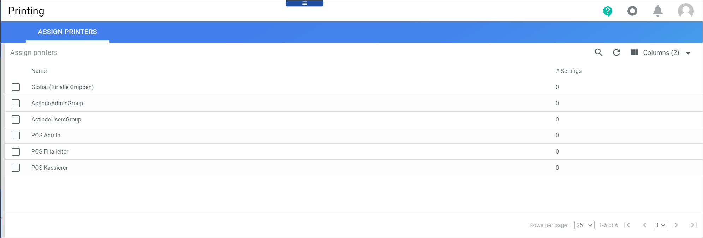
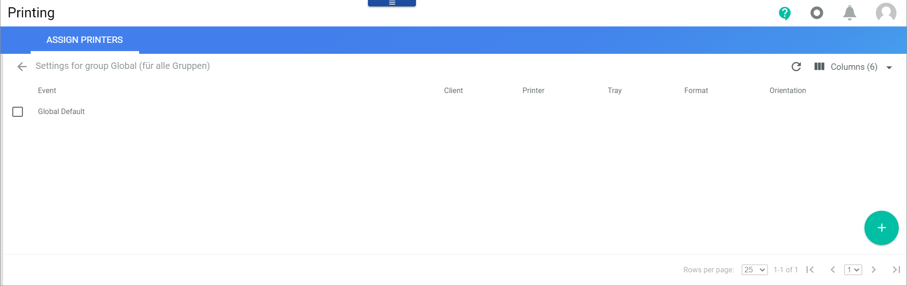
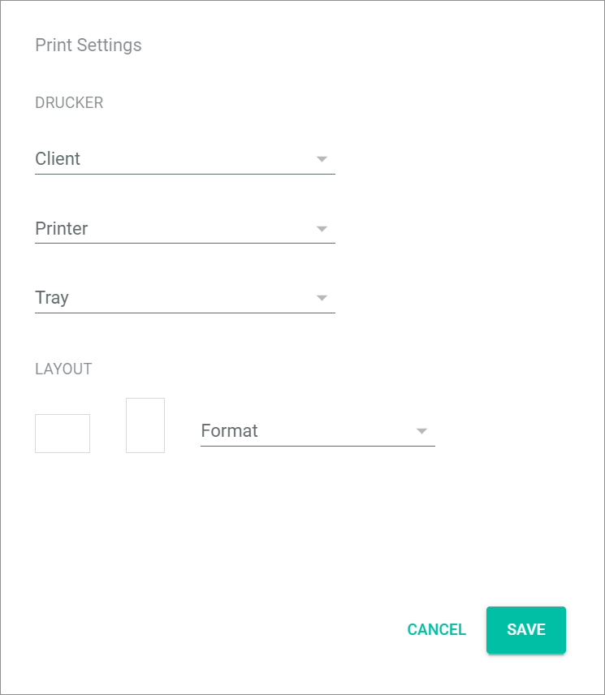

[!!Create a store in POS](./06_CreateStore.md)

[comment]: <> (add link to Install the APS, link to Printing module if available)

# Configure the printer client for POS

[comment]: <> (Need more information about the APS)

To print receipts, invoices, shift summaries etc., a printer must be configured for POS.

#### Prerequisites

The current APS is installed and has been started including a successful login.

> [Info] Note that you have to use a separate user for the APS client as parallel logins are forbidden.

#### Procedure

*Printing > Settings > Tab ASSIGN PRINTERS*

1. Click the *Global (for all groups)* printer in the list of printers.   
    The *Settings for group Global* view is displayed.

    

2. Click the  (Add) button in the bottom right corner.   
    The *Print settings* window is displayed.

    

3. Click the *Client* drop-down list and select the appropriate client.

4. Click the *Printer* drop-down list and select the appropriate printer, for instance for receipts.

5. If necessary, click the *Tray* drop-down list and select the appropriate tray. By default, the tray is automatically selected.

6. Select the portrait or the landscape format in the *LAYOUT* section.

    > [Info] For receipt printers always select portrait format.

7. Click the *Format* drop-down list and select the appropriate width of the receipt.

8. Click the *Module* drop-down list and select **POS** in the list of modules.

9. Click the *Event* drop-down list and select the appropriate pay desk and store in the list of pay desks.

10. Click the [SAVE] button in the bottom right corner of the window.   
    The printer is configured for the selected pay desk. The *Print settings* window is closed. The *Settings for group Global* view is displayed again. The new setting is displayed in the list of settings.

[comment]: <> (Is that right? Check it, when APS is installed)
