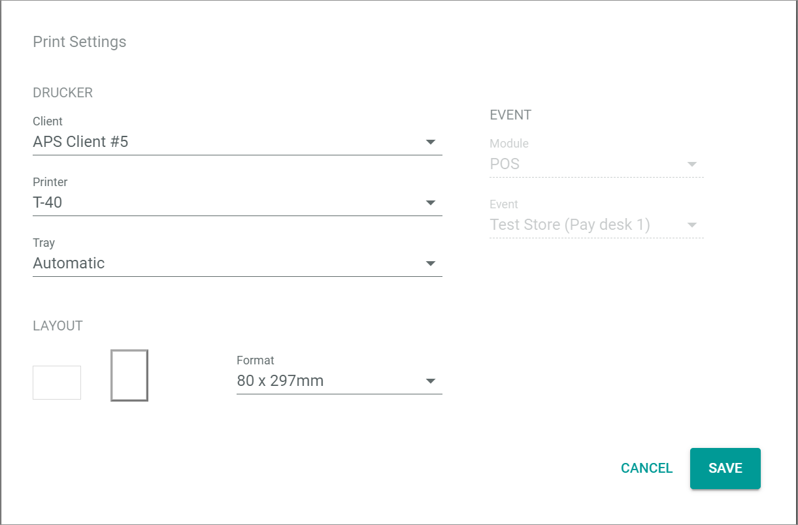

[!!Create a store in POS](./06_CreateStore.md)

[comment]: <> (add link to Install the APS, link to Printing module if available)
<!---Error-->

# Configure the printer client for POS

[comment]: <> (Need more information about the APS)

You must configure a printer for POS to print receipts, invoices, shift summaries, etc.

#### Prerequisites

- The *Printing* module version 1.0.4 or higher is installed. 
- The current printer client (APS) is installed and has been started including a successful login.

> [Info] Note that you have to use a separate user for the APS client as parallel logins are forbidden.

#### Procedure

*Printing > Settings > Tab ASSIGN PRINTERS*

1. Click the *Global (for all groups)* printer in the list of printers.   
    The *Settings for group Global* view is displayed.

    

2. Click the  (Add) button in the bottom right corner.   
    The *Print settings* window is displayed.

    

3. Click the *Client* drop-down list and select the appropriate client.

4. Click the *Printer* drop-down list and select the appropriate printer, for instance for receipts.

5. If necessary, click the *Tray* drop-down list and select the appropriate tray. By default, the tray is automatically selected.

6. Select the portrait or the landscape layout in the *LAYOUT* section by clicking on the required rectangle.

    > [Info] For receipt printers always select portrait layout.

7. Click the *Format* drop-down list and select the appropriate width of the receipt.

<!----Hallo Julian, auf der rechten Seite gibt es diese beiden Felder nicht mehr (Screenshot neu gemacht) nicht mehr in dem Modul, nicht?>
8. Click the *Module* drop-down list and select **Venduo POS** in the list of modules.

9. Click the *Event* drop-down list and select the appropriate pay desk and store in the list of pay desks, as displayed in the example below.

    > [Info] Bear in mind that it may take some time for newly created pay desks to be displayed in the *Event* drop-down list.

    -->

8. Click the [SAVE] button in the bottom right corner of the window.   
    The printer is configured for the selected pay desk. The *Print settings* window is closed. The *Settings for group Global* view is displayed again. The new setting is displayed in the list of settings.

[comment]: <> (Frage von Hannah: Is that right? Check it, when APS is installed. Frage von MV: Diese Procedure wäre für mich eher 'Define the printer' unter 06_Createstore.md, wenn man ein Store manuell erstellt. Ich habe von Create store auf diese Procedure einfach verwiesen. Die Prerequisites hier stimmen aber nicht ganz, denn man braucht schon ein Store und ein Pay desk erstellt zu haben, damit die hier zuweisen kann. Aber was muss der Benutzer vorher machen, um einen Drucker zu konfigurieren, das wird nicht erklärt.)
