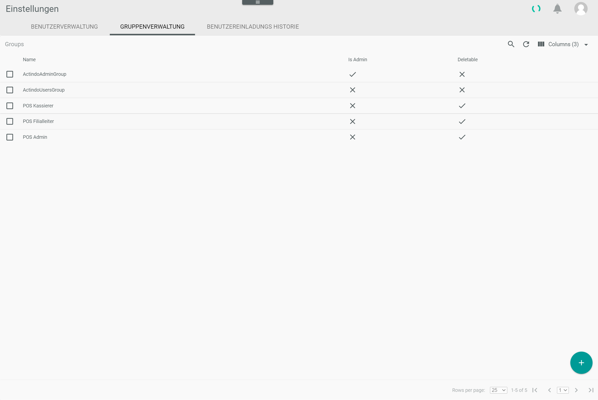
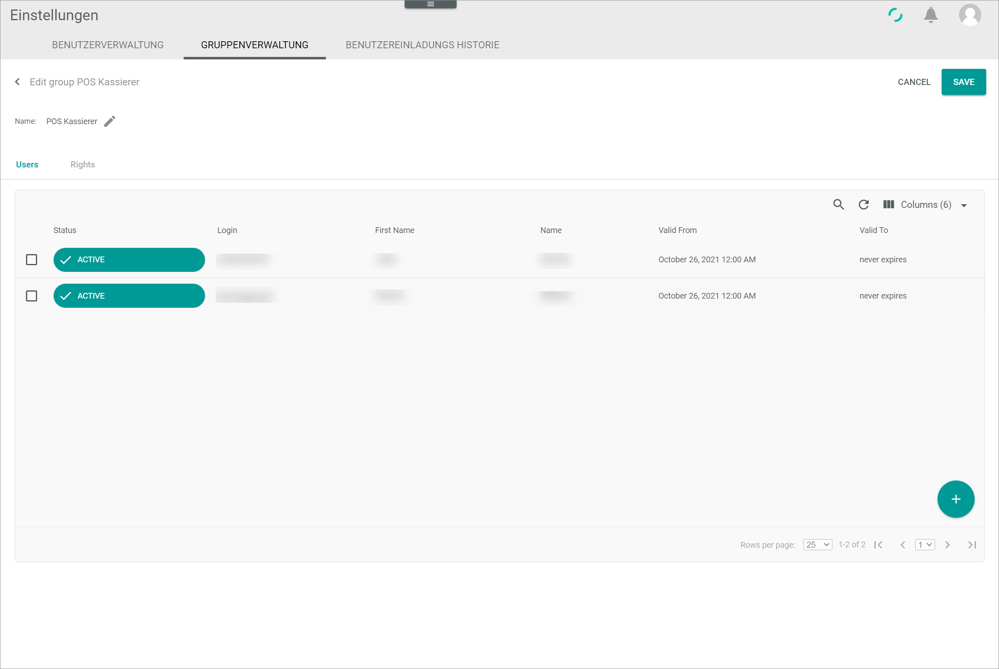
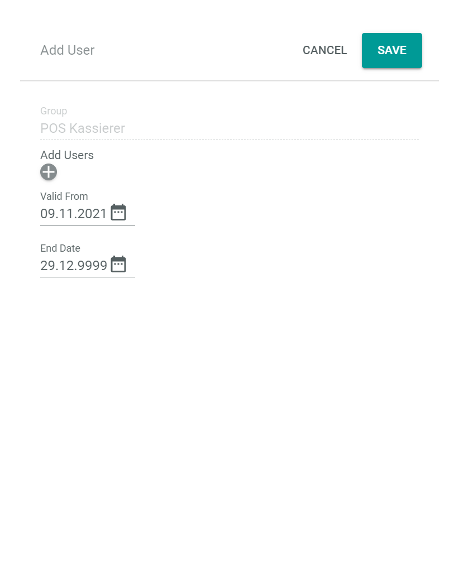

[!!Create a store in POS](06_CreateStore.md)

[comment]: <> (add link to Register a user, Settings module if available)

# Assign users to the POS groups

Users must belong to a specific POS group in order to be used as a cashier or store manager in the POS.
The following POS groups are available:
- POS Admin:  
    The POS Admin has all rights in the POS and can configure the settings in all stores, assign store managers and cashiers.
- POS Store Manager:   
    The POS Store Manager can configure the store settings in the assigned store. He/She can assign cashiers, log out cashiers, create pay desks, view the shift summary, etc. He/She has no rights to change the admin settings in the store.
- POS Cashier:   
    The POS cashier can log in and cash out on the assigned pay desk. He/She has no rights to change settings.

The users that belong to a POS group must be assigned to a pay desk or store in order to have the above rights.

> [Info] Note that you need system administrator rights to be allowed to make the assignment.  

[comment]: <> (The following How-To Guide is not specific for POS and may be reused)

#### Prerequisites

- The users have been registered.
- You have the system admin rights to assign users to a group.

[comment]: <> (add link to Register a user if available)

#### Procedure

*Settings > Users and Groups > Tab GROUP MANAGEMENT*

1. Select the checkbox of the group you want to assign the users to in the list of groups.   
    The editing toolbar is displayed above the list.

2. Click the  (Edit) button in the editing toolbar.   
    The *Edit group* view of the selected group is displayed.

    

3. Click the  (Add) button in the bottom right corner.   
    The *Add User* window is displayed.

    

4. Click the  (Add) button below the *Add Users* section.   
    The *Select User* drop-down list is displayed.

5. Click the *Select User* drop-down listand select the user you want to assign to the group from the displayed list of users.

    > [Info]  All registered users that are not yet assigned to the group are displayed in the drop-down list.  

6. Repeat step **4** and **5** for all users you want to assign to the selected group.

7. If desired, you can activate the selected users in the group only for a certain period of time. To do so, select the start and end dates of the period in the date *Valid From* and *End Date* fields.

8. Click the [SAVE] button in the upper right corner of the window.   
    The *Add User* window is closed. The selected users are displayed in the list of users.

9. Click the [SAVE] button in the upper right corner of the group edit view.   
    The *Edit group* view is closed. The *Group has been saved* message is displayed. The new user assignments to the group are saved.

    
