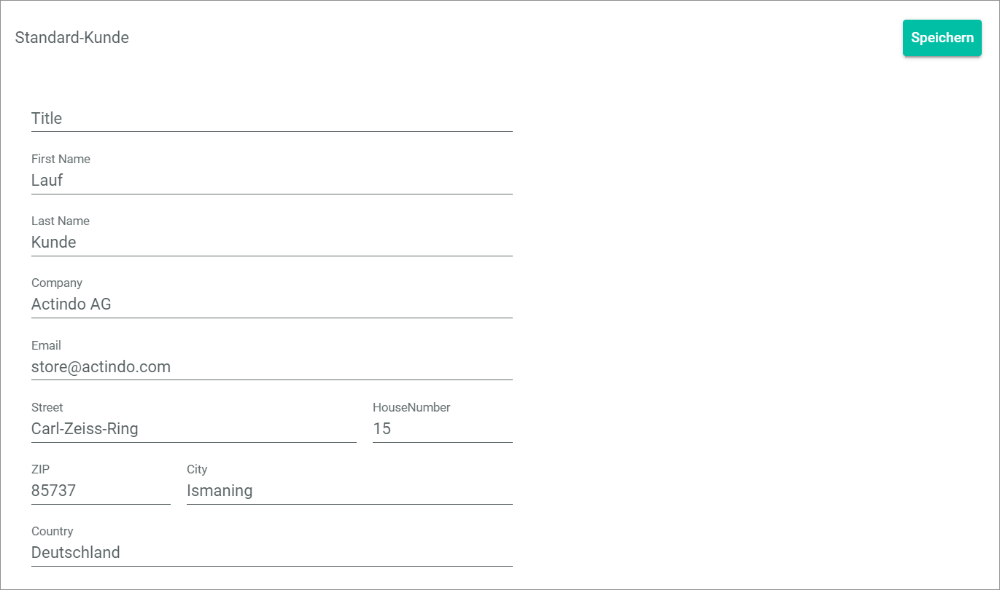
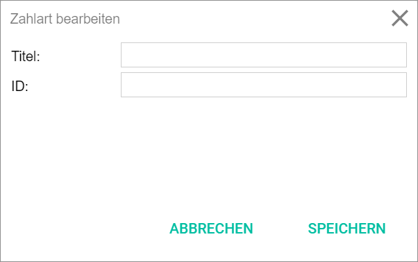
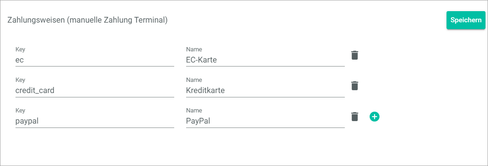

[!!Create a store in POS](./06_CreateStore.md)
[!!User interface Global settings](../UserInterface/02a_GlobalSettings.md)
[!!User interface DataHub MAPPINGS](../../DataHub/UserInterface/02a_Mappings.md)

# Configure the global settings for POS

POS offers many settings to customize the POS system to your specific needs. For detailed information about the specific settings, see [Global Settings](../UserInterface/02a_GlobalSettings.md).

Before creating a new store in the POS system, you should configure the following settings:

- Configure a default customer whose billing address will be added to all future POS bills to establish a connection to the *Order Management* module. For detailed information, see [Configure a default customer](#configure-a-default-customer).
- Configure the VAT ID for POS for the printing on receipts, which is mandatory in most countries. For detailed information, see [Configure the VAT ID in POS](#configure-the-vat-id-in-pos).
- If desired, define additional payment methods for POS, see [Define a new payment method for POS](#define-a-new-payment-method-for-pos).

## Configure a default customer

To connect the POS system with the *Order Management* module, you must define an invoice address for all occasional customers.   
Further, a delivery address and an invoice address should be indicated on every receipt created in the POS system. To specify an invoice address for occasional customers, you must create a default customer. The data of this default customer is used for all occasional customers.

#### Prerequisites

No prerequisites to fulfill.

#### Procedure

*Venduo POS > Management > Tab GLOBAL SETTINGS > Menu entry Default customer*

1. Enter the data for the default customer.

    > [Info] You must at least enter the country and an e-mail address for the default customer.

2. Click the [Save] button in the upper right corner.   
    A confirmation message is displayed. The default customer is saved for all stores.

## Configure the VAT ID in POS

In most countries it is mandatory to indicate the VAT ID on receipts. Therefore, it is recommended to define the VAT ID prior to creating a store.

#### Prerequisites

No prerequisites to fulfill.

#### Procedure

*Venduo POS > Management > Tab GLOBAL SETTINGS > Menu entry VAT ID*

1. Enter the VAT ID in the *VAT ID* field.

3. Click the [Save] button in the upper right corner.   
    A confirmation message is displayed. The VAT ID is saved for all stores.

## Define a new payment method for POS

By default, the payment methods debit card, credit card, and PayPal are predefined for the POS system. You can add several other payment methods that are predefined in the system, or you define a custom payment method for the POS system.

### Create a payment method in Order Management

If the existing payment methods in *Venduo POS* are not appropriate for your special needs, you can create a custom payment method. Therefore, you have to create a new payment method in the *Order Management* module first.

#### Prerequisites

No prerequisites to fulfill.

#### Procedure

*Order Management > Settings > Tab PAYMENT METHOD(S)*

1. Click the [NEW] button.   
    The *Edit payment method* window is displayed.

    

2. Enter a name for the payment method in the *Title* field, for example, Credit card. In the *POS* module, the title is displayed in the *Name* field.  

3. Enter a unique ID for the payment method in the *ID* field, for example, credit_card. In the *POS* module, the ID is displayed in the *Key* field.  

4. Click the [SAVE] button in the bottom right corner of the window.   
    The *Saving...* window is displayed.

    When the window is closed, the new payment method is saved in the *Order Management* module. The new payment method is displayed in the list of payment methods in the *PAYMENT METHOD(S)* tab.

### Create a payment method in POS

If the existing payment methods in *Venduo POS* are not appropriate for your special needs, you can create a custom payment method. Therefore, you have to create a new payment method in the *Venduo POS* module based on the payment method created in the *Order Management* module.

#### Prerequisites

- A payment method has been created in the *Order Management* module, see [Create a payment method in Order Management](#create-a-payment-method-in-order-management).

#### Procedure

*Venduo POS > Management > Tab GLOBAL SETTINGS > Menu entry Payment methods (manual terminal payment)*

2. Click the  (Add) button.
    A new row for a payment method is displayed.

3. Enter the key of the new payment method in the *Key* field.

4. Enter a name for the payment method in POS in the *Name* field.   

    > [Info] The name of the payment method in POS can differ from the name of the payment method in the *Order Management* module. It is only necessary that the ID of the payment method in *Order Management* matches with the *Key* in *Venduo POS*.

5. Click the [Save] button in the upper right corner.   
    The new payment method is saved in POS.

### Map the payment methods

If you have created a new payment method in POS, you need to map the payment method in POS with the payment method in the *Order Management* module.

<!---Ist das überhaupt noch relevant??, Payment method in Attribute set **Order channel POS Store "Name of the store"** nicht vorhanden-->

#### Prerequisites

- A payment method has been created in the *Order Management* module, see [Create a payment method in Order Management](#create-a-payment-method-in-order-management).
- A payment method has been created in the *Venduo POS* module, see [Create a payment method in POS](#create-a-payment-method-in-pos).
- At least, one store has been created so that the relevant attribute set is available in the *DataHub* module, see [Configure the store details](./06_CreateStore.md#configure-the-store-details).

#### Procedure

*DataHub > ETL > Tab MAPPINGS*

1. Click the **Orders channel POS Store "Name of the store"** attribute set mapping in the *Source attribute set* column.   
    The *Mapping* view of the selected attribute set is displayed.

2. Click the attribute mapping with the **Payment method** attribute in the *Destination attribute* column.   
    The *Settings* section is displayed in the right part of the tab.

    

3. Click the *Extension* drop-down list in the *Settings* section and select the **Mapping table** option.

4. Click the *Source attribute* drop-down list in the *Settings* section and select the **Payment methods** option.   
    The mapping table for the selected mapping is displayed in the *Configuration* section.

5. Search for the *Order Management* name of the new payment method in the *Source value* column, click the drop-down list in the same row in the *Destination value* column and select the *Venduo POS* name of the new payment method.

6. Click the [SAVE] button in the upper right corner.   
    The *Submitting data...* message is displayed in the right part of the *Mapping* view. The mapping is saved, when nothing is displayed in the right part of the *Mapping* view.
