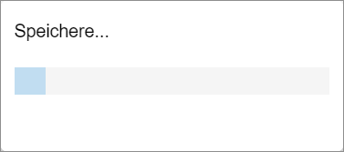
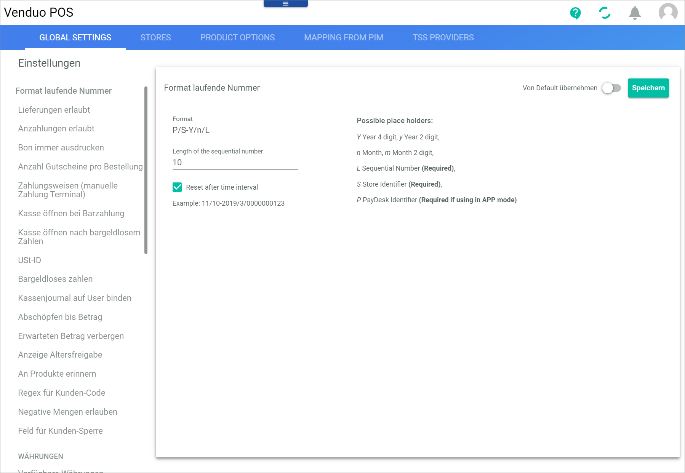
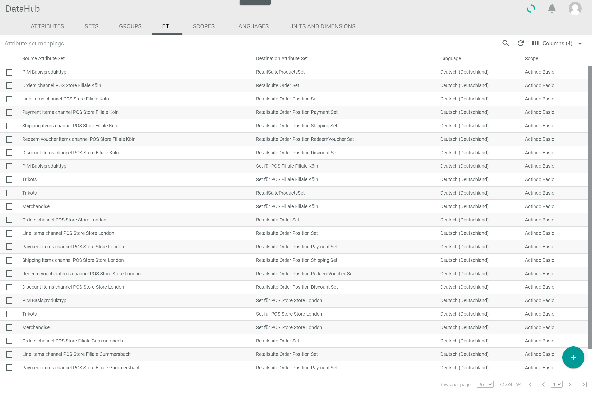
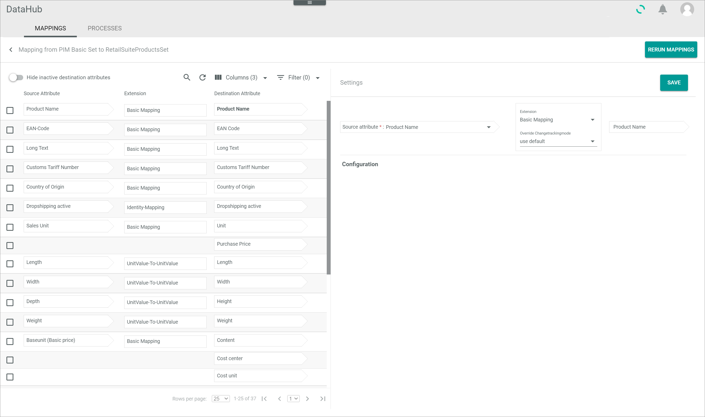

[!!Order management](../../RetailSuiteFaktBase/Overview/01_General.md)
[!!DataHub](../../DataHub/Overview/01_General.md)
[!!User Interface Venduo POS](../UserInterface/00_UserInterface.md)
[!!User Interface Order management](../../RetailSuiteFaktBase/UserInterface/00_UserInterface.md)
[!!User Interface DataHub](../../DataHub/UserInterface/00_UserInterface.md)

# Configure the global settings for POS

Venduo POS provides many settings to  configure the POS system individually.

For detailed information about the specific settings, see [Global Settings](../UserInterface/02a_GlobalSettings.md).

Before creating a new store in the POS system, you should configure the following settings:

- [Configure a default customer](#configure-a-default-customer) to establish a connection to invoicing which will be added as billing address to all future POS bills.
- [Configure the VAT-ID in POS](#configure-the-VAT-ID-in-POS) for the printing on receipts, which is mandatory in most countries.

## Configure a default customer

To connect the POS system with the invoicing, an invoice address has to be defined for all occasion customers.   
Further, a delivery address and an invoice address should be indicated on every receipt created in the POS system. To specify a invoice address for occasion customers, a default customer must be created. The data of this default customer is used for all occasion customers.

#### Prerequisites

No prerequisites to fulfill.

#### Procedure

*Venduo POS > Management > Tab GLOBAL SETTINGS > Entry Default customer*

  

1. Select the *Default customer* entry in the list of settings in the left column.

  The *Default customer* view is displayed on the right side.

2. Enter the fields for the default customer.

  > [Info] You must at least enter the country and an e-mail address for the default customer.

3. Click the [Save] button in the upper right corner.   
  The *Saving successful* message is displayed. The default customer is saved for all stores.

  

## Configure the VAT-ID in POS

In most countries it is mandatory to indicate the VAT-ID on receipts. Therefore, it is recommended to define the VAT-ID prior to creating a store.

#### Prerequisites

No prerequisites to fulfill.

#### Procedure

*Venduo POS > Management > Tab GLOBAL SETTINGS > Entry VAT-ID*

  

1. Select the *VAT-ID* entry in the list of settings in the left column.   
  The *VAT-ID* view is displayed on the right side.

2. Enter the VAT-ID in the *VAT-ID* field.

3. Click the [Save] button in the upper right corner.   
  The *Saving successful* message is displayed. The VAT-ID is saved for all stores.

  

## Define a new payment method for POS

By default, the payment methods debit card, credit card and paypal are predefined for the POS system. You can add several other payment methods that are predefined in the system, or you define a custom payment method for the POS system.

### Create a payment method in Invoicing

If the existing payment methods in *Venduo POS* are not appropriate for your special needs, you can create a custom payment method. Therefore, you have to create a new payment method in the *Invoicing* module first.

#### Prerequisites

No prerequisites to fulfill.

#### Procedure
*Invoicing > Settings > Tab PAYMENT METHOD(S)*

1. Click the [NEW] button.   
  The *Edit payment method* window is displayed.

  

2. Enter a name for the payment method in the *Title* field.   

3. Enter an ID for the payment method in the *ID* field.   

4. Click the [SAVE] button in the bottom right corner of the window.   
  The *Saving...* window is displayed.

  

  When the window is closed, the new payment method is saved in Invoicing. The new payment method is displayed in the list of payment methods in the *PAYMENT METHOD(S)* tab.

### Create a payment method in POS

If the existing payment methods in *Venduo POS* are not appropriate for your special needs, you can create a custom payment method. Therefore, you have to create a new payment method in the *Venduo POS* module based on the payment method created in the *Invoicing* module.

#### Prerequisites

A payment method has been created in the *Invoicing* module, see [Create a payment method in Invoicing](#create-a-payment-method-in-invoicing).

#### Procedure
*Venduo POS > Management > Tab GLOBAL SETTINGS*

1. Click the *Payment methods (manual terminal payment)* setting in the list of settings.   
  The *Payment methods (manual terminal payment)* view is displayed.

  

2. Click the  (Add) button.
  A new row for a payment method is displayed.

3. Enter the key of the new payment method in the *Key* field.

4. Enter a name for the payment method in POS in the *Name* field.   

    > [Info] The name of the payment method in POS can differ from the name of the payment method in the *Invoicing* module. It is only necessary that the ID of the payment method in *Venduo POS* and *Invoicing* match.

5. Click the [Save] button in the upper right corner.   
    The new payment method is saved in POS.

### Map the payment methods

#### Prerequisites

- A payment method has been created in the *Invoicing* module, see [Create a payment method in Invoicing](#create-a-payment-method-in-invoicing).
- A payment method has been created in the *Venduo POS* module, see [Create a payment method in POS](#create-a-payment-method-in-pos).

#### Procedure
*DataHub > Settings > Tab ETL*

1. Click the **Orders POS Store** attribute set mapping of the corresponding store in the *Source attribute set* column.   
  The *Mapping* view of the selected attribute set is displayed.

2. Click the attribute mapping with the **Payment method** attribute in the *Destination attribute* column.   
  The *Settings* section is displayed in the right part of the tab.

  

3. Click the *Extension* drop-down list in the *Settings* section and select the **Mapping table** option.

4. Click the *Source attribute* drop-down list in the *Settings* section and select the **Payment methods** option.   
    The mapping table for the selected mapping is displayed in the *Configuration* section.

5. Search for the invoicing name of the new payment method in the *Source value* column, click the drop-down list in the same row in the *Destination value* column and select the Venduo POS name of the new payment method.

6. Click the [SAVE] button in the upper right corner.   
    The *Submitting data...* message is displayed in the right part of the *Mapping* view. The mapping is saved, when nothing is displayed in the right part of the *Mapping* view.
