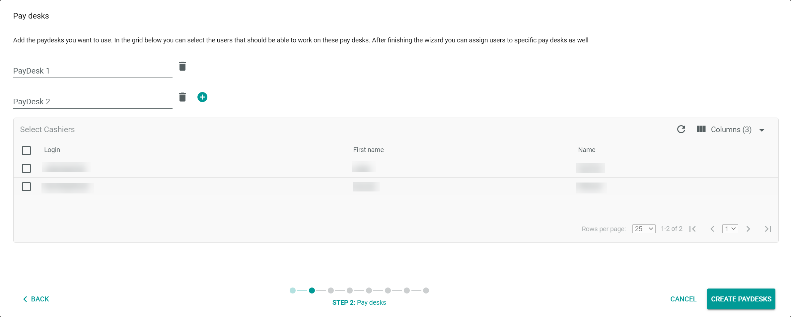
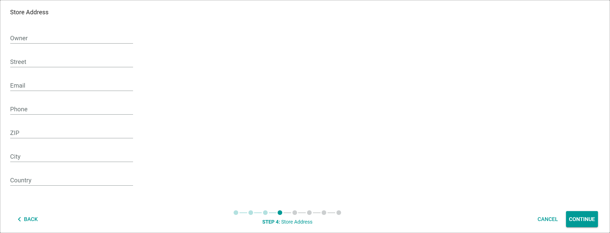
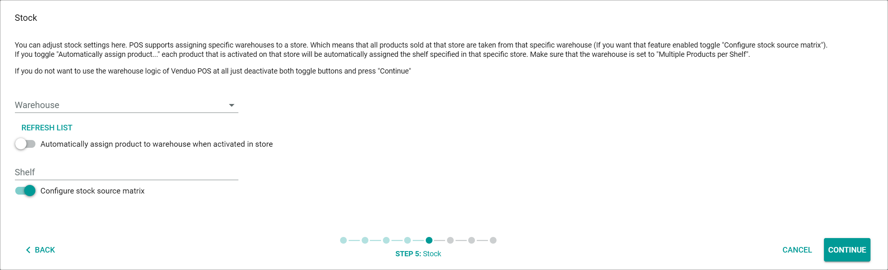
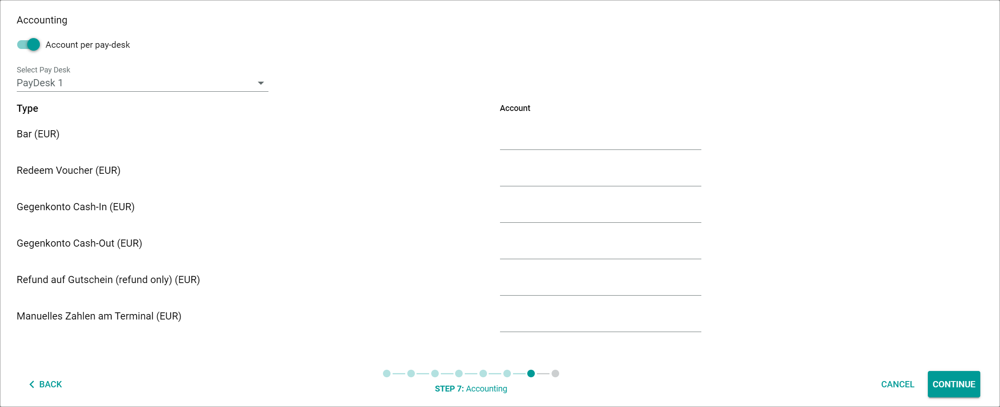

[!!Configure the printer for POS](./03_ConfigurePrinter.md)
[!!Open a pay desk](../Operation/01_OpenPayDesk.md)
[!!User interface Stores](../UserInterface/02b_Stores.md)
[!!User interface PIM Attributes](../../PIM/UserInterface/03a_Attributes.md)
[!!User interface DataHub ETL](../../DataHub/UserInterface/02a_Mappings.md)

[comment]: <> (add link to Warehouse, Accounting, Settings module if available)
<!---Error-->

# Create a store in POS using the wizard

There are two ways to create a store in POS: via wizard that is described in this topic and is highly recommended, or manually, see [Create a store manually](./06a_CreateStoreManually.md).  

## Create a store using the wizard

The store wizard guides you through all steps to create a store and its full functionality. 

## Start the store wizard

#### Prerequisites

- A warehouse for POS is configured, see [Configure the warehouse for POS](./01_ConfigureWarehouse.md).
- The accounts for POS are configured, see [Manage the accounts for POS](./02_ManageAccounts.md).
- The printer for POS is configured, see [Configure the printer for POS](./03_ConfigurePrinter.md).
- The users are assigned to the POS groups, see [Assign users to the POS groups](./04_AssignUsers.md).
- The global settings for POS are configured, see [Configure the global settings for POS](./05_ConfigureGlobalSettings.md).

#### Procedure

*Venduo POS > Management > Tab STORES*

1. Click the  (Add) button in the bottom right corner.   
    The [Create store via wizard (recommended)  ] button and the [Create Store  ] button are displayed.

2. Click the [Create store via wizard (recommended)  ] button to start the store creation wizard.   
    The *Create store* wizard window is displayed.

## Configure the store details

In this step you can add additional information for your store and assign a store manager.

#### Prerequisites

The store wizard has been started, see [Start the store wizard](#start-the-store-wizard).

#### Procedure

*Venduo POS > Management > Tab STORES > Button Add > Store Wizard - Step 1*

1. Enter a store name in the *Store name* field and add a short description if desired.

2. Specify a store manager from the list by selecting the corresponding checkbox.

    > [Info] The store managers list displays all the users who are assigned to the POS store manager group. You may select multiple users as store managers.

    For detailed information, see [Assign users to the POS groups](./04_AssignUsers.md).

3. Click the [CREATE STORE] button in the bottom right corner of the window.   
    The *Creating Store...* message is displayed. It may take several minutes until the creation is completed.    
    The *Pay desks* wizard window is displayed when the store is created.  
    The following entities have been automatically created:  
    - *DataHub* module:   
        The following attribute sets have been created<!--- Julian, Ist das richtig? Sollte man hier vielleicht eine Tabelle einfügen und erklären, was sie einzelnen Sets bedeuten und was die Kunden damit machen können?-->:
        - Orders channel POS Store "Name of new store"
        - Line items channel POS Store "Name of new store"
        - Payment items channel POS Store "Name of new store"
        - Discount items channel POS Store "Name of new store" 
        - Returns connection POS Store "Name of the new store"
        - Return line items channel POS Store "Name of the new store"
        - Redeem voucher item channel POS Store "Name of the new store"
        - Service items channel POS Store "Name of the new store"  
        - Set for POS store "Name of new store"
        - Offer option set for POS store "Name of the new store" 
- PIM module
    Your customer-specific PIM attribute sets have been created for the new store with a destination attribute set *Set for POS store "Name of the new store"*
    - *Omni-Channel* module   
    The following attribute sets have been created:    
        - A connection *Venduo POS store "Name of new store"*
        - A variant set *Set for POS for "Name of the new store"* 
        - A variant set *Offer option set for POS store "Name of the new store"* 

    

## Configure the pay desk

In this step you create one or several pay desks and assign cashiers.

#### Prerequisites

The store wizard has been started, see [Start the store wizard](#start-the-store-wizard).

#### Procedure

*Venduo POS > Management > Tab STORES > Button Add > Store Wizard - Step 2*

1. Enter a pay desk name in the *PayDesk 1* field.

    > [Info] Click the  (Add) button right next to the pay desk name to add another pay desk. You can add as many pay desks as you need.

2. Select a cashier from the list by selecting the corresponding checkbox.

    > [Info] The cashiers list displays all the users who are assigned to the POS cashier group. You may select multiple users as cashiers. Only cashiers who are assigned to a certain pay desk can use the pay desk.

   For detailed information, see [Assign users to the POS groups](./04_AssignUsers.md).

3. Click the [CREATE PAYDESKS] button in the bottom right corner of the window.   
    The *Printing* wizard window is displayed when the pay desk is created.

## Select a printer

In this step you select a printer for the receipt printing.

#### Prerequisites

The store wizard has been started, see [Start the store wizard](#start-the-store-wizard).

#### Procedure

*Venduo POS > Management > Tab STORES > Button Add > Store Wizard - Step 3*

> [Info] To select a printer, the printer client *APS (Actindo Print System)* must be installed and configured.   
For detailed information, see [Configure the printer client for POS](./03_ConfigurePrinter.md).

1. Click the *Client* drop-down list and select a client for the pay desk.

2. Click the *Printer* drop-down list and select a printer for the pay desk.

3. Click the *Tray* drop-down list and select a tray.

4. Select a format for printing. By default, portrait format is preselected for receipt printing.

5. Click the [SAVE PAYDESK] button in the bottom to save the printing settings for the selected pay desk.

    > [Info] If you created multiple pay desks, you can switch to another pay desk by clicking the tab with the name of the respective pay desk. You may configure different print settings for each pay desk.

6. Click the [CONTINUE] button in the bottom right corner of the window.   
    The *Store Address* wizard window is displayed when the printer is configured.

## Enter the store address

In this step, you specify the store address. The store address is the delivery address, which has to be defined for tax purposes. Further, a delivery address and an invoice address should be indicated on every receipt created in the POS system.

#### Prerequisites

The store wizard has been started, see [Start the store wizard](#start-the-store-wizard).

#### Procedure

*Venduo POS > Management > Tab STORES > Button Add > Store Wizard - Step 4*

1. Enter the store address in the fields.

    > [Info] The store address corresponds to the delivery address. You must at least enter the country and the ZIP code. For detailed information, see [Store Address](../UserInterface/02b_Stores.md#step-4---store-address).

2. Click the [CONTINUE] button in the bottom right corner of the window.   
    A confirmation message is displayed and the *Stock* wizard window is displayed when the store address is saved.

## Assign a POS warehouse 

In this wizard step, you assign the warehouse from which you want to take the stock from, you assign the shelf, and you configure the stock withdrawal matrix. The warehouse specifies where exactly the stock is posted out when a product is sold.

#### Prerequisites

The store wizard has been started, see [Start the store wizard](#start-the-store-wizard).

#### Procedure

*Venduo POS > Management > Tab STORES > Button Add > Store Wizard - Step 5*

1. Click the *Warehouse* drop-down list and select the warehouse you want to take the stock from.

2. Activate the *Automatically assign product to warehouse when activated in store* toggle to automate the assignment process. It is recommended to activate this option.

    > [Info] A product must have a stock level in a warehouse in order to be sold from that warehouse. Products only have stock level in a warehouse if a shelf is defined for them. By default, a shelf is not defined for products. Therefore, each product that is to be sold in the POS system must first get a shelf. The products get a shelf the first time the corresponding sales channels offer is activated. 

    This automation only works if you have enabled the storage of multiple items per shelf when creating the warehouse. For detailed information, see [Configure the warehouse for POS](./01_ConfigureWarehouse.md).

3. Enter a shelf number for the products in the *Shelf* field. The shelf number can be any arbitrary number.

4. Activate the *Configure stock withdrawal matrix* toggle to automate the configuration of the stock withdrawal matrix. It is recommended to activate this option.

5. Click the [CONTINUE] button in the bottom right corner of the window.   
    The *Stock allocation* wizard window is displayed when the warehouse assignment is saved.

## Assign a stock source

In this step you assign the stock source to manage the store stock level. The stock source specifies how the stock level in the POS system is calculated. In most cases, the stock source and the warehouse are identical, but they can also differ.

#### Prerequisites

The store wizard has been started, see [Start the store wizard](#start-the-store-wizard).

#### Procedure

*Venduo POS > Management > Tab STORES > Button Add > Store Wizard - Step 6*

1. Activate the *Create new stock source* toggle to add a new stock source that only considers the stock of the warehouse selected in the previous step. It is recommended to activate this option.     
    The *Select existing stock Source* drop-down list is hidden.

2. Click the [CONTINUE] button in the bottom right corner of the window.   
    The *Accounting* wizard window is displayed when the stock source assignment is saved.     

## Assign an account

In this step, you assign the accounts to which you want to post the payments.   

#### Prerequisites

The store wizard has been started, see [Start the store wizard](#start-the-store-wizard).

#### Procedure

*Venduo POS > Management > Tab STORES > Button Add > Store Wizard - Step 7*

1. Activate the *Account per pay desk* toggle to assign the accounts to each pay desk individually.   

    > [Info] If you deactivate the *Account per pay desk* toggle, you may only assign the accounts per store.   

2. Select the respective pay desk in the *Select Pay Desk* drop-down list.     
    A table to assign the accounts is displayed in the window.

    

3. Select the respective account in the *Account* column and enter the corresponding account numbers for the different payment types and currencies. For detailed information, see [Manage the accounts for POS](./02_ManageAccounts.md).

    > [Info] You only have to enter the account numbers for the accounts with the used currency. To delete the unused currencies from the list of available currencies, see [Available Currencies](../UserInterface/02a_GlobalSettings.md#available-currencies).

4. Click the [CONTINUE] button in the bottom right corner of the window.   
    The *Summary* wizard window is displayed when the account assignment is saved.

## Finalize the wizard

In this step you check if any necessary information is still missing, and you complete the configuration of the store.

#### Prerequisites

The store wizard has been started, see [Start the store wizard](#start-the-store-wizard).

#### Procedure

*Venduo POS > Management > Tab STORES > Button Add > Store Wizard - Step 8*

1. Check the summary.     

    > [Info] In the summary, missing data or problems that can lead to restrictions when using POS are indicated with a yellow warning triangle.    
    Remember these points and correct them manually afterwards if necessary.   
    The summary also indicates whether the POS can be used.  

2. Click the [FINALIZE] button in the bottom right corner of the window.   
    The wizard window is closed and the configuration of the store is finalized.

