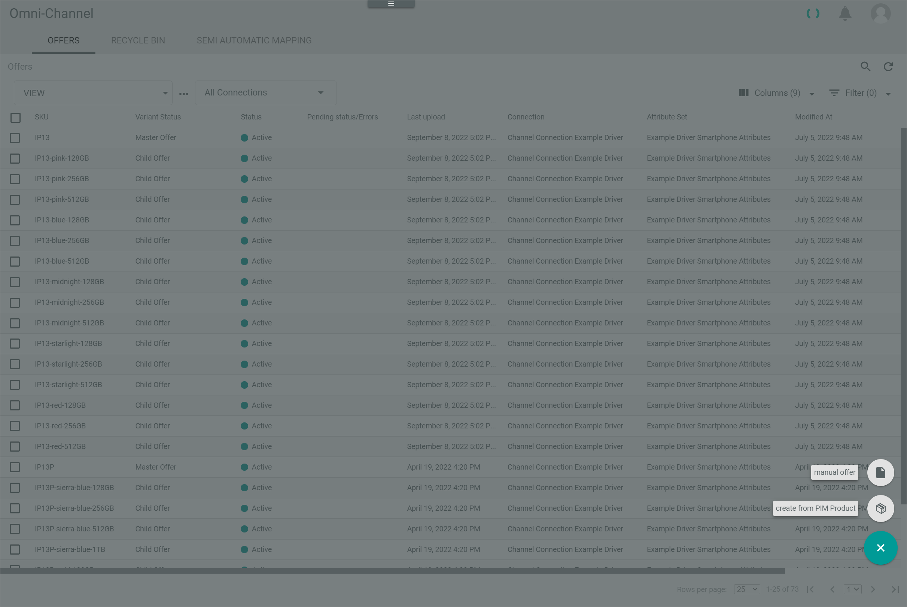
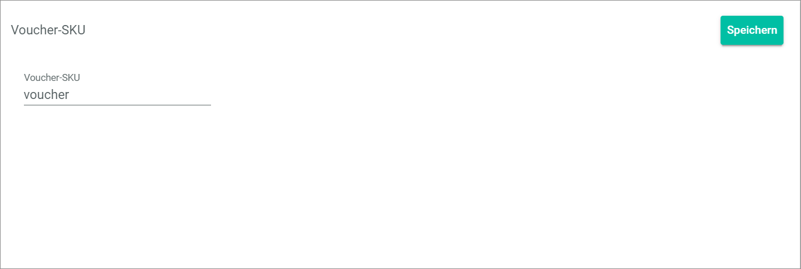
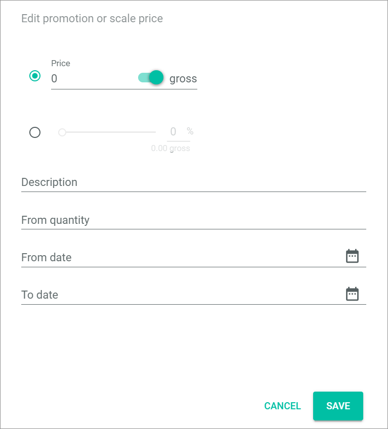
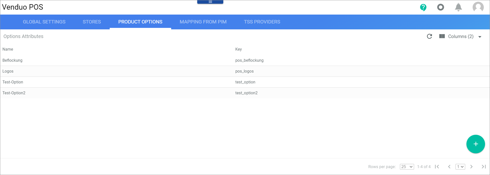

[!!Record the purchase](../Operation/02_SelectOffer.md)
[!!Edit the bill list](../Operation/03_EditBillList.md)
[!!Complete a purchase](../Operation/04_CompletePurchase.md)
[!!User interface Omni-Channel Offers](../../Channels/UserInterface/02a_Offers.md)
[!!User interface DataHub Attributes](../../DataHub/UserInterface/01a_Attributes.md)
[!!User interface PIM List](../../PIM/UserInterface/02a_List.md)

# Manage offers for POS

To offer products in POS, it is recommended to create the products in the *PIM* module first and import them later into the *Omni-Channel* module. From there, the *Venduo POS* module retrieves its offers.

## Create products for POS

To create an offer for POS, it is recommended to create products in the *PIM* module for which you can make an offer.

#### Prerequisites

No prerequisites to fulfill.

#### Procedure

Create the product in the *PIM* module. For detailed information, see [Create a product](../../PIM/Operation/01_ManageProducts.md#create-a-product) in the *PIM* documentation.

## Create a product type

To improve the product classification, you can create a product type and use it in POS. To do this, you create an attribute set in the *PIM* module.  
For detailed information on how to create an attribute set, see [Create an attribute set](../../PIM/Integration/02_ManageAttributeSets.md#create-an-attribute-set) in the *PIM* documentation.
<!---Product type= Attribute set?-->

## Map a new product type in POS

When a new product type has been created, it must be mapped before offers with this product type can be created for the POS.

#### Prerequisites

At least one new product type has been created, see [Create an attribute set](../../PIM/Integration/02_ManageAttributeSets.md#create-an-attribute-set) in the *PIM* documentation.

#### Procedure

*Venduo POS > Management > Tab MAPPING FROM PIM*

1. Click the  (Refresh) button in the upper right corner.   
    All not mapped PIM product types are displayed in the list.

    

2. Select the checkboxes of the product types you want to map.   
    A toolbar is displayed at the bottom.

3. Click the [CREATE MAPPINGS] button in the toolbar.    
    The selected mappings are removed from the list when the mappings are created.

## Create an offer for POS

Create an offer in the *Omni-Channel* module or a product in the *PIM* module, so you can offer and select the products/offers in the POS store.

If you have the *PIM* module in use, it is recommended to create/edit the products in the *PIM* module. Changes to the *PIM* product are automatically transferred (via ETL) to the offers available in the *Omni-Channel* module.  
Especially if you want to exchange your product data available in the *PIM* module with your stores, you must additionally create the ETL mappings and processes for the data transfer between the PIM product data and the Omni-Channel offer data.

### Create an offer from a PIM product in Omni-Channel

You can create an offer from a PIM product in the *Omni-Channel* module if the corresponding product exists in the *PIM* module.

> [Info] If the product you want to create an offer for exists in the *PIM* module, it is recommended to create the offer from the PIM product instead of creating a manual offer.

#### Prerequisites

At least one product has been created, see [Create products for POS](#create-products-for-pos).

#### Procedure

For detailed information, see [Create an offer from a PIM product](../../Channels/Operation/01_ManageOffers.md#create-an-offer-from-a-pim-product) in the *Omni-Channel* documentation.

### Create a manual offer in Omni-Channel

You can create a manual offer in the *Omni-Channel* module for all products regardless of whether they exist in the *PIM* module or not.

#### Prerequisites

At least one product has been created, see [Create products for POS](#create-products-for-pos).

#### Procedure

Create an offer manually. For detailed information, see [Create a manual offer](../../Channels/Operation/01_ManageOffers.md#create-a-manual-offer) in the *Omni-Channel* documentation.

### Create a single channel offer in PIM

You can create an offer for a single sales channel for the selected product in the *PIM* module. This allows you to offer specials in your stores.

#### Prerequisites

At least one product has been created, see [Create products for POS](#create-products-for-pos).

#### Procedure

Create a single channel offer in the *PIM* module. For detailed information, see [Create a single connection offer in PIM](../../PIM/Operation/01_ManageProducts.md#create-a-single-connection-offer-in-pim) in the *PIM* documentation.

### Create a multiple channels offer in PIM

You can create an offer for multiple channels to the selected product in the *PIM* module.

#### Prerequisites

At least one product has been created, see [Create products for POS](#create-products-for-pos).

#### Procedure

Create an offer for multiple sales channels to the selected product in the *PIM* module. For detailed information, see [Create a multi-connection offer in PIM](../../PIM/Operation/01_ManageProducts.md#create-a-multi-connection-offer-in-pim) in the *PIM* documentation.

## Activate a POS offer

An offer has to be active so that it is displayed in the selected sales channel and can be sold there.

#### Prerequisites

At least one offer has been created, see [Create an offer for POS](#create-an-offer-for-pos).

#### Procedure

*Omni-Channel > Offers > Tab OFFERS*

1. Select the checkboxes of the offers you want to activate.   
    The editing toolbar is displayed.

2. Click the *Change status to* drop-down list in the editing toolbar and select the **Active** option.   
    The **Active** status is displayed in the *Pending status/Errors* column of the selected offers.    

    

    When the offers are active, the status in the *Pending status/Errors* column is no longer displayed, but the status in the *Status* column has changed to **Active**.

    > [Info] It may take some time until all offers are activated. Click the  (Refresh) button in the upper right corner to update the offer list.

## Create a QuickSelect category

Create a QuickSelect category for POS for faster access to favorite offers at the cashpoint.  

The following image shows how QuickSelects can organize the most requested offers:

### Define a QuickSelect attribute

When creating a POS store, a QuickSelect attribute is automatically created in the *DataHub* module. Edit the QuickSelect attribute to specify the different QuickSelect elements for a POS offer.

#### Prerequisites

No prerequisites to fulfill.

#### Procedure

*DataHub > Data model > Tab ATTRIBUTES*

1. Enter **QuickSelect** in the search bar and click the  (Search) button.   
  The matching attributes are displayed in the attributes list.

2. Click the appropriate *QuickSelect Category* attribute in the attributes list.  
    The *Edit attribute* view is diplayed.

    

3. Scroll down to the *CONFIGURATION* section and click the  (Add) button in the bottom right corner of the *Edit tree* table.
    A plus sign is displayed in the left column of the *Edit tree* table.

    

4. Click the plus sign in the left column of the *Edit tree* table.   
    The *Add element* window is displayed.

    

5. Enter a name in the *Name* field.

    > [Info] The entered name equals the name of the QuickSelect element that will be displayed in Venuo POS.

6. If desired, enter a key in the *Key* field.
<!---Link war tot. Gibt es das noch?
    > [Info] By entering a key, you can define an icon for the QuickSelect element.   
      For detailed information on the icon list, see [QuickSelect Icon List](to_be_completed).-->

[comment]: <> (Add list of icon keys for Quickselect)

7. Click the [SAVE] button in the bottom right corner of the *Add element* window.   
    The *Add element* window is closed. The element is displayed in the left column of the *Edit tree* table.

    > [Info] If you want to create further QuickSelect elements, repeat step **3** to **6**.

8. Click the [SAVE] button in the upper right corner.   
    The *Edit attribute* view is closed. The QuickSelect element is saved.

9. Press the **F5** key to initialize the *Core1 Platform*.

### Assign the QuickSelect attribute

An offer is assigned to a certain QuickSelect category when you assign the created QuickSelect elements to the corresponding offer.

#### Prerequisites

- At least one QuickSelect attribute has been created, see [Define a QuickSelect attribute](#define-a-quickselect-attribute).
- At least one offer has been created for POS, see [Create an offer for POS](#create-an-offer-for-pos).

#### Procedure

*Omni-Channel > Offers > Tab OFFERS*

1. Click the offer you want to create the QuickSelect element to.   
    The *Edit offer* view of the selected offer is displayed. The *Attributes* tab is preselected.

    

2. Scroll down in the *Attribute* tab and select the QuickSelect element in the *QuickSelect Category* drop-down list.

    

3. Click the [SAVE] button in the upper right corner.    
    The *Edit offer* view is closed. The offer with the QuickSelect element is saved.

> [Info] You have to repeat this procedure for each offer you want to assign the QuickSelect Category to.

[comment]: <> (Is there an alternative to manually assign each offer?)
[comment]: <> (JULIAN: Hier könnten man noch unterbringen wie man zusätzliche Felder mapped aus PIM raus oder Felder aus Omni-Channel ins PIM übernimmt)

## Create a voucher 

If you want to sell vouchers in your POS system, you have to create them first.

### Create a voucher product

To create a voucher, you need to create a product that you define as a voucher.

#### Prerequisites

No prerequisites to fulfill.

#### Procedure

*PIM > Products > Tab LIST*

1. Click the  (Add) button in the bottom right corner.   
    The *Create new product* window is displayed.

    

2. Click the *Select attribute set* drop-down list and select the appropriate attribute set.

    > [Info] If you have not created a new attribute set, the only available attribute set is **PIM Basic Data**.   

    For detailed information on how to create an attribute set for POS, see [Create a product type](#create-a-product-type).

3. Enter an SKU in the *SKU* field, for instance **Voucher**.

    > [Info] The SKU (Stock Keeping Unit) is an identification number for the product. Therefore, it has to be uniquely assigned to a single product and should not be changed once assigned.

4. Click the [CREATE] button in the bottom right corner of the *Create new product* window.   
    The *Create new product* window is closed. The *Create product* view is displayed in the *List* tab. The *Attributes* tab is preselected.

    

5. Enter the product data in the fields of the *Attributes* tab. You must at least enter a product name, a price and a tax class.

6. Click the [SAVE] button in the upper right corner.   
    The new product is saved. The *Create product* view is closed. The *List* tab with the new product in the product list is displayed.

7. Create an offer for the voucher product, see [Create an offer for POS](#create-an-offer-for-pos).

### Define the voucher setting

You need to define the created product as a voucher to use it in the POS store.

#### Prerequisites

- At least one product to be defined as a voucher has been created in the *PIM* module, see [Create a voucher product](#create-a-voucher-product).
- The voucher product has been transferred to the *Omni-Channel* module. For detailed information, see [Create an offer from a PIM product](../../Channels/Operation/01_ManageOffers.md#create-an-offer-from-a-pim-product) in the *Omni-Channel* documentation.

#### Procedure

*Omni-Channel > Offers > Tab OFFERS*

1. Click the offer to the voucher.   
    The *Edit offer* view is displayed. The *Attributes* tab is preselected.

    

2. Scroll down in the attributes and enable the *Voucher* toggle.

3. Click the [SAVE] button in the upper right corner.
    The voucher is saved. The *Edit offer* view is closed.

    > [Info] When a voucher-offer is sold, a voucher code is created and printed on the receipt. The value of the voucher corresponds to the price of the voucher before discounts are applied.

<!---NEU-->
### Create an offer for pre-printed vouchers

A *Knistr&trade;* integration is available in the standard. You can use this integration to offer pre-printed vouchers. If the connection is established, the cashiers can record the codes of these vouchers via barcode scan or manually. For detailed information, see the [Knistr](https://www.knistr.com "[//https:knistr.com]") website.   

Pre-printed vouchers have the following special features:

- The voucher cards can be used as refill cards, so that you define a price proposal only when creating the pre-printed voucher offer. When it is created in Actindo, the cashier can individually load the voucher card with any amount. The amount entered when recording the voucher is added to the amount already existing on the voucher card.
- The pre-printed voucher offer is not created in the *PIM* module, it is created store-specific in the *Omni-Channel* module.

Note that the *Set for POS Store "Name of the store"* attribute set, which is inherited from the *POS basic set*, contains the *Voucher* attribute, which allows you to classify an offer as a pre-printed voucher. 

#### Prerequisites

- The credentials for the Knistr&trade;connection have been specified. For detailed information, see [KNISTR credentials](../UserInterface/02a_GlobalSettings.md#knistr-credentials).
- The *Voucher* attribute is added to the *Set for POS Store "Name of the store"* attribute set.

#### Procedure

*Omni-Channel > Offers > Tab OFFERS*

1. Click the  (Add) button in the bottom right corner.   
    The [Manual offer ] button and the [Create from PIM product ] button are displayed.

    

2. Click the [Manual offer ] button.   
    The *Create offer* window is displayed.

    

3. Enter the desired SKU in the *SKU* field.

4. Click the *Select connection* drop-down list and select the connection for the store for which you want to create the voucher. All available connections are displayed in the list.   

5. Click the *Select attribute set* dropdown-list and select the *Set for POS Store "Name of the store"* for your store.

6. Click the [SAVE] button.   
     The *Edit offer "Name of the voucher"* view is displayed.

7. Define the voucher. Note the following:

    > [Info] This description relates to the *POS basic set*. 

    - Enter **"Name of the voucher** in the *Barcode* field.
    - Enter a proposal in the *Price* field. This value can be overwritten individually when selling the voucher.
    - Enter the tax rate value in the *Tax rate* field and select the required tax class in the *Tax class* drop-down field.
    - Enable the *Voucher* toggle to classify the offer as a voucher.

8. Click the [SAVE] button.

9. Activate the new offer.

### Declare the name of the pre-printed voucher

Declare the voucher name in the *Global settings*.

#### Prerequisites
You have created an offer for pre-printed vouchers, see [Create an offer for pre-printed vouchers](#create-an-offer-for-pre-printed-vouchers).

#### Procedure
*Venduo POS > Management > Tab GLOBAL SETTINGS > Voucher SKU*

1. Enter the SKU of the offer for the pre-printed voucher in the *Voucher SKU* field.

2. Click the [Save] button.
    

<!---NEU-->
## Add an age rating to a product

If you want to use the *Age rating* feature, the attribute set assigned to the PIM product should contain an age rating attribute in which the required minimum age of a buyer is specified. Refer to the *PIM Basic set* attribute set for this.     
For detailed information on configuring this feature, see [Display age rating](../UserInterface/02a_GlobalSettings.md#display-age-rating).

<!---NEU-->
## Define promotions for POS
You can define promotions for POS by adding a promotion price and a validity period to a POS offer that have been previously defined as promotion price in the *PIM* module.  

For this feature, the following attributes have been added to the *POS basic set* attribute set and are available in the offer's attributes of your stores:
- actindo_pos_special_price: Attribute with which a promotions price can be specified.
- actindo_pos_special_price_start: Attribute, with which the start date of a promotion can be specified.
- actindo_pos_special_price_end: Attribute, with which the end date of a promotion can be specified.   

As the *POS basic set* is automatically inherited to your offers, these attributes are available for your offers.

In the following, the procedure of the standard delivery is described. It may differ if your system has a different configuration.

#### Prerequisites

- At least one product has been created, see [Create a product](../../PIM/Operation/01_ManageProducts.md#create-a-product) in the *PIM* documentation.
 - The product has been created as an offer in the *Omni-Channel* module. For detailed information, see [Create an offer in PIM](../../PIM/Operation/01_ManageProducts.md#create-an-offer-in-pim) in the PIM module.

#### Procedure

*PIM > Products > Tab LIST*

1. Click the product you want to edit in the list of products.   
    The *Edit product* view is displayed. The *Attributes* tab is preselected.

    

2. Click then *Prices* entry in the *Basic Data* tree.  
    The *Prices (EUR)* window is displayed.

    ]")

3. Click the [ADD] button.   
    The *Edit promotion or scale price* window is opened.

    

4. Select the *Price* radio button if you want to define a new price for the promotion. Enable the *gross* toggle, if the price is a gross price.

5. Select the radio button to enter a percentage if you want to reduce the price by a percentage. You can enter the value with a scale or by entering the percentage value.

6. Enter a description for the promotion in the *Description* field.

7. Enter the quantity in the *From Quantity* field. This field is required.

8. Enter the start date of the promotion in the *From date* field. Use the  button.

9. Enter the end date of the promotion in the *To date* field. Use the  button.

10. Click the [SAVE] button.  
    The *Edit product* view is displayed.

11. Click the [SAVE] button.  
    The *Submitting data..* message is displayed and the *Products* view is displayed. It may take some time until the changes are transferred to the offer in the *Omni-Channel* module and the promotion price is available in your stores.

<!---NEU-->
## Create a price group for POS

Price groups are used to classify different prices that apply to customers to whom the same pricing criteria are applied, for example members or business partners.

### Create attributes for the POS price group

Define the attribute that is assigned to the customer master data later and in which the price group of a customer is stored. Assign this attribute to the attribute set that you use for your customer master data. In addition, define the attribute that contains the POS price group. Assign this attribute to the related store-specific attribute set.

#### Prerequisites

No prerequisites to fulfill.

#### Procedure

*DataHub > Settings > Tab ATTRIBUTES*

1. Create the attribute that represent the POS price group, for example the *pos_price_group* attribute. It must be of the *string* data type. 

2. Assign this attribute to the *RetailSuite Customer* attribute set. 

3. Create the attribute(s), with which you define the price group itself, for example the *pos_member_price* attribute. You assign this attribute to offers later to be able to define a special price for customers assigned to this price group. It must be of the *Floating point number* data type. 

3. Assign this attribute to the *POS basic set* attribute set.

For detailed information, see [Create an attribute](../../DataHub/Integration/01_ManageAttributes.md#create-an-attribute) in the *DataHub* documentation.

### Declare the price group attribute for customer master data

Declare the field in which the price group is stored in the customer master data. 

For detailed information, see [Field for price group](../UserInterface/02a_GlobalSettings.md#field-for-price-group) in the Global settings.

### Activate the price groups

Activate the price groups you want to use in your stores. In this case, the price group attributes must have been included in the *POS basic set* attribute set.

> [Info] You can also activate the price groups store-specific, see [Admin settings &ndash; store](/POS/UserInterface/02b_Stores.md#admin-settings---store). 

For detailed information, see [Active price groups](../UserInterface/02a_GlobalSettings.md#active-price-groups) in the Global settings. 

### Add the price group price to offers

 Assign the attribute for defining the price group-related price, for example the *pos_member_price* attribute, to each offer, to which a price group-specific price should apply. Because you added the price group attribute to the *POS basic set*, the attribute is automatically inherited by all *Set for POS "Name of the store"* attribute groups. This means that it is available for all of your store-specific offers.

 > [Info] If you also want to offer the price groups for product options, you must also assign the price group attribute to the *Offer option set for POS "Name of the store"*. 

#### Prerequisites

The attribute for specifying the price group-related price has been defined in the *DataHub* module, see [Create the POS price group attributes](#create-the-pos-price-group-attributes).

#### Procedure

*Omni-Channel > Offers*

1. Click the *Connections* drop-down list and select the connection to the store, for which you want to assign the price group price to the offers.

2. Select an offer, for which a special price group price should apply. If the offer has a master offer with variants, select this one. This allows that the price group price is automatically inherited by all variants.    
    The *Edit offer "offer name"* view is displayed. The *Attributes* tab is displayed by default. Only the *Unassigned Group* is available, in which you can enter store-specific values for this offer.

    

3. Scroll down to the attribute you have created. 

4. Enter the price.

5. Click the [SAVE] button.

<!--->

## Create a product option 

You may want to combine additional services with an offer. If your store has the appropriate technical capabilities, you may want to offer shirts with an optional flocking, or photos with an optional printing on mugs and other objects. In these cases, a specific service is associated to an offer. For detailed information on how the product options are handled at the cash point, see [Add a product option](../Operation/02_SelectOffer.md#add-a-product-option).

From a technical point of view, you have to associate a product or service to an existing product.

### Define a product option

Define a product option that describes the additional service to an offer, for example, photo print or flocking.

#### Prerequisites

No prerequisites to fulfill.

#### Procedure

*Venduo POS > Management > Tab PRODUCT OPTIONS*

1. Click the  (Add) button in the bottom right corner.   
    The *Create option attribute* window is opened.

    

2. Enter a name for the product option in the *Name* field.

3. Enter a unique key for the product option in the *Key* field.

4. Click the [SAVE] button.    
    The new attribute is saved. It is automatically saved in the *DataHub* module with the *Related offers* data type and is added to the *POS basic set* attribute set. Since the *POS basic set* attribute set is inherited automatically to the *Set for POS Store ("Name of the store")* attribute sets, it is also available for each newly created store.

5. If desired, add additional product options.

### Create a product for product option

Create a product which describes the additional service, for example the logo to be printed on a shirt or a cup.

#### Prerequisites
No prerequisites to fulfill.

#### Procedure

1. Create the product. Assign this product to the *Product options* attribute set. For detailed information on creating a product, see [Create a product](../../PIM/Operation/01_ManageProducts.md#create-a-product) in the *PIM* documentation.

2. Transfer this product to the *Omni-Channel* module. For detailed information, see [Create an offer from a PIM product](../../Channels/Operation/01_ManageOffers.md#create-an-offer-from-a-pim-product). By doing this, assign the offer directly to the *Offer option set for POS store "Name of the store"*

POS options basic set.
da kommen alle attribute rein, die für die zusätzlichen Dienstleistungen gewünscht werden

### Associate the product option with offer

Associate the product option with the products for which you want to offer the additional service. Because the additional service may only apply to certain stores, the association is made to the Omni-Channel offer.    
In the *Unassigned Group* 

#### Prerequisites

- The product option has been created and is transferred to the *Omni-Channel* module.
- The product to which the product option will be associated has been created. 

#### Procedure

*Omni-Channel > Offers*

1. Select the desired connection respectively the desired store in the *All connections* drop-down list.    
    A list of all offers in the desired store is displayed.

2. Select the offer with which you want to associate the product option. If applicable, select the master offer so that the product option association is inherited by all variants of the master offer.   
    The *Edit offer "SKU"* view is displayed. The *Attributes* tab is preselected by default. Only the *Unassigned* group is available.

    

3. Scroll down the *Unassigned group* until you reach the product option to which you want to assign the offer you have created as product option.

    

4. Click the [ADD] button in the top right corner of the product option box.   
    The *Filter list of products* window is displayed.

    

5. Click the (Refresh) button in the top right corner.   
    A list of all offers available in the store is displayed.

6. Click the checkbox of the desired offer previously created as product option.   
    The editing toolbar is displayed.

7. Click the [SAVE] button in the top right corner of the *Filter list of products* window.   
    The *Edit offer "SKU"* view is displayed.  

8. Click the [SAVE] button in the top right corner of the *Edit offer "SKU"* view.   
    The product option offer is now associated to an offer of your store.

### Add additional attributes

You might want to have the possibility to specify a product option more precisely. For example, you want to offer to print a text on a shirt or a cup. In this case, you must create one or more attributes, in which the cashiers can enter a text or select a predefined text. 

#### Prerequisites

No prerequisites to fulfill.

#### Procedure

Create the additional attributes you require. For detailed information, see [Manage an attribute](../../PIM/Integration/01_ManageAttributes.md) in the *PIM* documentation.

-->