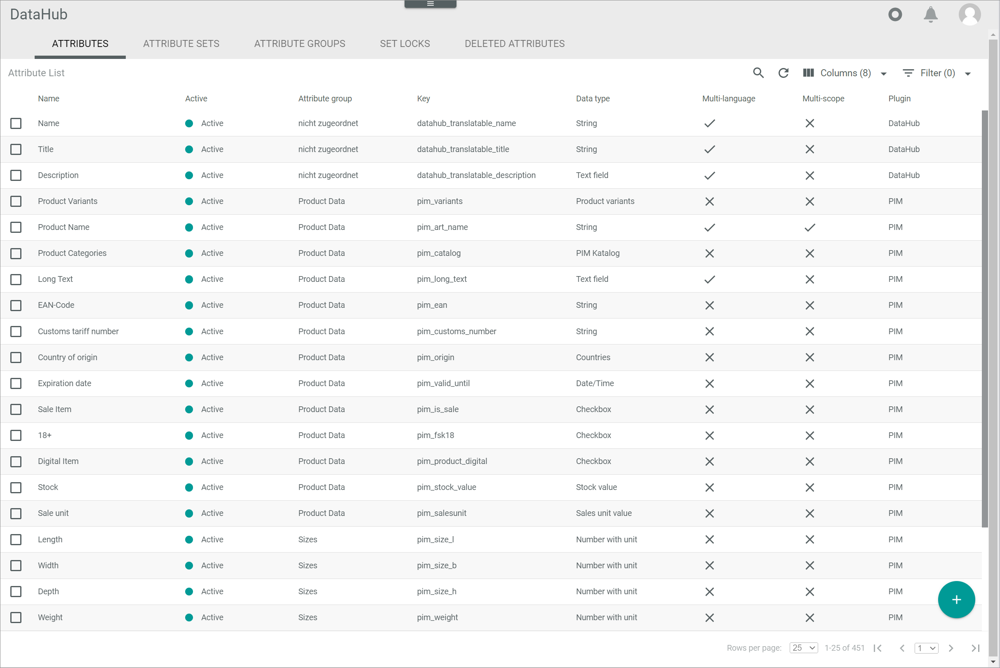
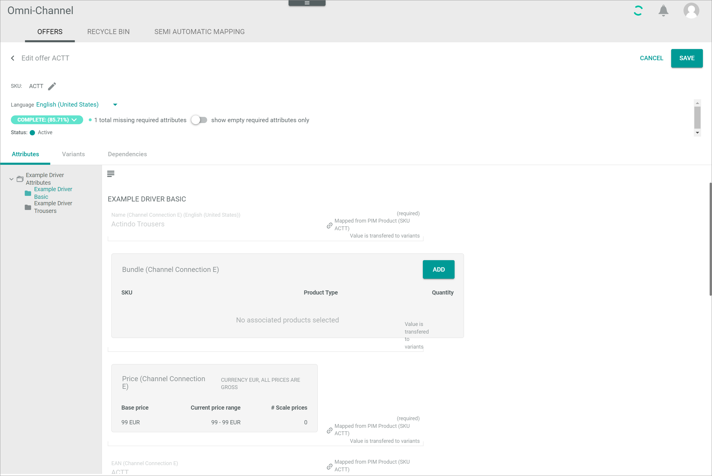
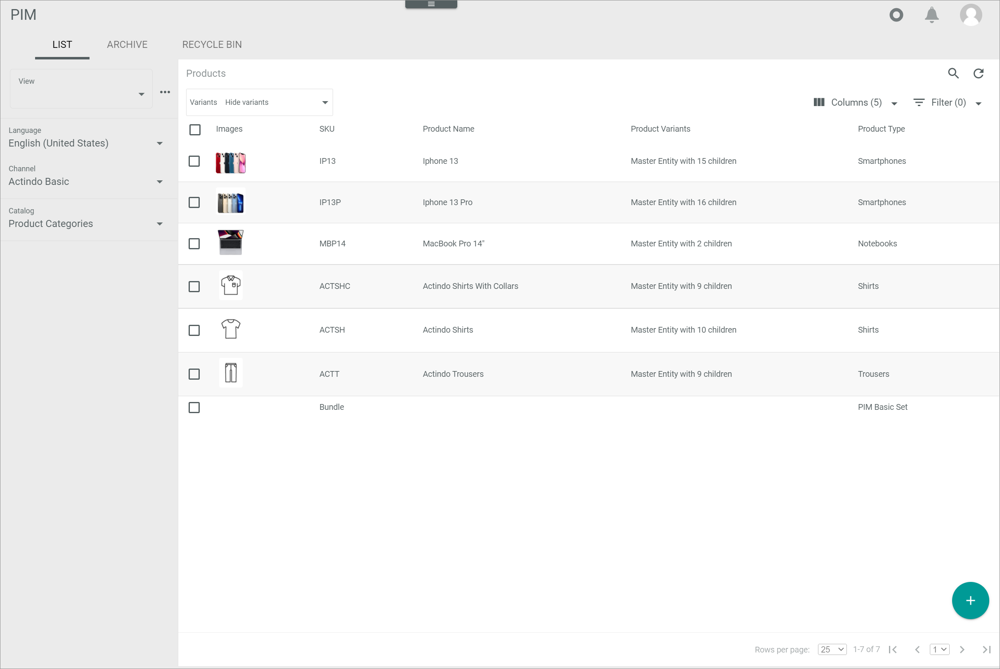

[!!Select an offer](../Operation/02_SelectOffer.md)
[!!Edit the bill list](../Operation/03_EditBillList.md)
[!!Complete a purchase](../Operation/04_CompletePurchase.md)
[!!Manage the POS order process](../Operation/06_ManageOrderProcess.md)
[!!User interface Mapping from PIM](../UserInterface/02c_MappingFromPIM.md)
[!!User interface Omni-Channel Offers](../../Channels/UserInterface/02a_Offers.md)
[!!User interface DataHub Attributes](../../DataHub/UserInterface/01a_Attributes.md)
[!!User interface PIM List](../../PIM/UserInterface/02a_List.md)

# Manage offers for POS

To offer products in Venduo POS, it is recommended to create the products in advance and create the corresponding offers afterwards in order to be able to distribute them properly in the system.

## Create products for POS

To create an offer for POS, it is recommended to create products in the *PIM* module for which you can make an offer.

#### Prerequisites

No prerequisites to fulfill.

#### Procedure

Create the product in the *PIM* module. For detailed information, see [Create a product](../../PIM/Operation/01_ManageProducts.md#create-a-product) in the *PIM* documentation.

## Create a product type

To improve the product classification, you can create a product type and use it in POS. To do this, you create an attribute set in the *PIM* module.  
For detailed information on how to create an attribute set, see [Create an attribute set](../../PIM/Integration/02_ManageAttributeSets.md#create-an-attribute-set) in the *PIM* documentation.

## Map a new product type in POS

When a new product type is created, it must be mapped before offers with this product type can be created for the POS.

#### Prerequisites

At least one new product type has been created, see [Create an attribute set](../../PIM/Integration/02_ManageAttributeSets.md#create-an-attribute-set) in the *PIM* documentation.

#### Procedure

*Venduo POS > Management > Tab MAPPING FROM PIM*

1. Click the  (Refresh) button in the upper right corner.   
    All not mapped PIM product types are displayed in the list.

    

2. Select the checkboxes of the product types you want to map.   
    A toolbar is displayed at the bottom.

3. Click the [CREATE MAPPINGS] button in the toolbar.    
    The selected mappings are removed from the list when the mappings are created.

## Create an offer for POS

Create an offer in the *Omni-Channel* module or a product in the *PIM* module, so you can offer and select the products/offers in the *Venduo POS* store.

If you have the *PIM* module in use, it is recommended to create/edit the products in the *PIM* module. Changes to the *PIM* product are automatically transferred (via ETL) to the offers available in the *Omni-Channel* module.  
Especially if you want to exchange your product data available in the *PIM* module with your stores, you must additionally create the ETL mappings and processes for the data transfer between the PIM product data and the Omni-Channel offer data.

### Create an offer from a PIM product in Omni-Channel

You can create an offer from a PIM product in the *Omni-Channel* module if the corresponding offer exists in the *PIM* module.

> [Info] If the product you want to create an offer for exists in the *PIM* module, it is recommended to create the offer from the PIM product instead of creating a manual offer.

#### Prerequisites

At least one product has been created, see [Create products for POS](#create-products-for-pos).

#### Procedure

For detailed information, see [Create an offer from a PIM product](../../Channels/Operation/01_ManageOffers.md#create-an-offer-from-a-pim-product) in the *Omni-Channel* documentation.

### Create a manual offer in Omni-Channel

You can create a manual offer in the *Omni-Channel* module for all products regardless of whether they exist in the *PIM* module or not.

#### Prerequisites

At least one product has been created, see [Create products for POS](#create-products-for-pos).

#### Procedure

Create an offer manually. For detailed information, see [Create a manual offer](../../Channels/Operation/01_ManageOffers.md#create-a-manual-offer) in the *Omni-Channel* documentation.

### Create a single channel offer in PIM

You can create an offer for a single sales channel for the selected product in the *PIM* module.
<!---Warum würde ich das tun wollen? Use case?-->

#### Prerequisites

At least one product has been created, see [Create products for POS](#create-products-for-pos).

#### Procedure

Create a single channel offer in the *PIM* module. For detailed information, see [Create a single connection offer in PIM](../../PIM/Operation/01_ManageProducts.md#create-a-single-connection-offer-in-pim) in the *PIM* documentation.

### Create a multiple channels offer in PIM

You can create an offer for multiple channels to the selected product in the *PIM* module.

#### Prerequisites

At least one product has been created, see [Create products for POS](#create-products-for-pos).

#### Procedure

Create an offer for multiple sales channels to the selected product in the *PIM* module. For detailed information, see [Create a multi-connection offer in PIM](../../PIM/Operation/01_ManageProducts.md#create-a-multi-connection-offer-in-pim) in the *PIM* documentation.

## Activate a POS offer

An offer has to be active so that it is displayed in the selected sales channel and can be sold there.

#### Prerequisites

At least one offer has been created, see [Create an offer for POS](#create-an-offer-for-pos).

#### Procedure

*Omni-Channel > Offers > Tab OFFERS*

1. Select the checkboxes of the offers you want to activate.   
    The editing toolbar is displayed.

2. Click the *Change status to* drop-down list in the editing toolbar and select the **Active** option.   
    The **Active** status is displayed in the *Pending status/Errors* column of the selected offers.    

    

    When the offers are active, the status in the *Pending status/Errors* column is no longer displayed, but the status in the *Status* column has changed to **Active**.

    > [Info] It may take some time until all offers are activated. Click the  (Refresh) button in the upper right corner to update the offer list.

## Create a QuickSelect category

Create a QuickSelect category for POS for faster access to favorite products.

### Define a QuickSelect attribute

When creating a POS store, a QuickSelect attribute is automatically created in the *DataHub* module. Edit the QuickSelect attribute to specify the different QuickSelect elements for a *Venduo POS* offer.

#### Prerequisites

No prerequisites to fulfill.

#### Procedure

*DataHub > Settings > Tab ATTRIBUTES*

1. Enter **QuickSelect** in the search bar and click the  (Search) button.   
  The matching attributes are displayed in the attributes list.

2. Click the appropriate *QuickSelect Category* attribute in the attributes list.  
    The *Edit attribute* view is diplayed.

    

3. Scroll down to the *CONFIGURATION* section and click the  (Add) button in the bottom right corner of the *Edit tree* table.
    A plus sign is displayed in the left column of the *Edit tree* table.

    

4. Click the plus sign in the left column of the *Edit tree* table.   
    The *Add element* window is displayed.

    

5. Enter a name in the *Name* field.

    > [Info] The entered name equals the name of the QuickSelect element that will be displayed in Venduo POS.

6. If desired, enter a key in the *Key* field.

    > [Info] By entering a key, you can define an icon for the QuickSelect element.   
    For detailed information on the icon list, see [QuickSelect Icon List](to_be_completed).

[comment]: <> (Add list of icon keys for Quickselect)

7. Click the [SAVE] button in the bottom right corner of the *Add element* window.   
    The *Add element* window is closed. The element is displayed in the left column of the *Edit tree* table.

    > [Info] If you want to create further QuickSelect elements, repeat step **3** to **6**.

8. Click the button [SAVE] in the upper right corner.   
    The *Edit attribute* view is closed. The QuickSelect element is saved.

9. Press the **F5** key to initialize the *Core1 Platform*.

### Assign the QuickSelect attribute

A product is assigned to a certain QuickSelect Category when you assign the created QuickSelect elements to the corresponding product offer.

#### Prerequisites

- At least one QuickSelect attribute has been created, see [Create a QuickSelect attribute](#create-a-quickselect-attribute).
- At least one offer is for *Venduo POS*, see [Create an offer for POS](#create-an-offer-for-pos).

#### Procedure
*Omni-Channel > Offers > Tab OFFERS*

1. Click the offer you want to create the QuickSelect element to.   
    The *Edit offer* view of the selected offer is displayed. The *Attributes* tab is preselected.

    

2. Scroll down in the *Attribute* tab and select the QuickSelect element in the *QuickSelect Category* drop-down list.

3. Click the [SAVE] button in the upper right corner.    
    The *Edit offer* view is closed. The offer with the QuickSelect element is saved.

> [Info] You have to repeat this procedure for each offer you want to assign the QuickSelect Category to.

[comment]: <> (Is there an alternative to manually assign each offer?)
[comment]: <> (JULIAN: Hier könnten man noch unterbringen wie man zusätzliche Felder mapped aus PIM raus oder Felder aus Omni-Channel ins PIM übernimmt)

## Create a voucher

If you want to sell vouchers in your POS system, you have to create them first.

### Create a voucher product

To create a voucher, you need to create a product that you can define as a voucher.

#### Prerequisites

No prerequisites to fulfill.

#### Procedure

*PIM > Products > Tab LIST*

1. Click the  (Add) button in the bottom right corner.   
    The *Create new product* window is displayed.

    

2. Click the *Select attribute set* drop-down list and select the appropriate attribute set.

    > [Info] If you have not created a new attribute set, the only available attribute set is **PIM Basic Data**.   

    For detailed information on how to create an attribute set for POS, see [Create a product type](#create-a-product-type).

3. Enter a SKU in the *SKU* field, for instance **Voucher**.

    > [Info] The SKU (Stock Keeping Unit) is an identification number for the product. Therefore, it has to be uniquely assigned to a single product and should not be changed once assigned.

4. Click the button [CREATE] in the bottom right corner of the *Create new product* window.   
    The *Create new product* window is closed. The *Create product* view is displayed in the *List* tab. The *Attributes* tab is preselected.

    

5. Enter the product data in the fields of the *Attributes* tab. You must at least enter a product name, a price and a tax class.

6. Click the button [SAVE] in the upper right corner.   
    The new product is saved. The *Create product* view is closed. The *List* tab with the new product in the product list is displayed.

7. Create an offer for the voucher product, see [Create an offer for POS](#create-an-offer-for-pos).

### Define the voucher setting

You need to define the created product as a voucher to use it in the *Venduo POS* store.

#### Prerequisites

- At least one product to be defined as a voucher has been created in the *PIM* module, see [Create a voucher product](#create-a-voucher-product).
- The voucher product has been transferred to the *Omni-Channel* module. For detailed information, see [Create an offer from a PIM product](../../Channels/Operation/01_ManageOffers.md#create-an-offer-from-a-pim-product) in the *Omni-Channel* documentation.

#### Procedure

*Omni-Channel > Offers > Tab OFFERS*

1. Click the offer to the voucher.   
    The *Edit offer* view is displayed. The *Attributes* tab is preselected.

    

2. Scroll down in the attributes and enable the *Voucher* toggle.

3. Click the [SAVE] button in the upper right corner.
The voucher is saved. The *Edit offer* view is closed.

    > [Info] When a voucher-offer is sold, a voucher code is created and printed on the receipt. The value of the voucher corresponds to the price of the voucher before discounts are applied.
