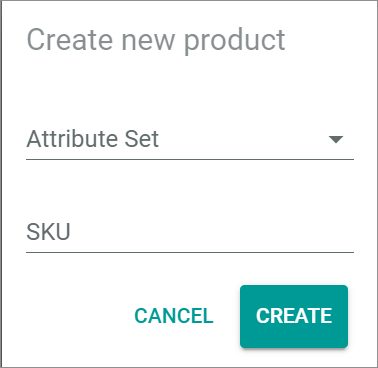
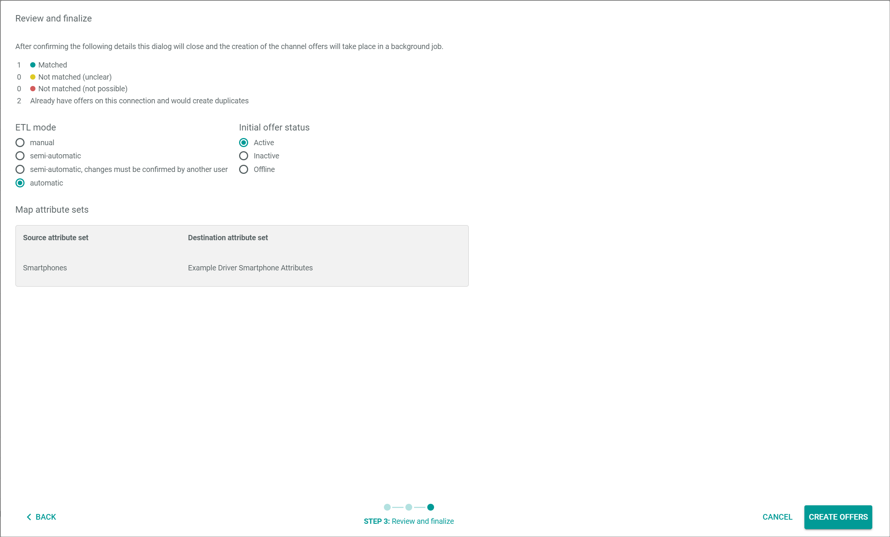
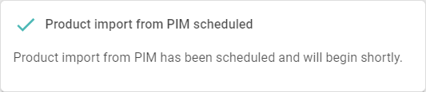
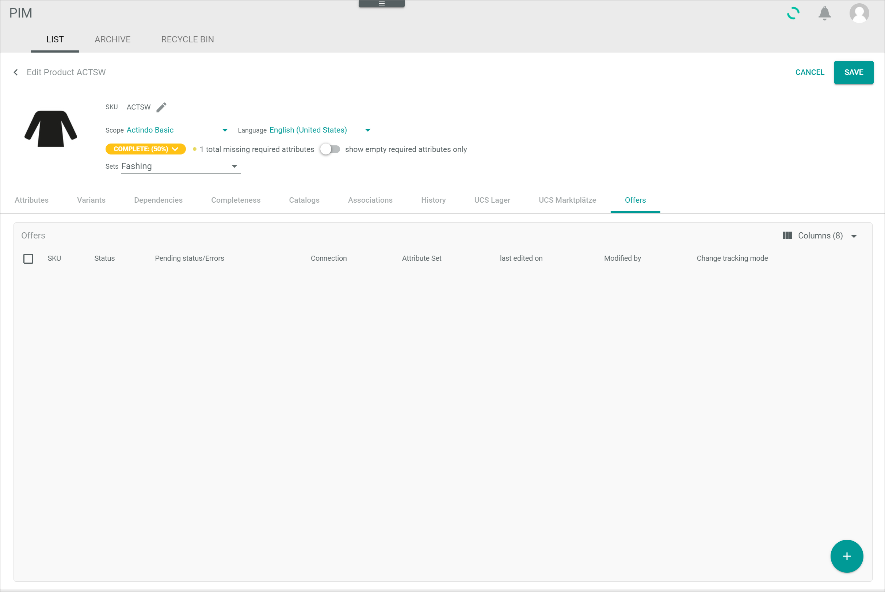
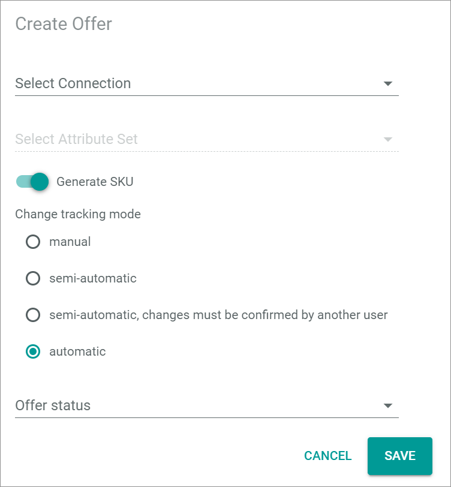

[!!Select an offer](../Operation/02_SelectOffer.md)
[!!Edit the bill list](../Operation/03_EditBillList.md)
[!!Complete a purchase](../Operation/04_CompletePurchase.md)
[!!Manage the POS order process](../Operation/06_ManageOrderProcess.md)
[!!User interface Mapping from PIM](../UserInterface/02c_MappingFromPIM.md)
[!!User interface Omni-Channel Offers](../../Channels/UserInterface/02a_Offers.md)
[!!User interface DataHub Attributes](../../DataHub/UserInterface/02a_Attributes.md)
[!!User interface PIM List](../../PIM/UserInterface/02a_List.md)

# Manage offers for POS

To to offer products in Venduo POS, it is recommended to create the products in advance and create the corresponding offers afterwards in order to be able to distribute them properly in the system.

## Create products for POS

To create an offer for POS, it is recommended to create products for which you can make an offer.

#### Prerequisites

No prerequisites to fulfill.

#### Procedure

*PIM > Products > Tab LIST*

1. Click the  (Add) button in the bottom right corner.   
    The *Create new product* window is displayed.

   

2. Click the *Select product type* drop-down list and select the appropriate product type.

    > [Info] If you have not created a new product type, the only available product type is **PIM Basic Product**.   
    For detailed information on how to create a product type for POS, see [Create a product type](#create-a-product-type).

3. Enter a SKU in the *SKU* field.

    > [Info] The SKU (Stock Keeping Unit) is an identification number for the product. Therefore, it has to be uniquely assigned to a single product and should not be changed once assigned.

4. Click the button [CREATE] in the bottom right corner.   
    The *Create new product* window is closed. The *Create product* view is displayed in the *List* tab. The *Attributes* sub-tab is preselected.

   

5. Enter the product data in the fields of the *Attributes* sub-tab. You must at least enter a product name, a price and a tax class.

    > [Info] If you want to create a variant to the master product, you have to specify it in the *Variants* tab.   
    For detailed information on how to create a variant, see [Create variants](../../PIM/Operation/02_ManageVariants.md#create-variants).

6. Click the button [SAVE] in the upper right corner.   
    The new product is saved. The *Create product* view is closed. The *List* tab with the new product in the product list is displayed.

## Create a product type

To improve the product classification, you can create a product type and use it in POS.   
For detailed information on how to create a product type, see [Create a product type](../../PIM/Integration/02_ManageAttributeSets.md#create-an-attribute-set).

## Map a new product type in POS

When a new product type is created, it must be mapped before offers with this product type can be created for the POS.

#### Prerequisites

At least one new product type has been created, see [Create a product type](../../PIM/Integration/02_ManageAttributeSets.md#create-an-attribute-set).

#### Procedure

*Venduo POS > Management > Tab MAPPING FROM PIM*

1. Click the  (Refresh) button in the upper right corner.   
    All not mapped PIM product types are displayed in the list.

    

2. Select the checkboxes of the product types you want to map.   
A toolbar is displayed at the bottom.

3. Click the [CREATE MAPPINGS] button in the toolbar.    
The selected mappings are removed from the list when the mappings are created.

## Create an offer for POS

Create an offer in the *Omni-Channel* module or the *PIM* module so you can offer and select the products in the *Venduo POS* store.

### Create an offer from a PIM product in Omni-Channel

You can create an offer from a PIM product in the *Omni-Channel* module if the corresponding offer exists in the *PIM* module.

#### Prerequisites

At least one product has been created, see [Create products for POS](#create-products-for-pos).

#### Procedure

*Omni-Channel > Offers > Tab OFFERS*

1. Click the  (Add) button in the bottom right corner.   
    The  (Manual offer) button and the  (create from PIM product) button are displayed.

    > [Info] If the product you want to create an offer for exists in PIM, it is recommended to create the offer from the PIM product instead of creating a manual offer.

2. Click the  (create from PIM product) button to create an offer from a PIM product.   
    The *Select marketplace* wizard window is displayed.

    

3. Configure the following settings:

    + Select one of the radio buttons:   
        -  *All products*   
            Offers for all existing PIM products are created.   
        -  *Select products*   
            Select manually the products you want to create an offer for.     

    + Select the marketplace for which you want to create the offers in the *Connection* drop-down list, for instance the appropriate POS Store.

        > [Info] A POS Store is handled like a marketplace in Omni-Channel.

    + Activate the *Do not create duplicates* toggle to automatically exclude offers that already exist from the creation process.  

        > [Info] Be aware that, if you deactivate the *Do not create duplicates* toggle, existing offers are created again, an automatically generated SKU is assigned to them and they exist in addition to the original offers.

4. Click the button [CONTINUE] in the bottom right corner.    
    If you have selected the *All products* radio button, continue with step **8**.   
    If you have selected the *Select products* radio button, the *Select products* wizard window is displayed.

    

5. Select the checkboxes of all products to which you want to create an offer for.   
    A toolbar is displayed above the product list.

6. Click the [ADD TO SELECTION >] button in the toolbar.   
    The selected products are added to the *Add to selection products* section on the right side of the wizard window.

7. Click the [CONTINUE] button in the upper right corner.   
    The *Review and finalize* wizard window is displayed.

    

8. Configure the following settings:

    + Select one of the radio buttons for the *ETL mode* section:   
        -  *Manual*   
            Changes in a PIM product must be triggered manually to be applied to the offer.   
        -  *Semiautomatic*   
            Changes in a PIM product are automatically applied to the offer after confirmation. 
        -  *Semiautomatic, changes must be confirmed by another user*   
            Changes in a PIM product are automatically applied to the offer after confirmation by another user. 
        -  *Automatic*   
            Changes in a PIM product are automatically applied to the offer.

    + Select one of the radio buttons for the *Initial offer status* section:   
        -  *Active*   
            The offer is active. It is displayed on the marketplace and can be sold there.   
        -  *Inactive*   
            The offer is inactive. It is not displayed on the marketplace and cannot be sold there.   
        -  *Offline*   
            The offer is unknown to the marketplace and therefore cannot be sold there.

[comment]: <> (Note for reuse: In case of webshops the procedure can be little bit more complicated because there are potential conflicts to be resolved)

9. Click the button [CREATE OFFERS] in the upper right corner.   
    The *Product import from PIM scheduled* message is displayed. The offers will be created. The creation process starts asynchronously, so that it may take some time until the offer creation starts.

    

    > [Info] It may take some time until all offers are created. Click the  (Refresh) button in the upper right corner to update the offer list.

### Create a manual offer in Omni-Channel

You can create a manual offer in the *Omni-Channel* module for all products regardless of whether they exist in the *PIM* module or not.

#### Prerequisites

At least one product has been created, see [Create products for POS](#create-products-for-pos).

#### Procedure

*Omni-Channel > Offers > Tab OFFERS*

1. Click the  (Add) button in the bottom right corner.   
    The  (Manual offer) button and the  (Create from PIM product) button are displayed.

    > [Info] If the product you want to create an offer for exists in PIM, it is recommended to create the [offer from the PIM product](#create-an-offer-from-a-pim-product-in-Omni-Channel) instead of creating a manual offer.

2. Click the  (Manual offer) button to create a manual offer.   
   The *Create offer* window is displayed.

    

3. Enter a SKU in the *SKU* field.

    > [Info] The SKU (Stock Keeping Unit) is an identification number for the product. Therefore, it has to be uniquely assigned to a single product and should not be changed once assigned.

4. Click the *Select connection* drop-down list and select the marketplace for which you want to create the offers, for instance the appropriate POS Store.   
    The *Select attribute set* drop-down list is unlocked.

5. Click the *Select attribute set* drop-down list and select the appropriate attribute set for the offer.

6. Click the [SAVE] button in the bottom right corner of the *Create offer* window.   
    The *Create offer* window is closed. The *Create offer* view is displayed. The *Attributes* tab is preselected.

    

7. Enter the product data in the fields of the *Attributes* tab. You must at least enter a product name, an EAN code, a price, a tax class and a tax rate.

    > [Info] If you want to create a variant to the master product, you have to specify it in the *Variants* tab.   
    For detailed information on how to create a variant, see [Create variants](../../PIM/Operation/02_ManageVariants.md#create-variants).

8. Click the [SAVE] button in the upper right corner.   
    The new offer is created. The *Create offer* view is closed. The *Offers* tab with the new offer in the offer list is displayed.

    > [Info] By default, the initial offer status of the new offer is **Not available**. You have to activate the offer to sell it on the marketplace, see [Activate a POS offer](#activate-a-pos-offer).

### Create a single channel offer in PIM

You can create an offer for a single channel to the selected product in the *PIM* module.

#### Prerequisites

At least one product has been created, see [Create products for POS](#create-products-for-pos).

#### Procedure

*PIM > Products > Tab LIST*

1. Click the product you want to create an offer to in the product list.    
    The *Edit product* view is displayed.

2. Click the *Offers* tab.   
    The *Offers* tab with a list of all existing offers of the product in all channels is displayed.

    

3. Click the  (Add) button in the bottom right corner.   
    The  (Single Channel) button and the  (Multiple Channels) button are displayed.

4. Click the  (Single Channel) button to create an offer from the selected PIM product to a single channel.   
    The *Create channels offer* window is displayed.

    

5. Configure the following settings:

    + Select the marketplace for which you want to create the offers in the *Connection* drop-down list, for instance the appropriate POS Store.   
    The *Select attribute set* drop-down list is unlocked.

    + Select the appropriate attribute set for the offer in the *Select attribute set* drop-down list.

    + Activate the toggle to automatically generate a SKU for the product in the offer.   

    + Select one of the radio buttons for the ETL mode:   
        -  *Manual*   
            Changes in a PIM product must be triggered manually to be applied to the offer.   
        -  *Semiautomatic*   
            Changes in a PIM product are automatically applied to the offer after confirmation. 
        -  *Semiautomatic, changes must be confirmed by another user*   
            Changes in a PIM product are automatically applied to the offer after confirmation by another user. 
        -  *Automatic*   
            Changes in a PIM product are automatically applied to the offer.

    + Select the initial offer status in the *Status* drop-down list:   
        - **Active**   
            The offer is active. It is displayed on the marketplace and can be sold there.   
        - **Inactive**   
            The offer is inactive. It is not displayed on the marketplace and cannot be sold there.   
        - **Offline**   
            The offer is unknown to the marketplace and therefore cannot be sold there.   

6. Click the button [SAVE] in the bottom right corner of the *Create channels offer* window.   
    The new offer will be created. The *Create channels offer* window is closed. The *Offers* tab with the new offer in the *Channel offers* list is displayed.

    > [Info] It may take some time until the channel offer is created.

7. Click the button [SAVE] in the upper right corner.   
    The *Edit product* view is closed. The *LIST* tab with the product list is displayed again.

### Create a multiple channels offer in PIM

You can create an offer for multiple channels to the selected product in the *PIM* module.

#### Prerequisites

At least one product has been created, see [Create products for POS](#create-products-for-pos).

#### Procedure

*PIM > Products > Tab LIST*

1. Click the product you want to create an offer to in the product list.    
    The *Edit product* view is displayed.

2. Click the *Offers* tab.   
    The *Offers* tab with a list of all existing offers of the product in all channels is displayed.

    

3. Click the  (Add) button in the bottom right corner.   
    The  (Single Channel) button and the  (Multiple Channels) button are displayed.

4. Click the  (Multiple Channels) button to create an offer from the selected PIM product to multiple channels.   
    The *Select channels and status* wizard window is displayed.

    

5. Configure the following settings:

    + Select the initial offer status in the *Status* drop-down list:
        - **Active**   
            The offer is active. It is displayed on the marketplace and can be sold there.   
        - **Inactive**   
            The offer is inactive. It is not displayed on the marketplace and cannot be sold there.   
        - **Offline**   
            The offer is unknown to the marketplace and therefore cannot be sold there.   

    + Select one of the radio buttons for the ETL mode:   
        -  *Manual*   
            Changes in a PIM product must be triggered manually to be applied to the offer.   
        -  *Semiautomatic*   
            Changes in a PIM product are automatically applied to the offer after confirmation. 
        -  *Semiautomatic, changes must be confirmed by another user*   
            Changes in a PIM product are automatically applied to the offer after confirmation by another user. 
        -  *Automatic*   
            Changes in a PIM product are automatically applied to the offer.
         
    + Activate the toggles of the marketplaces for which you want to create the offers in the *Select connections* section. If you want to create an offer for all channels, click the [SELECT ALL] button to activate all toggles.

6. Click the [FINISH] button in the bottom right corner of the window.   
  The *Select destination attribute sets* wizard window is displayed.

    

    > [Info] The attribute destination sets for the selected channels are automatically selected. You cannot edit the selection.

[comment]: <> (Is that correct? Why does this window exist when I cannot make any changes?)

7. Click the [FINISH] button in the upper right corner of the window.   
    The new offers will be created. The *Select destination attribute sets* wizard window is closed. The *Offers* tab with the new offers in the *Channel offers* list is displayed.

    > [Info] It may take some time until the channel offer is created.

8. Click the [SAVE] button in the upper right corner.   
The *Edit product* view is closed. The *LIST* tab with the product list is displayed again.

## Activate a POS offer

An offer has to be active so that it is displayed in the selected marketplace and can be sold there.

#### Prerequisites

At least one offer has been created, see [Create an offer for POS](#create-an-offer-for-pos).

#### Procedure

*Omni-Channel > Offers > Tab OFFERS*

1. Select the checkboxes of the offers you want to activate.   
    A toolbar is displayed above the offer list.

2. Click the *Change status to* drop-down list  in the right side of the toolbar and select the **Active** option.   
    The **Active** status is displayed in the *Pending status/Errors* column of the selected offers.    

    

    When the offers are active, the status in the *Pending status/Errors* column is no longer displayed, but the status in the *Status* column has changed to **Active**.

    > [Info] It may take some time until all offers are activated. Click the  (Refresh) button in the upper right corner to update the offer list.

## Create a QuickSelect category

Create a QuickSelect category for POS for faster access to favorite products.

### Define a QuickSelect attribute

When creating a POS store, a QuickSelect attribute is automatically created in the *DataHub* module. Define the QuickSelect attribute to specify the different QuickSelect elements for a *Venduo POS* offer.

#### Prerequisites

No prerequisites to fulfill.

#### Procedure

*DataHub > Settings > Tab ATTRIBUTES*

1. Enter **QuickSelect** in the search bar and click the  (Search) button.   
  The matching attributes are displayed in the attributes list.

2. Click the appropriate *QuickSelect Category* attribute in the attributes list.  
    The *Edit attribute* view is diplayed.

    

3. Scroll down to the *CONFIGURATION* section and click the  (Add) button in the bottom right corner of the *Edit tree* table.
    A plus sign is displayed in the left column of the *Edit tree* table.

    

4. Click the plus sign in the left column of the *Edit tree* table.   
    The *Add element* window is displayed.

    

5. Enter a name in the *Name* field.

    > [Info] The entered name equals the name of the QuickSelect element that will be displayed in Venduo POS.

6. If desired, enter a key in the *Key* field.

    > [Info] By entering a key, you can define an icon for the QuickSelect element.   
    For detailed information on the icon list, see [QuickSelect Icon List](to_be_completed).

[comment]: <> (Add list of icon keys for Quickselect)

7. Click the [SAVE] button in the bottom right corner of the *Add element* window.   
    The *Add element* window is closed. The element is displayed in the left column of the *Edit tree* table.

    > [Info] If you want to create further QuickSelect elements, repeat step **3** to **6**.

8. Click the button [SAVE] in the upper right corner.   
    The *Edit attribute* view is closed. The QuickSelect element is saved.

9. Press the **F5** key to initialize the *Core1 Platform*.

### Assign the QuickSelect attribute

A product is assigned to a certain QuickSelect Category when you assign the created QuickSelect elements to the corresponding product offer.

#### Prerequisites

- At least one QuickSelect attribute has been created, see [Create a QuickSelect attribute](#create-a-quickselect-attribute).
- At least one offer is for *Venduo POS*, see [Create an offer for POS](#create-an-offer-for-pos).

#### Procedure
*Omni-Channel > Offers > Tab OFFERS*

1. Click the offer you want to create the QuickSelect element to.   
    The *Edit offer* view of the selected offer is displayed. The *Attributes* tab is preselected.

    

2. Scroll down in the *Attribute* tab and select the QuickSelect element in the *QuickSelect Category* drop-down list.

3. Click the [SAVE] button in the upper right corner.    
    The *Edit offer* view is closed. The offer with the QuickSelect element is saved.

> [Info] You have to repeat this procedure for each offer you want to assign the QuickSelect Category to.

[comment]: <> (Is there an alternative to manually assign each offer?)
[comment]: <> (JULIAN: Hier könnten man noch unterbringen wie man zusätzliche Felder mapped aus PIM raus oder Felder aus Omni-Channel ins PIM übernimmt)

## Create a voucher

If you want to sell vouchers in your POS system, you have to create them first.

### Create a voucher product

To create a voucher, you need to create a product that you can define as a voucher.

#### Prerequisites

No prerequisites to fulfill.

#### Procedure

*PIM > Products > Tab LIST*

1. Click the  (Add) button in the bottom right corner.   
    The *Create new product* window is displayed.

    

2. Click the *Select product type* drop-down list and select the appropriate product type.

    > [Info] If you have not created a new product type, the only available product type is **PIM Basic Data**.   
    For detailed information on how to create a product type for POS, see [Create a product type](#create-a-product-type).

3. Enter a SKU in the *SKU* field, for instance **Voucher**.

    > [Info] The SKU (Stock Keeping Unit) is an identification number for the product. Therefore, it has to be uniquely assigned to a single product and should not be changed once assigned.

4. Click the button [CREATE] in the bottom right corner of the *Create new product* window.   
    The *Create new product* window is closed. The *Create product* view is displayed in the *List* tab. The *Attributes* tab is preselected.

    

5. Enter the product data in the fields of the *Attributes* tab. You must at least enter a product name, a price and a tax class.

6. Click the button [SAVE] in the upper right corner.   
    The new product is saved. The *Create product* view is closed. The *List* tab with the new product in the product list is displayed.

7. Create an offer for the voucher product, see [Create an offer for POS](#create-an-offer-for-pos).

### Define the voucher setting

You need to define the created product as a voucher to use it in the *Venduo POS* store.

#### Prerequisites

At least one product to be defined as a voucher has been created, see [Create a voucher product](#create-a-voucher-product).

#### Procedure

*Omni-Channel > Offers > Tab OFFERS*

1. Click the offer to the voucher.   
    The *Edit offer* view is displayed. The *Attributes* tab is preselected.

    

2. Scroll down in the attributes and enable the *Voucher* toggle.

3. Click the [SAVE] button in the upper right corner.
The voucher is saved. The *Edit offer* view is closed.

    > [Info] When a voucher-offer is sold, a voucher code is created and printed on the receipt. The value of the voucher corresponds to the price of the voucher before discounts are applied.
