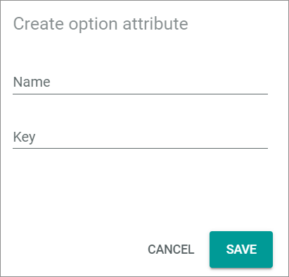
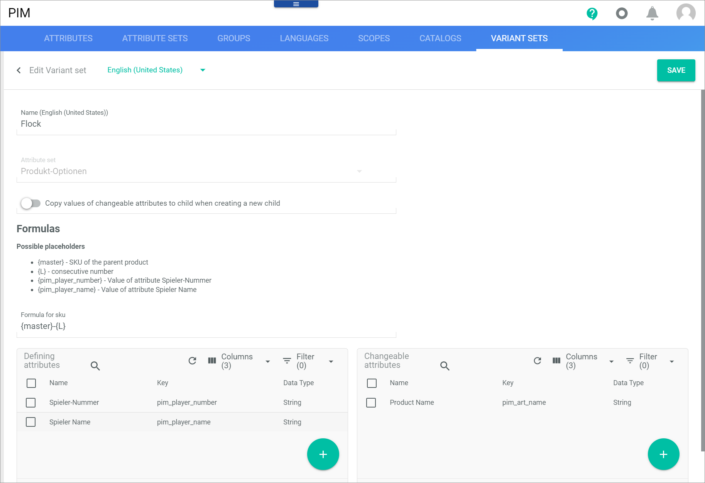
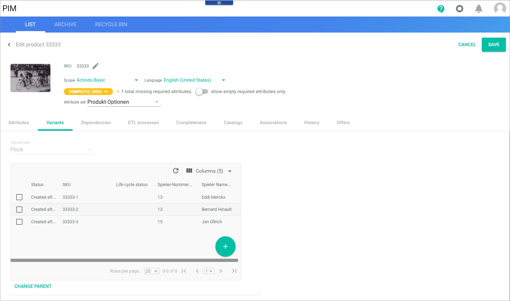

# Manage the product options

You may want to combine additional services with an offer. If your store has the appropriate technical capabilities, you may want to offer shirts with an optional flocking, or photos with an optional printing on mugs and other objects. In these cases, a specific service is associated to an offer that is called product option. From a technical point of view, you have to associate a product or service to an existing product.  
It is also possible to add additional text to a product option that the cashiers can enter manually or select via a drop-down list, see [Add additional attributes](#add-additional-attributes).

For detailed information on how the product options are handled at the cashpoint, see [Add a product option](../Operation/02_SelectOffer.md#add-a-product-option).

## Define a product option

Define a product option that describes the additional service to an offer, for example, photo print or flocking.

#### Prerequisites

No prerequisites to fulfill.

#### Procedure

*Venduo POS > Management > Tab PRODUCT OPTIONS*

1. Click the  (Add) button in the bottom right corner.   
    The *Create option attribute* window is opened.

    

2. Enter a name for the product option in the *Name* field.

3. Enter a unique key for the product option in the *Key* field.

4. Click the [SAVE] button.    
    The new attribute is saved. It is automatically saved in the *DataHub* module with the *Related offers* data type and is added to the *POS basic set* attribute set. Since the *POS basic set* attribute set is inherited automatically to the *Set for POS Store ("Name of the store")* attribute sets for your POS offers, it is also available for each store.

5. If desired, add additional product options.

## Create a product for product option

Create a product which describes the additional service, for example the logo to be printed on a shirt or a cup.

#### Prerequisites
No prerequisites to fulfill.

#### Procedure

1. Create the product. For detailed information on creating a product, see [Create a product](../../PIM/Operation/01_ManageProducts.md#create-a-product) in the *PIM* documentation.   
    When creating the product for the product option, do the following:
    - Assign the product to the *Product options* attribute set.

2. Transfer this product to the *Omni-Channel* module. It is recommended to do this individually for each product option product, so that you can assign the new offer directly to the correct attribute set. For detailed information, see [Create an offer from a PIM product](../../Channels/Operation/01_ManageOffers.md#create-an-offer-from-a-pim-product).    
    When creating the offer from a PIM product, note the following:
    - In the *Connection* drop-down list, select the store for which you want to offer the product option product.
    - Assign the product option product directly to the *Offer option set for POS store "Name of the store"* in the *Map attribute sets* section of the "Review and finalize" wizard step.

        *Omni-Channel > Offers > Button ADD > Select product option product > Wizard step 3*

        

## Associate the product option with offer

Associate the product option product with the offers for which you want to offer the additional service, for example a shirt or cup. Because the additional service may only apply to certain stores, the association is made to the Omni-Channel offer.     

#### Prerequisites

- The product option product has been created and transferred to the *Omni-Channel* module.
- The product with which the product option product is to be associated has been created and transferred to the *Omni-Channel* module. 

#### Procedure

*Omni-Channel > Offers*

1. Select the desired connection respectively the desired store in the *All connections* drop-down list.    
    A list of all offers in the desired store is displayed.

2. Select the offer with which you want to associate the product option offer. If applicable, select the master offer so that the product option association is inherited by all variants of the master offer.   
    The *Edit offer "SKU"* view is displayed. The *Attributes* tab is preselected by default. Only the *Unassigned* group is available.

    

3. Scroll down the *Unassigned group* until you reach the product option to which you want to assign the offer you have created as product option.   
    The product option is displayed as a gray box.

    

4. Click the [ADD] button in the top right corner of the product option box.   
    The *Filter list of products* window is displayed.

    

5. Click the (Refresh) button in the top right corner.   
    A list of all offers available in the store is displayed.

6. Click the checkbox of the desired offer previously created as product option offer.   
    The editing toolbar is displayed.

7. Click the [SAVE] button in the top right corner of the *Filter list of products* window.   
    The *Edit offer "SKU"* view is displayed.  

8. Click the [SAVE] button in the top right corner of the *Edit offer "SKU"* view.   
    The product option offer is now associated to an offer of your store. When a cashier selects this offer during the sales process, the *Choose options* window will be displayed.

    *Venduo POS > Sales > Select store and pay desk > Tab CASHPOINT > Select offer associated with a product option*

    

## Add additional attributes

You may want to add additional text to a product option that the cashiers can enter manually or select via a drop-down list. You have the following options: 

- Add individual text:   
    You might want to offer to print a text on a shirt or a cup. In this case, you must create one or more attributes, in which the cashiers can enter a text. For detailed information, see [Add additional text attributes](#add-additional-text-attributes).

- Define texts with predefined values   
    You may want to offer to print a predefined text on a shirt or a cup such as a printing of the names of famous athletes with their club player number. In this case, you must create variants to the product option product, which the cashiers can then easily select with a drop-down list. For detailed information, see [Add predefined text options](#add-predefined-text-options).

### Add attributes for individual texts

Add additional text attributes with which the cashier can input an individual text to be printed on a shirt or a cup.

#### Prerequisites

No prerequisites to fulfill.

#### Procedure

1. In the *PIM* module under *Settings > Attributes*, create the additional attributes you require. For detailed information, see [Create an attribute](../../PIM/Integration/01_ManageAttributes.md#create-an-attribute) in the *PIM* documentation. 
    - Use a key that starts with **pim_** to indicate that the attributes are product-related. 
    - Assign the *String* data type to the attributes.
    - Assign the attribute to the *Product options* attribute set.

2.  In the *DataHub* module under *Data model > Attribute sets*, assign the attributes to the following attribute sets:
    - *Offer option set for POS store "Name of the store"* for all stores in which you want to offer the product option.
   
    For detailed information, see [Add an attribute to the set](../../DataHub/Integration/02_ManageAttributeSets.md#add-an-attribute-to-the-set) in the *DataHub* documentation.

### Add predefined text options

Create attributes with which you can specify predefined texts that the cashier can select with a drop-down list. You need these attributes to specify the variants of the product option product.

#### Prerequisites

No prerequisites to fulfill.

#### Procedure

1. In the *PIM* module under *Settings > Tab Attributes*, create the additional attributes you require. This means, create an attribute in which you can enter a text for the variants to be created. For detailed information, see [Create an attribute](../../PIM/Integration/01_ManageAttributes.md) in the *PIM* documentation. 
    - Use a key that starts with **pim_** to indicate that the attributes are product-related. 
    - Assign the *String* data type to the attributes.
    - Assign the attributes to the *Product options* attribute set.

2. In the *PIM* module under *Settings > Tab Variant sets*, create a variant set with these attributes. For detailed information, see [Manage a variant set](../../PIM/Integration/07_ManageVariantSets.md) in the *PIM* documentation.   
    - Assign the variant set to the *Product options* attribute set.
    - Assign the previously created attributes as defining attributes.
    - Assign the *pim_art_name* (Product name) attribute as changing attribute.   

        

3. In the *PIM* module under *Products > Tab List*, create variants of your product option product. By doing it, use the *Add single variant* option. For detailed information, see [Create a single variant](../../PIM/Operation/02_ManageVariants.md#create-a-single-variant) in the *PIM* documentation.   
    
4. Assign the previously under step 2 created variant set in the *Variant set* field. 
    

5. Click the ADD button.   
    The *Add single variant* window is displayed. The attributes you have previously created are part of the variant definition. You can enter individual text that will be displayed later as a drop-down list when you select the product option product.

    
 
6. Transfer the variants to the *Omni-Channel* module.