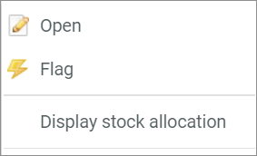

[!!Configure the warehouse for POS](./01_ConfigureWarehouse.md)

[comment]: <> (add link to Warehouse if available)
<!---Marina, kannst Du hier gucken wegen Terminologie,ob es das so überhaupt noch gibt und ob man links setzen kann?-->
# Manage the POS warehouse

Manage the warehouse settings to assign one or more specific warehouses to the POS from which the stock is taken from and posted. The warehouse specifies where exactly the stock is taken from when a product is sold.

## Check the stock allocation

Check if the stock allocation is correctly configured so that the store stock is correctly assigned to the warehouse. The stock source specifies how the stock available in the POS system is calculated. In most cases, the stock source and the warehouse are identical, but they can also differ.   

#### Prerequisites

- A POS store is created, see [Create a store via wizard](./06_CreateStore.md#create-a-store-in-pos-using-the-wizard) or [Create a store manually](./06a_CreateStoreManually.md#create-a-pos-store-manually).
- The stock allocation is configured, see [Configure the stock allocation](./06a_CreateStoreManually.md#configure-the-stock-allocation).

#### Procedure

*Warehouse > Settings > Tab WAREHOUSE > Tab Stock allocation*

1.  Search for the target channel of the appropriate POS store in the *Target channel* column and check the settings in the corresponding row.

2. If necessary, edit the settings as described in the following:

    + Select the **Calculation, stock** option in the drop-down list in the *Stock calculation* column.   
        The fields in the warehouse columns are unlocked.

    + Double-click the option in a warehouse column to display the drop-down list.
    
    + Select the **Yes** option in the drop-down list to include the corresponding warehouse in the stock calculation or select the **No** option to exclude it.

    > [Info] Select for each warehouse whether it should be included or not.

3. Click the [SAVE] button in the bottom right corner.   
    The stock allocation is saved. The stock is calculated from all selected warehouses.

## Check the stock withdrawal matrix

Check if the stock withdrawal matrix is correctly configured so that a specific warehouse is assigned to a specific store in POS.

#### Prerequisites

- A POS store is created, see [Create a store via wizard](./06_CreateStore.md#create-a-store-in-pos-using-the-wizard) or [Create a store manually](./06a_CreateStoreManually.md#create-a-pos-store-manually).
- The stock withdrawal matrix is configured, see [Configure the stock withdrawal matrix](./06a_CreateStoreManually.md#configure-the-stock-withdrawal-matrix).

#### Procedure

*Warehouse > Settings > Tab WAREHOUSE > Tab Stock withdrawal matrix*

1. Search for the appropriate POS store in the column *Account* and check the settings in the corresponding row.   

2. If necessary, edit the settings as described in the following:

    + Select the option **--all--** in the drop-down list in the *Product group* column.

    + Select the output channel via which you want to create offers in the drop-down list in the *Marketplace* column.

    + Select the option **--all--** in the drop-down list in the *Sub-account* column.

    + Select the option **--all--** in the drop-down list in the *Shipping provider* column.

    + Select the warehouse from which you want to take the stock in the drop-down list in the *Warehouse* column.

3. Click the [SAVE ASSIGNMENTS] button in the bottom right corner.   
    The new assignment in the stock withdrawal matrix is saved.

## Manage the warehouse logistics for POS products

Manage the warehouse logistics for POS offers to ensure that these are active for warehousing.

#### Prerequisites

- A POS store is created, see [Create a store via wizard](./06_CreateStore.md#create-a-store-in-pos-using-the-wizard) or [Create a store manually](./06a_CreateStoreManually.md#create-a-pos-store-manually).
- A POS offer is created, see [Create an offer for POS](./07_ManageOffers.md#create-an-offer-for-pos).

#### Procedure

Activate the warehouse logistics for the POS offers. For detailed information, see [Activate the warehouse logistics for a product](../../RetailSuiteWarehousing/Integration/06_ActivateWarehouseLogistics.md) in the *Warehousing* documentation.

## Manage the stock for POS products

You can adjust the stock quantity of your POS products, for instance because of a stock, a purchasing or an ordering.

#### Prerequisites

- A POS store is created, see [Create a store via wizard](./06_CreateStore.md#create-a-store-in-pos-using-the-wizard) or [Create a store manually](./06a_CreateStoreManually.md#create-a-pos-store-manually).
- A POS offer is created, see [Create an offer for POS](./07_ManageOffers.md#create-an-offer-for-pos).
- The warehouse logistics for the POS article is active, see [Manage the warehouse logistics for POS products](#manage-the-warehouse-logistics-for-pos-products).
- A warehouse with a defined storage shelf is assigned to the POS product.

#### Procedure

*Warehouse > Quick Booking > Tab QUICK BOOKING > Tab Product list*

1.  Double-click the product in the product list that you want to check. Alternatively, first right-click the product and click then the **Open** entry in the displayed context menu.    

       

    The product details are displayed on several tabs below the product list. The *Basic data* tab is preselected.

    

2. Click the *Warehouse / Suppliers* tab.   
    The the *Warehouse / Suppliers* tab is displayed. The *Warehouse management* sub-tab is preselected.

    

    > [Info] Check if a warehouse is displayed in the *Storage locations* section. You can only change the stock for the POS article, if a warehouse is assigned.

3. Click the [ADD POSTING] button at the bottom of the *Stocks* section.   
    A window to enter the posting is displayed.

    

4. Configure the following settings:

    + Click the *Stock location* drop-down list and select the appropriate warehouse from which you want to adjust the stock.

    + Click the *Posting type* drop-down list and select the appropriate reason for the posting. The following options are available:
        - **Reservation**
        - **Sale**
        - **Order**
        - **Purchase**
        - **Stocktaking entry**
        - **Stock transfer**
        - **Return**
        - **Problem**
        - **Pre-reserve**

    + Enter the number by which the stock should be changed in the *Change* field.
        > [Info] For a stock increase, enter a positive number. For a stock decrease, enter a negative number with a minus sign as a prefix. In the right column of the window, the old stock and a preview of the new stock are displayed.  

    + If desired, select the date on which the stock change will be posted in the *Posting date* field. By default, the current date is preselected.

    + If desired, enter a comment in the *Comment* field.

5. Click the [SAVE & NEW] button in the bottom right corner of the window.   
    The window is closed. The new stock is displayed in the *Stocks* section.
