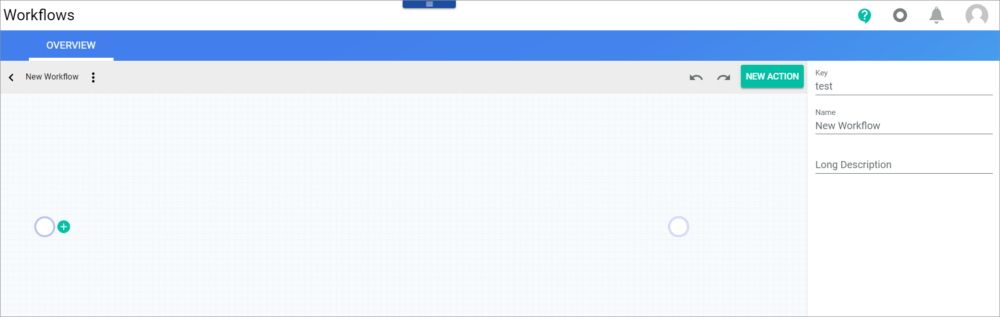
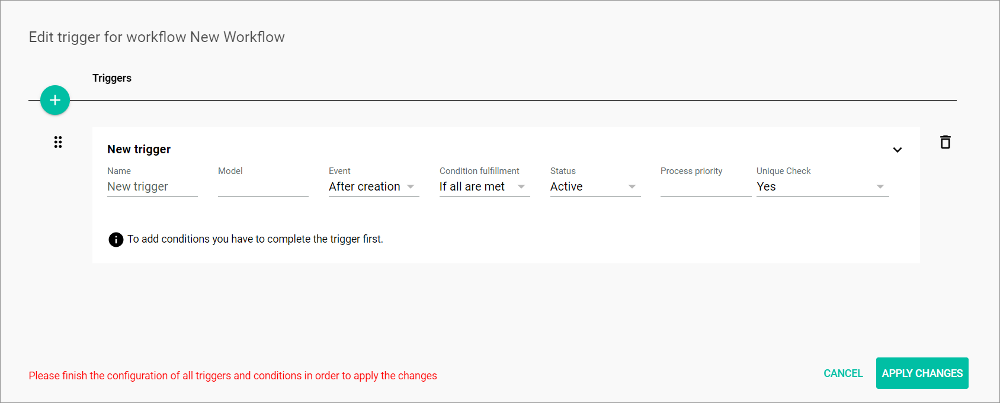

# Adjust workflows

To make payment data from the POS available to other modules such as the Accounting or the Order Management module, you need to add cash payment processing to your order workflow. In addition, non sales-related postings, such as cash in and cash out, must be processed by the workflow so that they can be posted in Accounting.

<!---Zu Info: Die Screenshot stammen teilweise aus der Workflow-Doku. Die überarbeiteten/aktualisierten  Screenshots sind dann verfügbar, wenn workflow 2 veröffentlicht ist--->

## Extend order workflow

Im order workflow hinzufügen -> ist Barrechnung? dann eine Entscheidng ja/ nein und eigenen Pfad und Sync Payment hinzufügen

## Synchronize cash journal

You need to transfer non sales-related POS postings such as cash ins and cash outs to the *Accounting* module or a third party application. To do this, you must synchronize the cash journal. A one-step workflow is suitable for this. For detailed information on workflows, see [Manage the workflows](../../ActindoWorkFlow/Operation/01_ManageWorkflows.md) in the *Process Orchestration* documentation.   
The following procedures describe step-for-step how to create the required workflow.

### Create synchronize cash journal workflow

Create the workflow needed to post non sales-related POS postings in the *Accounting* module

#### Prerequisites

- You have the required rights to edit a workflow.

#### Procedure

*Process Orchestration > Workflow > Add workflow*

1. Enter a name for the new workflow in the *Select a name for your new workflow* field.

3. Enter a unique key for the workflow in the *Select a unique key for your new workflow* field. The key is required for API access and must be unique within the workflow version.

4. Click the *Choose the data type of your start place* field and enter the **Modules.Actindo.POS.Models.JournalItem** data type, or enter a keyword you are searching for. If you want to add this one-step workflow to an existing workflow, you can add it by calling the **Actindo.Extensions.Actindo.UCSSyncPos.Workflows.addWorkflow** API end point.<!--Muss man dafür Start subprocess core action einfügen?>

5. Select the start place in the search result list. 

6. Click the *Choose the data type of your end place* field and enter **Modules.Actindo.POS.Models.JournalItem** or a keyword you are searching for. <!-- ist das der richtige End place data type?-->

7. Select the end place in the search result list.  

8. Click the [CREATE] button in the bottom right corner.   
    The new workflow has been created. The *New workflow* window is closed. The workflow editor with the defined start and end places is displayed.  

    

### Add a trigger

 Add a trigger to ensure that the workflow is started if cash ins, cash outs, or corrections to the opening or the closing floats have been posted. For detailed information, see [Manage the cash register](../Operation/05_ManageCashRegister.md).

#### Prerequisites

- The Sync cash journal workflow has been created.
- You have the required rights to edit a workflow.

#### Procedure

*Workflows > Workflows > Tab OVERVIEW > Select a workflow > Select a workflow version*

1. Click the  (Points) button in the upper left corner next to the workflow name.   
    The workflow context menu is displayed.

    

2. Click the *Triggers* menu entry.  
    The *Edit trigger for workflow "Workflow name"* window is displayed.

    

3. Click the  (Add) button to create a trigger.  
    A *New trigger* input line is displayed.

    

4. Enter a descriptive name for the trigger in the *Name* field, for example **Journal Item Created**.   
    The entered name is displayed above the trigger input line.

5. Enter **Actindo\Modules\Actindo\POS\Models\JournalItem** in the *Model* field.

6. Click the *Event* drop-down list and select **After creation**.

7. Click the *Condition fulfillment* drop-down list and select **IF any is met**.

8. Click the *Status* drop-down list and select **Active**.

9. Enter **1** in the Process priority field.

10. Click the *Unique check* drop-down list and select **Yes**.

    

11. Click the [Apply changes] button.
    The trigger has been saved. The *Edit trigger for workflow "Workflow name"* window is closed.

### Add the conditions 

Add the conditions that define the triggers that initiate the Sync cash journal workflow.

#### Prerequisites

- The Sync cash journal workflow has been created.
- You have the required rights to edit a workflow.

#### Procedure

*Workflows > Workflows > Tab OVERVIEW > Select a workflow > Select a workflow version > Button Points > Menu entry Triggers*

1. Click the  (Add) button in the *Conditions* section.  
    A new input line is displayed.

    

2. Click the *Prefix* drop-down list and select **entity.**.

3. Enter **type** in the *Property* field.

4. Click the *Operator* drop-down list and select **Equals**.

5. Enter **opening_diff** in the *Value* field. This is used to post differences in the opening float. 

6. Repeat step 1-4 and enter **close_diff** in the *Value* field. This is used to post differences in the closing float. 

7. Repeat step 1-4 and enter **cash-in** in the *Value* field. This is used to post cash ins.

8. Repeat step 1-4 and enter **cash-out** in the *Value* field. This is used to post cash outs.

    

9. Click the [APPLY CHANGES] button. 
    All changes have been saved. The *Edit trigger for workflow "Workflow name"* window is closed.

### Add a transition

#### Prerequisites

#### Procedure

*Workflows > Workflows > Tab OVERVIEW > Select workflow > Select workflow version*

1. Click the  (Add) button next to the place or click the [NEW ACTION] button on the right hand above the workflow editor.     
    A window to search for a transition is displayed.

    

2. Click the *Search for an action* field and enter the name **/Actindo.Extensions.Actindo.UCSSyncPos.JournalSync.syncJournalItem**.

    

3. Select the entry.
    The transition is added to the workflow.

    

4. Edit the label in the settings sidebar in the *Label* field, so that the name of the transition is shortened.

    

5. Connect the transition with the end place. To do this, click the  (Add) button of the *data* output port.
    A new place is added.

     

6. Select the new place and drag it on the end place.

     

7. Click the  (Points) button in the upper left corner next to the workflow name.   
    The workflow context menu is displayed.

    

8. Click the *Deploy* menu entry.   
    A confirmation message is displayed. The workflow is finalized and deployed.

