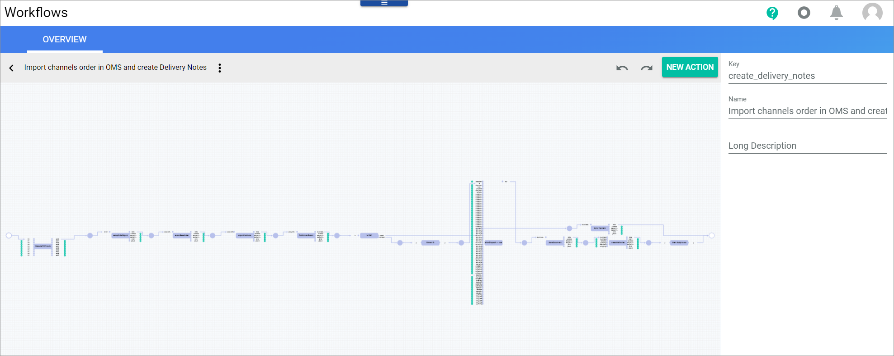
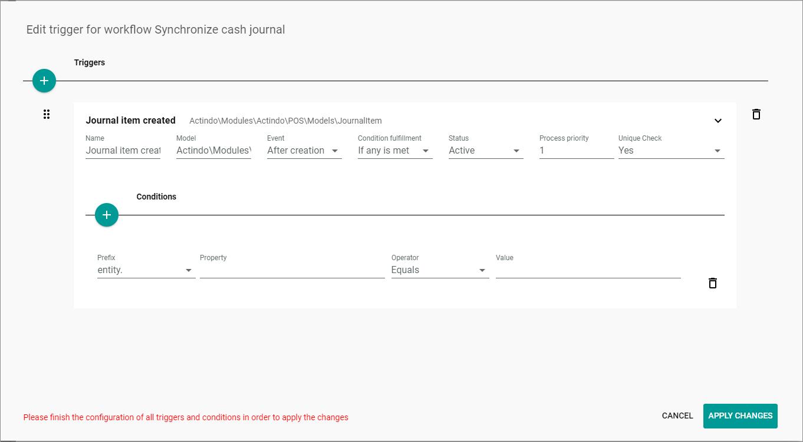
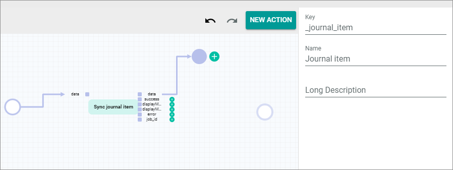

# Prepare workflows

To make payment data from the POS available to other modules such as the *Accounting* or the *Order Management* module, you need to add the business-document-related cash payments of this sales channel to your existing Import channels order in OMS workflow.  In addition, non-sales-related postings, such as cash in and cash out, must be processed by an additional workflow so that they can be posted in the *Accounting* module to a transit account.

The following describes in detail how to perform these two different operations by using workflows. For detailed information on workflow configuration, see also [Manage the workflows](../../ActindoWorkFlow/Operation/01_ManageWorkflows.md) in the *Process Orchestration* documentation. 

<!---Zu Info: Die Screenshot stammen teilweise aus der Workflow-Doku. Die überarbeiteten/aktualisierten  Screenshots sind dann verfügbar, wenn workflow 2 veröffentlicht ist--->

## Extend Import channels order in OMS workflow

Use your order workflow to transfer all sales-related POS postings to the *Order Management* and the *Accounting* module. 

The order workflow is used to post an order confirmation business document (RB) to the *Order Management* module. There, further processing is initiated, such as postings to the *Warehousing* and the *Accounting* modules. When using the *POS* module, the order confirmation generates an open item in the customer's account in the *Accounting* module. In order to clear this open item, a cash invoice business document (RB) must be created in addition. This is then used to post cash payments in the *Accounting* module. For this reason, you must extend your order workflow, so that the cash invoice business document is posted to the *Accounting* module.

The following procedures describe step-for-step how you can include the relevant processing for sales-related POS postings into your existing order workflow.

> [Info] The *Import channels order in OMS and create delivery note* workflow is available as example workflow in the standard. But because transitions of the *POS* module are not available in the standard, the processing is not part of this standard workflow.

### Split order confirmation and cash invoice processing

Include the necessary cash invoice processing in your Import channels order in OMS workflow. To do this, you must include a special processing for the cash invoice business document (RB).   
The following procedure shows how to include a workflow transition that separates the processing of the cash invoice business document from the processing of the order confirmation business document (AB).

#### Prerequisites

- You have the required rights to edit a workflow.
- Your customer-specific order workflow is already created.
- The *UCS Sync for POS* plugin is installed.

#### Procedure

*Process Orchestration > Workflow > Select order workflow > Select version*

1. Search for a suitable position for inserting the POS posting processing. For example, a suitable position is after the transition for finishing the order export. After that, the data of the cash invoice business document (RB) as well as the data of the order confirmation business document (AB) is available.

    

    It is now necessary to split the data, so that the processing of the cash invoice data relevant for accounting is separated from the processing of the order confirmation data relevant for order management.

2. Click the [NEW ACTION] button.  
    The *Search for an action* window is displayed.

    

3. Enter **Split** in the search field and select the **Split by criterion** entry.  
    The Split by criterion transition is added to your workflow configuration. For detailed information on this core action, see [Split by criterion](../../ActindoWorkFlow/UserInterface/08_CoreActions.md#split-by-criterion) in the *Process Orchestration* documentation.

    

4. Configure the Split by criterion transition.

    - Enter **Is RB?** in the *Label* field. Alternatively, you can choose any other label that clarifies the purpose of the transition.
    - Enter **type** in the *Path* field of the *Configuration section*.<!---In welchem API/Data Model finde ich das "Type" field?-->
    - Enter **=** in the *Operator* field.
    - Enter **"RB"** in the *Value* field. Do not miss the quotes.

    

5. Insert the Split by criterion transition into your workflow. To do this, create more space to insert the Is RB? transition into the flow by moving the previous and the following transitions. Tips:   
    - Move the start and end place, so that more free space is available.   
    - Move the places and transitions separately, so that an orderly overall picture is created.

6. Click the arc that connects the place after the *Finish order export* with the following transition and delete it.   
    The *Finish order export* transition is no longer connected to other transitions. An  (Add) button is available at the place connected to the output port of the transition. 

    

7. Drag the place connected to the input port of the *Is RB?* transition and drop it to the place connected to the output port of the *Finish order export* transition.

    

8. Join the *Is RB?* transition in the flow.

    

9. Connect the *noMatch* output port of the *Is RB?* transition with the following transition. To do this, click the relevant output port of the following transition.   
    A new place is created.

    

10. Drop and drag the place of the *noMatch* output port of the *Is RB?* transition on the newly created place.   
    The *Is RB?* transition is now part of your order workflow. The place of the *match* output port is not yet connected.

    

11. Continue with [Insert payment synchronization](#insert-payments-synchronization).

### Insert payments synchronization

Include a transition in your workflow that posts cash payments in the *Accounting* module or a third-party application.

#### Prerequisites
- You have the required rights to edit a workflow.
- The *UCS Sync for POS* plugin is installed.
- You have included a Split by criterion transition in your order workflow, see [Split order confirmation and cash invoice processing](#split-order-confirmation-and-cash-invoice-processing).

#### Procedure

*Process Orchestration > Workflow > Select order workflow > Select version*

1. Add a transition to the *match* output port of your *Is RB?* transition. The *match* output port contains the data of the cash invoice business document (RB). To do this, click the  (Add) button right to the place that is connected with the *match* output port.   
    The *Search for an action window* is displayed.

    

2. Search for the **/Actindo.Extensions.Actindo.UCSSyncPos.JournalSync.syncJournalItemByBusinessDocument** endpoint and select the entry.   
    The new transition is added.

3. Edit the label so that the transition is clearly labeled.

    

4. Connect the transition with the end place. To do this, drag the place connected with the *data* output port and drop it on the end place.    
    The transition is connected with the end place.
    
    

5. Click the  (Points) button in the upper left corner next to the workflow name.   
    The workflow context menu is displayed.

    

6. Select the *Deploy* entry.   
    A confirmation message is displayed. A new version of your order workflow has been created. You have finished the necessary order workflow adjustments for the POS integration.

## Synchronize cash journal

You need to transfer non-sales-related POS postings such as cash ins and cash outs to the *Accounting* module or a third-party application. To do this, you must synchronize the cash journal. A one-step workflow is suitable for this.   

The following procedures describe step-for-step how to create the required workflow.

### Create the Synchronize cash journal workflow

Create the workflow needed to post non-sales-related POS postings in the *Accounting* module.

#### Prerequisites

- You have the required rights to edit a workflow.
- The *UCS Sync for POS* plugin is installed.

#### Procedure

*Process Orchestration > Workflow > Add workflow*

1. Enter a name for the new workflow in the *Select a name for your new workflow* field.

3. Enter a unique key for the workflow in the *Select a unique key for your new workflow* field. The key is required for API access and must be unique within the workflow version.

4. Click the *Choose the data type of your start place* field and enter the **Modules.Actindo.POS.Models.JournalItem** data type. 
  
    > [Info] If you want to add this one-step workflow to an existing workflow, you can add it by calling the **Actindo.Extensions.Actindo.UCSSyncPos.Workflows.addWorkflow** API end point.<!---Muss man dafür Start subprocess core action einfügen?-->

5. Select the start place in the search result list. 

6. Click the *Choose the data type of your end place* field and enter **Modules.Actindo.POS.Models.JournalItem**. <!-- ist das der richtige End place data type?-->

7. Select the end place in the search result list.  

8. Click the [CREATE] button in the bottom right corner.   
    The new workflow has been created. The *New workflow* window is closed. The workflow editor with the defined start and end places is displayed.  

    

### Add a trigger

 Add a trigger to ensure that the workflow is started if cash ins, cash outs, or corrections to the opening or the closing floats have been posted. For detailed information on posting these objects, see [Manage the cash register](../Operation/05_ManageCashRegister.md).

#### Prerequisites

- The Synchronize cash journal workflow has been created, see [Create the Synchronize cash journal workflow](#create-the-synchronize-cash-journal-workflow).
- You have the required rights to edit a workflow.

#### Procedure

*Workflows > Workflows > Tab OVERVIEW > Select the Synchronize cash journal workflow > Select a workflow version*

1. Click the  (Points) button in the upper left corner next to the workflow name.   
    The workflow context menu is displayed.

    

2. Click the *Triggers* menu entry.  
    The *Edit trigger for workflow "Workflow name"* window is displayed.

    

3. Click the  (Add) button to create a trigger.  
    A *New trigger* input line is displayed.

    

4. Enter a descriptive name for the trigger in the *Name* field, for example **Journal Item Created**.   
    The entered name is displayed above the trigger input line.

5. Enter **Actindo\Modules\Actindo\POS\Models\JournalItem** in the *Model* field.

6. Click the *Event* drop-down list and select **After creation**.

7. Click the *Condition fulfillment* drop-down list and select **IF any is met**.

8. Click the *Status* drop-down list and select **Active**.

9. Enter **1** in the Process priority field.

10. Click the *Unique check* drop-down list and select **Yes**.

    

11. Click the [Apply changes] button.   
    The trigger has been saved. The *Edit trigger for workflow "Workflow name"* window is closed.

### Add the conditions 

Add the conditions that define the triggers that initiate the Synchronize cash journal workflow.

#### Prerequisites

- The Synchronize cash journal workflow has been created, see [Create the Synchronize cash journal workflow](#create-the-synchronize-cash-journal-workflow).
- You have the required rights to edit a workflow.

#### Procedure

*Workflows > Workflows > Tab OVERVIEW > Select the Synchronize cash journal workflow > Select a workflow version > Button Points > Menu entry Triggers*

1. Click the  (Add) button in the *Conditions* section.  
    A new input line is displayed.

    

2. Click the *Prefix* drop-down list and select **entity.**.

3. Enter **type** in the *Property* field.

4. Click the *Operator* drop-down list and select **Equals**.

5. Enter **opening_diff** in the *Value* field. This is used when differences in the opening float has been posted in the cash register. 

6. Repeat step 1-4 and enter **close_diff** in the *Value* field. This is used when differences in the closing float has been posted in the cash register. 

7. Repeat step 1-4 and enter **cash-in** in the *Value* field. This is used when cash ins has been posted in the cash register.

8. Repeat step 1-4 and enter **cash-out** in the *Value* field. This is used when cash outs have been posted in the cash register.

    

9. Click the [APPLY CHANGES] button.   
    All conditions have been saved. The *Edit trigger for workflow "Workflow name"* window is closed.

### Add a transition

Add a transition with which the synchronization of the non-sales-related POS postings is processed and postings for the *Accounting* are supplied. For this, the `/Actindo.Extensions.Actindo.UCSSyncPos.JournalSync.syncJournalItem` transition is available.

#### Prerequisites

- The Synchronize cash journal workflow has been created, see [Create the Synchronize cash journal workflow](#create-the-synchronize-cash-journal-workflow).
- You have the required rights to edit a workflow.

#### Procedure

*Workflows > Workflows > Tab OVERVIEW > Select the Synchronize cash journal workflow > Select workflow version*

1. Click the  (Add) button next to the start place.     
    A window to search for a transition is displayed.

    

2. Click the *Search for an action* field and enter the name **/Actindo.Extensions.Actindo.UCSSyncPos.JournalSync.syncJournalItem**.

    

3. Select the entry.
    The transition is added to the workflow.

    

4. Edit the label in the settings sidebar in the *Label* field, so that the name of the transition is shortened.

    

5. Connect the transition with the end place. To do this, click the  (Add) button of the *data* output port.   
    A new place is added.

     

6. Click the new place and drag and drop it on the end place.

     

7. Click the  (Points) button in the upper left corner next to the workflow name.   
    The workflow context menu is displayed.

    

8. Click the *Deploy* menu entry.   
    A confirmation message is displayed. The workflow is finalized and deployed.

