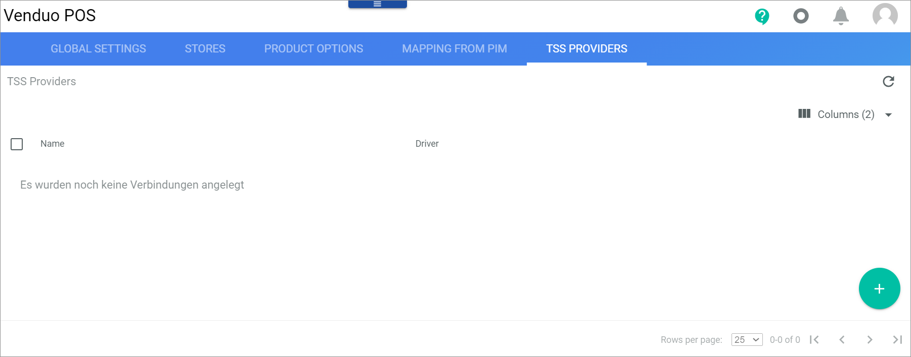

# Create a connection to a TSS provider
<!---Error-->

In Germany, the Kassensicherungsverordnung (KassenSichV) is an ordinance that define the technical requirements for electronic recording and security systems in business transactions. It enforces that merchants record all transactions in a non-manipulable manner.   
The TSS (Technical security system) must fulfill certain requirements and needs certification. It must generate certain data like a sequence number, digital signing, and much more. This information must be either printed on the receipt in a human-readable form or be encoded in a QR code that can be scanned to reveal the information.   
Actindo currently works with fiskaly&trade;, which is a cloud provider for TSS. It allows to register the transactions via API calls after everything is set up. Actindo has the license to fiskaly&trade; and a master account. Each Actindo customer receives a subaccount of it. Each subaccount can have multiple TSS', for example, for each location one TSS. In turn, each TSS can have multiple clients that correspond to the paydesks.

Create a connection to your subaccount of the fiskaly&trade; Actindo master account. Usually you have only one TSS connection. It might be useful to have more than one TSS connection, if you have stores in different countries.

#### Prerequisites

- The *Fiskaly Cloud* plugin as of version 1.0.1 is installed.
- The *Global Driver Management* plugin as of version xxx is installed. <!---Stimmt das?-->
- You have got the credentials of your fiskaly&trade; subaccount from Actindo.

#### Procedure

*Venduo POS > Management > Tab TSS PROVIDERS*

1.  Click the  (Add) button in the bottom right corner.   
    The *Create Connection* view is displayed.  

    

2. Select *Fiskaly* in the *Driver* drop-down list.   
    The *Credentials* section is displayed.

     

3. Enter the API key you have got for your subaccount from Actindo in the *API-Key* field.   

4. Enter the API secret your have got for your subaccount from Actindo in the *API secret* field.

5. Click the [SAVE] button.    
    The connection has been created.

## Assign the TSS provider connection to the stores

Assign the TSS provider connection to each of your stores. In most cases it might be the same connection for each. If you have stores in different countries, it might be necessary to have different TSS provider connections for each country.

For detailed information, see [Configure the store details](./06a_CreateStoreManually.md#configure-the-store-details).

