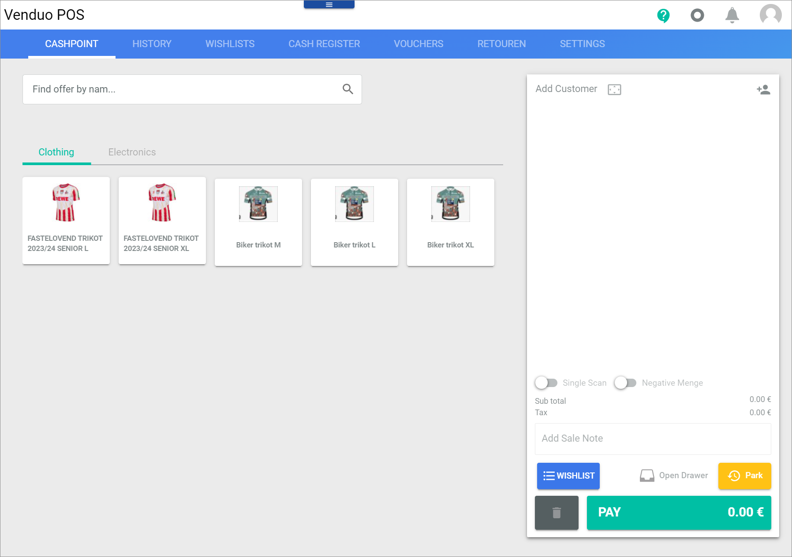
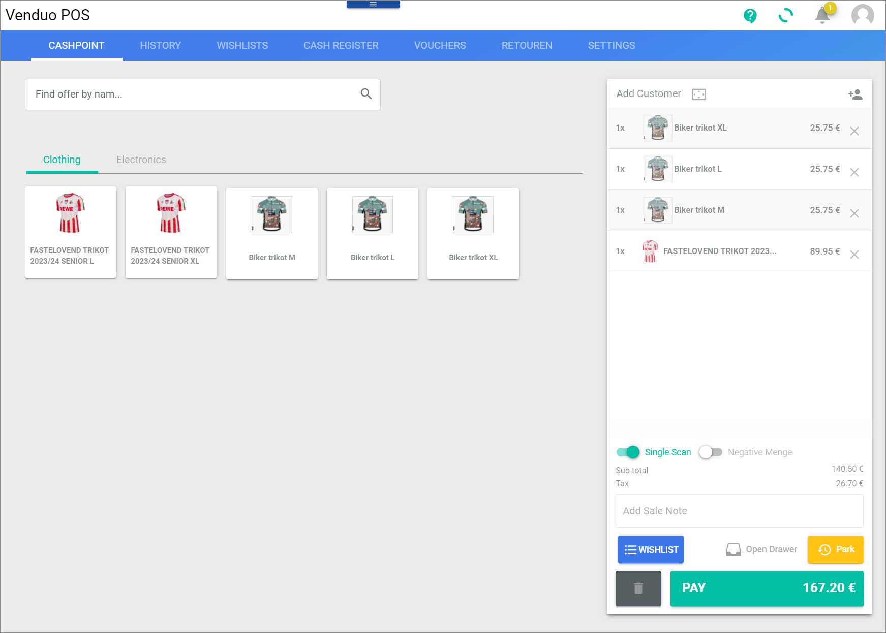

[!!Manage offers for POS](../Integration/07_ManageOffers.md)
[!!User interface Cashpoint](../UserInterface/01a_Cashpoint.md)

# Select an offer

The *POS* module offers several ways to select an offer or to search for it.
You may select an offer by the following:
- Quickselect, see [Select by QuickSelect](#select-by-quickselect).
- Name, see [Select by name](#select-by-name).
- Number, see [Select by number](#select-by-number).

The different options are described in the following.

## Use single scan

If the same offer is selected more than once, it is displayed in the bill list as one line item with the corresponding quantity indication.     
Optionally, you can use the single scan feature. By using it, each offer is listed as a single line item in the bill list, even if it is the same offer. This allows you to treat each product in the bill list individually, for instance, to apply an individual discount.

#### Prerequisites

Offers for POS are created, see [Manage offers for POS](../Integration/07_ManageOffers.md).

#### Procedure

*POS > Sales > Select store and pay desk > Tab CASHPOINT*

1. Enable the *Single scan* toggle in the bill list on the right side of the pay desk interface.   

    > [Info] The single scan works from the moment it is enabled. It does not apply backwards to products that were already on the bill list at the time of activation.

    Even if the single scan function is active, you can edit the quantity of products manually in the bill list, see [Edit the quantity of a product](./03_EditBillList.md#edit-the-quantity-of-a-product).

2. Select an offer, see below. 
    The product is listed in the bill list.

3. Select the same offer again.   
    The same product is listed in an own entry in the bill list.

    

## Select by QuickSelect

The QuickSelect option offers you the possibility to select an offer by clicking a predefined button. This option is often used for popular offers or permanent favorites.

#### Prerequisites

- Offers for POS are created, see [Manage offers for POS](../Integration/07_ManageOffers.md).
- A QuickSelect Category for POS is created, see [Create a QuickSelect Category](../Integration/07_ManageOffers.md#create-a-quickselect-category).

#### Procedure

*POS > Sales > Select store and pay desk > Tab CASHPOINT*

1. Select the desired category by clicking the corresponding tab below the search bar.  
    All offers assigned to the selected category are displayed.

2. Select the desired offer by clicking the corresponding button.   
    The offer is added to the bill list if no age verification is necessary, see [Verify the age](#verify-the-age).   
    

## Select by name

You may select an offer or search for it by entering its name in the search bar. To find an offer, you must enter at least three characters in the search bar. All offers that correspond to your entry are automatically displayed.

#### Prerequisites

Offers for POS are created, see [Manage offers for POS](../Integration/07_ManageOffers.md).

#### Procedure

*POS > Sales > Select store and pay desk > Tab CASHPOINT*

1. Click the *Find offer by nam...* search bar in the upper left part of the tab.  
    The cursor is displayed in the search bar.

2. Enter the name of the offer or the keyword you are searching for in the search bar.
    The offers that match the search are displayed in a list below the search bar.

    > [Info] The search already provides you with proposals for your keyword as you type.

3. Select the desired offer by clicking the corresponding product in the list.   
    The offer is added to the bill list on the right side if no age verification is necessary, see [Verify the age](#verify-the-age). 
     
    > [Info] The keyword remains in the search bar when you add a product to the bill list. When you click the search bar with that keyword again, the search results list for this keyword is displayed again.

## Select by number

You may select an offer or search for it by entering its offer number in the search bar. To find an offer, you must enter at least three numbers in the search bar. All offers that correspond to your entry are automatically displayed.
<!---Ist das die Offer ID, SKU  oder was ist das für eine Nummer?-->

#### Prerequisites

Offers for POS are created, see [Manage offers for POS](../Integration/07_ManageOffers.md).

#### Procedure

*POS > Sales > Select store and pay desk > Tab CASHPOINT* 

1. Click the *Find offer by nam...* search bar in the upper left part of the tab.  
    The cursor is displayed in the search bar.

2. Enter the number of the offer you are searching for in the search bar.
    The offers that match the search are displayed in a list below the search bar.

    > [Info] The search already provides you with proposals for your number as you type.

3. Select the desired offer by clicking the corresponding product in the list.   
    The offer is added to the bill list on the right side if no age verification is necessary, see [Verify the age](#verify-the-age).   
    
    > [Info] The number remains in the search bar when you add a product to the bill list. When you click the search bar with that number again, the search results list for this number is displayed again.

<!--- NEU-->
## Verify the age

Some offers are not suitable for children and young people, for example offers such as alcoholic beverages, cigarettes, or energy drinks. When you select an offer, Actindo checks whether an age verification is necessary before the offer is added to the bill list.

#### Prerequisites

- Offers for POS are created, see [Manage offers for POS](../Integration/07_ManageOffers.md).
- An age restriction for the offer is defined, for example 18 or 16.    
- The *Display age verification* setting is activated. For detailed information, see [Display age verification](../UserInterface/02a_GlobalSettings.md#display-age-verification).

#### Procedure

*POS > Sales > Select store and pay desk > Tab CASHPOINT* 

1. Select an offer.   
    If the offer requires an age verification, the *Age verification* window is displayed.

    
    <!---Screenshot neu machen-->

2. Check the age of the customer. The *Age verification* window provides you with both the minimum age required and the date of birth that the customer must meet or fall below. Eventually, an explanatory text has been added.

    
    <!---Screenshot neu machen-->

3. Click the [AGE OF BUYER CONFIRMED] button if the customer is allowed to buy this offer.  
    The offer is added to the bill list.

4. Click the [CANCEL] button if the customer is too young to buy this offer.   
    The offer is not added to the bill list.

