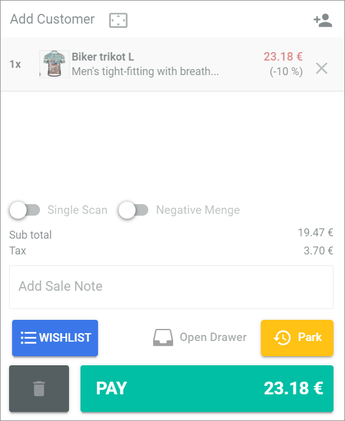
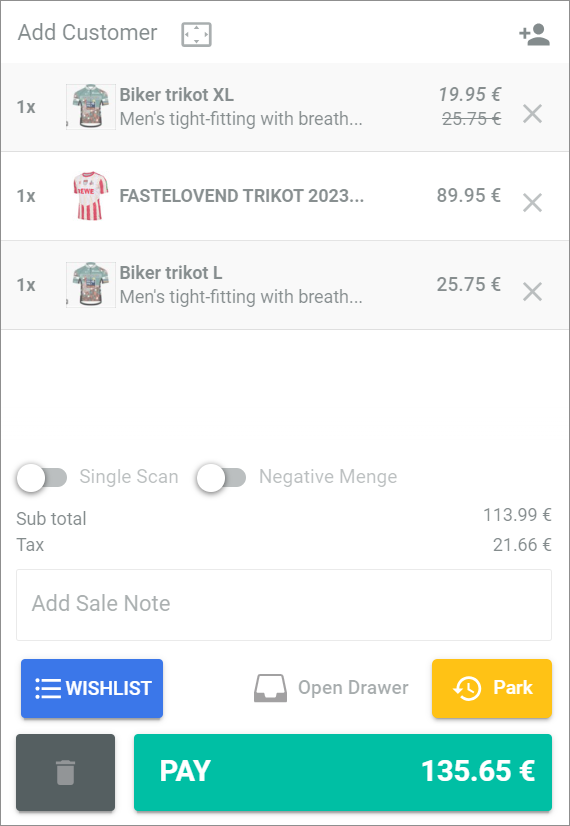
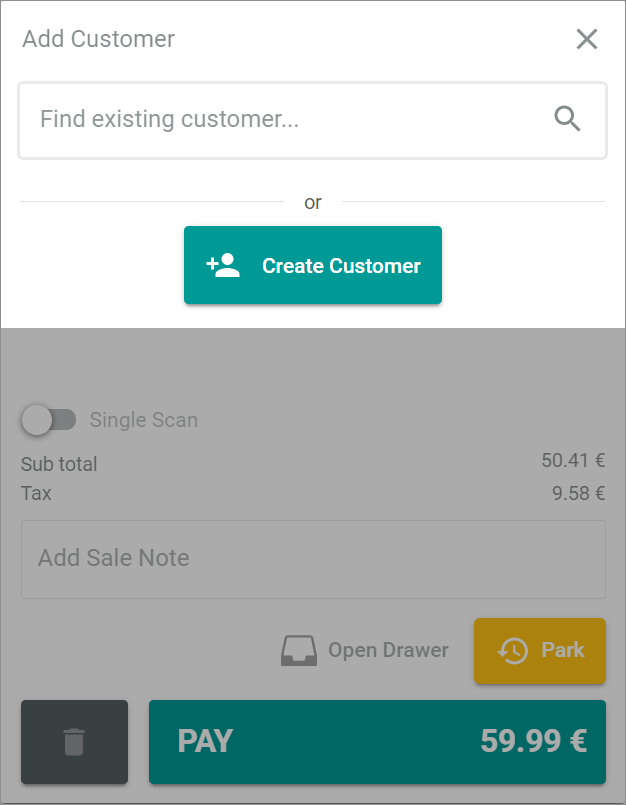
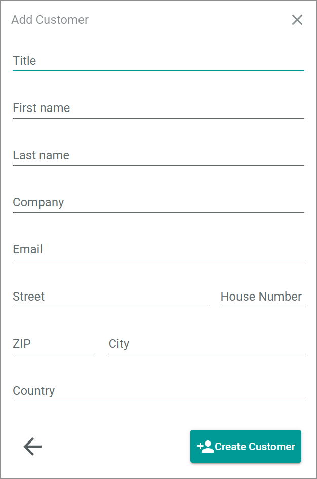

[!!Manage offers for POS](../Integration/07_ManageOffers.md)
[!!User interface Cashpoint](../UserInterface/01a_Cashpoint.md)

# Edit the bill list

The bill list on the right side of the *Cashpoint* tab displays all offers added to the list for purchase. Before completing the purchase, you can edit the price and the quantity of offers on the list, you can add discounts, remove offers from the list, add a sale note, or assign the purchase to a new or an existing customer.

## Add a discount to a single offer

You can add a discount to single offers in your bill list, for instance, because of a campaign, defects in the offers, for loyal customers, or from a certain quantity of offers. 
If you add a discount to a single offer, the discount is applied to an offer entry in the bill list. This means that if the quantity of an offer entry is greater than one because a customer wants to purchase the offer, the discount will be applied to all offers in this entry.   

If you want to apply a discount to a single one of several offers in an entry, you have to use the [single scan function](./02_SelectOffer.md#use-single-scan) first to add an offer as a single entry in the bill list.   

You can also apply a discount to the whole purchase. For detailed information, see [Add a discount to the purchase](./04_CompletePurchase.md#add-a-discount-to-the-purchase).

> [Info] A combination of several discount options is not allowed. For example, you cannot give a discount on a single offer and a discount on the whole purchase. If a customer has a customer-specific discount that is automatically added to the pay bill list, manually applied discounts on this offer are not allowed.

#### Prerequisites

- Offers for POS are created, see [Manage offers for POS](../Integration/07_ManageOffers.md).
- At least one offer is added to the bill list, see [Select an offer](./02_SelectOffer.md#select-an-offer).

#### Procedure

*Venduo POS > Sales > Select store and pay desk > Tab CASHPOINT*

1. Click the offer in the bill list on which you want to apply a discount.   
    The detail view of the offer is displayed in the bill list.

    

2. Click the drop-down list to the right of the *Discount* field and select the **%** option if you want to apply a percentage discount, or select the **EUR** option to apply a fixed amount discount to the offer.   
    The selected option is displayed in the drop-down list.

    > [Info] The currency displayed in the drop-down list corresponds to the default currency in the tab *Global Settings*.

3. Enter a number in the text field to the right of the *Discount* field. The number indicates the amount of the discount, depending on the selection in the drop-down list as a percentage or as a fixed amount.

4. Click the [Save] button in the bottom right corner to apply the discount.   
    The detail view of the offer is closed. The bill list is displayed again. The reduced price of the offer is displayed in red. The discount is displayed below the price.

    

## Edit the price of an offer

You can manually change the price of an offer in your bill list, for example, if a price is incorrect in the system.   
If you enter a changed price for an offer, you will not be able to apply an additional single discount to that offer. The discount field will be locked.  
The modified price is related to each item of the offer entry in the bill list. That means, if the quantity of an offer in the bill list is greater than one, the modified price is applied to each item of this entry.  

#### Prerequisites

- Offers for POS are created, see [Manage offers for POS](../Integration/07_ManageOffers.md).
- At least one offer is added to the bill list, see [Select an offer](./02_SelectOffer.md#select-an-offer).

#### Procedure

*Venduo POS > Sales > Select store and pay desk > Tab CASHPOINT*

1. Click the offer in the bill list whose price you want to edit.   
    The detail view of the offer is displayed in the bill list.

    

2. To the right of the *Price* field, click the  (Edit) button.   
    The price input field becomes editable. The field name changes to *Price (mod.)*.

3.  Enter a price in the input field to the right of the *Price (mod.)* field.   

    > [Info] If you want to restore the original price, click the  (Reject) button in the *Price (mod.)* field.

4. Click the [Save] button in the bottom right corner to apply the price change.   
    The detail view of the offer is closed. The bill list is displayed again. The modified price is displayed in italics to the right of the offer. <!---NEU-->The old price is listed one line below and crossed out. The price difference is stored for future analysis.

    

## Edit the quantity of an offer

You can change the quantity of an offer in your bill list by increasing or decreasing it.

#### Prerequisites

- Offers for POS are created, see [Manage offers for POS](../Integration/07_ManageOffers.md).
- At least one offer is added to the bill list, see [Select an offer](./02_SelectOffer.md#select-an-offer).

#### Procedure

*Venduo POS > Sales > Select store and pay desk > Tab CASHPOINT*

1. Click the offer in the bill list whose quantity you want to change.   
    The detail view of the offer is displayed in the bill list.

    

2. To the right of the *Quantity* field, click the  (Plus) button to increase the quantity or click the  (Minus) button to decrease the quantity of the selected offer. Alternatively, you can directly enter a number in the input field to the left of the buttons.

    > [Info] You have to enter a quantity greater than 0. The  (Minus) button is only active if the quantity is greater than one. If you want to set the quantity to zero, remove the offer from the bill list, see [Delete an offer from the bill list](03_EditBillList.md#delete-an-offer-from-the-bill-list).

3. Click the [Save] button in the bottom right corner to apply the quantity change.   
    The detail view of the offer is closed. The bill list is displayed again. The selected quantity is displayed to the left of the offer.

## Check the stock

You can check the number of items in stock respectively the availability of an offer for the current store or all other stores of your company.

#### Prerequisites

- Offers for POS are created, see [Manage offers for POS](../Integration/07_ManageOffers.md).
- At least one offer is added to the bill list, see [Select an offer](./02_SelectOffer.md#select-an-offer).

#### Procedure

*Venduo POS > Sales > Select store and pay desk > Tab CASHPOINT*

1. Click the offer in the bill list whose stock you want to check.   
    The detail view of the offer is displayed in the bill list.

    

2. Click the [SHOW STOCK LEVELS] button.   
    The *Stock levels* window is displayed. 

    

3. Check the number of units/items in stock for the desired offer.

4. Click the [Esc] key to close the window.

## Delete an offer from the bill list

You can delete an offer from your bill list, for example, if you accidentally added it to the list.
If you delete an offer from the bill list, the whole offer entry regardless of its quantity is deleted. You cannot undo the deletion.

#### Prerequisites

- Offers for POS are created, see [Manage offers for POS](../Integration/07_ManageOffers.md).
- At least one offer is added to the bill list, see [Select an offer](./02_SelectOffer.md#select-an-offer).

#### Procedure

*Venduo POS > Sales > Select store and pay desk > Tab CASHPOINT*

1. Click the  (Delete) button to the right of the offer you want to delete from the bill list.   
    The offer entry is deleted from the list.

## Add a sale note

You can add a note to the purchase in your bill list to indicate if you have made any changes to the offers, or you want to save any other information about the purchase.

#### Prerequisites

- Offers for POS are created, see [Manage offers for POS](../Integration/07_ManageOffers.md).
- At least one offer is added to the bill list, see [Select an offer](./02_SelectOffer.md#select-an-offer).

#### Procedure

*Venduo POS > Sales > Select store and pay desk > Tab CASHPOINT*

1. Click the *Add sale note* field at the bottom part of the bill list.   
    The cursor is displayed in the field.

2. Enter the note you want to add to the bill list.   
    The note is displayed in the text field.

[comment]: <> (Is there any restriction concerning the length of the note? Where is the note displayed after the purchase has been completed?)

## Assign a purchase to a customer

You can assign a customer to a purchase in order to track customer buying behavior or loyalty.   
You can either assign the purchase to an existing customer by searching for his/her name, see [Assign a purchase to a customer](#assign-a-purchase-to-a-customer), or by the customer number, see [Assign a purchase via customer number](#assign-a-purchase-via-customer-number). If the customer is not yet registered in the system, you can [register a new customer](#register-a-customer).

>[Info] It is possible to assign a customer-specific discount to a customer in his/her master data. In this case, the discount is automatically added to all offers the customer purchases. It is deducted from the total amount and displayed in the pay bill list. For detailed information on this setting, see [Customer-specific discount](../UserInterface/02a_GlobalSettings.md#customer-specific-discount).

### Register a customer

If you want to assign a purchase to a customer who does not yet exist in the system, you must first register that customer.

#### Prerequisites

- Offers for POS are created, see [Manage offers for POS](../Integration/07_ManageOffers.md).
- At least one offer is added to the bill list, see [Select an offer](./02_SelectOffer.md#select-an-offer).

#### Procedure

*Venduo POS > Sales > Select store and pay desk > Tab CASHPOINT*

1. Click the  (Add Customer) button in the upper right corner of the bill list.   
    The search view is displayed in the bill list.

    

2. Click the [  Create Customer] button.    
    A view to enter the customer data is displayed.

    

3. Enter the customer data in the corresponding fields and click the [  Create Customer] button.   
    The customer is registered. The customer data view is closed. The bill list is displayed again.   
    The customer's name and address are displayed on top of the bill list. The data is also stored in the *Order Management* module. <!--- Passiert das automatisch oder muss man da noch was tun?-->

    > [Info] If you want to unassign the customer from the purchase, click the  (Delete) button in the upper right corner of the bill list.

### Assign a purchase to an existing customer

Assign the current purchase to a registered customer.   

Alternatively, if the customer has a customer or member card, you can select the customer via customer number, see [Assign a purchase via customer number](#assign-a-purchase-via-customer-number).

#### Prerequisites

- Offers for POS are created, see [Manage offers for POS](../Integration/07_ManageOffers.md).
- At least one offer is added to the bill list, see [Select an offer](./02_SelectOffer.md#select-an-offer).
- At least one customer is already registered, see [Register a customer](#register-a-customer).

#### Procedure

*Venduo POS > Sales > Select store and pay desk > Tab CASHPOINT*

1. Click the  (Add Customer) button in the upper right corner of the bill list.   
    The search view is displayed in the bill list.

    

2. Click the *Find existing customer...* search bar and enter the customer name. You must enter at least three characters in the search bar to start the search. All customers that correspond to your entry are automatically displayed.

    > [Info] The search already provides you with proposals for your entry as you type.

    The customers that match the entered name are displayed in a list below the search bar. If no customer with the entered name is displayed, you have to [register the customer](#register-a-customer) first.

3. Click the appropriate customer's name in the list.   
    The search view is closed. The bill list is displayed again. The customer's name and address is displayed on top of the bill list.

    > [Info] If you want to unassign the customer from the purchase, click the  (Delete) button to the right of the selected customer in the upper right corner of the bill list.

<!--NEU-->
### Assign a purchase via customer number

Assign the current purchase to a registered customer who has a customer or a member card. This card has the customer number printed on it or a barcode that can be scanned with a barcode scanner.  

Alternatively, you can search for the customer name, see [Assign a purchase to an existing customer](#assign-a-purchase-to-an-existing-customer).

#### Prerequisites

- Offers for POS are created, see [Manage offers for POS](../Integration/07_ManageOffers.md).
- At least one offer is added to the bill list, see [Select an offer](./02_SelectOffer.md#select-an-offer).
- At least one customer is already registered, see [Register a customer](#register-a-customer) and has a customer or member card.

#### Procedure

*Venduo POS > Sales > Select store and pay desk > Tab CASHPOINT*

1. Click the  (Customer details) button next to *Add Customer*.   
    The *Customer details* window is displayed.

    

2. Scan the customer code with the barcode scanner or enter the number manually.    
    The number is automatically added to the search field and the customer's details are displayed. This is the name and address, but can also be the price group to which a customer is assigned or the discount granted.

    

3. Click the  (Customer) button.   
    The search view is closed. The bill list is displayed again. The customer's name and address is displayed on top of the bill list.
