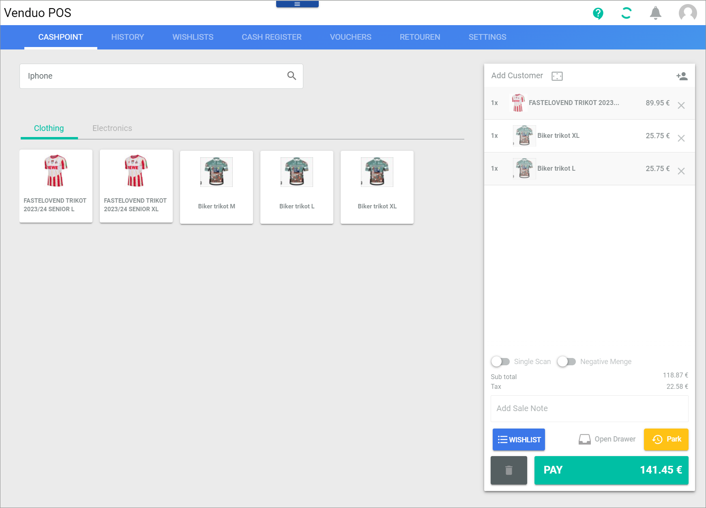
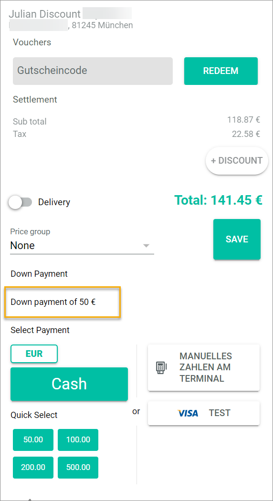
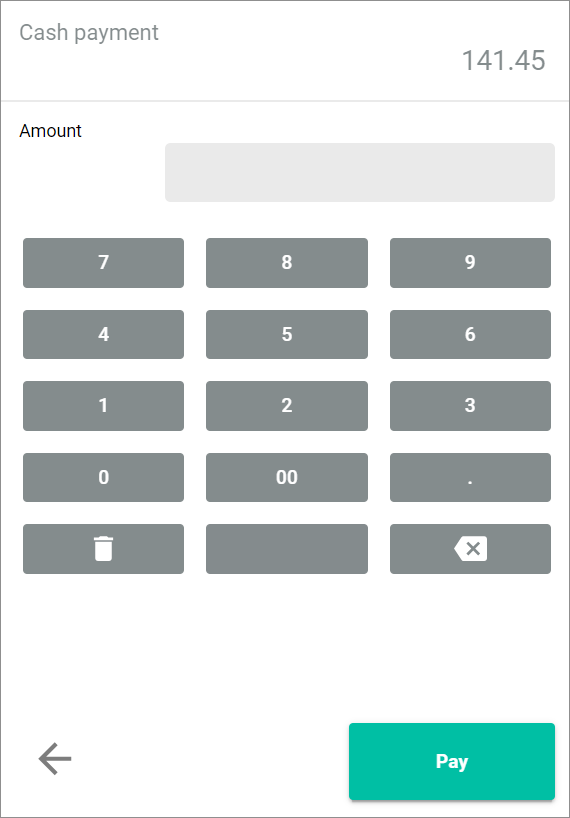
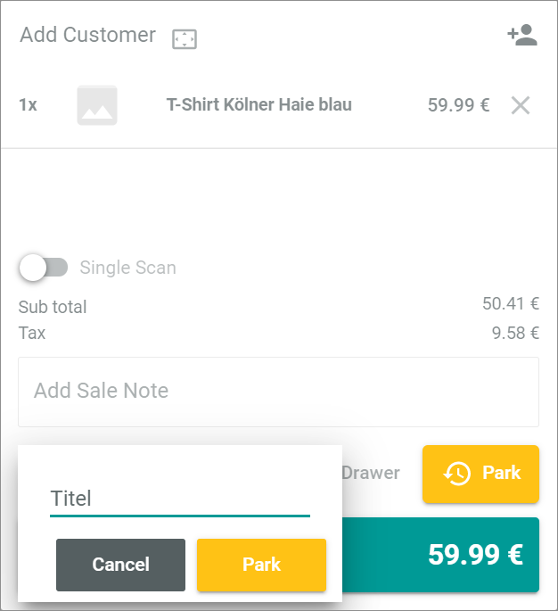
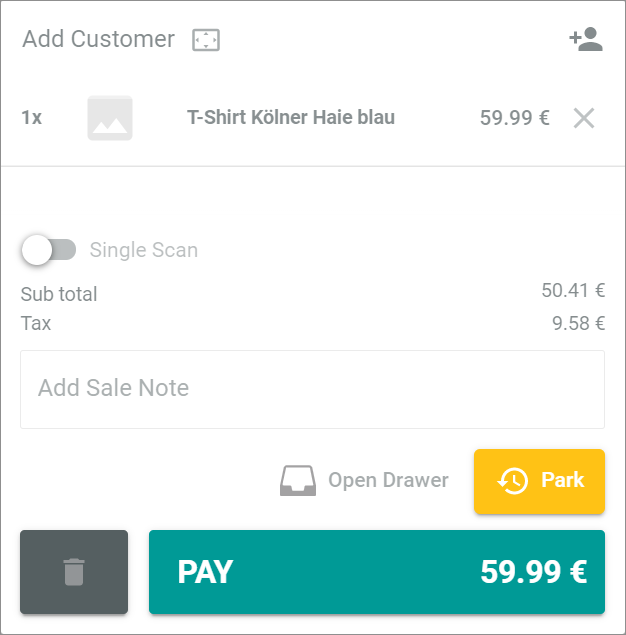

[!!Manage offers for POS](../Integration/07_ManageOffers.md)
[!!User interface Cashpoint](../UserInterface/01a_Cashpoint.md)
[!!User interface Cash register](../UserInterface/01c_CashRegister.md)

# Complete a purchase

To complete a purchase, you need to initiate the payment. At the POS pay desk, you have several options to modify the payment process such as suggesting additional offers, adding a discount, initiating a delivery or a down payment, or parking a payment for a later time. Further, you have several options to finalize the payment process, for instance by cash payment, by cashless payment, or by voucher. 

<!--- NEU-->
## Suggest an offer to the customer

If your company wants you to suggest additional offers to complete the customer's shopping experience, there is a feature that reminds you to offer additional items to the customer.   

#### Prerequisites

- At least one offer is added to the bill list, see [Select an offer](./02_SelectOffer.md#select-an-offer).
- The *Remind of offers* setting is activated. For detailed information, see [Remind of offers](../UserInterface/02a_GlobalSettings.md#remind-of-offers).

#### Procedure

*Venduo POS > Sales > Select store and pay desk > Tab CASHPOINT*

1. Click the [PAY] button at the bottom of the bill list.   
    The *Suggest the following offers to the customer* window is displayed, presenting some additional offers.

    

2. Suggest the offers to the customer.

3. Click an offer, if a customer wants to buy it.  
    The offer is added to the bill list.

4. Click the [PROCEED] button.   
    The bill list to be paid is displayed. If you have not previously clicked on a suggested offer, only the offer(s) you originally selected will be charged.

    

## Add a discount to the purchase

You can add a discount to the whole purchase of your bill list, for instance, because of a campaign, defects in the offers, for loyal customers, or from a certain quantity of offers. The discount to the purchase is always a percentage discount.  

> [Info] You can also add a discount to a single offer of the bill list. For detailed information, see [Add a discount to a single offer](./03_EditBillList.md#add-a-discount-to-a-single-offer). 
 
A combination of several discount options is not allowed. For example, you cannot give a discount on a single offer and a discount on the purchase. If a customer has a customer-specific discount that is automatically added to the pay bill list, manually applied discounts are not allowed.

#### Prerequisites

- Offers have been created for the *Venduo POS* module, see [Manage offers for POS](../Integration/07_ManageOffers.md).
- At least one offer is added to the bill list, see [Select an offer](./02_SelectOffer.md#select-an-offer).

#### Procedure

*Venduo POS > Sales > Select store and pay desk > Tab CASHPOINT*

1. Click the [PAY] button at the bottom of the bill list.   
    The pay bill list is displayed. 

    

2. Click the [+ DISCOUNT] button above the total.   
    The *Discount on bill* view is displayed.

    

3. Enter a description in the *Description* field to specify the discount, for example, campaign, defect.

4. Enter the percentage in the input field to the right of the *Description* field or select a percentage by clicking the number buttons in the lower area.   
    The reduced price of the purchase is displayed below the percentage field.

5. Click the [APPLY DISCOUNT] button in the bottom right corner.   
    The bill discount view is closed. The pay bill list is displayed again. The discount is indicated both as a percentage and as a fixed amount above the reduced total.

    

    > [Info] To the right of the indicated discount, on the edge of the bill list, the  (Remove) flag is displayed. Click the flag to delete the discount, if required.

<!--- NEU-->
## Check the customer-specific discount

If your company uses the *Customer-specific discount* feature, a specific discount might be defined for a customer. The discount is automatically deducted as soon as a customer purchases an offer. You can remove the discount, if required.

> [Info] If a customer has a customer-specific discount, other discount options are not allowed.

#### Prerequisites

- Offers have been created for the *Venduo POS* module, see [Manage offers for POS](../Integration/07_ManageOffers.md).
- At least one offer is added to the bill list, see [Select an offer](./02_SelectOffer.md#select-an-offer).
- The *Customer-specific discount* setting is activated. For detailed information, see [Customer-specific discount](../UserInterface/02a_GlobalSettings.md#customer-specific-discount).

#### Procedure

*Venduo POS > Sales > Select store and pay desk > Tab CASHPOINT*

1. Add an existing customer to the bill list. For detailed information, see [Assign a purchase to an existing customer](../Operation/03_EditBillList.md#assign-a-purchase-to-an-existing-customer).

2. Click the [PAY] button at the bottom of the bill list.   
    The pay bill list is displayed. A discount is added automatically to the pay bill list. 

    

3. If the customer should not receive a discount, click the  (Remove) flag.    
    The customer-specific discount is removed.

<!---NEU-->
## Assign a price group

A price group classifies different prices that apply to customers who share the same pricing criteria such as club members or business partners. A price group associated with an offer can reduce the offer's price for customers assigned to this price group. The price group is stored in the customer's master data.      

If your company supports this feature, the price will be automatically reduced for the customers concerned. You can also assign the price group manually in the pay bill list. 

#### Prerequisites

- At least one offer is added to the bill list, see [Select an offer](./02_SelectOffer.md#select-an-offer).
- A price group price has been assigned to the related offers, see [Create a price group for POS](../Integration/07_ManageOffers.md#create-a-price-group-for-pos).
- A price group has been assigned to a customer.

#### Procedure

*Venduo POS > Sales > Select store and pay desk > Tab CASHPOINT*

1. Add the customer. For detailed information, see [Assign a purchase to a customer](../Operation/03_EditBillList.md#assign-a-purchase-to-a-customer).   
    The customer data are displayed at the top.

2. Click the [PAY] button at the bottom of the bill list.   
    The pay bill list is displayed. If the customer is assigned to a specific price group, it is preselected. 

    

3. If desired, select the price group manually, for example, if you know the customer. To do this, click the *Price group* drop-down list and select the price group.

4. Click the [SAVE] button next to the *Price group* field.   
    If there are offers on the bill list for which a price group-specific price has been defined, the amounts on the bill list are changed. The old amount is crossed out, and the new amount is calculated.

    

<!--- NEU-->
## Initiate a down payment

If your company uses the *Down payment allowed* feature, you can reduce the entire total amount of the bill to a specific down payment, for example, if a down payment has been agreed or if the full amount is not due until the offers are delivered or collected.   

#### Prerequisites

- At least one offer is added to the bill list, see [Select an offer](./02_SelectOffer.md#select-an-offer).   
- The *Down payment allowed* setting is activated. For detailed information, see [Down payments allowed](../UserInterface/02a_GlobalSettings.md#down-payments-allowed).

#### Procedure

*Venduo POS > Sales > Select store and pay desk > Tab CASHPOINT*

1. Click the [PAY] button at the bottom of the bill list.   
    The pay bill list is displayed.

    

2. Click the [+ ADD DOWN PAYMENT] button in the *Settlement* section.   
    The *Add down payment* window is displayed.

    

3. Define the down payment. You can enter a percentage value or a fixed amount.
   
   **Enter a percentage value**
    - Enable the * Calculated via percentage* toggle.
    - Enter the desired percentage value in the *Percent* field.  
        The down payment amount is displayed below.

    **Enter a fixed value**
    - Disable the * Calculated via percentage* toggle.
    - Enter the fixed value the line below. You can use the  (Plus minus) button as input help.

4. Click the [SAVE] button.   
    The *Down payment of "value/currency"* is noted in the pay bill list.   
    The total amount of the pay bill list remains at the original price. When you now initiate the payment, only the down payment amount is due.

    

<!--- NEU-->
## Initiate a delivery

If your company supports the delivery of an offer, you can easily initiate a delivery.  

#### Prerequisites

- At least one offer is added to the bill list, see [Select an offer](./02_SelectOffer.md#select-an-offer).
- The *Deliveries allowed* setting is activated. For detailed information, see [Deliveries allowed](../UserInterface/02a_GlobalSettings.md#deliveries-allowed).
- The purchase is assigned to a customer, and the address (delivery address) is available, see [Assign a purchase to a customer](03_EditBillList.md#assign-a-purchase-to-a-customer).

#### Procedure
*Venduo POS > Sales > Select store and pay desk > Tab CASHPOINT*

1. Click the [PAY] button at the bottom of the bill list.   
    The pay bill list is displayed.

    

2. Click the  *Delivery* toggle in the *Settlement* section.  
    The delivery is initiated.

## Pay cash

If a customer wants to pay cash, the payment process in the pay desk must be completed as follows.

### Manual input of the cash amount

To enter a cash payment, you can select the cash amount for the payment manually.

#### Prerequisites

At least one offer is added to the bill list, see [Select an offer](./02_SelectOffer.md#select-an-offer).

#### Procedure

*Venduo POS > Sales > Select store and pay desk > Tab CASHPOINT*

1. Click the [PAY] button at the bottom of the bill list.   
    The pay bill list is displayed.

    

3. Click the [Cash] button.   
    The *Cash payment* view is displayed.

    

4. Enter the cash payment amount in the *Amount* field or select an amount by clicking the number buttons in the lower area.

5. Click the [Pay] button in the bottom right corner.   
    The *Payment pending* view is displayed while the payment is being processed. After that, a confirmation window is displayed. 

6. Click the [Done] button to confirm the payment.   
    The purchase is completed. The bill list is displayed again.

### Quick select of the cash amount

To enter a cash payment, you can select the cash amount for the payment by using the quick select proposals.

#### Prerequisites

At least one offer is added to the bill list, see [Select an offer](./02_SelectOffer.md#select-an-offer).

#### Procedure

*Venduo POS > Sales > Select store and pay desk > Tab CASHPOINT*

1. Click the [PAY] button at the bottom of the bill list.   
    The pay bill list is displayed.

    

2. Click one of the buttons in the *Quick select* section. The offered amounts on the buttons vary depending on the amount of the purchase and the denomination of the currency defined in the global settings.  
    The *Payment pending* view is displayed while the payment is being processed. The total of the bill, the given amount, and the change amount are listed.  
    The *Payment successful* view is displayed when the payment is completed.   

    

4. After you have returned the change, click the [Done] button.   
    The purchase is completed. The bill list is displayed again.

## Open the drawer

Generally, you open the cash drawer when you accept a cash payment or when you want to store the receipt in the drawer for a cashless payment.
In case of cash or cashless payment, the option to open the drawer can be activated or deactivated in the settings.
If you want to open the drawer independently of a payment process, for instance to change money, you can do so as follows.

### Open the drawer in the cashpoint

You can open the drawer in the *CASHPOINT* tab.

#### Prerequisites

A pay desk is opened, see [Open a pay desk](./01_OpenPayDesk.md).

#### Procedure

*Venduo POS > Sales > Select store and pay desk > Tab CASHPOINT*

Click the [ Open Drawer] button at the bottom part of the bill list.   
    The drawer opens.

### Open the drawer in the cash register

You can open the drawer in the *CASH REGISTER* tab.

#### Prerequisites

A pay desk is opened, see [Open a pay desk](./01_OpenPayDesk.md).

#### Procedure

*Venduo POS > Sales > Select store and pay desk > Tab CASH REGISTER*

Click the [ Open drawer] button at the top of the *Cash In/Out* section.   
    The drawer opens.

## Pay cashless at the terminal

If a customer wants to pay cashless, the payment process in the pay desk of the *Venduo POS* module must be completed as described below. Currently, it is not possible to connect an external terminal to the *Venduo POS* module.   
You can complete the entire payment process with the pay desk at your desktop. If you have external terminals in use, you must complete the payment process at them. Nevertheless, you can post the payment in your pay desk for the statistics and for posting it into your accounts.  

#### Prerequisites

At least one offer is added to the bill list, see [Select an offer](./02_SelectOffer.md#select-an-offer).

#### Procedure

*Venduo POS > Sales > Select store and pay desk > Tab CASHPOINT*

1. Click the [PAY] button at the bottom of the bill list.   
    The pay bill list is displayed.

    

2. Click the [  MANUAL PAYMENT AT TERMINAL] button at the right side of the *Select payment* section.   
    The *Cashless payment* view is displayed.

    

3. Select the card type in the *Card type* drop-down list.
    The selected card type is displayed in the drop-down list.

4. Click the [Finalize payment process] button.   
    A confirmation window is displayed.

5. Click the [Done] button.   
    The purchase is completed. The bill list is displayed again.

## Pay with voucher

In addition to cash and cashless payment, customers can also pay with vouchers.

#### Prerequisites

At least one offer is added to the bill list, see [Select an offer](./02_SelectOffer.md#select-an-offer).

#### Procedure

*Venduo POS > Sales > Select store and pay desk > Tab CASHPOINT*

1. Click the [PAY] button at the bottom of the bill list.   
    The pay bill list is displayed.

    

2. Click the *Voucher code* field at the top in the *Vouchers* section and enter the voucher code or scan it with a barcode scanner.   

3. Click the [REDEEM] button to the right of the *Voucher code* field.   
    The voucher is indicated in the *Settlement* section of the bill list.

    > [Info] The current value of the voucher is displayed on the left side, the amount that will be redeemed at purchase is displayed on the right side. The remaining total of the purchase is indicated below. If the voucher amount is higher than the purchase amount, the voucher is reduced by the purchase amount and the remaining total 0.00 € is displayed on the bill list.

    

    > [Info] To the right of the indicated voucher amount, on the edge of the bill list, the  (Remove) flag is displayed. Click the flag to remove the voucher from the payment.

[comment]: <> (Is there a predefined way how to complete the purchase when total = 0?)

4. Complete the purchase by paying the remaining total either by cash or cashless payment:
    - For cash payment, see [Pay cash](#pay-cash).
    - For cashless payment, see [Pay cashless at the terminal](#pay-cashless-at-the-terminal).

## Manage a parked bill

You can park a purchase, for instance if a customer has forgotten the wallet and resume it at a later time.

### Park a bill

Park a bill to defer it for a later date.

#### Prerequisites

At least one offer is added to the bill list, see [Select an offer](./02_SelectOffer.md#select-an-offer).

#### Procedure

*Venduo POS > Sales > Select store and pay desk > Tab CASHPOINT*

1. Click the [  Park] button at the bottom of the bill list.   
    A window to enter a title for the purchase is displayed in the bill list.

    

2. Enter a descriptive name for the purchase in the *Title* field.

    > [Info] If you want to resume the purchase, you should be able to recognize the purchase by this title.

3. Click the [Park] button.   
    The purchase is parked. The [  PARKED] flag is displayed in the upper part to the right of the bill list. The bill list is empty.

    

    > [Info] The number on the flag indicates the numbers of parked purchases.

### Resume a parked bill

If you have parked a purchase, you can resume it as follows.

#### Prerequisites

At least one offer is added to the bill list, see [Select an offer](./02_SelectOffer.md#select-an-offer).

#### Procedure

*Venduo POS > Sales > Select store and pay desk > Tab CASHPOINT*

1. Click the [  PARKED] flag in the upper part to the right of the bill list.   
    The *Parked bills* window is displayed.

    

2. Click the appropriate bill.   
    The [Cancel] and the [Resume] buttons are displayed in the window.

    

3. Click the [Resume] button.   
    The purchase is resumed. The parked bill list is displayed again.

    

4. Complete the purchase by editing the bill list or collecting the remaining total either by cash or cashless payment:
    - For cash payment, see [Pay cash](#pay-cash).
    - For cashless payment, see [Pay cashless at the terminal](#pay-cashless-at-the-terminal).
    - For payment with voucher, see [Pay with voucher](#pay-with-voucher).

## Cancel a purchase

You can cancel a purchase, for instance if a customer decides against the purchase at short notice.   
Note that you cannot undo a cancellation.

#### Prerequisites

At least one offer is added to the bill list, see [Select an offer](./02_SelectOffer.md#select-an-offer).

#### Procedure

*Venduo POS > Sales > Select store and pay desk > Tab CASHPOINT*

Click the  (Delete) button at the bottom of the bill list.   
    The current purchase is canceled. The bill list is empty.

> [Info] If you click the  (Delete) button, the entire purchase is canceled without further query.