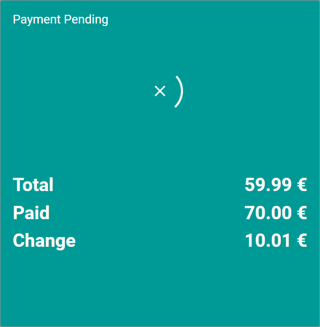
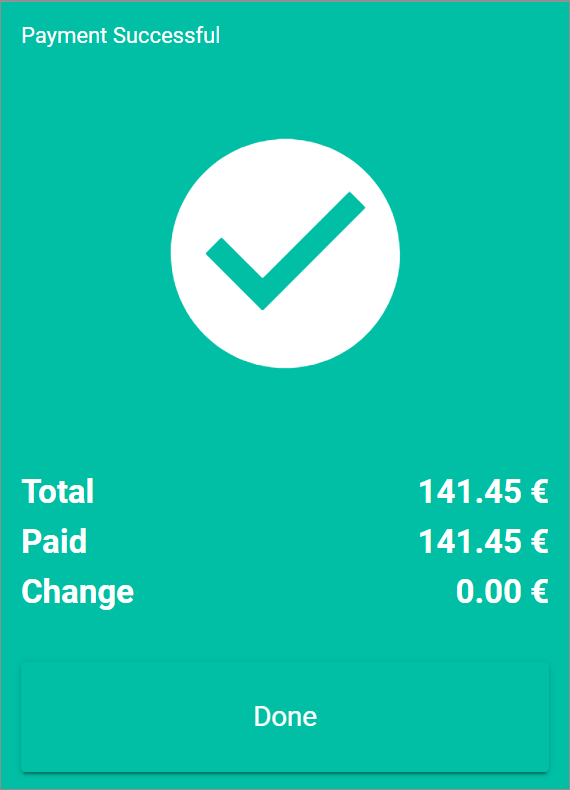
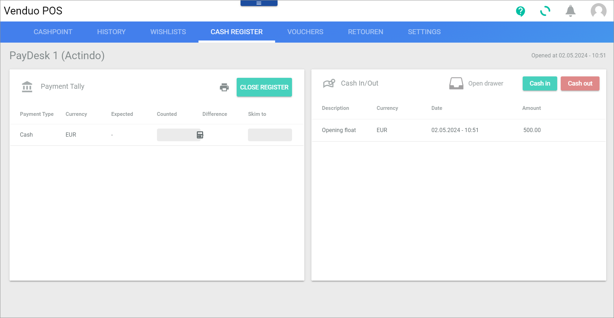
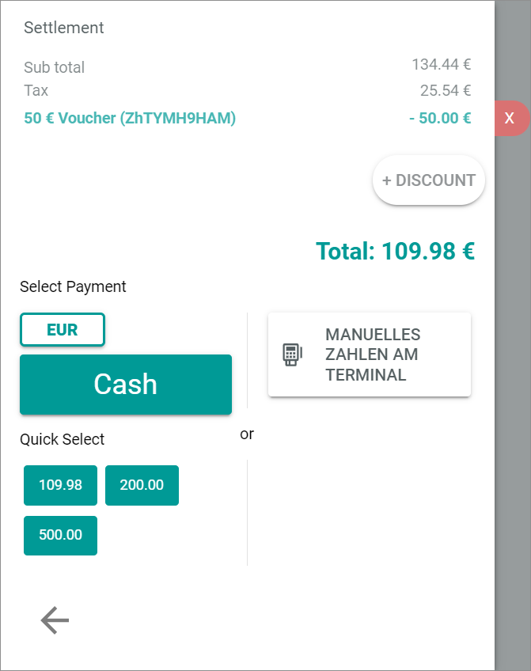
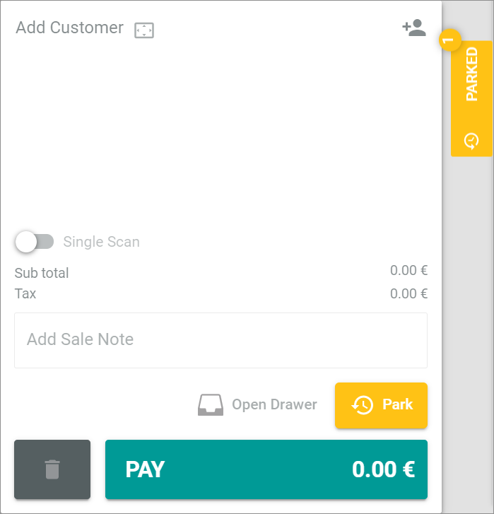
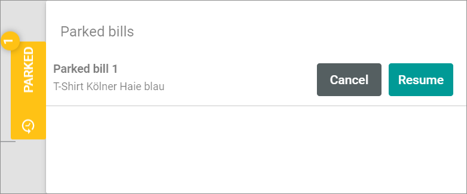

[!!User Interface Cashpoint](../UserInterface/01a_Cashpoint.md)
[!!User Interface Cash register](../UserInterface/01c_CashRegister.md)
[!!Manage offers for POS](../Integration/07_ManageOffers.md)

# Complete a purchase

To complete a purchase, you need to initiate the payment. At the Venduo POS pay desk, you have several options to complete the payment process, for instance by cash payment, by cashless payment or by voucher. You can also assign a discount to one or more items on the bill list or park a payment for a later time.

## Pay cash

If a customer wishes to pay in cash, the payment process in the pay desk must be completed as follows.

### Manual input of the cash amount

To enter a cash payment, you can select the cash amount for the payment manually.

#### Prerequisites

At least one product is added to the bill list, see [Select an offer](./02_SelectOffer.md).

#### Procedure

*Venduo POS > Sales > Select store and pay desk > Tab CASHPOINT*

1. Click the [PAY] button at the bottom of the bill list.   
  The payment view is displayed in the bill list.

   

2. In the *Select payment* section you can complete the cash payment by two different ways:   

3. Click the [Cash] button.   
  	The *Cash payment* view is displayed.

    

4. Enter the cash payment amount in the *Amount* field or select an amount by clicking the number buttons in the lower area.

5. Click the [Pay] button in the bottom right corner.   
  The *Payment pending* view is displayed while the payment is being processed.   

  

  The *Payment successful* view is displayed when the payment is completed.   

  

6. Click the [Done] button.   
  The purchase is completed. The bill list is displayed again.

### Quick select of the cash amount

To enter a cash payment, you can select the cash amount for the payment by using the quick select proposals.

#### Prerequisites

At least one product is added to the bill list, see [Select an offer](./02_SelectOffer.md).

#### Procedure

*Venduo POS > Sales > Select store and pay desk > Tab CASHPOINT*

1. Click the [PAY] button at the bottom of the bill list.   
  The payment view is displayed in the bill list.

   

2. In the *Select payment* section you can complete the cash payment by two different ways:   

3. Click one of the buttons in the *Quick select* section. The offered amounts on the buttons vary depending on the amount of the purchase and the denomination of the currency defined in the global settings.   
  The *Payment pending* view is displayed while the payment is being processed.   

  

  The *Payment successful* view is displayed when the payment is completed.   

  

4. Click the [Done] button.   
  The purchase is completed. The bill list is displayed again.

## Open the drawer

Generally, you open the cash drawer when you accept a cash payment or when you want to store the receipt in the drawer for a cashless payment.
In case of cash or cashless payment, the option to open the drawer can be activated or deactivated in the settings.
If you want to open the drawer independently of a payment process, for instance to change money, you can do so as follows.

### Open the drawer in the cashpoint

You can open the drawer in the *CASHPOINT* tab.

#### Prerequisites

A pay desk is opened, see [Open a pay desk](./01_OpenPayDesk.md).

#### Procedure

*Venduo POS > Sales > Select store and pay desk > Tab CASHPOINT*

Click the [  Open Drawer] button at the bottom part of the bill list.   
  The drawer opens.

### Open the drawer in the cash register

You can open the drawer in the *CASH REGISTER* tab.

#### Prerequisites

A pay desk is opened, see [Open a pay desk](./01_OpenPayDesk.md).

#### Procedure

*Venduo POS > Sales > Select store and pay desk > Tab CASH REGISTER*

Click the [  Open drawer] button at the top of the *Cash In/Out* section.   
  The drawer opens.

## Pay cashless at the terminal

[comment]: <> (need more information!)

If a customer wishes to pay cashless, the payment process in the pay desk must be completed as follows. Currently, it's not possible to connect an external terminal to POS. The payment process itself has to be completed at the external terminal. Nevertheless, you can book the payment in your pay desk for the statistic and to transfer it in your accounts.  

#### Prerequisites

At least one product is added to the bill list, see [Select an offer](./02_SelectOffer.md).

#### Procedure

*Venduo POS > Sales > Select store and pay desk > Tab CASHPOINT*

1. Click the [PAY] button at the bottom of the bill list.   
   The payment view is displayed in the bill list.

   

2. Click the [  MANUAL PAYMENT AT TERMINAL] button at the right side of the *Select payment* section.   
   The *Cashless payment* view is displayed.

   

3. Select the card type in the drop-down list *Card type*.
  The selected card type is displayed in the drop-down list.

[comment]: <> (Is card type correct? It could also be Paypal, or another cardless method...)

4. Click the [Finalize payment process] button.   
   The *Payment at terminal* view is displayed when the payment is completed.

   

5. Click the [Done] button.   
   The purchase is completed. The bill list is displayed again.

## Pay with voucher

In addition to cash and cashless payment, customers can also pay with vouchers.

#### Prerequisites

At least one product is added to the bill list, see [Select an offer](./02_SelectOffer.md).

#### Procedure

*Venduo POS > Sales > Select store and pay desk > Tab CASHPOINT*

1. Click the [PAY] button at the bottom of the bill list.   
   The payment view is displayed in the bill list.

   

2. Click the *Voucher code* field at the top in the *Vouchers* section and enter the voucher code.   

3. Click the [REDEEM] button to the right of the *Voucher code* field.   
   The voucher is indicated in the *Settlement* section of the bill list.

    > [Info] The current value of the voucher is displayed on the left side, the amount that will be redeemed at purchase is displayed on the right side. The remaining total of the purchase is indicated below. If the voucher amount is higher than the purchase amount, the voucher is reduced by the purchase amount and the remaining total 0.00 € is displayed on the bill list.

   

      > [Info] To the right of the indicated voucher amount, on the edge of the bill list, the  (Remove) flag is displayed. Click the flag to remove the voucher from the payment.

  [comment]: <> (Is there a predefined way how to complete the purchase when total = 0?)

4. Complete the purchase by paying the remaining total either by cash or cashless payment:
  - For cash payment, see [Pay cash](#pay-cash).
  - For cashless payment, see [Pay cashless at the terminal](#pay-cashless-at-the-terminal).

## Manage a parked bill

You can park a purchase, for instance if a customer has forgotten the wallet and resume it at a later time.

### Park a bill

Park a bill to defer it for a later date.

#### Prerequisites

At least one product is added to the bill list, see [Select an offer](./02_SelectOffer.md).

#### Procedure

*Venduo POS > Sales > Select store and pay desk > Tab CASHPOINT*

1. Click the [  Park] button at the bottom of the bill list.   
   A window to enter a title for the purchase is displayed in the bill list.

   

2. Enter a descriptive name for the purchase in the *Title* field.

  > [Info] If you want to resume the purchase, you should be able to recognize the purchase by this title.

3. Click the [Park] button.   
   The purchase is parked. The [  PARKED] flag is displayed in the upper part to the right of the bill list. The bill list is empty.

   

  > [Info] The number on the flag indicates the numbers of parked purchases.

### Resume a parked bill

If you have parked a purchase, you can resume it as follows.

#### Prerequisites

At least one product is added to the bill list, see [Select an offer](./02_SelectOffer.md).

#### Procedure

*Venduo POS > Sales > Select store and pay desk > Tab CASHPOINT*

1. Click the [  PARKED] flag in the upper part to the right of the bill list.   
   The *Parked bills* window is displayed.

   

2. Click the appropriate bill.   
   The [Cancel] and the [Resume] buttons are displayed in the window.

   

3. Click the [Resume] button.   
   The purchase is resumed. The parked bill list is displayed again.

   

4. Complete the purchase by editing the bill list or paying the remaining total either by cash or cashless payment:
  - For cash payment, see [Pay cash](#pay-cash).
  - For cashless payment, see [Pay cashless at the terminal](#pay-cashless-at-the-terminal).
  - For payment with voucher, see [Pay with voucher](#pay-with-voucher).

## Cancel a purchase

You can cancel a purchase, for instance if a customer decides against the purchase at short notice.   

#### Prerequisites

At least one product is added to the bill list, see [Select an offer](./02_SelectOffer.md).

#### Procedure

*Venduo POS > Sales > Select store and pay desk > Tab CASHPOINT*

Click the  (Delete) button at the bottom of the bill list.   
  The current purchase is canceled. The bill list is empty.

  > [Info] If you click the  (Delete) button the entire purchase is canceled without further query. The cancellation cannot be undone.
