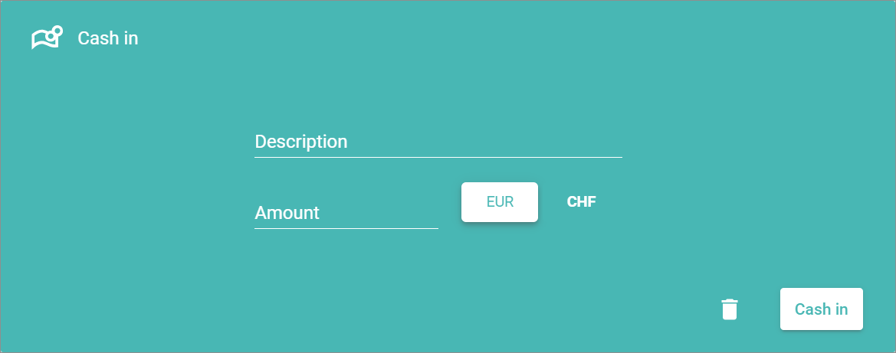

[!!Open a pay desk](./01_OpenPayDesk.md)
[!!User interface Cash register](../UserInterface/01c_CashRegister.md)
[!!User interface Stores](../UserInterface/02b_Stores.md)
<!---Error-->

# Manage the cash register

In the cash register, you can post sales-independent cash ins and cash outs, you can close the pay desk, for instance after a shift, count the current cash balance and define or edit a skimming amount. In addition, you can open the cash drawer and print a shift summary.

## Cash in the register

If you deposit cash in the pay desk without a purchase being made, for instance if you put change in the pay desk, you must log that in the cash register.

#### Prerequisites

The pay desk is open, see [Open a pay desk](./01_OpenPayDesk.md).

#### Procedure

*Venduo POS > Sales > Select store and pay desk > Tab CASH REGISTER*

1. Click the [Cash in] button in the upper right corner of the *Cash in/out* box.   
    The *Cash in* box is displayed.

    

2. Enter a descriptive name for the deposit in the *Description* field.

3. Enter the deposit amount in the *Amount* field.

4. Click the [Cash in] button in the bottom right corner.  
    The *Cash in* view is closed. The deposit is listed in the table of the *Cash in/out* section.   

    > [Info] To cancel the cash in process, click the  (Delete) button in the bottom right corner.

## Cash out the register

If you withdraw cash without a purchase being made, for instance if you take out a partial amount before closing time, you must log that in the cash register.

#### Prerequisites

The pay desk is open, see [Open a pay desk](./01_OpenPayDesk.md).

#### Procedure

*Venduo POS > Sales > Select store and pay desk > Tab CASH REGISTER*

1. Click the [Cash out] button in the upper right corner of the *Cash in/out* box.   
    The *Cash out* box is displayed.

    

2. Enter a descriptive name for the withdrawal in the text *Description* field.

3. Enter the withdrawal amount in the *Amount* field.

4. Click the [Cash out] button in the bottom right corner.  
    The *Cash out* view is closed. The withdrawal is listed in the table of the *Cash in/out* section.   

    > [Info] To cancel the cash out process, click the  (Delete) button in the bottom right corner.

## Close a pay desk

You close the pay desk at cash closing or when a shift change is due and the cashier changes. To close a pay desk, you have to count the current cash amount in the pay desk. In addition, you can define a skimming amount.

#### Prerequisites

The pay desk is open, see [Open a pay desk](./01_OpenPayDesk.md).

#### Procedure

*Venduo POS > Sales > Select store and pay desk > Tab CASH REGISTER*

1. Click the  (Calculator) button in the field of the *Counted* column in the *Payment tally* box.   
    The *Count cash* box is displayed.

    

    > [Info] Alternatively to using the *Count cash* function, you can enter the total amount of cash directly in the field of the *Counted* column in the *Payment tally* box.

2. Enter the number in the *Amount* column input field per each type of coin or banknote, for example in euros the number of 1-cent coins, of 2-cent coins and so on. If desired, you can use the [+1], [+5].[+10], or [+50] buttons to quickly enter the amount, but you can also enter the value manually. The total of each peace is specified in the *Amount* column.

    

3. Click the next row and continue entering the number of coins or banknotes in the *Amount* column input field. Repeat this step for all rows.

    > [Info] The total of cash counted is displayed at the bottom of the *Count cash* box.

4. Click the [OK] button in the bottom right corner.  
    The *Count cash* box is closed. The total of cash counted is displayed in the field of the *Counted* column in the *Payment tally* box.

5. If desired, enter an amount up to which the pay desk is skimmed after closing in the field of the *Skim to* column in the *Payment tally* section.

    > [Info] You can set an amount up to which the pay desk is skimmed after closing in the *Global Settings* tab. If you have predefined a skimming amount, the field of the column *Skim to* is preset with this amount. The field can be overwritten in the *Cash Register* tab when closing the pay desk.

6. Click the [Close Register] button in the upper right corner of the *Payment tally* section.   
    A confirmation window whether the pay desk should really be closed is displayed.

7. Click the [Ok] button.   
    The pay desk is closed. The view to select a store and a pay desk is displayed, see [Open a pay desk](./01_OpenPayDesk.md).

## Manage the shift summary

The shift summary is an overview of all the transactions made within a shift. A shift starts, when a pay desk is opened and ends, when the pay desk is closed. You can check the shift summary or print it.

#### Prerequisites

At least one shift has ended, and the pay desk has been closed, see [Close a pay desk](#close-a-pay-desk).

#### Procedure

*Venduo POS > Management > Tab STORES > Select Store > Tab Basic Data > Select Pay Desk > Tab Transactions*

1. Click anywhere in the row with the shift you want to check (except in the *Print shift summary* field).   
    The *Transactions* window is displayed.

    

    > [Info] The *Transactions* window displays the detailed transactions of the selected shift.

2. Check the transactions in the *Transactions* window and click anywhere outside the window.   
    The *Transactions* window is closed.

3. Click the *Print shift summary* field in the row of the selected shift.   
    The summary of the shift is printed.

[comments]: <> (For me, a new tab in the browser is displayed with the shift summary. Is it like that by default or do I have to configure it somewhere in the printing settings?)
