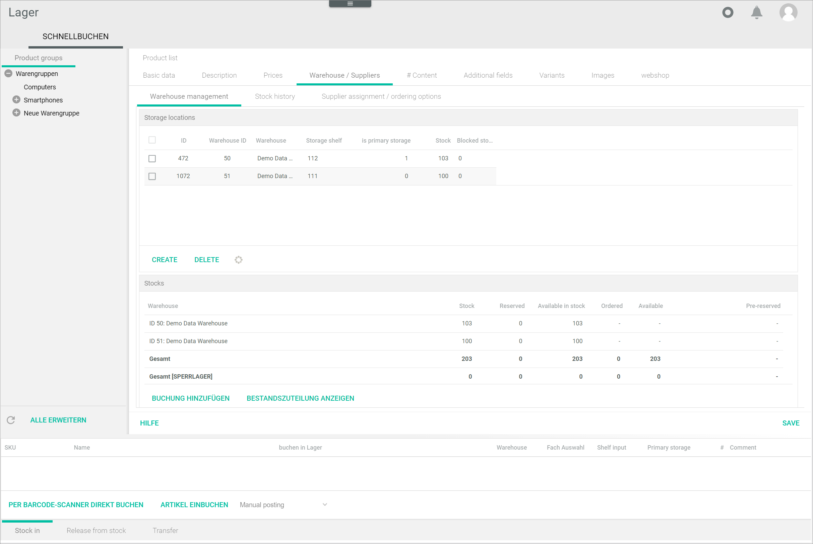
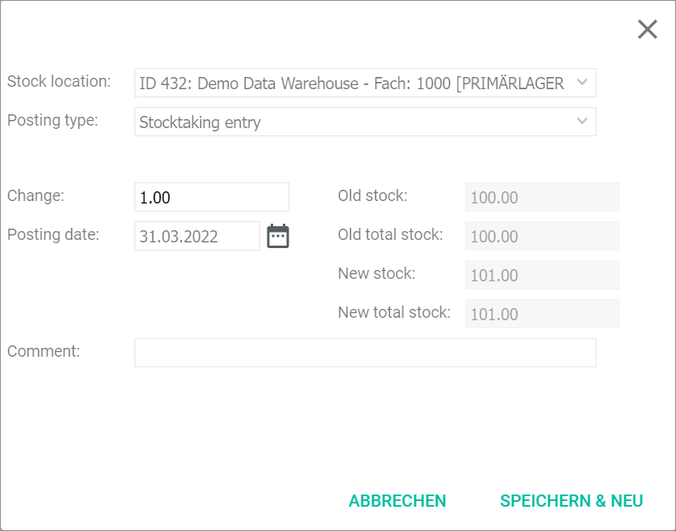

[!!User interface Omni-Channel Orders](../../Channels/UserInterface/05a_Orders.md)

[comment]: <> (add link to Warehouse module if available)

# Handle an out-of-stock order

#### Error message

Error booking bill: [stage: lager_book] Fehler beim Erzeugen der Lagerbuchungen: Der Bestand für Artikel *x* im Lager *x* ist nur 0.00, benötigt würden *x*.

Follow the instructions below if this error message is displayed.

#### Prerequisites

No prerequisites to fulfill.

#### Procedure

*Warehouse > Quick Booking > Tab QUICK BOOKING > Tab Product list*

1.  Double click the material in the material list that you want to check. Alternatively, first right click the material and click then the **Open** entry in the displayed context menu.    
    The material's details are displayed on several tabs below the material list. The *Basic data* tab is preselected.

    

2. Click the *Warehouse / Suppliers* tab.   
    The *Warehouse / Suppliers* tab is displayed. The *Warehouse management* sub-tab is preselected.

    

    > [Info] Check if a warehouse is displayed in the *Storage locations* section. You can only change the stock for the POS offer, if a warehouse is assigned.

3. Click the [ADD BOOKING] button at the bottom of the *Stocks* section.   
    A window to enter the posting is displayed.

    

4. Configure the following settings:

    + Click the *Stock location* drop-down list and select the appropriate warehouse from which you want to adjust the stock.

    + Click the *Posting type* drop-down list and select the appropriate reason for the posting. The following options are available:
        - **Reservation**
        - **Sale**
        - **Order**
        - **Purchase**
        - **Stocktaking entry**
        - **Stock transfer**
        - **Return**
        - **Problem**
        - **Pre-reserve**

    + Enter the number by which the stock level should be changed in the *Change* field.

        > [Info] For a stock level increase, enter a positive number. For a stock level decrease, enter a negative number with a minus sign as a prefix. In the right column of the window, the old stock level and a preview of the new stock level are displayed.  

    + If desired, select the date on which the stock level change will be posted in the *Posting date* field. By default, the current date is preselected.

    + If desired, enter a comment in the *Comment* field.

5. Click the [SAVE & NEW] button in the bottom right corner of the window.   
    The window is closed. The new stock level is displayed in the *Stocks* section.

6. Switch to the *Omni-Channel* module: *Omni-Channel > Orders and Returns > Tab ORDERS*.    
    The *ORDERS* tab is displayed.

    

7. Select the checkbox of the order that was out-of-order and click the [EXPORT TO OMS] button in the editing toolbar at the top.     
    The order export is restarted. During the export, the **Being exported** status is displayed in the *Status of export to OMS* column.

    > [Info] The export can take several minutes. Click the  (Process) button in the upper right corner to display the process window with the current state of export.

8. Click the  (Refresh) button in the upper right corner to update the order list.   
    The order status in the *Status of export to OMS* column changed to **Exported**. The order is correctly exported.

#### Was this chapter helpful?

If you need further assistance, please contact your MPS consultant.
