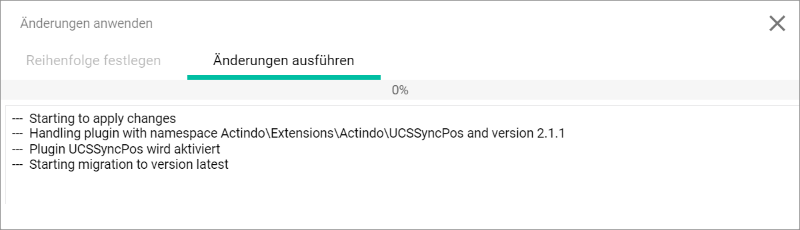
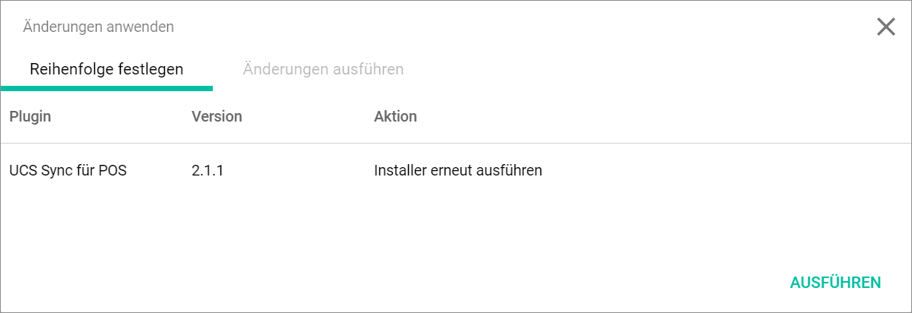

[comment]: <> (add link to Settings module if available)

# Establish the RetailSuite connection

#### Error description

<!---Ist das hier noch aktuell?-->
The RetailSuite is not connected to *POS*. The *DATA TRANSFER RETAILSUITE ORDER MANAGEMENT* section is not displayed in the global settings.

Follow the instructions below to establish the connection to the RetailSuite.

## Install the missing plugin

If the connection to the Retailsuite is not working, there could be a problem with the *UCS Sync for POS* plugin. If the plugin is not yet installed, the installation may fix the error and create a connection to the Retailsuite.

#### Prerequisites

- The *UCS Sync for POS* plugin is not yet installed.
- You have the rights to install a plugin in the *Platform Manager*.

#### Procedure

*Settings > Platform Manager > Tab PLUGIN OVERVIEW*

1. In the *Available modules* section click the three points right to the *Plugin* section.   
    A context menu is displayed.

    

2. Click the *Filters* entry.   
    The checkbox of the *Filters* entry is selected. A search bar is displayed right to the *Filters* entry.   

3. Enter **UCS Sync for POS** in the search bar and press **Enter** to start the search.
    The *UCS Sync for POS* plugin is displayed in the *Available modules* section.

    > [Info] If the *UCS Sync for POS* plugin is not displayed, check the spelling of the entered search keyword. If you did no spelling mistake, check again, if the plugin is not already installed by searching it in the *Installed modules* section on the right.

4. Click the *UCS Sync for POS* plugin in the *Available modules* section and, using drag and drop, pull it in the *Installed modules* section on the right.   
    The plugin is displayed in the *Installed modules* section. The *Status* column indicates, if all dependencies for installing the plugin are fulfilled.

    

    > [Info] Make sure that all dependencies are fulfilled before installing the plugin to guarantee the whole functionality.

5. Click the [APPLY] button in the upper right corner of the *Installed modules* section.   
    The *Apply changes* window is displayed. The *Set sequence* tab is preselected. The *UCS Sync for POS* plugin is displayed in the list.

    

6. Click the [APPLY] button in the bottom right corner of the window.   
    The *Apply changes* tab is displayed.

    

    The plugin is installed when the progress bar displays **100%**.

7. Press the **F5** key to initialize the *Core1 Platform*.

## Reinstall the plugin

If the connection to the Retailsuite is not working, there could be a problem with the *UCS Sync for POS* plugin. If the plugin is already installed, a rerun of the installation may fix the error and create a working connection to the Retailsuite.

#### Prerequisites

- The *UCS Sync for POS* plugin is already yet installed.
- You have the rights to install a plugin in the *Platform Manager*.

#### Procedure

*Settings > Platform Manager > Tab PLUGIN OVERVIEW*

1. Double-click the row of the *UCS Sync for POS* plugin in the *Installed modules* section.  
    The fields of the plugin are unlocked.

    

2. Select the **Rerun the installer** option in the drop-down list of the *Action* column.

3. Click the [UPDATE] button above the row.

4. Click the [APPLY] button in the upper right corner of the *Installed modules* section.   
    The *Apply changes* window is displayed. The *Set sequence* tab is preselected. The *UCS Sync for POS* plugin is displayed in the list.

    

5. Click the [APPLY] button in the bottom right corner of the window.   
    The *Apply changes* tab is displayed. The plugin is updated when the progress bar displays **100%**.

    

6. Press the **F5** key to initialize the *Core1 Platform*.

#### Was this chapter helpful?

If you need further assistance, please contact your MPS consultant.
