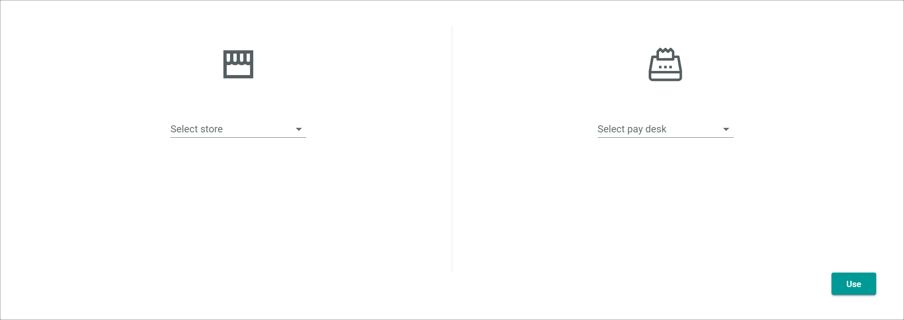

[!!Open a pay desk](../Operation/01_OpenPayDesk.md)

# Sales

The POS *Sales* menu entry is used for all transactions in the stores and pay desks.

The *Sales* user interface is composed of the following tabs:
- [CASHPOINT](./01a_Cashpoint.md)
- [HISTORY](./01b_History.md)
- [CASH REGISTER](./01c_CashRegister.md)
- [VOUCHERS](./01d_Vouchers.md)
- [RETURNS](./01e_Returns.md)
- [SETTINGS](./01f_Settings.md)

To access the tabs (except for the *VOUCHERS* and the *WISHLISTS* tab), you first have to select a store and a pay desk.

## Select store and pay desk

*Venduo POS > Sales*

- *Select store*   
    Click the drop-down list to display all available stores and select one. When you select a store, the drop-down list *Select pay desk* is unlocked.

- *Select pay desk*   
    Click the drop-down list to display all available pay desks for the selected store and select one. You can only select a pay desk, when a store is already selected.

- [Use]   
    Click this button to open the selected pay desk. The view to select an opening float is displayed.

## Select opening float

*Venduo POS > Sales > Select Store and Pay Desk*

- *Opening float*   
    Enter an opening amount for each currency used in the selected pay desk. The used currencies are defined in the global settings. For detailed information, see [Used currencies](./02a_GlobalSettings.md#used-currencies).  
    By default, the skimming amount of the last pay desk closing is preset. For detailed information, see [Skim to amount](./02a_GlobalSettings.md#skim-to-amount).

- [Open]   
    Click this button to open the selected pay desk.
