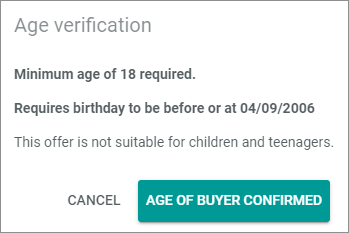
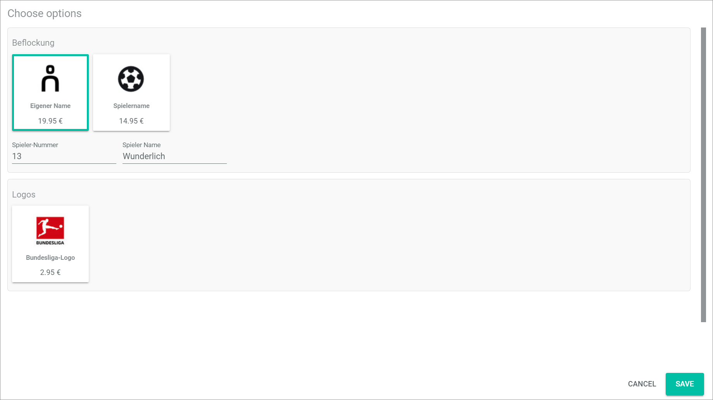
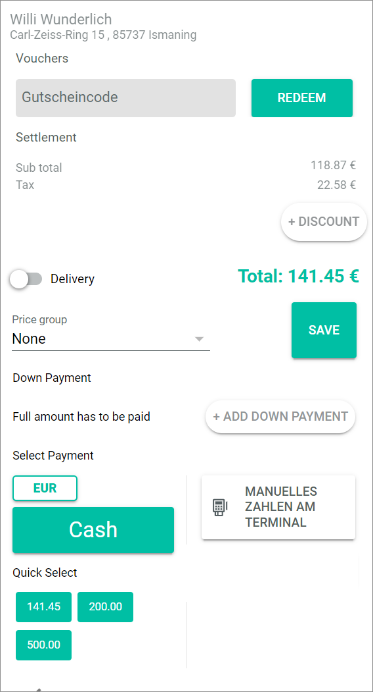
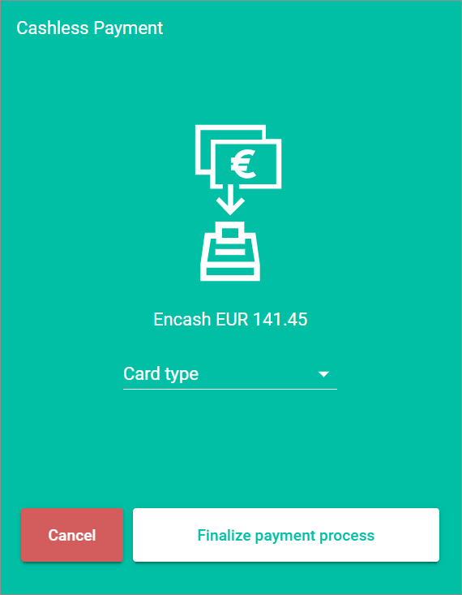
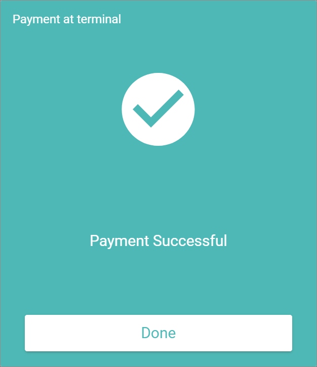
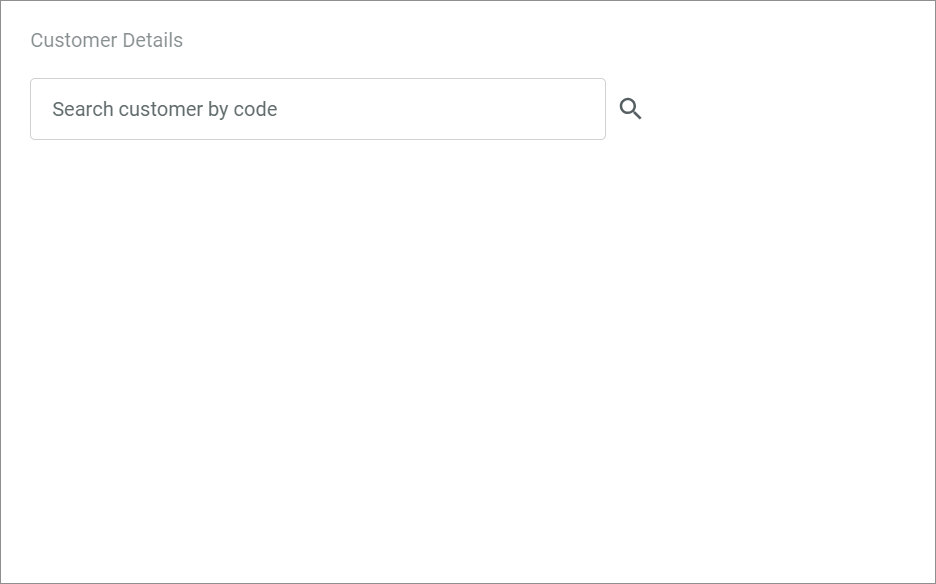
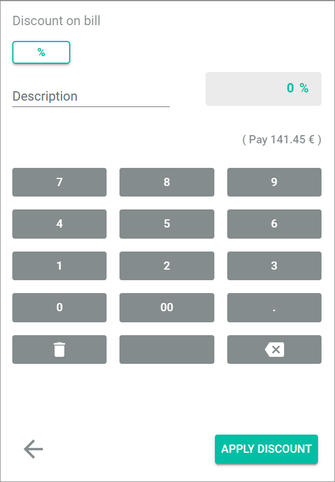
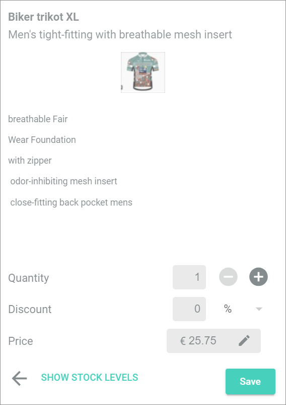

[!!Manage the offers](../Integration/07_ManageOffers.md)
[!!Record the purchase](../Operation/02_SelectOffer.md)
[!!Edit the bill list](../Operation/03_EditBillList.md)
[!!Complete a purchase](../Operation/04_CompletePurchase.md)
<!---Error-->

# Cashpoint

*Venduo POS > Sales > Select Store and Pay Desk > Tab CASHPOINT*

- *Find offer by name*    
    Enter the offer name, the keyword or the (EAN) number you search for in the search bar. Click an offer in the list of search results to add it to the bill list.

    > [Info] The search already provides you with proposals for your keyword as you type.

- *QuickSelect Category*    
    Click a QuickSelect category tab to display the associated QuickSelect elements. The tabs are only displayed if a QuickSelect category with an element has been created before. The categories are named individually. 

- *QuickSelect Element*   
    Click a QuickSelect element to add it to the bill list. The QuickSelect element is only displayed if a QuickSelect category with an element has been created before. The elements are named individually.  For detailed information, see [Create a QuickSelect Category](../Integration/07_ManageOffers.md#create-a-quickselect-category).

<!---NEU-->
## Age verification

*Venduo POS > Sales > Select Store and Pay Desk > Tab CASHPOINT > Select offer*

The *Age verification* window is displayed if a selected offer is not suitable for children and young people. For detailed information, see [Verify the age](../Operation/02_SelectOffer.md#verify-the-age).

- [AGE OF BUYER CONFIRMED]   
    Click this button if the customer is allowed to buy this offer.  
    The offer is added to the bill list.      

- [CANCEL]   
   Click this button if the customer is too young to buy this offer.   
   The offer is not added to the bill list. 

<!---NEU-->
## Choose options

*Venduo POS > Sales > Select Store and Pay Desk > Tab CASHPOINT > Select offer*

The *Choose options* window is displayed if a selected offer has additional product options that represent a service. For detailed information, see [Add a product option](../Operation/02_SelectOffer.md#add-a-product-option). 

- Additional field   
    Enter additional information to a single option, if applicable. This can be a text or a name that should be printed on a shirt or another item.

- [CANCEL]   
    Click this button if the customer no longer wants to purchase the offer associated with the product option.

- [SAVE]   
    Click this button if the customer wants to purchase the offer, or both the offer and the product option.   
    If you previously selected a product option, both the associated offer and the product option are added to the bill list.
    If you have not previously selected a product option, only the associated offer is added to the bill list.

<!---NEU-->
## Suggest an offer to the customer

*Venduo POS > Sales > Select Store and Pay Desk > Tab CASHPOINT > Select offer > Click [PAY]*

 

 - [PROCEED]  
   Click this button after you have suggested the offer to the customer. For detailed information, see [Suggest an offer to the customer](../Operation/04_CompletePurchase.md#suggest-an-offer-to-the-customer).

## Bill list

*Venduo POS > Sales > Select Store and Pay Desk > Tab CASHPOINT > Select offer*

<!---NEU-->
- (Customer details)      
    Click this button to scan a customer code with a barcode scanner or to enter the customer number manually, see [Assign a purchase via customer number](../Operation/03_EditBillList.md#assign-a-purchase-via-customer-number).

-  (Add Customer)   
    Click this button to assign the bill to a certain customer. The *Add customer* view is displayed, see [Add customer](#add-customer).

- *Customer Name and Address*   
    The customer name and address is displayed when the bill list is assigned to a customer. This field is read-only.

-  (Unassign Customer)  
    Click this button to unassign the customer from the bill list. The button is only displayed if the bill list has already been assigned to a customer.

- *Quantity x*    
    Quantity of the offer in the bill list. This field is only displayed if an offer has been added to the bill list.

- *Name*   
    Offer name. This field is only displayed if an offer has been added to the bill list.

- *Price*   
    Total gross price of the single offer(s).<!--- Hier stand net price. Bei mir ist aber der gross price--> This field is only displayed if an offer has been added to the bill list.   
    By default, the price is displayed in black. If the price has been modified, it will be displayed differently as follows:
    - Price is written in red and followed by an amount/a percentage in brackets:   
        The price is a discount price, the discount is indicated in brackets, either as a fixed discount or percentage.
    - Price is written in italics:   
        The price itself has been modified.
    - Price is crossed out and is displayed below the price that is charged:  
        The price have been changed directly without a discount (new price is written in italics) or the price is a price group price, see [Assign a price group](../Operation/04_CompletePurchase.md#assign-a-price-group).

-  (Remove offer)   
    Click this button to remove an offer from the bill list. This field is displayed only when an offer has been added to the bill list.

- * Single scan*   
    Activate this toggle to use the single scan feature, see [Use single scan](../Operation/02_SelectOffer.md#use-single-scan).

    > [Info] If the same offer is selected more than once, and you use the single scan feature, each offer is listed as a single offer in the bill list. This allows you to treat each offer in the posting individually. 

- *Sub total*   
    Net<!---Hier stand "Gross"--> amount of all offers in the bill list. This field is read-only.

- *Tax*   
    Tax amount of all offers in the bill list. This field is read-only.

- *Add Sale Note*   
    Enter a sale note to add any additional information to the bill list.

- [ Open drawer]   
    Click this button to open the drawer.

- [ Park]   
    Click this button to park the current bill list to a later time.

-  (Delete bill list)   
    Click this button to delete the current bill list.

- [PAY]   
    Click this button to start the payment process. The payment view is displayed in the bill list. The total gross amount of the purchase is displayed at the right of the [PAY] button.

## Pay bill list

*Venduo POS > Sales > Select Store and Pay Desk > Tab CASHPOINT > Select the PAY button*

   

- *Customer Name and Address*   
    The customer name and address is displayed, when the bill list is assigned to a customer. This field is read-only.

**Vouchers**

This section is only displayed when no voucher has been redeemed.

- *Voucher code*   
    Enter a voucher code to apply the voucher to the invoice.

- [REDEEM]   
    Click this button to redeem the voucher. A voucher can only be redeemed with a correct voucher code.

**Settlement**

- *Sub total*   
    Net <!---Hier stand Gross amount--> amount of all offers in the bill list. This field is read-only.

- *Tax*   
    Tax amount of all offers in the bill list. This field is read-only.

- [+ DISCOUNT]   
    Click this button to apply a discount to the bill. The *Discount on bill* view is displayed. This button is only displayed when no discount has been selected.

- [Discount ]      
    Selected discount. Click this button to edit the discount. This button is only displayed when a discount is selected.

-  (Remove Discount)    
    Click this button to remove the discount. The button is only displayed when a discount is selected.

- * Delivery*   
    Enable this toggle if the offer is to be delivered to the customer. Disable this toggle if no delivery is necessary. For detailed information, see [Initiate a delivery](../Operation/04_CompletePurchase.md#initiate-a-delivery).  

    This toggle is only available, if the *Delivery allowed* setting is activated in the *Global settings*. For detailed information, see [Deliveries allowed](./02a_GlobalSettings.md#deliveries-allowed). 

- *Voucher (xxxxxxx)*   
    Redeemed voucher with the voucher code in brackets. The remaining amount of the voucher is displayed on the left, the amount of the voucher to be credited on the right. This field is read-only.

-  (Remove Voucher)    
    Click this button to remove the voucher. The button is only displayed when a voucher is redeemed.

- *Total:*   
    Total gross<!--- Hier stand net--> amount of the bill. This field is read-only.

<!---NEU-->
**Down payment**

- [+ ADD DOWN PAYMENT]   
    Click this button to collect a down payment. For detailed information, see [Add down payment](#add-down-payment). This button is only available, if the *Down payment allowed* setting is activated in the *Global settings*, see [Down payment allowed](../UserInterface/02a_GlobalSettings.md#down-payments-allowed).

<!---NEU-->
**Price group**

- *Price group*    
    Click the drop-down list and select the desired price group, which is customer-specific. You can also select the **None** entry to remove the automatically granted price group. 

- [SAVE]   
    Click this button to confirm the price group assignment. If there are offers on the bill list for which a price group-specific price has been defined, the amounts on the bill list are changed.

**Select Payment**

- [EUR]   
    Default currency that is used for the payment.

[comment]: <> (Is it possible to add a second currency? Why is this a button when I cannot choose?)

- [Cash]   
    Click this button to enter a cash pay. The *Cash payment* view is displayed. For detailed information, see [Cash payment](#cash-payment).

**Quick Select**

- [Amount]   
    Click a button with a proposed cash amount. The offered amounts on the buttons vary depending on the amount of the purchase and the denomination of the currency defined in the global settings.  

**-- or --**

- [ MANUAL PAYMENT AT TERMINAL]   
    Click this button to pay cashless. The *Cashless payment* view is displayed.

<!--NEU-->
## Add down payment

*Venduo POS > Sales > Select Store and Pay Desk > Tab CASHPOINT > Select the [PAY] button > Select the [+ Add down payment] button*

- * Calculated via percentage*    
    Enable this toggle if you want to determine the down payment via a percentage amount. Disable the toggle to enter a fixed amount.

- *Percent*   
    Enter the percentage amount. This field is only displayed if you have previously enabled the *Calculated via percentage* toggle. In the field below the down payment amount is displayed.

- Field for amount   
    Enter the fixed amount. This field is only displayed if you have disabled the *Calculated via percentage* toggle. 

## Cash payment

*Venduo POS > Sales > Select Store and Pay Desk > Tab CASHPOINT > Select the [PAY] button > Select the [CASH] button*

- *Amount*   
    Enter the cash amount given by the customer using the number buttons or typing the amount directly into the field.

- *Number field*   
    Use the number buttons to enter the cash amount given by the customer.
    -  (Delete entry)   
        Click this button to delete the entered amount.

    -  (Delete last character)   
        Click this button to delete the last number (or character) entered in the field *Amount*.

-  (Back)   
    Click this button to cancel the cash payment and return to the payment view.

- [Pay]   
    Click this button to finalize the cash payment process. The payment can be finalized only if an amount equal or higher than the bill amount is entered in the *Amount* field. If an amount smaller than the bill amount or no amount at all is entered, an error message is displayed.   
    The *Payment Pending* view is displayed.  Click the [Done] button to finalize the payment process. The *Payment Successful* view is than displayed.  
    

### Payment pending   

The *Payment Pending* view is displayed when the cash payment has been confirmed. When the cash payment process has been completed, the *Payment Successful* view is automatically displayed.

- *Total*   
    Total bill amount. This field is read-only.

- *Paid*   
    Amount given by the customer. This field is read-only.

- *Change*   
    Amount of change to be given to the customer. This field is read-only.

### Payment successful   

The *Payment Successful* view is automatically displayed when the cash payment process has been successfully completed.

- *Total*   
    Total bill amount. This field is read-only.

- *Paid*   
    Amount given by the customer. This field is read-only.

- *Change*   
    Amount of change to be given to the customer. This field is read-only.

- [Done]   
    Click this button to confirm the completion of the payment process and return to the bill list.

## Cashless payment

*Venduo POS > Sales > Select Store and Pay Desk > Tab CASHPOINT > [PAY] > [MANUELLES ZAHLEN AM TERMINAL]*

  

- *Card type*   
    Click the drop-down list to select the used card type or payment method. By default, the payment methods below are available. Additional cashless payment methods can be defined in the Global Settings, see [Payment methods (manual payment terminal](./02a_GlobalSettings.md#payment-methods-manual-payment-terminal).  
    - **Debit card**
    - **Credit card**
    - **Paypal**    

- [Cancel]   
    Click this button to cancel the cashless payment process and return to the payment view.

- [Finalize payment process]   
    Click this button to finalize the cashless payment process. The *Payment at terminal* view is displayed.   
    The payment can be finalized only if a payment method is selected in the drop-down list *Card type*.

### Payment at terminal   

The *Payment at terminal* view is automatically displayed when the cash payment process has been successfully completed.

- *Total*   
    Total bill amount. This field is read-only.

- *Paid*   
    Amount given by the customer. This field is read-only.

- *Change*   
    Amount of change to be given to the customer. This field is read-only.

- [Done]   
    Click this button to confirm the completion of the payment process and return to the bill list.

## Add customer

*Venduo POS > Sales > Select Store and Pay Desk > Tab CASHPOINT > Button Add Customer*

-  (Cancel)   
    Click this button to cancel the operation and close the *Add Customer* view.

- *Find existing customer... *    
    Enter the customer name you search for in the search bar. Click a customer in the list of search results to assign the bill to the customer.

- [  Create Customer]   
    Click this button to register a customer. The *Create Customer* view is displayed.

<!---NEU-->
## Customer details

*Venduo POS > Sales > Select Store and Pay Desk > Tab CASHPOINT > Button Customer details*

- *Search customer by code*    
    Scan the customer number by a barcode scan or enter the customer number manually.    
    The customer's details are displayed. This is the name and address, but can also be the price group to which a customer is assigned or the discount granted.

-  (Search)   
    Click this button to start the search.

-    
    Click this button to apply the customer data to the bill list.

## Create customer

*Venduo POS > Sales > Select Store and Pay Desk > Tab CASHPOINT > Button Add Customer > Button Create Customer*

-  (Cancel)   
    Click this button to cancel the operation and close the *Add Customer* view.

- *Title*   
    Enter the title of the customer.

- *First name*   
    Enter the first name of the customer.

- *Last name*   
    Enter the last name of the customer.

- *Company*   
    Enter the company name of the customer.

- *Email*   
    Enter the email address of the customer.

- *Street*   
    Enter the street of the customer's address.

- *House Number*   
    Enter the house number of the customer's address.

- *ZIP*   
    Enter the ZIP code of the customer's address.

- *City*   
    Enter the city of the customer's address.

- *Country*   
    Enter the country of the customer's address.

-  (Back)   
    Click this button to cancel the registration of the customer and close the current view.

- [  Create Customer]   
    Click this button to register the customer and assign the bill to the customer. The *Add Customer* view is closed and the bill list is displayed again.

## Discount on bill

*Venduo POS > Sales > Select Store and Pay Desk > Tab CASHPOINT > [PAY] > [+ DISCOUNT]*

-  (Percent)   
    Click this button to select percentage as the type of discount. By default, the percentage discount is preselected.

- *Description*   
    Enter a description of the discount.

- *Discount*   
    This field displays the selected amount and type of discount. The field is read-only.

- *(Pay XX.XX €)*   
    This field displays the current amount of the bill less the discount entered. If you enter or edit a discount, the amount is automatically adjusted.

- - *Number field*   
    Use the number buttons to enter the discount.
    -  (Delete entry)   
        Click this button to delete the entered discount.

    -  (Delete last character)   
        Click this button to delete the last number (or character) of the discount entered.

-  (Back)   
    Click this button to cancel the discount on the bill and return to the payment view.

- [APPLY DISCOUNT]   
    Click this button to apply the entered discount. The payment view with the entered discount is displayed.

## Offer details

*Venduo POS > Sales > Select Store and Pay Desk > Tab CASHPOINT > Select offer in the bill list*

- *Quantity*   
    Quantity of the selected offer in the bill list.

-  (Minus)  
    Click this button to decrease the quantity in the field *Quantity* by 1. The button is locked, when the quantity equals **1**.

-  (Plus)  
    Click this button to increase the quantity in the field *Quantity* by 1.

- *Discount*   
    Discount on the selected offer in the bill list.

- *%/Currency*   
    Click this drop-down list and select the type of discount. The following options are available:
    - **%**   
        A percentage discount is applied.
    - **EUR** (currency)   
        A fixed price discount in the selected currency is applied.

- *Price*   
    Price of the selected offer in the bill list.

-   (Edit)   
    Click this button to unlock the price field and edit the price of the selected offer.

- [SHOW STOCK LEVELS]   
    Click this button to display the stock level of the selected offer in all other stores of your company.   
    The *Stock levels* window is displayed. It provides a list of the stock levels of this offer in all stores.

-  (Back)   
    Click this button to cancel the changes to the offer and return to the bill list.

- [Save]   
    Click this button to save the changes to the offer and return to the bill list.
