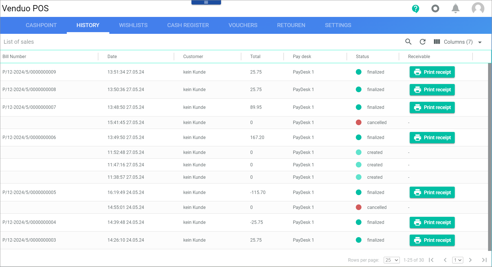

# History

*POS > Sales > Tab HISTORY*

**List of sales**

The table displays the history of sales. Depending on the settings, the displayed columns may vary.

- *Bill Number*   
    Bill number of the sale in POS. This field is read-only.

- *Date*   
    Date and time of the sale. This field is read-only.

- *Customer*   
    Name of the customer. If the sale was not assigned to a registered customer, *no customer* is displayed. This field is read-only.

- *Total*  
    Total sales amount. This field is read-only.

- *Pay desk*   
    Name of the pay desk where the sale was made. This field is read-only.
  
- *Status*   
    Sales status. The following statuses are available:
    -  (turquoise)   
        The sale is in progress.
    -  (blue)   
        The sale is completed.
    -  (red)   
        The sale has been canceled.

- *Receivable*   
    Click the [ Print receipt] button to print the sales receipt. The button is only displayed when the sale is finalized. When no receipt is available, a dash (*-*) is displayed.

    > [Info] The printer must be configured to print the sales receipt.

- *ID*   
    Sales ID.
