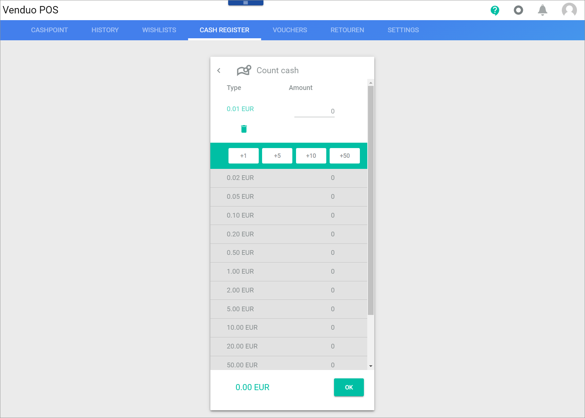
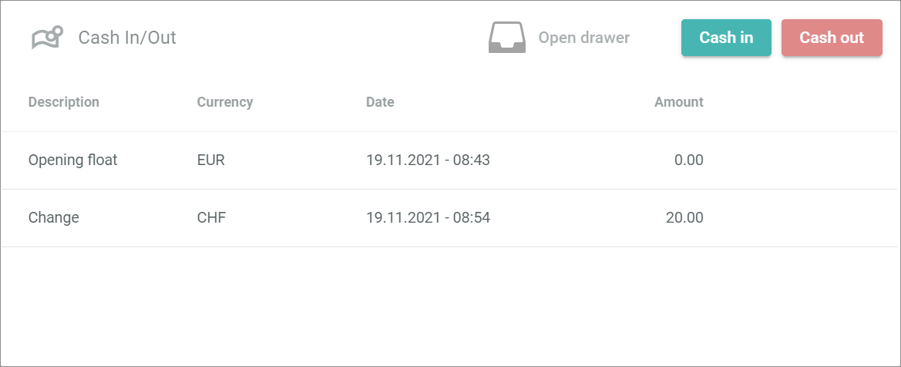
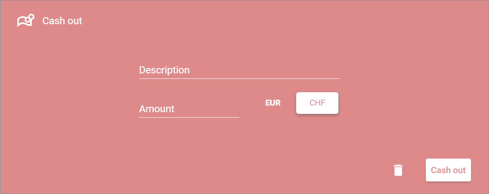

[!!User interface Global settings](./02a_GlobalSettings.md)
[!!Complete a purchase](../Operation/04_CompletePurchase.md)
[!!Manage the cash register](../Operation/05_ManageCashRegister.md)

# Cash register

*Venduo POS > Sales > Select Store and Pay Desk > Tab CASH REGISTER*

The *Cash Register* tab is divided into two boxes:
- [Payment Tally](#payment-tally)
- [Cash in/out](#cash-in-cash-out)

## Payment tally

*Venduo POS > Sales > Select Store and Pay Desk > Tab CASH REGISTER > Payment tally box*

The *Payment tally* box is used to close the pay desk. To close a pay desk, you must count the current cash amount in the pay desk. 

-  (Open Drawer)  
    Click this button to open the cash drawer.

- [CLOSE REGISTER]   
    Click this button to close the pay desk. You can close the pay desk only if an amount is entered *Counted* column field.

- *Payment Type*   
    Type of the cash amount in the pay desk. By default, the type is **Cash**. This field is read-only.

- *Currency*   
    Currency of the cash amount in the pay desk. A single row is displayed for each available currency defined in the global settings. This field is read-only. For detailed information, see [Available currencies](./02a_GlobalSettings.md#available-currencies).

- *Expected*   
    Cash amount in the pay desk expected by all transactions during the shift. If the setting *Hide expected amount* in the [Global settings](./02a_GlobalSettings.md#erwarteten-vertrag-verbergen) is active, the expected cash amount is hidden and a dash **-** is displayed. This field is read-only.

- *Counted*   
    Enter the counted cash amount in the pay desk by entering the amount directly into the field or by clicking the  (Calculator) button. In this case, the *Count cash* view is displayed.

- *Difference*   
    Difference amount between the expected and the counted cash amount in the pay desk. If no expected amount is displayed, no difference amount is displayed, but a dash **-**.

- *Skim to*   
    Enter a cash amount up to which the pay desk is skimmed after closing. If a skimming amount is predefined in the global settings, the field is preset with this amount. For detailed information, see [Skim to amount](./02a_GlobalSettings.md#skim-to-amount).

### Count cash

*Venduo POS > Sales > Select Store and Pay Desk > Tab CASH REGISTER > Button Calculator*

The *Count cash* window is used to faciliate the calculation of the cash count.

- *Type*   
    Type of coins or banknotes of the default currency. The displayed types of coins and banknotes are defined by the currencies in the global settings. For detailed information, see [Currencies](./02a_GlobalSettings.md#currencies).

- *Amount*   
    Enter the amount counted of the selected type of coins or banknotes by using the buttons or entering the amount directly into the field.

-  (Delete)   
    Click this button to delete the entered amount of the selected type of coins or banknotes.

- [ +1 ]   
    Click this button to increase the counted amount of the selected type of coins or banknotes by 1.

- [ +5 ]   
    Click this button to increase the counted amount of the selected type of coins or banknotes by 5.

- [ +10 ]   
    Click this button to increase the counted amount of the selected type of coins or banknotes by 10.

- [ +50 ]   
    Click this button to increase the counted amount of the selected type of coins or banknotes by 50.

- [OK]   
    Click this button to confirm the counted cash amount and close the *Count cash* view.

## Cash in/Cash out

*Venduo POS > Sales > Select Store and Pay Desk > Tab CASH REGISTER > Cash in/out box*

The *Cash in/out* box is used to post sales independent cash ins and cash outs. In this case, you have to log that in the cash register.

- [  Open Drawer]  
    Click this button to open the cash drawer.

- [Cash in]   
    Click this button to post a cash in. The *Cash in* view is displayed.

- [Cash out]   
    Click this button to post a cash out. The *Cash out* view is displayed.

- *Description*   
    Short description of the cash in or cash out reason. The first row always lists the opening float of the pay desk.

- *Currency*   
    Currency of the cash in or cash out process. This field is read-only.

- *Date*   
    Date and time of the cash in or cash out process.

- *Amount*   
    Cash amount of the cash in or cash out process.

### Cash in

*Venduo POS > Sales > Select Store and Pay Desk > Tab CASH REGISTER > Button Cash in*

The *Cash in* box is used to deposit sales-independent cash at the pay desk. In this case, you have to log that in the cash register. Note that this box is green to avoid confusion with the *Cash out* box.

- *Description*   
    Enter a short description of the cash in.

- *Amount*   
    Enter the cash amount of the cash in.

- [Currency]    
    Click this button to select the currency of the cash in. A single button is displayed for each available currency defined in the global settings. For detailed information, see [Available currency](./02a_GlobalSettings.md#available-currencies).    

-  (Delete)    
    Click this button to delete the entered cash in or cancel the cash in process and close the *Cash in* view.

- [Cash in]   
    Click this button to save the cash in and close the *Cash in* view.    
    The cash in is posted with a positive amount, for example, 50 (EUR).

### Cash out

*Venduo POS > Sales > Select Store and Pay Desk > Tab CASH REGISTER > Button Cash out*

The *Cash out* box is used to withdraw sales-independent cash at the pay desk. In this case, you have to log that in the cash register. Note that this box is red to avoid confusion with the *Cash in* box.

- *Description*   
    Enter a short description for the cash out reason.

- *Amount*   
    Enter the cash amount of the cash out.

- [Currency]     
    Click this button to select the currency of the cash out. A single button is displayed for each available currency defined in the global settings. For detailed information, see [Available currency](./02a_GlobalSettings.md#available-currencies).

-  (Delete)    
    Click this button to delete the entered cash out or cancel the cash in process and close the *Cash out* view.

- [Cash in]   
    Click this button to save the cash out and close the *Cash out* view.     
    The cash out is posted with a negative amount, for example, -50 (EUR).
