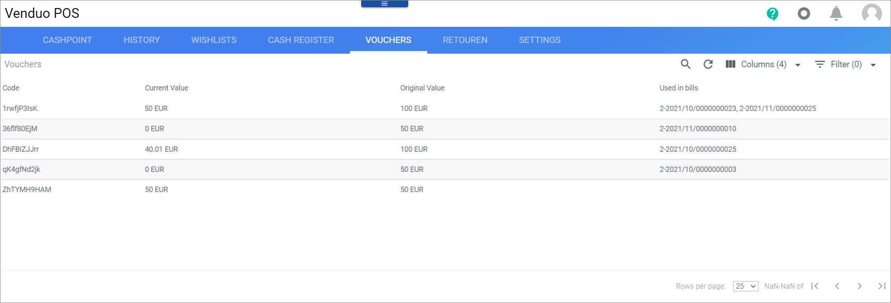

# Vouchers

*Venduo POS > Sales > Tab VOUCHERS*

**Vouchers**

The table displays all vouchers. All fields are read-only. Depending on the settings, the displayed columns may vary.

- *Code*   
    Voucher code to be entered in the bill list to redeem the voucher.

- *Current value*   
    Current value of the voucher.

- *Original value*   
    Voucher value at issuance.

- *Used in bills*   
    POS bill numbers of the bills for which the voucher was redeemed.
