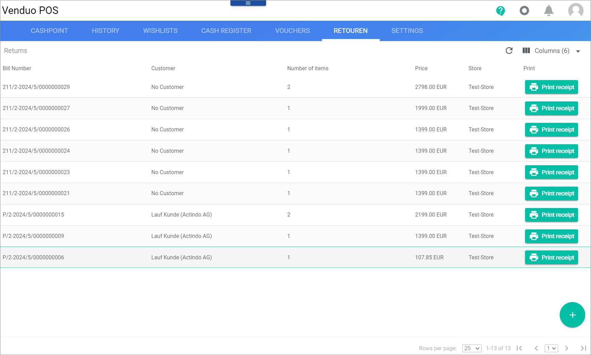
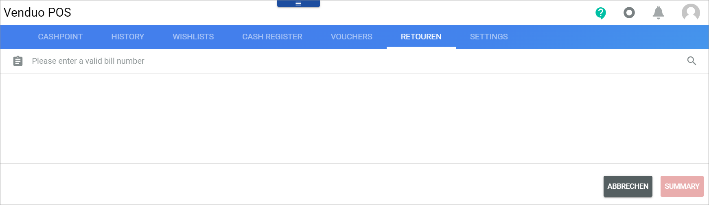
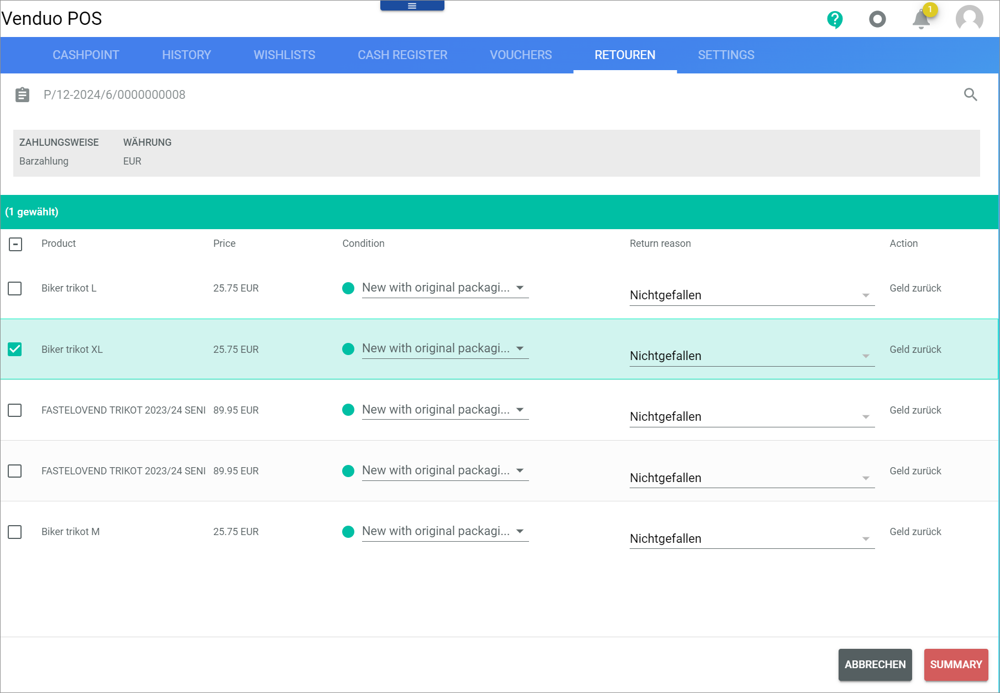
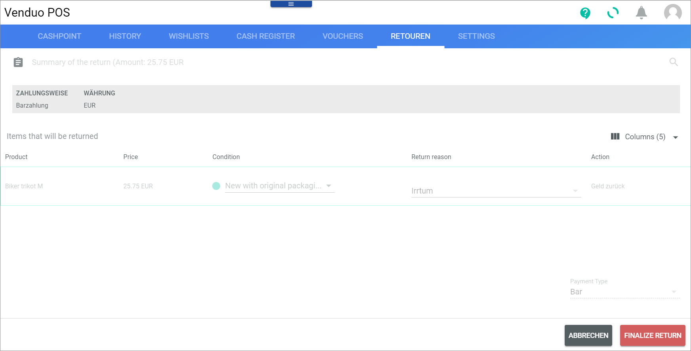

# Returns

*Venduo POS > Sales > Select Store and Pay Desk > Tab RETURNS*
<!---Error-->

**Returns**

The table displays all returns. Depending on the settings, the displayed columns may vary.

- *Bill number*   
    POS bill number of the return. This field is read-only.

- *Customer*   
    Name of the customer who has returned the items. This field is read-only.

- *Number of items*   
    Number of items that are returned. This field is read-only.

- *Price*   
    Price of items that are returned. This field is read-only.

- *Store*   
    Store to which the items are returned. This field is read-only.

- *Print*   
    Click this button to print a receipt of the return.

- *ID*   
    ID number of the return. This field is read-only.

-  (Add)   
    Click this button to add a return to the list. The *Add Return* view is displayed.

<!--- Ab hier zuende dokumentiert-->

## Add return

*Venduo POS > Sales > Select Store and Pay Desk > Tab RETURNS > Button Add*

The *Add return* view is used to select the bill number of the offer that a customer wants to return.

- * Please enter a valid bill number*    
    Enter the bill number of the return to be added to the returns list.

-  (Search)   
    Click this button to start the search for the entered bill number.

- [CANCEL]   
    Click this button to cancel the process and close the *Add Return* view.

- [SUMMARY]   
    Click this button to display a summary of all returns after you have defined the return.

## Define return

*Venduo POS > Sales > Select Store and Pay Desk > Tab RETURNS > Button Add > Select bill number*

**Bill number**

The *Bill number* view is used to specify the return reason and the condition of the offer to be returned and to initiate the refund.

- Bill number   
    Number of the bill that documents the sale of the offer.

- *Payment method*   
    Method by which the payment was made. This field is read-only.

- *Currency*  
    Currency in which the offer was purchased. This field is read-only.

**Items that will be returned**

- *Offer*   
    ID of the offer that was purchased. This field is read-only.

- *Price*   
    Selling price of the bill, that means the price of the offer at the time of sale. This field is read-only.

- *Condition*   
    Click the drop-down list and select the condition of the offer that the customer wants to return.

- *Return reason*     
    Indicate the reason that prompted the buyer to return the offer.

- *Action*  
    Action that results in the return, such as money-back. This field is read-only.

- [CANCEL]    
    Click this button to cancel the process and close the *Bill number* view.

- [SUMMARY]   
    Click this button to initiate the return. Select the offer first so that the button is ready for input.

## Summary of the return

*Venduo POS > Sales > Select Store and Pay Desk > Tab RETURNS > Button Add > Select bill number > Click [SUMMARY]*

The *Summary of the return (Amount)* view is used to define the refund method and to finalize the return.

- *Payment method*   
    Method by which the payment was made. This field is read-only.

- *Currency*   
    Currency in which the offer was purchased

**Items that will be returned**

- *Offer*   
    ID of the offer that was purchased. This field is read-only.

- *Price*   
    Selling price of the bill, that means the price of the offer at the time of sale. This field is read-only.

- *Condition*   
    Click the drop-down list and select the condition of the offer that the customer wants to return.

- *Return reason*     
    Indicate the reason that prompted the buyer to return the offer.

- *Action*  
    Action that results in the return, such as money-back. This field is read-only

- *Payment type*   
    Method by which the refund is to be made. This drop-down list is read-only if the [Refund only on the same payment method](../UserInterface/02a_GlobalSettings.md#refund-only-on-the-same-payment-method) setting is active.
    The following values are available:
    - Manual payment at terminal
    - Bar

- *Card type*     
    Click the drop-down list to select the card type. It is only available if the payment was made with the Manual payment at terminal method. It determines how the refund should be transferred.

- [FINALIZE RETURN]   
    Click this drop-down list to finalize the return.

- [CANCEL]    
    Click this button to cancel the process and close the *Summary of the return (Amount)* view.

