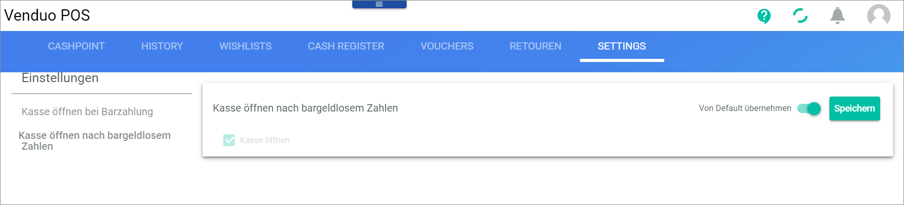

# Settings

*Venduo POS > Sales > Select Store and Pay Desk > Tab SETTINGS*
<!---Error-->

In this tab, you can configure the settings for the cash drawer:
- [Open drawer for cash payment](#open-drawer-for-cash-payment)
- [Open drawer after cashless payment](#open-drawer-after-cashless-payment)

## Open drawer for cash payment

Activate or deactivate the option to open the cash drawer for cash payment.

- [x] *Open drawer for cash payment*   
    Select this checkbox to open the cash drawer for cash payment.

- *Apply from default*      
    Activate this toggle to apply the default settings or deactivate this toggle to specify custom settings. When the toggle is active, all fields in the view are locked. By default, this toggle is active.

- [Save]   
    Click this button to save any changes.

## Open drawer after cashless payment

Activate or deactivate the option to open the cash drawer for cashless payment.

- [x] *Open drawer*    
    Select this checkbox to open the cash drawer for cashless payment.

- *Apply from default*      
    Activate this toggle to apply the default settings or deactivate this toggle to specify custom settings. When the toggle is active, all fields in the view are locked. By default, this toggle is active.

- [Save]   
    Click this button to save any changes.
