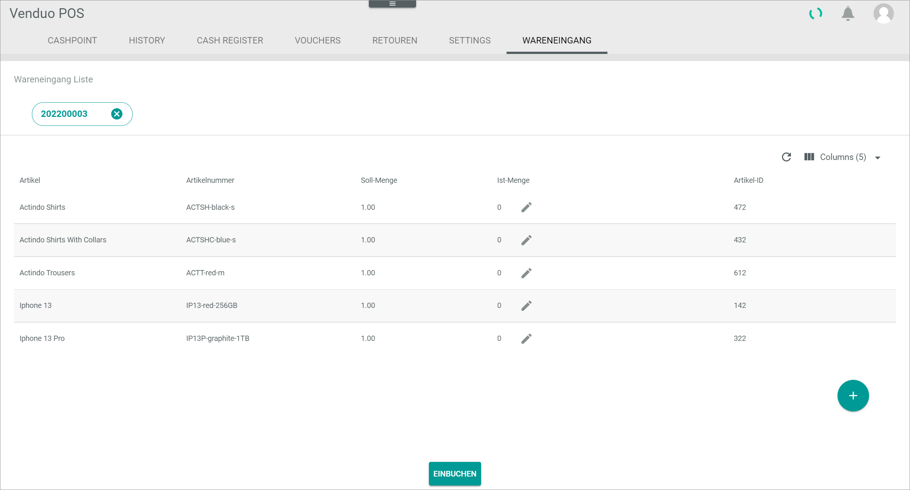

# Wareneingang

This tab is only displayed, when the global setting *Shop-Lieferungen aktiv* is active.

*Venduo POS > Sales > Select Store and Pay Desk > Tab WARENEINGANG*

**Wareneingang Liste**

- *Lieferscheinnummer*    
    Enter the number of the delivery bill.

- [LISTE LADEN]   
    Click this button to open the list of incoming goods to the entered delivery bill number.

- *Artikel*    
    Product name.

- *Artikelnummer*    
    Product number.

- *Soll-Menge*    
    Target quantity of the item.

- *Ist-Menge*    
    Actual quantity of the item.

-  (Edit)   
    Click this button to edit the number of items on the delivery bill.

- *Artikel-ID*    
    Product identification number.

- [EINBUCHEN]   
    Click this button to book the items from the delivery bill list into the warehouse.

[comment]: <> (Is that right?)

[comment]: <> (to be completed)
