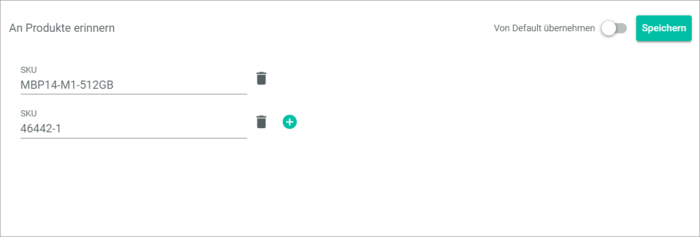
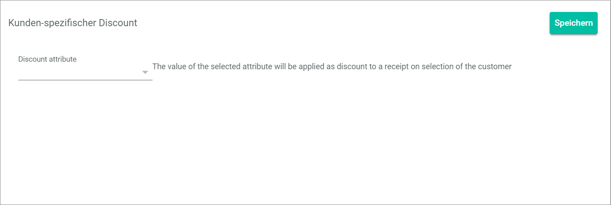

[!!Configure the global settings for POS](../Integration/05_ConfigureGlobalSettings.md)

# Global settings

*POS > Management > Tab GLOBAL SETTINGS*

In the *GLOBAL SETTINGS* tab, you define basic settings for all your stores.

> [Info] Global settings are valid for all stores as long as no different settings are defined for the respective stores or pay desks.

In principle, the more specific setting always overrides the more general setting.

In the left part of the page, the selection list *Settings* is displayed. The list is divided in the following sections:
- [GENERAL](#general)
- [CURRENCIES](#währungen)
- [RETURNS](#retouren)
- [RECEIPT PRINT](#belegdruck)
- [DATA TRANSFER ORDER MANAGEMENT ](#datenübertragung-retailsuite-faktura)

In the right part of the page, a view of the selected setting is displayed when clicking on it.

In the following, each setting and its view is explained.

## GENERAL

In this section, you define all pay desk and payment settings.

### Format of sequence number 

*POS > Management > Tab GLOBAL SETTINGS > Entry Format of sequential number*

Configure the details of the POS specific cash receipt number. The cash receipt number is independent of the receipt number in the *Order Management* module and is therefore selected from a different number range to be defined here.

- *Apply from default*    
    Activate this toggle to apply the default settings or disable this toggle to specify custom settings. When the toggle is enabled, all fields in the view are locked. By default, this toggle is enabled.

- [Save]    
    Click this button to save any changes.

- *Format*   
    Define the format of the sequential number. It is mandatory to include the store identifier (S) and the sequential number (L). The place holders are indicated on the right side.

- *Length of the sequential number*   
    Define the number of digits of the sequential number.
    <!--- Stimmt das so? Digits oder characters?--->    

- [x] *Reset after time interval*   
    Choose whether or not to reset the sequential number after the time interval.

[comment]: <> (What does it mean?)

<!--- NEU-->
### Deliveries allowed

*POS > Management > Tab GLOBAL SETTINGS > Entry Deliveries allowed*

The deliveries allowed setting enables the cashiers to initiate a delivery during the payment process. For detailed information, see [Initiate a delivery](../Operation/04_CompletePurchase.md#initiate-a-delivery).

- *Apply from default*   
    Enable this toggle to apply the default settings or disable this toggle to specify custom settings. When the toggle is enabled, all fields in the view are locked. By default, this toggle is enabled.   

- [Save]   
    Click this button to save any changes

- *Deliveries allowed*   
    Activate this setting if you deliver sales to customers. If you activate this setting, the  *Delivery* toggle is available in the payment view. By default, this setting is not activated.   
    Do not forget to adjust your order workflow accordingly, so that a delivery note is created in case a delivery is initiated.<!---stimmt das?--> 

<!--- NEU-->
### Down payments allowed

*POS > Management > Tab GLOBAL SETTINGS > Down payments allowed*

By default, down payments are not allowed.

- *Apply from default*   
    Enable this toggle to apply the default settings or disable this toggle to specify custom settings. When the toggle is enabled, all fields in the view are locked. 

- [Save]   
    Click this button to save any changes

- *Down payments allowed*
    Activate this setting if it is allowed to down pay sales. By default, this setting is not activated. If you activate this setting, the *Down payment* section with the [+ ADD DOWN PAYMENT] button is displayed in the *Pay bill* list.
    <!---Muss man hier dafür sorgen, dass ein bestimmtes Konto gefüllt wird im Accounting bei Anzahlungen? Oder muss man den Workflow anpassen?-->

### Always print the receipt

*POS > Management > Tab GLOBAL SETTINGS > Entry Always print the receipt*

Activate or disable the option to print the cash receipt.

- *Apply from default*      
    Activate this toggle to apply the default settings or disable this toggle to specify custom settings. When the toggle is enabled, all fields in the view are locked. By default, this toggle is enabled.

- [Save]   
    Click this button to save any changes.

- [x] *Always print the receipt*   
    Choose whether or not to print the cash receipt for each transaction. If the receipt printing is deactivated, you can still initiate the receipt printing manually via the order history.

    > [Info] Remember that receipt printing is mandatory in several countries. Please inform yourself about the country-specific regulations before you disable this option.

### Number of vouchers per order

*POS > Management > Tab GLOBAL SETTINGS > Entry Number of vouchers per order*

Define how many vouchers may be redeemed per order.

- *Apply from default*      
    Activate this toggle to apply the default settings or disable this toggle to specify custom settings. When the toggle is enabled, all fields in the view are locked. By default, this toggle is enabled.

- [Save]    
    Click this button to save any changes.

- *Number of vouchers per order*   
    Enter the number of vouchers that can be redeemed per order. By default, one voucher per order is set.

- *Apply from default*      
    Activate this toggle to apply the default settings or disable this toggle to specify custom settings. When the toggle is enabled, all fields in the view are locked. By default, this toggle is enabled.

- [Save]    
    Click this button to save any changes.

### Payment methods (manual payment terminal)

*POS > Management > Tab GLOBAL SETTINGS > Entry Payment methods (manual payment terminal)*

If you use an external terminal that is not connected to POS, cashless payment is completed manually through that terminal.
In POS, you can specify for statistical purposes which payment method was used for the cashless payment. You define the different payment methods in this setting.

> [Info] By default, the payments methods *debit card*, *credit card* and *PayPal* are preset.

- [Save]   
    Click this button to save any changes.

- *Key*   
    Enter the key of the payment method. The following keys are available:

[comment]: <> (list of keys is needed) <!--Gibt es eine liste der Keys oder werden die individuell angelegt?-->

- *Name*   
    Enter the name of the payment method.

-  (Delete)    
    Click this button to delete the payment method left to the button.

-  (Add)    
    Click this button to add a new payment method. A new line for a payment method is displayed.

### Automatic discount

*POS > Management > Tab GLOBAL SETTINGS > Entry Automatic discount*

Define a discount that is automatically applied above a certain amount.

- *Apply from default*      
    Activate this toggle to apply the default settings or disable this toggle to specify custom settings. When the toggle is enabled, all fields in the view are locked. By default, this toggle is enabled.

- [Save]    
    Click this button to save any changes.

- *As of amount*   
    Enter the amount from which the discount is granted.

- *Discount in %*   
    Enter the amount of the discount in percent.

    > [Info] If you leave the fields blank, no automatic discount will be granted.

-  (Delete)   
    Click this button to delete the discount left to the button.

-  (Add)  
    Click this button to add a new discount. A new line for a discount is displayed.

### Open drawer at cash payment

*POS > Management > Tab GLOBAL SETTINGS > Entry Open drawer at cash payment*

Activate or deactivate the option to open the cash drawer for cash payment.

- *Apply from default*      
    Activate this toggle to apply the default settings or disable this toggle to specify custom settings. When the toggle is enabled, all fields in the view are locked. By default, this toggle is enabled.

- [Save]   
    Click this button to save any changes.

- [x] *Open drawer at cash payment*   
    Choose whether or not to open the cash drawer for cash payment. By default, this option is active.

### Open drawer at cashless payment

*POS > Management > Tab GLOBAL SETTINGS > Entry Open drawer at cashless payment*

Enable or disable the option to open the cash drawer for cashless payment.

- *Apply from default*      
    Activate this toggle to apply the default settings or disable this toggle to specify custom settings. When the toggle is enabled, all fields in the view are locked. By default, this toggle is enabled.

- [Save]   
    Click this button to save any changes.

- [x] *Open drawer*    
    Choose whether or not to open the cash drawer for cashless payment. By default, this option is enabled.

## VAT ID

*POS > Management > Tab GLOBAL SETTINGS > Entry VAT ID*

Enter the VAT ID of your company, which is mandatory to be indicated on receipts in some countries.

- [Save]    
    Click this button to save any changes.

- *VAT ID*   
    Enter your VAT ID. By default, The VAT ID is printed on your receipts.

### Cashless payment

*POS > Management > Tab GLOBAL SETTINGS > Entry Cashless payment*

  

Activate or deactivate the options for cashless payment.

- *Apply from default*      
    Enable this toggle to apply the default settings or disable this toggle to specify custom settings. When the toggle is enabled, all fields in the view are locked. By default, this toggle is enabled.

- [Save]   
    Click this button to save any changes.

- [x]  *Refund on voucher (refund only)*   
    Choose whether or not to refund cashless payments only on vouchers. By default, this option is inactive.

- [x]  *Manual payment at terminal*   
    Choose whether or not to allow cashless payments via manual payment at the terminal. If you use an external terminal that is not connected to POS, you need to enable that option. By default, this option is inactive.

### Bind cash journal to user

*POS > Management > Tab GLOBAL SETTINGS > Entry Bind cash journal to user*

When a pay desk is opened, it is linked to a specific user. This user is the only one who can use the pay desk until he closes it again. To allow that several users can access the same pay desk without closing it, you can deactivate the option to link the cash register to a specific user.

- *Apply from default*      
    Activate this toggle to apply the default settings or disable this toggle to specify custom settings. When the toggle is enabled, all fields in the view are locked. By default, this toggle is enabled.

- [Save]    
    Click this button to save any changes.

- [x] *Bind cash journal to user*   
    Choose whether or not to link the cash register to a special user. By default, this option is active.

    > [Info] Remember that even if you deactivate this option, a user must log out to allow another user to access the pay desk.

### Skim to amount

*POS > Management > Tab GLOBAL SETTINGS > Entry Skim to amount*

Define an amount up to which the pay desk is skimmed after the pay desk closes. The amount is automatically entered in the cash register and taken as the opening float.

- [Save]  
    Click this button to save any changes.

- *Skim to amont*    
    Enter the amount up to which the pay desk is skimmed after the pay desk closing.

### Hide expected amount

*POS > Management > Tab GLOBAL SETTINGS > Entry Hide expected amount*

By default, the expected amount in the pay desk is indicated. Deactivate this option to hide the expected amount from the cashier in order to prevent the concealment of shortfalls.

- *Apply from default*      
    Enable this toggle to apply the default settings or disable this toggle to specify custom settings. When the toggle is enabled, all fields in the view are locked. By default, this toggle is enabled.

- [Save]    
    Click this button to save any changes.

- [x] *Hide expected amount*   
    Choose whether or not to hide the expected amount in the pay desk from the cashier. By default, this option is inactive.

<!--- NEU-->
### Display age rating

*POS > Management > Tab GLOBAL SETTINGS > Entry Display age rating*

By default, offers with an age rating can only be added to the basket if the cashier confirms explicitly that s/he has checked the age of the customer. For detailed information, see [Verify the age](../Operation/02_SelectOffer.md#verify-the-age).
The following prerequisites must be met to use this feature:   
- You have assigned the *Age rating* attribute to the offer-related attribute set in the *Omni-Channel* module. See the POS basic set for reference. 
- You have specified the age rating for an offer, such as 16 or 18, if necessary. Actindo uses the number (of years) to calculate the birthdate that must not be undercut and that is displayed in the *Age verification* window.
- If you want to display an explanatory text in addition, add an *Age rating description* attribute with which you can create the text. See the POS basic set for reference. Actindo uses the text to display it in the *Age verification window*.    

The following fields and features are available in the window:

- *Apply from default*   
    Enable this toggle to apply the default settings or disable this toggle to specify custom settings. When the toggle is enabled, all fields in the view are locked. By default, this toggle is enabled.   

- [Save]   
    Click this button to save any changes

- *Mode*   
   Click this drop-down list to select if and when to display the *Age verification* window when selecting an offer with age rating. For detailed information, see [Verify the age](../Operation/02_SelectOffer.md#verify-the-age). The following settings are available:

   - **Always**    
    The cashier will always be asked when an offer is added to the basket that requires an age verification.

   - **Never**   
    The cashier will never be asked when an offer is added to the basket that requires an age verification.

   - **Once**   
    The cashier is asked once per order in case an offer is added to the basket that requires an age verification. If an offer with a lower age rating is added later, the cashier will be asked again.  
    This setting is the default.

<!--- NEU-->
### Remind of offers

*POS > Management > Tab GLOBAL SETTINGS > Entry Remind of offers*

This setting allows the cashiers to suggest additional offers to the customer during the payment process. For detailed information, see [Suggest an offer to the customer](../Operation/04_CompletePurchase.md#suggest-an-offer-to-the-customer).

- *Apply from default*   
    Enable this toggle to apply the default settings or disable this toggle to specify custom settings. When the toggle is enabled, all fields in the view are locked. By default, this toggle is enabled and the *Remind of offers* feature is not activated.  

- [Save]   
    Click this button to save any changes.

- *SKU*   
    Enter at least one SKU to activate this feature. The SKU defines the offer(s) that the cashiers should suggest to the customers.

-  (Delete)   
    Click this button to delete the SKU entry.

-  (Add)   
    Click this button to add an SKU. A new line for an SKU is displayed.

<!--- NEU-->
### Customer-specific discount

*POS > Management > Tab GLOBAL SETTINGS > Entry Customer-specific discount*

This setting allows you to define discounts that are valid for specific customers. You can use it as a global or a store-related setting.  
A customer-specific discount is automatically added to the pay bill list when a customer, for whom a discount is defined in the customer's basic data, purchases an offer. The cashier can remove the discount manually from the pay bill list, if desired. For detailed information, see [Check the customer-specific discount](../Operation/04_CompletePurchase.md#check-the-customer-specific-discount).    

The following prerequisites must be met to use this feature: 

- You have added an attribute for the auto-discount to the attribute sets with which you define customer and supplier basic data. See the *RetailSuite customer* or the *RetailSuite supplier* attribute set for reference. Currently, the customer-specific discount can only be retrieved via the _customer_auto_discount attribute of the Actindo.Modules.Actindo.POS.Customers API. <!---ist das richtig-->
- This attribute must be of the Floating point number or Integer data type. For detailed information, see [Floating point number](../../DataHub/UserInterface/05_DataTypeList.md#floating-point-number) or [Integer](../../DataHub/UserInterface/05_DataTypeList.md#integer) in the *DataHub* documentation.
<!---Links gehen auf DataHub2 und gehen daher nicht-->

The following fields and features are available for this window:   

- [Save]   
    Click this button to save any changes.

- *Discount attribute*    
    Click this drop-down list to select one of the following options:
    - [ID of your customer-specific attribute]    
        The value of the selected attribute will be applied as discount to a receipt on selection of the customer.

## Currencies

In this section, you define all settings concerning the currencies in your POS system.

### Available currencies

*POS > Management > Tab GLOBAL SETTINGS > Entry Available Currencies*

Define the currencies that are available in your POS system as well as the coins and bills that exist in each currency. By default, the four currencies Euro, Swiss Franc, US Dollar, and British Pound are predefined.

**Available Currencies**

The table displays all available currencies. All fields are read-only. Depending on the settings, the displayed columns may vary.

The following functions are available for the editing toolbar:

- [x]     
    Select the checkbox to display the editing toolbar and to edit or delete the selected currency.

- [EDIT]   
    Click this button to edit the selected currency. The [*Edit currency*](#edit-currency) view is displayed. This button is displayed only if a *Currency* checkbox is selected.

- [DELETE]   
    Click this button to delete the selected currency. This button is displayed only if a currency checkbox is selected.

The following fields and functions are available in this window: 

- *Name*  
    Name or abbreviation of the currency.

- *Abbreviation*    
    Symbol of the currency.

- *Coins*   
    Available coins (values) of the currency.

- *Banknotes*   
    Available banknotes (values) of the currency.

-  (Add)   
    Click this button to add a new currency to the list of currencies. The [*Create currency*](#create-currency) view is displayed where you must define the currency settings.

- [Save]  
    Click this button to save any changes.

### Create currency

*POS > Management > Tab GLOBAL SETTINGS > Entry Available Currencies > Button Add*

Add a new currency to the list of available currencies and define the coins and banknotes of the new currency.

**DESCRIPTION**
- *Name*   
    Enter the name of the new currency.

- *Symbol*   
    Enter the symbol of the new currency.

**COINS AND NOTES**

-  (Banknote)   
    The banknote icons indicate the banknote values that are defined for a currency. The number in the icon indicates the amount of the banknote. The icon is displayed after you have created an entry.  
    When you hover over a banknote icon, the  (Delete) button is displayed in the upper right corner of the banknote. Click the [Delete Currency](../../Assets/Icons/Cross05.png "[Delete Currency]") (Delete) button to delete the banknote.
    

-  (Coin)   
    The coin icons indicate the coin values that are defined for the currency. The number in the middle indicates the amount of the coin. The icon is displayed after you have created an entry.   
    When you hover over a coin icon, the   (Delete) button is displayed in the upper right corner of the coin. Click the  (Delete) button to delete the coin.
   

- *Amount*   
    Enter the amount of the banknote or the coin.

- *Note*   
    Click the drop-down list to select if the entered amount refers to a banknote or a coin.

-  (Add)    
    Click this button to add a banknote or coin to the currency.

- [CANCEL]   
    Click this button to cancel the creation of a new currency. The *Available Currencies* view is displayed again.

- [Save]   
    Click this button to save the new currency and add it to the list of currencies. The *Available Currencies* view is displayed again.

### Edit currency

*POS > Management > Tab GLOBAL SETTINGS > Entry Available Currencies > Button Edit*

Edit the settings of an existing currency.

**DESCRIPTION**
- *Name*   
    Enter the name of the currency.

- *Symbol*   
    Enter the symbol of the currency.

**COINS AND NOTES**

-  (Banknote)   
    The banknote icon indicates which banknotes are defined for the respective currency. The number in the middle indicates the amount of the banknote.   
    When you hover over a banknote icon, the   (Delete) button is displayed in the upper right corner of the banknote. Click the  (Delete) button to delete the banknote.
    The banknote icon is displayed only if a banknote is defined for the currency.

-  (Coin)   
    The coin icon indicates which coins are defined for the respective currency. The number in the middle indicates the amount of the coin.   
    When you hover over a coin icon, the  (Delete) button is displayed in the upper right corner of the coin. Click the  (Delete) button to delete the coin.
    The coin icon is displayed only if a coin is defined for the currency.

- *Amount*   
    Enter the amount of the banknote or the coin.

- *Note*   
    Click the drop-down list to select if the entered amount refers to a banknote or a coin.

-  (Add)   
    Click this button to add the specified banknote or coin to the currency.

- [CANCEL]   
    Click this button to discard the changes to the currency. The *Available Currencies* view is displayed again.

- [SAVE]   
    Click this button to save all changes. The *Available Currencies* view is displayed again.

### Used currencies

*POS > Management > Tab GLOBAL SETTINGS > Entry Used currencies*

Select all currencies that are used in your POS system and define a default currency.

- *Apply from default*      
    Enable this toggle to apply the default settings or disable this toggle to specify custom settings. When the toggle is enabled, all fields in the view are locked. By default, this toggle is enabled.

- [Save]    
    Click this button to save any changes.

- [x] *Currency Name*   
    Choose whether or not to use this currency in your POS system.

- *Default*   
    Click the drop-down list to select the currency that is used as default currency. All available currencies are displayed in the drop-down list. When you select a default currency that is not yet selected as used currency, that currency is automatically selected as used currency.

## RETURNS

In this section, you define all settings concerning returns.

### Return reasons

*POS > Management > Tab GLOBAL SETTINGS > Entry Return reasons*

Define the return reasons that are available in the POS system.

- [Save]    
    Click this button to save any changes.

- *Key*   
    Enter the return reason key. The following keys are available:

- *Value*   
    Enter a value for the return reason. The value is displayed when returning an order.

-  (Delete)   
    Click this button to delete the return reason left to the button.

-  (Add)   
    Click this button to add a return reason. A new line for a return reason is displayed.

### Refund only on the same payment method

*POS > Management > Tab GLOBAL SETTINGS > Entry Refund only on the same payment method*

Activate or deactivate the refund to the same payment method for returns.

- *Apply from default*      
    Enable this toggle to apply the default settings or disable this toggle to specify custom settings. When the toggle is enabled, all fields in the view are locked. By default, this toggle is enabled.

- [Save]    
    Click this button to save any changes.

- [x] *Only on the same payment method*   
    Choose whether or not a refund for a return can only be made to the same payment method. By default, this option is enabled.

### Return only in the same store

*POS > Management > Tab GLOBAL SETTINGS > Entry Return only in the same store*

Activate or deactivate the return to the same store.

- *Apply from default*      
    Enable this toggle to apply the default settings or disable this toggle to specify custom settings. When the toggle is enabled, all fields in the view are locked. By default, this toggle is enabled.

- [Save]    
    Click this button to save any changes.

- [x] *Return only in the same store*   
    Choose whether or not a return can only be made in the same store. By default, this option is inactive.

## Receipt printing

In this section, you define all settings concerning the receipt printing.

### Print merchant receipt

*POS > Management > Tab GLOBAL SETTINGS > Entry Händler-Beleg drucken*

Activate or deactivate the printing of a merchant receipt for cashless payment.

- *Apply from default*       
    Enable this toggle to apply the default settings or disable this toggle to specify custom settings. When the toggle is enabled, all fields in the view are locked. By default, this toggle is enabled.

- [Save]    
    Click this button to save any changes.

- [x] *Print merchant receipt*   
    Choose whether or not to print a merchant receipt in addition to the customer receipt for cashless payments. By default, this option is enabled.

### Logo print compatibility mode

*POS > Management > Tab GLOBAL SETTINGS > Entry Logo print compatibility mode*

Activate or deactivate the compatibility mode for logo printing. As some receipt printer have issues with printing logos, it may help to activate this option.

- *Apply from default*      
    Enable this toggle to apply the default settings or disable this toggle to specify custom settings. When the toggle is enabled, all fields in the view are locked. By default, this toggle is enabled.

- [Save]   
    Click this button to save any changes.

- [x] *Logo print compatibility mode*   
    Choose whether or not to use the compatibility mode for logo printing. By default, this option is inactive.

### Receipt format

*POS > Management > Tab GLOBAL SETTINGS > Entry Receipt format*

Define the width of the receipt, as it may vary depending on the printer.

- *Apply from default*      
    Enable this toggle to apply the default settings or disable this toggle to specify custom settings. When the toggle is enabled, all fields in the view are locked. By default, this toggle is enabled.

- [Save]    
    Click this button to save any changes.

- *Width in characters*   
    Define the width of the receipt in characters. This size is needed to calculate the width for the text.

    > [Info] Monospaced fonts are used for receipt printing. This means that each character has the same width.

- *Width in pixel*   
    Define the width of the receipt in pixels. This size is needed to calculate the width for images, for instance logos.

### Number format

*POS > Management > Tab GLOBAL SETTINGS > Entry Number format*

Define the number format on the receipt.

- *Apply from default*      
    Enable this toggle to apply the default settings or disable this toggle to specify custom settings. When the toggle is enabled, all fields in the view are locked. By default, this toggle is enabled.

- [Save]    
    Click this button to save any changes.

- *Decimal separator*   
    Enter the decimal separator for the numbers on your receipt. You can use any separator including a blank space. This field is mandatory.

- *Thousand separator*   
    Enter the thousand separator for the numbers on your receipt. You can use any separator including a blank space.

- *Precision*   
    Enter the number of decimal places for the numbers on your receipt or use the arrow buttons in the field to increase or decrease the number of decimal places. You can select a number between 0 and 4. This field is mandatory.

    > [Info] The sample view below the input fields displays a live preview of the number with the selected separators and decimal places.

### Logo

*POS > Management > Tab GLOBAL SETTINGS > Entry Logo*

Upload a logo for your receipts.

> [Info] The PNG format is the only image format supported for logo images. So make sure that your image logo is also saved in the PNG format before uploading it.

- [Save]   
    Click this button to save any changes.

- [SELECT FILE]   
    Click this button to select a logo image for your receipts. The explorer is displayed for image selection. The selected logo image is displayed in the preview box right from the button. Alternatively, you can select an image using drag & drop.

-  *Drop file here...*   
    Drag the logo image from your local folder and drop it in this dashed box to upload it. The background color of the box turns to blue when you can drop the image.  The selected logo image is displayed in the preview box right from the button. Alternatively, you can select an image by using the [SELECT FILE] button.

- Preview box   
    The preview box displays the uploaded logo image. If a logo image is already displayed and you upload a new one, the current logo image will be overwritten by the new logo image.
    Remove a displayed logo by clicking the  (Remove) button in the upper right corner of the logo.

## DATA TRANSFER ORDER MANAGEMENT

In this section, you define all settings concerning the connection to the *Order Management* module. The settings are only displayed if the accounting is correctly configured.

### Account allocation accounting

*POS > Management > Tab GLOBAL SETTINGS > Entry Account allocation accounting*

Assign the accounts to which you want to post the payments. The accounts are assigned for all stores, unless they are overwritten in the store or pay desk admin settings.
For more information, see [Admin Settings - Store](./02b_Stores.md#adminsettings-store) or [Admin Settings - Pay Desk](./02b_Stores.md#admin-settingspay-desk).

The number of accounts to be assigned depends on the number of available currencies.

- [Save]   
    Click this button to save any changes.

- *Type*   
    In this column, the account type is indicated. Six accounts are displayed per currency. The currency of the account is indicated in brackets after the account type name. The fields are display fields only. They cannot be changed.

    - *Cash*   
        This type of account serves as a cash account for cash payments.

    - *Redeem Voucher*    
        This type of account serves as --- add information ---

    - *Gegenkonto Cash-In*   
        This type of account serves as a clearing account against which cash deposits without customers are posted.

    - *Gegenkonto Cash-Out*   
        This type of account serves as a clearing account against which cash withdrawals without customers are posted.

    - *Refund on voucher (refund only)*   
        This type of account serves as a refund account for refunds of cashless payments.

    - *Manual payment at terminal*   
        This type of account serves as a cash account for cashless payments.

- *Account*   
    Enter the account number for the corresponding account types. You can assign another account number for each account type.

### Reverse posting on source warehouse

*POS > Management > Tab GLOBAL SETTINGS > Entry Korrekturbuchung auf Ursprungslager*

Activate or deactivate the reverse posting to the original warehouse. Any discrepancies in store deliveries are automatically posted back to the original warehouse. 

> [Info] This option is only applicable if store deliveries are activated.    
    For detailed information, see [Store delivery active](#shoplieferungen-aktiv).

- *Apply from default*      
    Enable this toggle to apply the default settings or disable this toggle to specify custom settings. When the toggle is enabled, all fields in the view are locked. By default, this toggle is enabled.

- [Save]   
    Click this button to save any changes.

- [x] *Reverse posting on source warehouse*    
    Choose whether or not to post discrepancies between the delivery receipt and the delivery are automatically posted back to the original warehouse. By default, this option is active.

### Return warehouse (Storage area for blocked stock)

*POS > Management > Tab GLOBAL SETTINGS > Entry Return warehouse (Storage area for blocked stock)*

[comment]: <> (need information; Is that right?)

Define a shelf in the storage area for blocked stock for returns with defects.

- [Save]   
    Click this button to save any changes.

- *Warehouse ID*   
    Enter the number of the storage area for blocked stock.

[comment]: <> (Is shelf name right? Not number of the shelf?)

- *Shelf name*   
    Enter the name of the shelf for the defect returns.

### Default customer

*POS > Management > Tab GLOBAL SETTINGS > Entry Default customer*

Define an invoice address for a default customer to connect the POS system with the *Order Management* module. The invoice address of this default customer is used for all occasional customers.

> [Info] It is recommended to define at least the country of the customer address as it is needed for tax purposes.

- [Save]    
    Click this button to save any changes.

- *Title*   
    Enter the customer's title.

- *First Name*   
    Enter the customer's first name.

- *Last Name*   
    Enter the customer's last name.

- *Company*   
    Enter the customer's company name.

- *Email Name*   
    Enter the customer's e-mail address.

- *Street*   
    Enter the street name of the customer's address.

- *HouseNumber*   
    Enter the house number of the customer's address.

- *ZIP*   
    Enter the ZIP code of the customer's address.

- *City*   
    Enter the city name of the customer's address.

[comment]: <> (Should the country field be mandatory and a drop-down list?)

- *Country*   
    Enter the country name of the customer's address.

 <!---Obsolet  
### Store deliveries active

*POS > Management > Tab GLOBAL SETTINGS > Entry Shop deliveries active*

Activate or deactivate the store deliveries. If the store deliveries are active, deliveries to the store can be entered and the POS inventory is automatically increased by the delivered products.

> [Info] Deliveries to the store can only be added if a delivery receipt for this delivery exists in the *Order Management* module.

- [Save]    
    Click this button to save any changes.

- [x] *Shop delivery active*   
    Choose whether or not to activate deliveries from the store. By default, this option is inactive.   
    When the store deliveries are active, the three new tabs [*ABGESCHLOSSENE LIEFERSCHEINE*](./02e_ProcessedDeliveryNotes.md), [*OFFENE LIEFERSCHEINE*](./02f_UnprocessedDeliveryNotes.md) and  [*WARENEINGANGS-SYNC*](./02g_WareneingangsSync.md) are displayed in the menu entry *Management* and the new tab [*WARENEINGANG*](./01g_Wareneingang.md) is displayed in the menu entry *Sales*.

    > [Info] You have to save the changes and press **F5** to initialize the Core1 Platform and display the new tabs.
-->

<!--- Obsolete?

## Kundendaten aus RetailSuite übernehmen

*POS > Management > Tab GLOBAL SETTINGS > Entry Kundendaten aus RetailSuite übernehmen*

Enable or disable the application of customer data from RetailSuite.

- [x] *Kundendaten aus RetailSuite uebernehmen*   
    Choose whether or not to apply customer data from RetailSuite when receipts are linked to a customer. By default, this option is active.

- [Save]    
    Click this button to save any changes.
-->